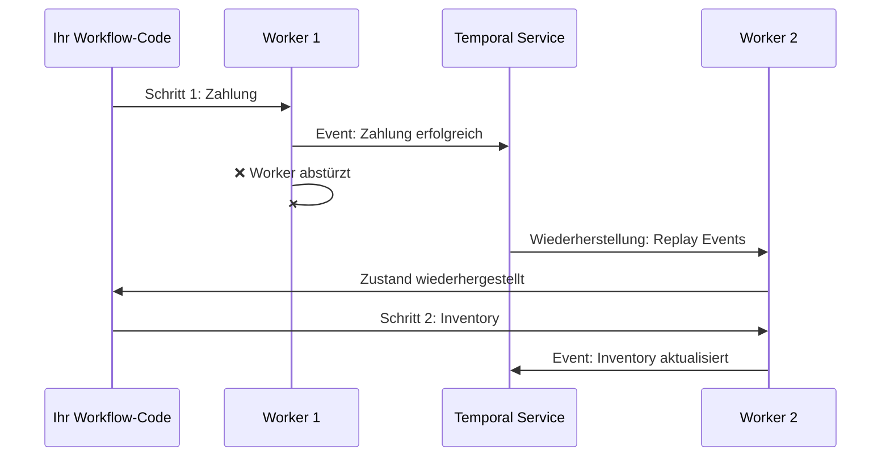
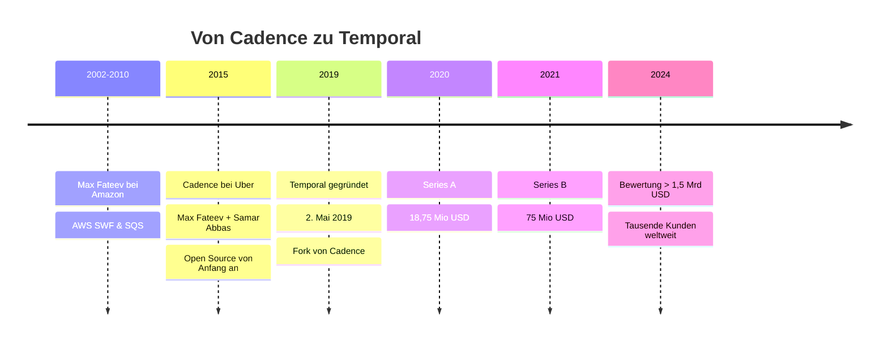
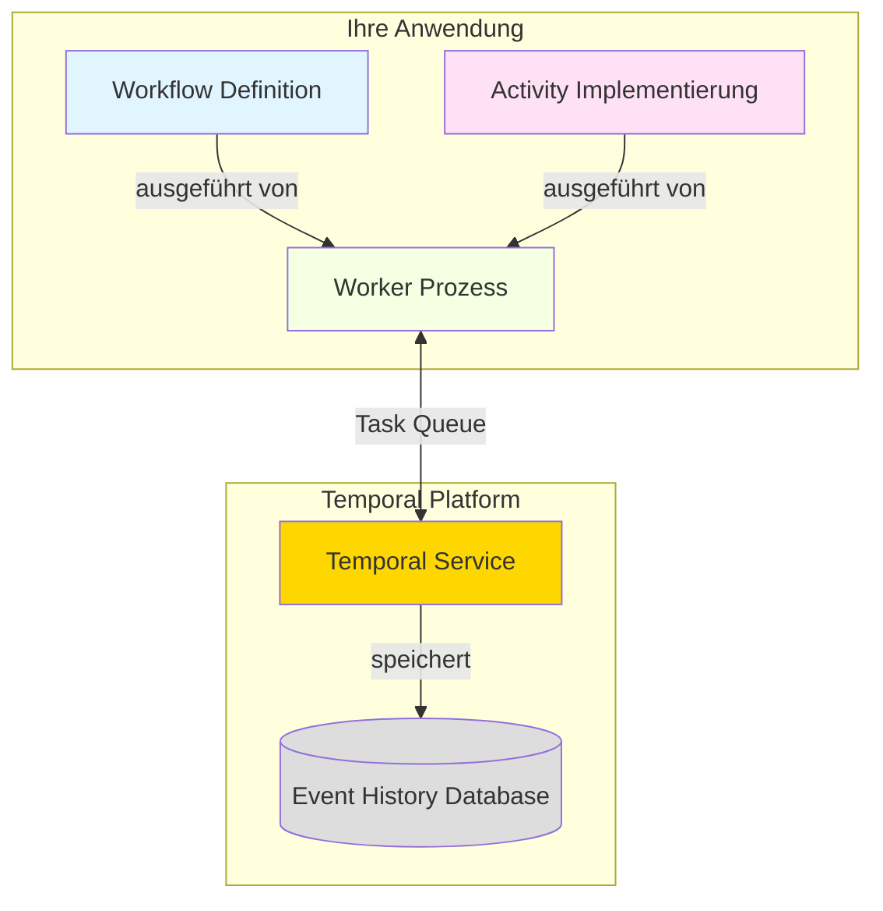
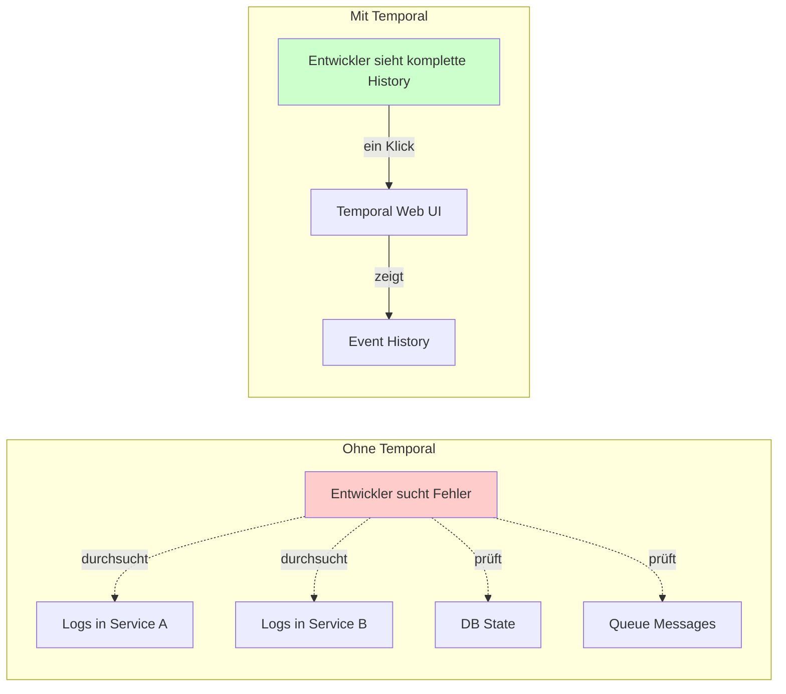

# Kapitel 1: Einführung in Temporal

**Lernziele**:
- Verstehen, was Temporal ist und warum es wichtig ist
- Die Grundprinzipien der Durable Execution kennenlernen
- Die Geschichte von Temporal nachvollziehen
- Anwendungsfälle für Temporal identifizieren können

## 1.1 Das Problem verteilter Systeme

Stellen Sie sich vor, Sie entwickeln ein E-Commerce-System. Ein Kunde bestellt ein Produkt, und Ihr System muss folgende Schritte ausführen:

1. Zahlung bei einem Zahlungsdienstleister (z.B. Stripe) durchführen
2. Lagerbestand im Inventory-Service reduzieren
3. Versand beim Logistikpartner beauftragen
4. Bestätigungs-E-Mail versenden

Was passiert, wenn:
- Der Zahlungsdienstleister nach 30 Sekunden antwortet, aber Ihre Anfrage bereits timeout hatte?
- Der Inventory-Service abstürzt, nachdem die Zahlung durchging?
- Der Versanddienstleister nicht erreichbar ist?
- Ihr Server während des Prozesses neu startet?

Bei traditionellen Ansätzen müssen Sie:
- Manuell Zustand in einer Datenbank speichern
- Komplexe Retry-Logik implementieren
- Kompensations-Transaktionen für Rollbacks programmieren
- Idempotenz-Schlüssel verwalten
- Worker-Prozesse und Message Queues koordinieren

Dies führt zu **hunderten Zeilen Boilerplate-Code**, nur um sicherzustellen, dass Ihr Geschäftsprozess zuverlässig funktioniert.

**Temporal löst diese Probleme auf fundamentale Weise.**

## 1.2 Was ist Temporal?

### Definition

**Temporal** ist eine Open-Source-Plattform (MIT-Lizenz) für **Durable Execution** – dauerhafte, ausfallsichere Codeausführung. Es handelt sich um eine zuverlässige Laufzeitumgebung, die garantiert, dass Ihr Code vollständig ausgeführt wird, unabhängig davon, wie viele Fehler auftreten.

Das Kernversprechen von Temporal:

> **"Build applications that never lose state, even when everything else fails"**
>
> Entwickeln Sie Anwendungen, die niemals ihren Zustand verlieren, selbst wenn alles andere ausfällt.

### Was ist Durable Execution?

**Durable Execution** (Dauerhafte Ausführung) ist crash-sichere Codeausführung mit folgenden Eigenschaften:

#### 1. Virtualisierte Ausführung

Ihr Code läuft über mehrere Prozesse hinweg, potenziell auf verschiedenen Maschinen. Bei einem Crash wird die Arbeit transparent in einem neuen Prozess fortgesetzt, wobei der Anwendungszustand automatisch wiederhergestellt wird.



#### 2. Automatische Zustandspersistierung

Der Zustand wird bei jedem Schritt automatisch erfasst und gespeichert. Bei einem Fehler kann die Ausführung exakt dort fortgesetzt werden, wo sie aufgehört hat – ohne Fortschrittsverlust.

#### 3. Zeitunabhängiger Betrieb

Anwendungen können unbegrenzt laufen – von Millisekunden bis zu Jahren – ohne zeitliche Beschränkungen und ohne externe Scheduler.

#### 4. Hardware-agnostisches Design

Zuverlässigkeit ist in die Software eingebaut, nicht abhängig von teurer fehlertoleranter Hardware. Funktioniert in VMs, Containern und Cloud-Umgebungen.

### Temporal vs. Traditionelle Ansätze

Die folgende Tabelle zeigt den fundamentalen Unterschied:

| Aspekt | Traditionelle Zustandsmaschine | Temporal Durable Execution |
|--------|--------------------------------|----------------------------|
| **Zustandsmanagement** | Manuell in Datenbanken persistieren | Automatisch durch Event Sourcing |
| **Fehlerbehandlung** | Manuell Retries und Timeouts implementieren | Eingebaute, konfigurierbare Retry-Policies |
| **Wiederherstellung** | Komplexe Checkpoint-Logik programmieren | Automatische Wiederherstellung am exakten Unterbrechungspunkt |
| **Debugging** | Zustand über verteilte Logs suchen | Vollständige Event-History in einem Log |
| **Code-Stil** | Zustandsübergänge explizit definieren | Normale if/else und Schleifen in Ihrer Programmiersprache |

## 1.3 Geschichte: Von AWS SWF über Cadence zu Temporal

### Die Ursprünge bei Amazon (2002-2010)

**Max Fateev** arbeitete bei Amazon und leitete die Architektur und Entwicklung von:
- **AWS Simple Workflow Service (SWF)** – Einer der ersten Workflow-Engines in der Cloud
- **AWS Simple Queue Service (SQS)** – Das Storage-Backend für eine der meistgenutzten Queue-Services weltweit

Diese Erfahrungen zeigten die Notwendigkeit für zuverlässige Orchestrierung verteilter Systeme.

### Microsoft Azure Durable Functions

Parallel entwickelte **Samar Abbas** bei Microsoft das **Durable Task Framework** – eine Orchestrierungs-Bibliothek für langlebige, zustandsbehaftete Workflows, die zur Grundlage für Azure Functions wurde.

### Cadence bei Uber (2015)



2015 kamen Max Fateev und Samar Abbas bei Uber zusammen und schufen **Cadence** – eine transformative Workflow-Engine, die von Anfang an vollständig Open Source war.

**Produktionsdaten bei Uber:**
- 100+ verschiedene Anwendungsfälle
- 50 Millionen laufende Ausführungen zu jedem Zeitpunkt
- 3+ Milliarden Ausführungen pro Monat

### Temporal gegründet (2019)

Am **2. Mai 2019** gründeten die ursprünglichen Tech-Leads von Cadence – Maxim Fateev und Samar Abbas – **Temporal Technologies** und forkten das Cadence-Projekt.

**Warum ein Fork?**

Temporal wurde gegründet, um:
- Die Entwicklung zu beschleunigen
- Cloud-nativen Support zu verbessern
- Eine bessere Developer Experience zu schaffen
- Ein nachhaltiges Business-Modell zu etablieren

**Finanzierung und Wachstum:**
- **Oktober 2020**: Series A mit 18,75 Millionen USD
- **Juni 2021**: Series B mit 75 Millionen USD
- **2024**: Series B erweitert auf 103 Millionen USD, Unternehmensbewertung über 1,5 Milliarden USD

## 1.4 Kernkonzepte im Überblick

Temporal basiert auf drei Hauptkomponenten:

### 1. Workflows

Ein **Workflow** definiert eine Abfolge von Schritten durch Code.

**Eigenschaften:**
- Geschrieben in Ihrer bevorzugten Programmiersprache (Go, Java, Python, TypeScript, .NET, PHP, Ruby)
- **Resilient**: Workflows können jahrelang laufen, selbst bei Infrastrukturausfällen
- **Ressourceneffizient**: Im Wartezustand verbrauchen sie null Rechenressourcen
- **Deterministisch**: Muss bei gleichen Eingaben immer gleich ablaufen (für Replay-Mechanismus)

### 2. Activities

Eine **Activity** ist eine Methode oder Funktion, die fehleranfällige Geschäftslogik kapselt.

**Eigenschaften:**
- Führt eine einzelne, klar definierte Aktion aus (z.B. API-Aufruf, E-Mail senden, Datei verarbeiten)
- **Nicht deterministisch**: Darf externe Systeme aufrufen
- **Automatisch wiederholbar**: Das System kann Activities bei Fehlern automatisch wiederholen
- **Timeout-geschützt**: Konfigurierbare Timeouts verhindern hängende Operations

### 3. Workers

Ein **Worker** führt Workflow- und Activity-Code aus.

**Eigenschaften:**
- Prozess, der als Brücke zwischen Anwendungslogik und Temporal Server dient
- Pollt eine Task Queue, die ihm Aufgaben zur Ausführung zuweist
- Meldet Ergebnisse zurück an den Temporal Service
- Kann horizontal skaliert werden



## 1.5 Hauptanwendungsfälle

Temporal wird von tausenden Unternehmen für mission-critical Anwendungen eingesetzt. Hier sind reale Beispiele:

### Financial Operations

- **Stripe**: Payment Processing
- **Coinbase**: Jede Coinbase-Transaktion nutzt Temporal für Geldtransfers
- **ANZ Bank**: Hypotheken-Underwriting – langlebige, zustandsbehaftete Prozesse über Wochen

### E-Commerce und Logistik

- **Turo**: Buchungssystem für Carsharing
- **Maersk**: Logistik-Orchestrierung – Verfolgung von Containern weltweit
- **Box**: Content Management

### Infrastruktur und DevOps

- **Netflix**: Custom CI/CD-Systeme – "fundamentaler Wandel in der Art, wie Anwendungen entwickelt werden können"
- **Datadog**: Infrastruktur-Services – von einer Anwendung auf über 100 Nutzer in Dutzenden Teams innerhalb eines Jahres
- **Snap**: Jede Snap Story verwendet Temporal

### Kommunikation

- **Twilio**: Jede Nachricht auf Twilio nutzt Temporal
- **Airbnb**: Marketing-Kampagnen-Orchestrierung

### AI und Machine Learning

- **Lindy, Dust, ZoomInfo**: AI Agents mit State-Durability und menschlicher Intervention
- **Descript & Neosync**: Datenpipelines und GPU-Ressourcen-Koordination

## 1.6 Warum ist Temporal wichtig?

### Problem 1: Fehlerresilienz

**Traditionell:**
```python
def process_order(order_id):
    try:
        payment = charge_credit_card(order_id)  # Was, wenn Timeout?
        save_payment_to_db(payment)  # Was, wenn Server hier abstürzt?
        inventory = update_inventory(order_id)  # Was, wenn Service nicht erreichbar?
        save_inventory_to_db(inventory)  # Was, wenn DB-Connection verloren?
        shipping = schedule_shipping(order_id)  # Was, wenn nach 2 Retries immer noch Fehler?
        send_confirmation_email(order_id)  # Was, wenn E-Mail-Service down ist?
    except Exception as e:
        # Manuelle Rollback-Logik für jeden möglichen Fehlerzustand?
        # Welche Schritte waren erfolgreich?
        # Wie kompensieren wir bereits durchgeführte Aktionen?
        # Wie stellen wir sicher, dass wir nicht doppelt buchen?
        pass
```

**Mit Temporal:**
```python
@workflow.defn
class OrderWorkflow:
    @workflow.run
    async def run(self, order_id: str):
        # Temporal garantiert, dass dieser Code vollständig ausgeführt wird
        payment = await workflow.execute_activity(
            charge_credit_card,
            order_id,
            retry_policy=RetryPolicy(maximum_attempts=5)
        )

        inventory = await workflow.execute_activity(
            update_inventory,
            order_id,
            retry_policy=RetryPolicy(maximum_attempts=3)
        )

        shipping = await workflow.execute_activity(
            schedule_shipping,
            order_id
        )

        await workflow.execute_activity(send_confirmation_email, order_id)

        # Kein manuelles State-Management
        # Keine manuellen Retries
        # Automatische Wiederherstellung bei Crashes
```

### Problem 2: Langlebige Prozesse

**Beispiel: Kreditantrag**

Ein Hypothekenantrag kann Wochen dauern:
1. Antrag eingereicht → Wartet auf Dokumente
2. Dokumente hochgeladen → Wartet auf manuelle Prüfung
3. Prüfung abgeschlossen → Wartet auf Gutachten
4. Gutachten erhalten → Finale Entscheidung

Mit traditionellen Ansätzen:
- Cron-Jobs, die den Status in der DB prüfen
- Komplexe Zustandsmaschinen
- Anfällig für Race Conditions
- Schwer zu debuggen

Mit Temporal:
```python
@workflow.defn
class MortgageApplicationWorkflow:
    @workflow.run
    async def run(self, application_id: str):
        # Wartet auf Dokumente (kann Tage dauern)
        documents = await workflow.wait_condition(
            lambda: self.documents_uploaded
        )

        # Wartet auf manuelle Prüfung
        review_result = await workflow.wait_condition(
            lambda: self.review_completed
        )

        # Wartet auf Gutachten
        appraisal = await workflow.wait_condition(
            lambda: self.appraisal_received
        )

        # Finale Entscheidung
        decision = await workflow.execute_activity(
            make_decision,
            application_id,
            documents,
            review_result,
            appraisal
        )

        return decision
```

Der Workflow kann **Wochen oder Monate** laufen, ohne Ressourcen zu verbrauchen, während er wartet.

### Problem 3: Observability



Mit Temporal haben Sie:
- **Vollständige Event-History** jeder Workflow-Ausführung
- **Time-Travel Debugging**: Sehen Sie exakt, was zu jedem Zeitpunkt passiert ist
- **Web UI**: Visualisierung aller laufenden und abgeschlossenen Workflows
- **Stack Traces**: Sehen Sie, wo ein Workflow gerade "hängt"

## 1.7 Fundamentaler Paradigmenwechsel

Temporal hebt die Anwendungsentwicklung auf eine neue Ebene, indem es die Last der Fehlerbehandlung entfernt – ähnlich wie höhere Programmiersprachen die Komplexität der Maschinenprogrammierung abstrahiert haben.

### Analogie: Von Assembler zu Python

| Assembler (1950er) | Python (heute) |
|-------------------|----------------|
| Manuelle Speicherverwaltung | Garbage Collection |
| Register manuell verwalten | Variablen einfach deklarieren |
| Goto-Statements | Strukturierte Programmierung |
| Hunderte Zeilen für einfache Aufgaben | Wenige Zeilen aussagekräftiger Code |

| Ohne Temporal | Mit Temporal |
|---------------|-------------|
| Manuelle Zustandsspeicherung in DB | Automatisches State-Management |
| Retry-Logik überall | Deklarative Retry-Policies |
| Timeout-Handling manuell | Automatische Timeouts |
| Fehlersuche über viele Services | Zentrale Event-History |
| Defensive Programmierung | Fokus auf Geschäftslogik |

**Temporal macht verteilte Systeme so zuverlässig wie Schwerkraft.**

## 1.8 Zusammenfassung

In diesem Kapitel haben Sie gelernt:

✅ **Was Temporal ist**: Eine Plattform für Durable Execution, die garantiert, dass Ihr Code vollständig ausgeführt wird, unabhängig von Fehlern

✅ **Die Geschichte**: Von AWS SWF über Cadence bei Uber zu Temporal als führende Open-Source-Lösung mit Milliarden-Bewertung

✅ **Kernkonzepte**: Workflows (Orchestrierung), Activities (Aktionen), Workers (Ausführung)

✅ **Anwendungsfälle**: Von Payment Processing bei Stripe/Coinbase über Logistik bei Maersk bis hin zu CI/CD bei Netflix

✅ **Warum es wichtig ist**: Temporal löst fundamentale Probleme verteilter Systeme – Fehlerresilienz, langlebige Prozesse, Observability

Im nächsten Kapitel werden wir tiefer in die **Kernbausteine** eintauchen und verstehen, wie Workflows, Activities und Worker im Detail funktionieren.

## Praktisches Beispiel

Im Verzeichnis `examples/chapter-01/` finden Sie ein lauffähiges Beispiel eines einfachen Temporal Workflows:

```bash
cd part-i-grundlagen/examples/chapter-01
uv sync
uv run python simple_workflow.py
```

Dieses Beispiel zeigt:
- Wie ein Workflow definiert wird
- Wie eine Verbindung zum Temporal Server hergestellt wird
- Wie ein Workflow gestartet und ausgeführt wird
- Wie das Ergebnis abgerufen wird

## Weiterführende Ressourcen

- 📚 **Offizielle Dokumentation**: https://docs.temporal.io/
- 🎥 **Temporal YouTube Channel**: Tutorials und Talks
- 💬 **Community Slack**: https://temporal.io/slack
- 🐙 **GitHub**: https://github.com/temporalio/temporal
- 📰 **Temporal Blog**: https://temporal.io/blog – Case Studies und Best Practices

---

**[Zurück zum Inhaltsverzeichnis](../README.md)** | **[Nächstes Kapitel: Kernbausteine →](./chapter-02.md)**
