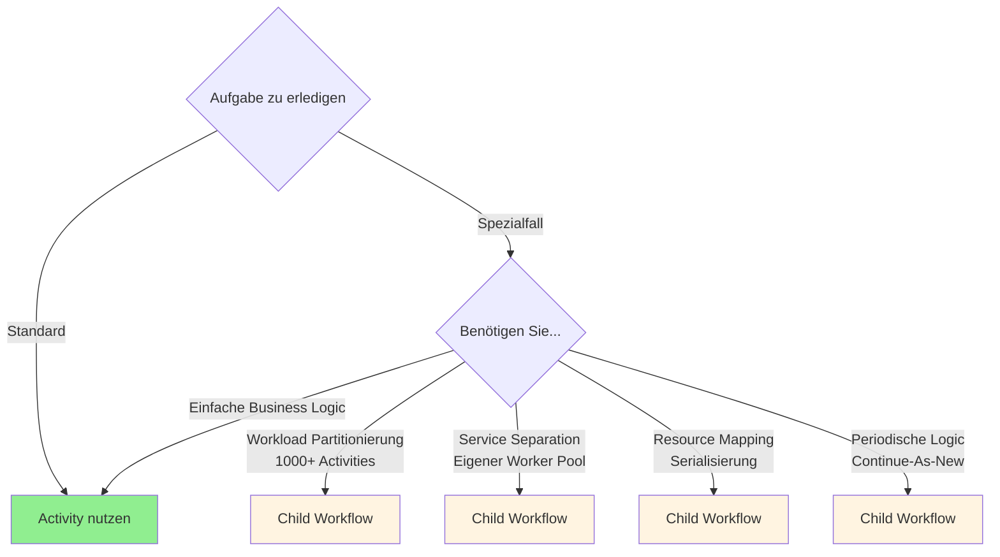
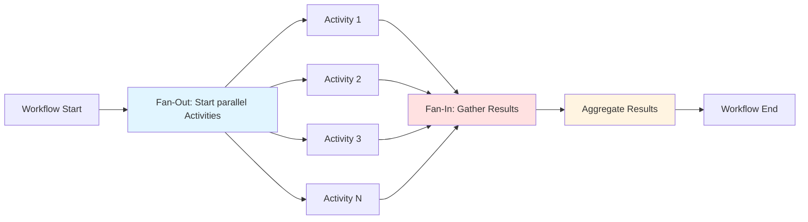
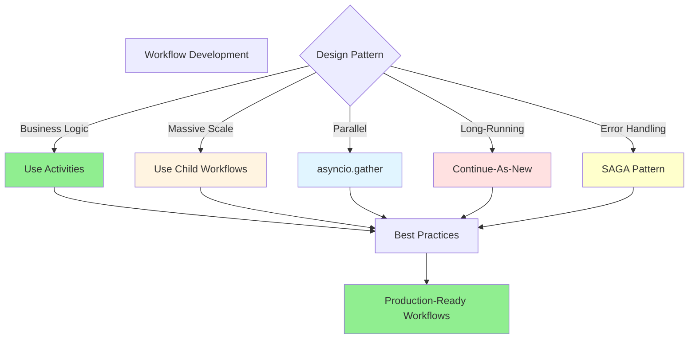

# Kapitel 5: Workflows programmieren

Nachdem wir die Entwicklungsumgebung in Kapitel 4 aufgesetzt haben, tauchen wir nun tief in die **praktische Programmierung von Workflows** ein. In diesem Kapitel lernen Sie fortgeschrittene Patterns kennen, die Ihnen helfen, robuste, skalierbare und wartbare Workflow-Anwendungen zu bauen.

## 5.1 Workflow-Komposition: Activities vs Child Workflows

### 5.1.1 Die goldene Regel

**Activities sind die Default-Wahl**. Nutzen Sie Child Workflows nur für spezifische Use Cases!



### 5.1.2 Wann Activities nutzen

**Activities sind perfekt für**:
- Business Logic (API-Aufrufe, Datenbank-Operationen)
- Alle nicht-deterministischen Operationen
- Automatische Retries
- Niedrigerer Overhead (weniger Events in History)

```python
from temporalio import workflow, activity
from datetime import timedelta

@activity.defn
async def send_email(to: str, subject: str, body: str) -> bool:
    """Activity für E-Mail-Versand (nicht-deterministisch)."""
    # Externer API-Aufruf - perfekt für Activity
    result = await email_service.send(to, subject, body)
    return result.success

@activity.defn
async def charge_credit_card(amount: float, card_token: str) -> str:
    """Activity für Payment Processing."""
    # Externe Payment API
    transaction = await payment_api.charge(amount, card_token)
    return transaction.id

@workflow.defn
class OrderWorkflow:
    @workflow.run
    async def run(self, order_data: dict) -> dict:
        # Activities für Business Logic
        transaction_id = await workflow.execute_activity(
            charge_credit_card,
            args=[order_data["amount"], order_data["card_token"]],
            start_to_close_timeout=timedelta(seconds=30)
        )

        await workflow.execute_activity(
            send_email,
            args=[
                order_data["customer_email"],
                "Order Confirmation",
                f"Your order is confirmed. Transaction: {transaction_id}"
            ],
            start_to_close_timeout=timedelta(seconds=10)
        )

        return {"transaction_id": transaction_id, "status": "completed"}
```

### 5.1.3 Wann Child Workflows nutzen

**Use Case 1: Workload Partitionierung**

Für massive Fan-Outs (>1000 Activities):

```python
from temporalio import workflow
from temporalio.workflow import ParentClosePolicy

@workflow.defn
class BatchCoordinatorWorkflow:
    """
    Koordiniert Verarbeitung von 100.000 Items.
    Nutzt Child Workflows zur Partitionierung.
    """

    @workflow.run
    async def run(self, total_items: int) -> dict:
        batch_size = 1000
        num_batches = (total_items + batch_size - 1) // batch_size

        workflow.logger.info(f"Processing {total_items} items in {num_batches} batches")

        # Starte Child Workflows (max ~1000)
        batch_handles = []
        for i in range(num_batches):
            start_idx = i * batch_size
            end_idx = min((i + 1) * batch_size, total_items)

            handle = await workflow.start_child_workflow(
                BatchProcessorWorkflow.run,
                args=[{"start": start_idx, "end": end_idx}],
                id=f"batch-{workflow.info().workflow_id}-{i}",
                parent_close_policy=ParentClosePolicy.ABANDON,
            )
            batch_handles.append(handle)

        # Warte auf alle Batches
        results = await asyncio.gather(*batch_handles)

        return {
            "total_batches": num_batches,
            "total_processed": sum(r["processed"] for r in results)
        }

@workflow.defn
class BatchProcessorWorkflow:
    """
    Verarbeitet einen Batch von ~1000 Items.
    Jedes Child Workflow hat eigene Event History.
    """

    @workflow.run
    async def run(self, params: dict) -> dict:
        # Verarbeite bis zu 1000 Activities
        tasks = [
            workflow.execute_activity(
                process_single_item,
                item_id,
                start_to_close_timeout=timedelta(seconds=30)
            )
            for item_id in range(params["start"], params["end"])
        ]

        results = await asyncio.gather(*tasks)

        return {"processed": len(results)}
```

**Warum Child Workflows hier?**
- Parent Workflow: 100 Batches → ~200 Events
- Jedes Child: 1000 Activities → ~2000 Events
- **Ohne** Child Workflows: 100.000 Activities → ~200.000 Events in **einer** History (Fehler!)
- **Mit** Child Workflows: Verteilung über 100 separate Histories

**Use Case 2: Service Separation**

```python
@workflow.defn
class OrderFulfillmentWorkflow:
    """
    Koordiniert verschiedene Microservices via Child Workflows.
    """

    @workflow.run
    async def run(self, order_id: str) -> dict:
        # Parallele Child Workflows auf verschiedenen Task Queues
        inventory_handle = await workflow.start_child_workflow(
            InventoryWorkflow.run,
            args=[order_id],
            task_queue="inventory-service",  # Eigener Worker Pool
            id=f"inventory-{order_id}",
        )

        shipping_handle = await workflow.start_child_workflow(
            ShippingWorkflow.run,
            args=[order_id],
            task_queue="shipping-service",  # Anderer Worker Pool
            id=f"shipping-{order_id}",
        )

        # Warte auf beide Services
        inventory_result, shipping_result = await asyncio.gather(
            inventory_handle,
            shipping_handle
        )

        return {
            "inventory": inventory_result,
            "shipping": shipping_result
        }
```

**Use Case 3: Resource Mapping (Entity Workflows)**

```python
@workflow.defn
class HostUpgradeCoordinatorWorkflow:
    """
    Upgraded mehrere Hosts - ein Child Workflow pro Host.
    """

    @workflow.run
    async def run(self, hostnames: list[str]) -> dict:
        # Jeder Hostname mapped zu eigenem Child Workflow
        # Garantiert serialisierte Operationen pro Host
        upgrade_handles = []

        for hostname in hostnames:
            handle = await workflow.start_child_workflow(
                HostUpgradeWorkflow.run,
                args=[hostname],
                id=f"host-upgrade-{hostname}",  # Eindeutige ID pro Host
            )
            upgrade_handles.append(handle)

        results = await asyncio.gather(*upgrade_handles)
        return {"upgraded": len(results)}

@workflow.defn
class HostUpgradeWorkflow:
    """
    Upgraded einen einzelnen Host.
    Multiple Aufrufe mit gleicher ID werden de-duplicated.
    """

    @workflow.run
    async def run(self, hostname: str) -> dict:
        # Alle Operationen für diesen Host serialisiert
        await workflow.execute_activity(
            stop_host,
            hostname,
            start_to_close_timeout=timedelta(minutes=5)
        )

        await workflow.execute_activity(
            upgrade_host,
            hostname,
            start_to_close_timeout=timedelta(minutes=30)
        )

        await workflow.execute_activity(
            start_host,
            hostname,
            start_to_close_timeout=timedelta(minutes=5)
        )

        return {"hostname": hostname, "status": "upgraded"}
```

### 5.1.4 Parent-Child Kommunikation

```python
from temporalio import workflow
from dataclasses import dataclass

@dataclass
class TaskUpdate:
    task_id: str
    status: str
    progress: int

@workflow.defn
class ChildWorkerWorkflow:
    def __init__(self) -> None:
        self.task_data = None
        self.paused = False

    @workflow.run
    async def run(self) -> str:
        # Warte auf Task-Zuweisung via Signal
        await workflow.wait_condition(lambda: self.task_data is not None)

        # Verarbeite Task
        for i in range(10):
            # Prüfe Pause-Signal
            if self.paused:
                await workflow.wait_condition(lambda: not self.paused)

            await workflow.execute_activity(
                process_task_step,
                args=[self.task_data, i],
                start_to_close_timeout=timedelta(minutes=2)
            )

        return "completed"

    @workflow.signal
    def assign_task(self, task_data: dict) -> None:
        """Signal vom Parent: Task zuweisen."""
        self.task_data = task_data

    @workflow.signal
    def pause(self) -> None:
        """Signal vom Parent: Pausieren."""
        self.paused = True

    @workflow.signal
    def resume(self) -> None:
        """Signal vom Parent: Fortsetzen."""
        self.paused = False

    @workflow.query
    def get_status(self) -> dict:
        """Query vom Parent oder External Client."""
        return {
            "has_task": self.task_data is not None,
            "paused": self.paused
        }

@workflow.defn
class CoordinatorWorkflow:
    @workflow.run
    async def run(self, tasks: list[dict]) -> dict:
        # Starte Worker Child Workflows
        worker_handles = []
        for i in range(3):  # 3 Worker
            handle = await workflow.start_child_workflow(
                ChildWorkerWorkflow.run,
                id=f"worker-{i}",
            )
            worker_handles.append(handle)

        # Verteile Tasks via Signals
        for i, task in enumerate(tasks):
            worker_idx = i % len(worker_handles)
            await worker_handles[worker_idx].signal("assign_task", task)

        # Query Worker Status
        statuses = []
        for handle in worker_handles:
            status = await handle.query("get_status")
            statuses.append(status)

        # Warte auf Completion
        await asyncio.gather(*worker_handles)

        return {"completed_tasks": len(tasks)}
```

## 5.2 Parallele Ausführung

### 5.2.1 asyncio.gather für parallele Activities

```python
import asyncio
from temporalio import workflow
from datetime import timedelta

@workflow.defn
class ParallelProcessingWorkflow:
    @workflow.run
    async def run(self, urls: list[str]) -> list[dict]:
        # Alle URLs parallel scrapen
        tasks = [
            workflow.execute_activity(
                scrape_url,
                url,
                start_to_close_timeout=timedelta(minutes=5)
            )
            for url in urls
        ]

        # Warte auf alle (Results in Order der Input-Liste)
        results = await asyncio.gather(*tasks)

        return results
```

### 5.2.2 Fan-Out/Fan-In Pattern



```python
from typing import List
from dataclasses import dataclass

@dataclass
class ScrapedData:
    url: str
    title: str
    content: str
    word_count: int

@workflow.defn
class FanOutFanInWorkflow:
    @workflow.run
    async def run(self, data_urls: List[str]) -> dict:
        workflow.logger.info(f"Fan-out: Scraping {len(data_urls)} URLs")

        # Fan-Out: Parallele Activities starten
        scrape_tasks = [
            workflow.execute_activity(
                scrape_url,
                url,
                start_to_close_timeout=timedelta(minutes=5)
            )
            for url in data_urls
        ]

        # Fan-In: Alle Results sammeln
        scraped_data: List[ScrapedData] = await asyncio.gather(*scrape_tasks)

        workflow.logger.info(f"Fan-in: Scraped {len(scraped_data)} pages")

        # Aggregation
        aggregated = await workflow.execute_activity(
            aggregate_scraped_data,
            scraped_data,
            start_to_close_timeout=timedelta(minutes=2)
        )

        return {
            "total_pages": len(scraped_data),
            "total_words": sum(d.word_count for d in scraped_data),
            "aggregated_insights": aggregated
        }
```

### 5.2.3 Performance-Limitierungen bei Fan-Outs

**WICHTIG**: Ein einzelner Workflow ist auf ~**30 Activities/Sekunde** limitiert, unabhängig von Ressourcen!

**Lösung für massive Fan-Outs**:

```python
@workflow.defn
class ScalableFanOutWorkflow:
    """
    Für 10.000+ Items: Nutze Child Workflows zur Partitionierung.
    """

    @workflow.run
    async def run(self, total_items: int) -> dict:
        batch_size = 1000  # Items pro Child Workflow

        # Berechne Anzahl Batches
        num_batches = (total_items + batch_size - 1) // batch_size

        workflow.logger.info(
            f"Processing {total_items} items via {num_batches} child workflows"
        )

        # Fan-Out über Child Workflows
        batch_workflows = []
        for i in range(num_batches):
            start_idx = i * batch_size
            end_idx = min((i + 1) * batch_size, total_items)

            handle = await workflow.start_child_workflow(
                BatchProcessorWorkflow.run,
                {"start": start_idx, "end": end_idx},
                id=f"batch-{i}",
            )
            batch_workflows.append(handle)

        # Fan-In: Warte auf alle Batches
        batch_results = await asyncio.gather(*batch_workflows)

        return {
            "batches_processed": len(batch_results),
            "total_items": total_items
        }
```

**Performance-Matrix**:

| Items | Strategie | Geschätzte Zeit |
|-------|-----------|----------------|
| 10-100 | Direkte Activities in Workflow | Sekunden |
| 100-1000 | asyncio.gather | Minuten |
| 1000-10.000 | Batch Processing | 5-10 Minuten |
| 10.000+ | Child Workflows | 30+ Minuten |

## 5.3 Timers und Scheduling

### 5.3.1 workflow.sleep() für Delays

```python
import asyncio
from datetime import timedelta
from temporalio import workflow

@workflow.defn
class DelayWorkflow:
    @workflow.run
    async def run(self) -> str:
        workflow.logger.info("Starting workflow")

        # Sleep für 10 Sekunden (durable timer)
        await asyncio.sleep(10)
        workflow.logger.info("10 seconds passed")

        # Kann auch Monate schlafen - Resource-Light!
        await asyncio.sleep(60 * 60 * 24 * 30)  # 30 Tage
        workflow.logger.info("30 days passed")

        return "Timers completed"
```

**Wichtig**: Timers sind persistent! Worker/Service Restarts haben keinen Einfluss.

### 5.3.2 Timeout Patterns

```python
@workflow.defn
class TimeoutWorkflow:
    def __init__(self) -> None:
        self.approval_received = False

    @workflow.run
    async def run(self, order_id: str) -> dict:
        workflow.logger.info(f"Awaiting approval for order {order_id}")

        try:
            # Warte auf Approval Signal oder Timeout
            await workflow.wait_condition(
                lambda: self.approval_received,
                timeout=timedelta(hours=24)  # 24h Timeout
            )

            return {"status": "approved", "order_id": order_id}

        except asyncio.TimeoutError:
            workflow.logger.warning(f"Approval timeout for order {order_id}")

            # Automatische Ablehnung nach Timeout
            await workflow.execute_activity(
                reject_order,
                order_id,
                start_to_close_timeout=timedelta(seconds=30)
            )

            return {"status": "rejected_timeout", "order_id": order_id}

    @workflow.signal
    def approve(self) -> None:
        self.approval_received = True
```

### 5.3.3 Cron Workflows mit Schedules

**Moderne Methode** (Empfohlen):

```python
from temporalio.client import (
    Client,
    Schedule,
    ScheduleActionStartWorkflow,
    ScheduleSpec,
    ScheduleIntervalSpec
)
from datetime import timedelta

async def create_daily_report_schedule():
    client = await Client.connect("localhost:7233")

    # Schedule erstellen: Täglich um 9 Uhr
    await client.create_schedule(
        "daily-report-schedule",
        Schedule(
            action=ScheduleActionStartWorkflow(
                DailyReportWorkflow.run,
                task_queue="reports",
            ),
            spec=ScheduleSpec(
                # Cron Expression: Minute Hour Day Month Weekday
                cron_expressions=["0 9 * * *"],  # Täglich 9:00 UTC
            ),
        ),
    )

    # Interval-basiert: Jede Stunde
    await client.create_schedule(
        "hourly-sync-schedule",
        Schedule(
            action=ScheduleActionStartWorkflow(
                SyncWorkflow.run,
                task_queue="sync",
            ),
            spec=ScheduleSpec(
                intervals=[
                    ScheduleIntervalSpec(every=timedelta(hours=1))
                ],
            ),
        ),
    )
```

**Cron Expression Beispiele**:

```python
# Jede Minute
"* * * * *"

# Jeden Tag um Mitternacht
"0 0 * * *"

# Wochentags um 12 Uhr
"0 12 * * MON-FRI"

# Jeden Montag um 8:00
"0 8 * * MON"

# Am 1. jeden Monats
"0 0 1 * *"

# Alle 15 Minuten
"*/15 * * * *"
```

### 5.3.4 Timer Cancellation

```python
@workflow.defn
class CancellableTimerWorkflow:
    def __init__(self) -> None:
        self.timer_cancelled = False

    @workflow.run
    async def run(self) -> str:
        # Starte 1-Stunden Timer
        sleep_task = asyncio.create_task(asyncio.sleep(3600))

        # Warte auf Timer oder Cancellation
        await workflow.wait_condition(
            lambda: self.timer_cancelled or sleep_task.done()
        )

        if self.timer_cancelled:
            # Timer canceln
            sleep_task.cancel()
            try:
                await sleep_task
            except asyncio.CancelledError:
                return "Timer was cancelled"

        return "Timer completed normally"

    @workflow.signal
    def cancel_timer(self) -> None:
        self.timer_cancelled = True
```

## 5.4 State Management und Queries

### 5.4.1 Workflow Instance Variables

```python
from dataclasses import dataclass, field
from typing import Dict, List

@dataclass
class OrderState:
    order_id: str
    items: List[dict] = field(default_factory=list)
    total_amount: float = 0.0
    status: str = "pending"
    approvals: Dict[str, bool] = field(default_factory=dict)

@workflow.defn
class StatefulOrderWorkflow:
    def __init__(self) -> None:
        # Instance Variables halten State
        self.state = OrderState(order_id="")
        self.processing_complete = False

    @workflow.run
    async def run(self, order_id: str) -> OrderState:
        self.state.order_id = order_id
        self.state.status = "fetching_items"

        # State persistiert über Activities
        items = await workflow.execute_activity(
            fetch_order_items,
            order_id,
            start_to_close_timeout=timedelta(minutes=1)
        )
        self.state.items = items
        self.state.total_amount = sum(item["price"] for item in items)

        # Conditional basierend auf State
        if self.state.total_amount > 1000:
            self.state.status = "awaiting_approval"
            await workflow.wait_condition(
                lambda: "manager" in self.state.approvals
            )

        self.state.status = "approved"
        return self.state

    @workflow.signal
    def approve(self, approver: str) -> None:
        """Signal updated State."""
        self.state.approvals[approver] = True

    @workflow.query
    def get_state(self) -> OrderState:
        """Query liest State (read-only!)."""
        return self.state

    @workflow.query
    def get_total(self) -> float:
        return self.state.total_amount
```

### 5.4.2 State Queries für Progress Tracking

```python
from dataclasses import dataclass
from datetime import datetime

@dataclass
class ProgressInfo:
    phase: str
    current_step: int
    total_steps: int
    percentage: float
    start_time: datetime
    estimated_completion: datetime = None

@workflow.defn
class ProgressTrackingWorkflow:
    def __init__(self) -> None:
        self.progress = ProgressInfo(
            phase="initializing",
            current_step=0,
            total_steps=100,
            percentage=0.0,
            start_time=None
        )

    @workflow.run
    async def run(self, total_items: int) -> dict:
        self.progress.total_steps = total_items
        self.progress.start_time = workflow.time()

        # Phase 1: Initialization
        self.progress.phase = "initialization"
        await workflow.execute_activity(
            initialize_activity,
            start_to_close_timeout=timedelta(minutes=1)
        )
        self._update_progress(10)

        # Phase 2: Processing
        self.progress.phase = "processing"
        for i in range(total_items):
            await workflow.execute_activity(
                process_item,
                i,
                start_to_close_timeout=timedelta(minutes=2)
            )
            self.progress.current_step = i + 1
            self._update_progress()

        # Phase 3: Finalization
        self.progress.phase = "finalization"
        self._update_progress(100)

        return {"completed": self.progress.current_step}

    def _update_progress(self, override_percentage: float = None) -> None:
        if override_percentage is not None:
            self.progress.percentage = override_percentage
        else:
            self.progress.percentage = (
                self.progress.current_step / self.progress.total_steps * 100
            )

        # ETA Berechnung
        if self.progress.current_step > 0:
            elapsed = (workflow.time() - self.progress.start_time).total_seconds()
            rate = self.progress.current_step / elapsed
            remaining = self.progress.total_steps - self.progress.current_step
            eta_seconds = remaining / rate if rate > 0 else 0
            self.progress.estimated_completion = (
                workflow.time() + timedelta(seconds=eta_seconds)
            )

    @workflow.query
    def get_progress(self) -> ProgressInfo:
        """Query für aktuellen Progress."""
        return self.progress

    @workflow.query
    def get_percentage(self) -> float:
        """Query nur für Percentage."""
        return self.progress.percentage
```

**Client-Side Progress Monitoring**:

```python
from temporalio.client import Client
import asyncio

async def monitor_workflow_progress():
    client = await Client.connect("localhost:7233")
    handle = client.get_workflow_handle("workflow-id")

    while True:
        # Query Progress
        progress = await handle.query("get_progress")

        print(f"Phase: {progress.phase}")
        print(f"Progress: {progress.percentage:.2f}%")
        print(f"Step: {progress.current_step}/{progress.total_steps}")

        if progress.estimated_completion:
            print(f"ETA: {progress.estimated_completion}")

        if progress.percentage >= 100:
            print("Workflow complete!")
            break

        await asyncio.sleep(5)  # Poll alle 5 Sekunden
```

## 5.5 Error Handling und Resilience

### 5.5.1 try/except in Workflows

```python
from temporalio.exceptions import ApplicationError, ActivityError

@workflow.defn
class ErrorHandlingWorkflow:
    @workflow.run
    async def run(self, items: List[str]) -> dict:
        successful = []
        failed = []

        for item in items:
            try:
                result = await workflow.execute_activity(
                    process_item,
                    item,
                    start_to_close_timeout=timedelta(minutes=2),
                    retry_policy=RetryPolicy(
                        maximum_attempts=3,
                        non_retryable_error_types=["InvalidInput"]
                    )
                )
                successful.append(result)

            except ActivityError as e:
                # Activity failed nach allen Retries
                workflow.logger.warning(f"Failed to process {item}: {e.cause}")
                failed.append({
                    "item": item,
                    "error": str(e.cause),
                    "attempts": e.retry_state.attempt if e.retry_state else 0
                })
                # Workflow fährt fort!

        return {
            "successful": len(successful),
            "failed": len(failed),
            "total": len(items)
        }
```

### 5.5.2 SAGA Pattern für Compensation

```python
from typing import List, Callable

@workflow.defn
class BookingWorkflow:
    """
    SAGA Pattern: Bei Fehler Rollback aller vorherigen Schritte.
    """

    @workflow.run
    async def run(self, booking_data: dict) -> dict:
        compensations: List[Callable] = []

        try:
            # Step 1: Buche Auto
            car_result = await workflow.execute_activity(
                book_car,
                booking_data,
                start_to_close_timeout=timedelta(seconds=10),
            )
            # Registriere Compensation
            compensations.append(
                lambda: workflow.execute_activity(
                    undo_book_car,
                    booking_data,
                    start_to_close_timeout=timedelta(seconds=10)
                )
            )

            # Step 2: Buche Hotel
            hotel_result = await workflow.execute_activity(
                book_hotel,
                booking_data,
                start_to_close_timeout=timedelta(seconds=10),
            )
            compensations.append(
                lambda: workflow.execute_activity(
                    undo_book_hotel,
                    booking_data,
                    start_to_close_timeout=timedelta(seconds=10)
                )
            )

            # Step 3: Buche Flug
            flight_result = await workflow.execute_activity(
                book_flight,
                booking_data,
                start_to_close_timeout=timedelta(seconds=10),
            )
            compensations.append(
                lambda: workflow.execute_activity(
                    undo_book_flight,
                    booking_data,
                    start_to_close_timeout=timedelta(seconds=10)
                )
            )

            return {
                "status": "success",
                "car": car_result,
                "hotel": hotel_result,
                "flight": flight_result
            }

        except Exception as e:
            # Fehler - Führe Compensations in umgekehrter Reihenfolge aus
            workflow.logger.error(f"Booking failed: {e}, rolling back...")

            for compensation in reversed(compensations):
                try:
                    await compensation()
                except Exception as comp_error:
                    workflow.logger.error(f"Compensation failed: {comp_error}")

            return {
                "status": "rolled_back",
                "error": str(e)
            }
```

## 5.6 Long-Running Workflows und Continue-As-New

### 5.6.1 Event History Management

**Problem**: Event History ist auf 51.200 Events oder 50 MB limitiert.

**Lösung**: Continue-As-New

```python
from dataclasses import dataclass

@dataclass
class WorkflowState:
    processed_count: int = 0
    iteration: int = 0

@workflow.defn
class LongRunningWorkflow:
    @workflow.run
    async def run(self, state: WorkflowState = None) -> None:
        # Initialisiere oder restore State
        if state is None:
            self.state = WorkflowState()
        else:
            self.state = state
            workflow.logger.info(f"Resumed at iteration {self.state.iteration}")

        # Verarbeite Batch
        for i in range(100):
            await workflow.execute_activity(
                process_item,
                self.state.processed_count,
                start_to_close_timeout=timedelta(minutes=1)
            )
            self.state.processed_count += 1

        self.state.iteration += 1

        # Check Continue-As-New Suggestion
        if workflow.info().is_continue_as_new_suggested():
            workflow.logger.info(
                f"Continuing as new after {self.state.processed_count} items"
            )
            workflow.continue_as_new(self.state)

        # Oder: Custom Trigger
        if self.state.processed_count % 10000 == 0:
            workflow.continue_as_new(self.state)
```

### 5.6.2 Infinite Loop mit Continue-As-New

**Entity Workflow Pattern** (Actor Model):

```python
from dataclasses import dataclass
from datetime import datetime

@dataclass
class AccountState:
    account_id: str
    balance: float = 0.0
    transaction_count: int = 0

@workflow.defn
class AccountEntityWorkflow:
    """
    Läuft unbegrenzt - Entity Workflow für ein Bank-Konto.
    """

    def __init__(self) -> None:
        self.state: AccountState = None
        self.pending_transactions: List[dict] = []
        self.should_shutdown = False

    @workflow.run
    async def run(self, initial_state: AccountState = None) -> None:
        # Initialize oder restore
        if initial_state:
            self.state = initial_state
        else:
            self.state = AccountState(
                account_id=workflow.info().workflow_id
            )

        workflow.logger.info(
            f"Account {self.state.account_id} started. "
            f"Balance: {self.state.balance}, "
            f"Transactions: {self.state.transaction_count}"
        )

        # Infinite Loop
        while not self.should_shutdown:
            # Warte auf Transactions oder Timeout
            await workflow.wait_condition(
                lambda: len(self.pending_transactions) > 0 or self.should_shutdown,
                timeout=timedelta(seconds=30)
            )

            # Verarbeite Transactions
            while self.pending_transactions:
                transaction = self.pending_transactions.pop(0)

                try:
                    result = await workflow.execute_activity(
                        process_transaction,
                        transaction,
                        start_to_close_timeout=timedelta(seconds=10)
                    )

                    self.state.balance += result["amount"]
                    self.state.transaction_count += 1

                except Exception as e:
                    workflow.logger.error(f"Transaction failed: {e}")

            # Continue-As-New nach 1000 Transactions
            if self.state.transaction_count % 1000 == 0:
                workflow.logger.info(
                    f"Continuing as new after {self.state.transaction_count} transactions"
                )
                workflow.continue_as_new(self.state)

        # Graceful Shutdown
        workflow.logger.info("Account workflow shutting down gracefully")

    @workflow.signal
    def deposit(self, amount: float) -> None:
        """Signal: Geld einzahlen."""
        self.pending_transactions.append({
            "type": "deposit",
            "amount": amount,
            "timestamp": workflow.time()
        })

    @workflow.signal
    def withdraw(self, amount: float) -> None:
        """Signal: Geld abheben."""
        self.pending_transactions.append({
            "type": "withdraw",
            "amount": -amount,
            "timestamp": workflow.time()
        })

    @workflow.signal
    def shutdown(self) -> None:
        """Signal: Workflow beenden."""
        self.should_shutdown = True

    @workflow.query
    def get_balance(self) -> float:
        """Query: Aktueller Kontostand."""
        return self.state.balance

    @workflow.query
    def get_transaction_count(self) -> int:
        """Query: Anzahl Transaktionen."""
        return self.state.transaction_count
```

## 5.7 Zusammenfassung

In diesem Kapitel haben wir fortgeschrittene Workflow-Programming-Patterns kennengelernt:

**Workflow-Komposition**:
- **Activities**: Default für Business Logic
- **Child Workflows**: Nur für Workload-Partitionierung, Service-Separation, Resource-Mapping
- Parent-Child Kommunikation via Signals

**Parallele Ausführung**:
- `asyncio.gather()` für parallele Activities
- Fan-Out/Fan-In Patterns
- Performance-Limit: ~30 Activities/Sekunde pro Workflow
- Lösung für 10.000+ Items: Child Workflows

**Timers und Scheduling**:
- `workflow.sleep()` für Delays (Tage, Monate möglich!)
- Timeout Patterns mit `wait_condition()`
- Cron Workflows via Schedules
- Timer Cancellation

**State Management**:
- Instance Variables für Workflow-State
- Queries für Progress Tracking (read-only!)
- Signals für State Updates
- ETA-Berechnungen

**Error Handling**:
- try/except für Activity Failures
- SAGA Pattern für Compensations
- Graceful Degradation
- Workflows failen NICHT automatisch bei Activity Errors

**Long-Running Workflows**:
- Event History Limit: 51.200 Events / 50 MB
- `workflow.info().is_continue_as_new_suggested()`
- State Transfer via `workflow.continue_as_new()`
- Entity Workflows mit Infinite Loops



**Nächstes Kapitel**: [Kapitel 6: Kommunikation (Signale und Queries)](chapter-06.md) – Wir tauchen tief in Workflow-Kommunikationspatterns ein!

---

**Praktische Übung**: Implementieren Sie einen Entity Workflow mit Signals, Queries und Continue-As-New!
