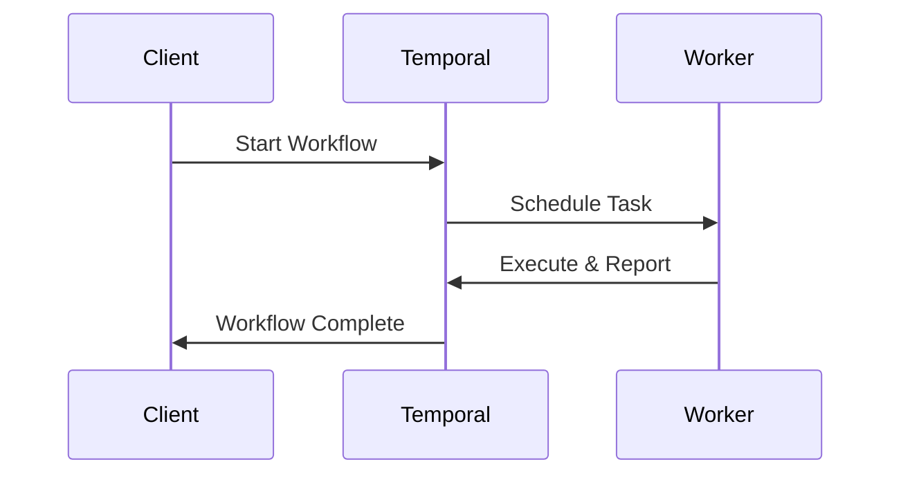
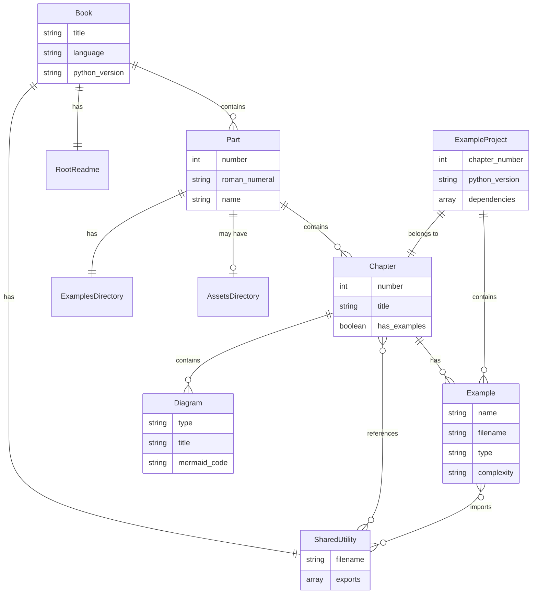
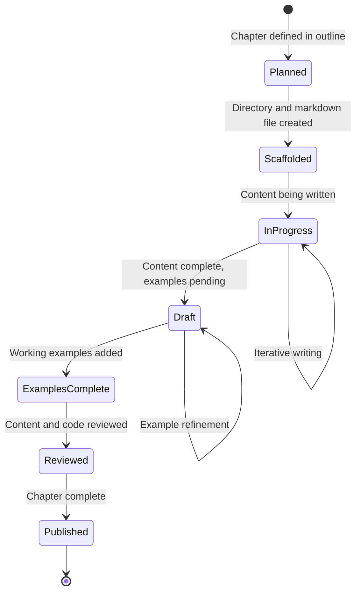
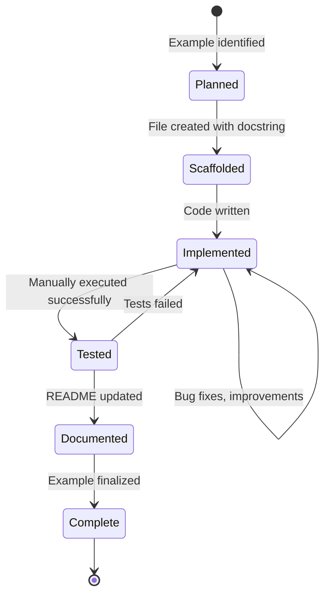

# Data Model: Book Content Structure

**Feature**: Temporal Book Chapter Structure with Python Examples
**Date**: 2025-11-19

## Overview

This document defines the logical entities, their attributes, relationships, and validation rules for the Temporal book project structure. The model represents a hierarchical content organization optimized for educational material with integrated code examples.

## Entity Definitions

### Book

**Description**: The root container representing the entire Temporal educational book

**Attributes**:
- `title`: String - "Temporal.io – Durable Execution Mastery"
- `subtitle`: String - "Ein Deep Dive in die Orchestrierung verteilter Systeme"
- `language`: String - "de" (German)
- `version`: String - Semantic version (e.g., "1.0.0")
- `python_version`: String - "3.13" (standardized across all examples)
- `temporal_sdk_version`: String - Version range (e.g., ">=1.5.0,<2.0.0")

**Relationships**:
- **Contains**: 5 Parts (one-to-many)
- **Contains**: 1 SharedUtilities (one-to-one)
- **Has**: 1 RootReadme (one-to-one)

**Validation Rules**:
- Must contain exactly 5 parts (Teil I through V)
- Python version must be "3.13"
- All parts must follow naming convention `part-{roman}-{name}`

**File Representation**:
```
temporal-book/               # Book root
├── README.md               # RootReadme
├── shared/                 # SharedUtilities
└── part-{i-v}-{name}/     # Parts (5 total)
```

---

### Part

**Description**: A major section of the book organizing related chapters (Teil I-V)

**Attributes**:
- `number`: Integer - Part number (1-5)
- `roman_numeral`: String - Roman numeral representation ("i", "ii", "iii", "iv", "v")
- `name`: String - Part name in German (kebab-case)
- `full_title`: String - Part title from book outline
- `directory_name`: String - Computed: `part-{roman_numeral}-{name}`

**Relationships**:
- **BelongsTo**: 1 Book (many-to-one)
- **Contains**: 3-4 Chapters (one-to-many)
- **Has**: 1 ExamplesDirectory (one-to-one)
- **Has**: 0-1 AssetsDirectory (one-to-zero-or-one)

**Validation Rules**:
- Part number must be between 1 and 5
- Directory name must match pattern: `part-{i|ii|iii|iv|v}-[a-z-]+`
- Must contain at least 1 chapter
- Examples directory must exist even if empty

**File Representation**:
```
part-{roman}-{name}/
├── chapter-01.md          # Chapters
├── chapter-02.md
├── examples/              # ExamplesDirectory
│   ├── chapter-01/
│   └── chapter-02/
└── assets/                # AssetsDirectory (optional)
```

**Part Inventory**:

| Number | Roman | Name | Full Title | Chapter Count |
|--------|-------|------|------------|---------------|
| 1 | i | grundlagen | Grundlagen der Durable Execution | 3 |
| 2 | ii | sdk-fokus | Entwicklung von Temporal-Anwendungen | 3 |
| 3 | iii | resilienz | Resilienz, Evolution und Muster | 3 |
| 4 | iv | betrieb | Betrieb, Skalierung und Best Practices | 4 |
| 5 | v | kochbuch | Das Temporal Kochbuch | 2 |

---

### Chapter

**Description**: An individual chapter within a part containing theoretical content and practical examples

**Attributes**:
- `number`: Integer - Global chapter number (1-15)
- `title`: String - Chapter title from book outline
- `part_number`: Integer - Parent part number (1-5)
- `filename`: String - `chapter-{number:02d}.md` or `chapter-{number:02d}-{short-name}.md`
- `has_examples`: Boolean - Whether chapter includes code examples
- `example_count`: Integer - Number of Python example files

**Relationships**:
- **BelongsTo**: 1 Part (many-to-one)
- **Has**: 0-many Examples (one-to-many)
- **Has**: 0-many Diagrams (one-to-many)
- **References**: 0-many SharedUtilities (many-to-many via imports)

**Validation Rules**:
- Chapter number must be globally unique (1-15)
- Filename must match pattern: `chapter-\d{2}(-[a-z-]+)?\.md`
- Markdown file must exist in parent part directory
- If `has_examples` is true, corresponding examples directory must exist

**Content Structure** (within markdown file):
```markdown
# Chapter {number}: {title}

## Introduction
[Chapter overview, learning objectives]

## Section 1: {Topic}
[Theory, explanations]

```mermaid
[Diagrams]
```

## Section 2: {Topic}
[More content]

## Example: {Example Name}
See `/examples/chapter-{number}/` for working code.

## Summary
[Key takeaways]
```

**File Representation**:
```
part-{roman}-{name}/
├── chapter-{number:02d}.md                    # This chapter file
└── examples/
    └── chapter-{number:02d}/                  # Examples for this chapter
        ├── README.md
        ├── pyproject.toml
        ├── .python-version
        └── {example_name}.py
```

---

### Example

**Description**: A runnable Python code sample demonstrating Temporal concepts for a specific chapter

**Attributes**:
- `chapter_number`: Integer - Parent chapter number
- `name`: String - Descriptive name (e.g., "simple_workflow", "saga_pattern")
- `filename`: String - `{name}.py`
- `type`: Enum - "workflow", "activity", "worker", "client", "full_example"
- `complexity`: Enum - "basic", "intermediate", "advanced"
- `requires_temporal_server`: Boolean - Whether example needs running Temporal server
- `description`: String - What the example demonstrates

**Relationships**:
- **BelongsTo**: 1 Chapter (many-to-one)
- **ContainedIn**: 1 ExampleProject (many-to-one)
- **Imports**: 0-many SharedUtilities (many-to-many)

**Validation Rules**:
- Python file must have `.py` extension
- Must include docstring explaining purpose
- Must follow Python 3.13 syntax
- Should include type hints
- Must be runnable via `uv run python {filename}.py`

**Code Structure Requirements**:
```python
"""
{Example description}

Chapter: {chapter_number}
Complexity: {complexity}
Requires: Temporal server running (if applicable)
"""

from shared.temporal_helpers import create_temporal_client  # If using shared utilities

# Type hints required
from temporalio import workflow, activity
from typing import Optional

# Example implementation
...

if __name__ == "__main__":
    # Runnable main section
    ...
```

**File Representation**:
```
part-{roman}-{name}/examples/chapter-{number:02d}/
├── README.md                   # Example documentation
├── pyproject.toml              # ExampleProject config
├── .python-version             # "3.13"
├── simple_workflow.py          # Example 1
├── complex_saga.py             # Example 2
└── worker.py                   # Example 3
```

---

### ExampleProject

**Description**: A uv-managed Python project containing all examples for a specific chapter

**Attributes**:
- `chapter_number`: Integer - Parent chapter number
- `directory_path`: String - `part-{roman}-{name}/examples/chapter-{number:02d}/`
- `python_version`: String - "3.13" (from `.python-version` file)
- `dependencies`: List[String] - Python packages (from `pyproject.toml`)

**Relationships**:
- **BelongsTo**: 1 Chapter (one-to-one)
- **Contains**: 1-many Examples (one-to-many)

**Required Files**:
1. **pyproject.toml** - Project configuration
2. **.python-version** - Python version (content: "3.13")
3. **README.md** - Setup and usage instructions

**Validation Rules**:
- Directory must contain `pyproject.toml`
- Directory must contain `.python-version` with value "3.13"
- `pyproject.toml` must include `temporalio` dependency
- Running `uv sync` must complete in <2 minutes
- Running examples with `uv run python <file>.py` must succeed

**pyproject.toml Structure**:
```toml
[project]
name = "temporal-book-chapter-{number:02d}"
version = "0.1.0"
description = "Examples for Chapter {number}: {chapter_title}"
requires-python = ">=3.13"
dependencies = [
    "temporalio>=1.5.0,<2.0.0",
]

[build-system]
requires = ["hatchling"]
build-backend = "hatchling.build"
```

**.python-version Content**:
```
3.13
```

**README.md Template**:
```markdown
# Chapter {number} Examples

## Prerequisites
- Python 3.13
- uv package manager
- Temporal server running locally or Temporal Cloud access

## Setup
```bash
# Install dependencies
uv sync

# Run example
uv run python simple_workflow.py
```

## Examples
- `{file1}.py` - {description}
- `{file2}.py` - {description}
```

---

### Diagram

**Description**: A Mermaid visualization embedded in chapter markdown

**Attributes**:
- `chapter_number`: Integer - Parent chapter number
- `type`: Enum - "sequence", "state", "flowchart", "class"
- `title`: String - Diagram title/caption
- `mermaid_code`: String - Mermaid syntax definition

**Relationships**:
- **BelongsTo**: 1 Chapter (many-to-one)

**Validation Rules**:
- Must use valid Mermaid syntax
- Must render correctly in GitHub, VS Code, and target SSG
- Should include title/caption before or after diagram
- Avoid overly complex diagrams (split if >20 nodes/edges)

**Markdown Embedding**:
```markdown
### Workflow Execution Flow

The following diagram shows how Temporal orchestrates workflow execution:


```

**Supported Diagram Types**:

| Type | Usage | Example Use Case |
|------|-------|------------------|
| sequence | Interactions over time | Client-Worker-Server communication |
| state | State transitions | Workflow lifecycle states |
| flowchart | Decision trees | Activity retry logic |
| class | Entity relationships | Data model (rarely used) |

---

### SharedUtility

**Description**: Reusable Python code in the central `shared/` directory

**Attributes**:
- `filename`: String - Python module name (e.g., "temporal_helpers.py")
- `exports`: List[String] - Exported functions/classes
- `description`: String - Module purpose

**Relationships**:
- **BelongsTo**: 1 Book (many-to-one)
- **ImportedBy**: 0-many Examples (one-to-many)

**Required Modules**:

1. **temporal_helpers.py**
   - `create_temporal_client()` → Temporal.Client
   - `get_default_namespace()` → str
   - `create_worker()` → Worker

2. **examples_common.py**
   - `setup_logging()` → None
   - `parse_common_args()` → argparse.Namespace
   - `format_workflow_result()` → str

**Validation Rules**:
- Must be valid Python 3.13 code
- Must include comprehensive docstrings
- Must include type hints
- Must be importable by examples: `from shared.{module} import {function}`

**File Representation**:
```
shared/
├── __init__.py                 # Package marker
├── temporal_helpers.py         # Temporal utilities
└── examples_common.py          # Common utilities
```

**Example Code** (temporal_helpers.py):
```python
"""
Shared Temporal utilities for book examples.

Provides common functions for connecting to Temporal,
creating workers, and configuring clients.
"""

from temporalio.client import Client
from temporalio.worker import Worker
from typing import Optional, List, Type
import asyncio


async def create_temporal_client(
    target_host: str = "localhost:7233",
    namespace: str = "default"
) -> Client:
    """
    Create and return a Temporal client connection.

    Args:
        target_host: Temporal server address
        namespace: Temporal namespace

    Returns:
        Connected Temporal client
    """
    return await Client.connect(target_host, namespace=namespace)


def get_default_namespace() -> str:
    """Return the default namespace for examples."""
    return "default"
```

---

### AssetsDirectory

**Description**: Optional directory for shared images, diagrams, or resources at part level

**Attributes**:
- `part_number`: Integer - Parent part number
- `directory_path`: String - `part-{roman}-{name}/assets/`
- `asset_count`: Integer - Number of files in directory

**Relationships**:
- **BelongsTo**: 1 Part (many-to-one)
- **ReferencedBy**: 0-many Chapters (one-to-many via markdown image links)

**Validation Rules**:
- If directory exists, must contain at least 1 file
- Supported formats: PNG, JPG, SVG, GIF
- Images should be optimized (<500KB each)

**Usage in Markdown**:
```markdown

```

---

### RootReadme

**Description**: The main README.md at repository root providing book overview and navigation

**Attributes**:
- `filename`: String - "README.md"
- `title`: String - Book title
- `description`: String - Book overview
- `navigation_links`: List[String] - Links to all parts

**Relationships**:
- **BelongsTo**: 1 Book (one-to-one)
- **LinksTo**: 5 Parts (one-to-many via navigation)

**Required Sections**:
1. Title and subtitle
2. Book overview
3. Table of contents (parts and chapters)
4. Prerequisites
5. Quick start instructions
6. Navigation links to all parts
7. License and contribution information

**Template Structure**:
```markdown
# Temporal.io – Durable Execution Mastery

Ein umfassender Deep Dive in die Orchestrierung verteilter Systeme mit Temporal.

## Über dieses Buch
[Description]

## Inhaltsverzeichnis

### Teil I: Grundlagen der Durable Execution
- [Kapitel 1: Einführung](./part-i-grundlagen/chapter-01.md)
- [Kapitel 2: Kernbausteine](./part-i-grundlagen/chapter-02.md)
...

## Voraussetzungen
- Python 3.13
- uv package manager
- Temporal CLI oder Docker

## Schnellstart
[Quick start instructions]

## Lizenz
[License information]
```

---

## Entity Relationship Diagram



---

## State Transitions

### Chapter Lifecycle



### Example Lifecycle



---

## Validation Summary

### Book Level
- ✅ Exactly 5 parts (Teil I-V)
- ✅ All parts follow naming convention
- ✅ Shared utilities directory exists
- ✅ Root README exists with navigation

### Part Level
- ✅ Directory name matches `part-{i|ii|iii|iv|v}-[a-z-]+`
- ✅ Contains at least 1 chapter
- ✅ Examples directory exists
- ✅ All chapter numbers within part are sequential

### Chapter Level
- ✅ Markdown file exists in parent part directory
- ✅ Filename matches `chapter-\d{2}(-[a-z-]+)?\.md`
- ✅ If has_examples is true, example project exists

### Example Project Level
- ✅ `pyproject.toml` exists with temporalio dependency
- ✅ `.python-version` exists with content "3.13"
- ✅ `uv sync` completes in <2 minutes
- ✅ All `.py` files execute without errors

### Example Code Level
- ✅ Valid Python 3.13 syntax
- ✅ Includes docstring
- ✅ Includes type hints
- ✅ Runnable via `uv run python <file>.py`

---

**Status**: Data model complete and ready for implementation
**Next**: Generate contract schemas and quickstart guide
