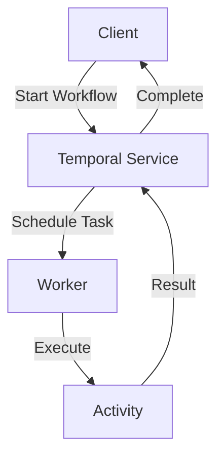

# Quick Start Guide: Temporal Book Project

**Feature**: Temporal Book Chapter Structure with Python Examples
**Date**: 2025-11-19
**Audience**: Authors, contributors, and readers

## Overview

This guide helps you set up the Temporal book project environment, navigate the structure, run examples, and contribute content. The book teaches Temporal.io concepts through a combination of theoretical markdown content and practical Python examples.

## Table of Contents

1. [Prerequisites](#prerequisites)
2. [Initial Setup](#initial-setup)
3. [Project Structure](#project-structure)
4. [Running Examples](#running-examples)
5. [Adding New Content](#adding-new-content)
6. [Building the Interactive Book](#building-the-interactive-book)
7. [Troubleshooting](#troubleshooting)

---

## Prerequisites

### Required Software

**Python 3.13**
```bash
# Check if installed
python3 --version  # Should show 3.13.x

# If not installed:
# macOS (using Homebrew)
brew install python@3.13

# Linux (using pyenv recommended)
pyenv install 3.13.0
pyenv global 3.13.0

# Windows (using installer from python.org)
# Download from: https://www.python.org/downloads/
```

**uv Package Manager**
```bash
# Install uv
curl -LsSf https://astral.sh/uv/install.sh | sh

# Or using pip
pip install uv

# Verify installation
uv --version
```

**Git**
```bash
# Verify Git is installed
git --version

# If not installed, download from: https://git-scm.com/
```

**Temporal Server** (choose one option)

Option A: Temporal CLI (Recommended for development)
```bash
# Install Temporal CLI
brew install temporal  # macOS
# Or download from: https://docs.temporal.io/cli

# Start local development server
temporal server start-dev
```

Option B: Docker Compose
```bash
# Clone Temporal's docker-compose setup
git clone https://github.com/temporalio/docker-compose.git temporal-docker
cd temporal-docker

# Start services
docker-compose up
```

Option C: Temporal Cloud
- Sign up at https://temporal.io/cloud
- Note your namespace and connection details

### Optional Software

**VS Code** (recommended editor)
- Install from: https://code.visualstudio.com/
- Recommended extensions:
  - Python (ms-python.python)
  - Markdown Preview Enhanced (shd101wyy.markdown-preview-enhanced)
  - Mermaid Markdown Syntax Highlighting (bpruitt-goddard.mermaid-markdown-syntax-highlighting)

---

## Initial Setup

### 1. Clone the Repository

```bash
# Clone the book repository
git clone https://github.com/your-org/temporal-book.git
cd temporal-book

# Checkout the working branch
git checkout 001-temporal-book-chapters
```

### 2. Verify Project Structure

```bash
# List top-level directories
ls -la

# Expected output:
# - README.md
# - shared/
# - part-i-grundlagen/
# - part-ii-sdk-fokus/
# - part-iii-resilienz/
# - part-iv-betrieb/
# - part-v-kochbuch/
```

### 3. Set Up Shared Utilities

The `shared/` directory contains common utilities used by all examples.

```bash
# Verify shared utilities exist
ls shared/

# Expected files:
# - __init__.py
# - temporal_helpers.py
# - examples_common.py
```

No installation needed - examples will import directly from this directory.

### 4. Test Your Environment

Run a quick environment check:

```bash
# Check Python version
python3 --version  # Should be 3.13.x

# Check uv
uv --version

# Check Temporal server (if using local dev server)
temporal server start-dev &  # Start in background
sleep 5  # Wait for startup
temporal workflow list  # Should connect without errors
```

---

## Project Structure

### Directory Layout

```
temporal-book/
├── README.md                          # Book overview & navigation
├── .gitignore                         # Python/uv ignores
│
├── shared/                            # 🔧 Shared utilities
│   ├── __init__.py
│   ├── temporal_helpers.py            # Temporal client setup
│   └── examples_common.py             # Common example utilities
│
├── part-i-grundlagen/                 # 📚 Part I: Fundamentals
│   ├── chapter-01.md                  # Einführung in Temporal
│   ├── chapter-02.md                  # Kernbausteine
│   ├── chapter-03.md                  # Architektur des Temporal Service
│   ├── examples/
│   │   ├── chapter-01/                # 🐍 Examples for Chapter 1
│   │   │   ├── pyproject.toml
│   │   │   ├── .python-version
│   │   │   ├── README.md
│   │   │   └── simple_workflow.py
│   │   ├── chapter-02/                # 🐍 Examples for Chapter 2
│   │   └── chapter-03/
│   └── assets/                        # 🎨 Shared images for Part I
│
├── part-ii-sdk-fokus/                 # 📚 Part II: SDK Development
│   ├── chapter-04.md
│   ├── ...
│
├── part-iii-resilienz/                # 📚 Part III: Resilience & Patterns
├── part-iv-betrieb/                   # 📚 Part IV: Operations & Scaling
└── part-v-kochbuch/                   # 📚 Part V: Cookbook
```

### Navigation Tips

**Find a specific chapter:**
```bash
# All chapters for Part I
ls part-i-grundlagen/chapter-*.md

# Specific chapter content
cat part-i-grundlagen/chapter-01.md

# Examples for Chapter 1
cd part-i-grundlagen/examples/chapter-01/
```

**Browse all parts:**
```bash
# List all parts
ls -d part-*/

# Count total chapters
find . -name "chapter-*.md" | wc -l  # Should show 15+
```

---

## Running Examples

### Basic Example Execution

Each chapter with examples includes a self-contained Python project using uv.

**Step 1: Navigate to example directory**
```bash
cd part-i-grundlagen/examples/chapter-01/
```

**Step 2: Install dependencies**
```bash
# uv will create a virtual environment and install dependencies
uv sync

# This should complete in <2 minutes
# Creates: .venv/ directory with isolated dependencies
```

**Step 3: Run an example**
```bash
# Run with uv (recommended - uses project's venv)
uv run python simple_workflow.py

# Or activate venv manually
source .venv/bin/activate  # macOS/Linux
.\.venv\Scripts\activate   # Windows
python simple_workflow.py
```

### Example Workflow

Most examples follow this pattern:

```python
# simple_workflow.py
from shared.temporal_helpers import create_temporal_client

async def main():
    # Connect to Temporal
    client = await create_temporal_client()

    # Start workflow
    handle = await client.start_workflow(...)

    # Get result
    result = await handle.result()
    print(f"Result: {result}")

if __name__ == "__main__":
    import asyncio
    asyncio.run(main())
```

### Troubleshooting Examples

**Issue: ImportError for shared utilities**

```bash
# Solution: Add parent directory to PYTHONPATH
export PYTHONPATH="${PYTHONPATH}:/Users/you/temporal-book"

# Or add to example script:
import sys
sys.path.append('../../../')  # Adjust for your structure
```

**Issue: Temporal connection refused**

```bash
# Ensure Temporal server is running
temporal server start-dev

# Or check if already running
lsof -i :7233  # Should show temporal process
```

**Issue: Python version mismatch**

```bash
# Verify version in example directory
cat .python-version  # Should show "3.13"

# Force uv to use correct version
uv python install 3.13
uv sync
```

---

## Adding New Content

### Adding a New Chapter

**1. Create chapter markdown file**
```bash
cd part-i-grundlagen/

# Create chapter file (e.g., chapter-04.md)
touch chapter-04.md
```

**2. Add chapter template**
```markdown
# Kapitel 4: [Chapter Title]

## Einführung
[Learning objectives and overview]

## [Section 1]
[Content]

## Beispiel
Siehe `/examples/chapter-04/` für lauffähigen Code.

## Zusammenfassung
[Key takeaways]
```

**3. Create example project** (if chapter has examples)
```bash
cd examples/
mkdir chapter-04
cd chapter-04/

# Initialize with uv
uv init

# Or create manually:
cat > .python-version << EOF
3.13
EOF

cat > pyproject.toml << EOF
[project]
name = "temporal-book-chapter-04"
version = "0.1.0"
description = "Examples for Chapter 4: [Title]"
requires-python = ">=3.13"
dependencies = [
    "temporalio>=1.5.0,<2.0.0",
]

[build-system]
requires = ["hatchling"]
build-backend = "hatchling.build"
EOF

# Create README
cat > README.md << EOF
# Chapter 4 Examples

## Setup
\`\`\`bash
uv sync
uv run python example.py
\`\`\`
EOF
```

**4. Add example code**
```bash
# Create Python example
cat > example.py << 'EOF'
"""
Example for Chapter 4: [Description]

Demonstrates: [Concept]
"""

from shared.temporal_helpers import create_temporal_client

async def main():
    print("Chapter 4 example")
    # Your example code here

if __name__ == "__main__":
    import asyncio
    asyncio.run(main())
EOF
```

**5. Test the example**
```bash
uv sync
uv run python example.py
```

### Adding Mermaid Diagrams

**In chapter markdown file:**
```markdown
### Workflow Architecture


```

**Preview the diagram:**
- GitHub: View file in repository (renders automatically)
- VS Code: Use Markdown Preview (Cmd+Shift+V / Ctrl+Shift+V)
- Online: https://mermaid.live/ (paste code)

---

## Building the Interactive Book

### Using MkDocs (Recommended)

**1. Install MkDocs with Material theme**
```bash
# Install in project root
pip install mkdocs-material mkdocs-mermaid2-plugin

# Or with uv (recommended)
uv tool install mkdocs-material
uv tool install mkdocs-mermaid2-plugin
```

**2. Create MkDocs configuration**
```yaml
# mkdocs.yml
site_name: Temporal.io - Durable Execution Mastery
site_description: Ein Deep Dive in die Orchestrierung verteilter Systeme
theme:
  name: material
  language: de
  features:
    - navigation.tabs
    - navigation.sections
    - toc.integrate
    - search.suggest

plugins:
  - search:
      lang: de
  - mermaid2

markdown_extensions:
  - pymdownx.superfences:
      custom_fences:
        - name: mermaid
          class: mermaid
          format: !!python/name:mermaid2.fence_mermaid

nav:
  - Home: README.md
  - Teil I - Grundlagen:
      - Kapitel 1: part-i-grundlagen/chapter-01.md
      - Kapitel 2: part-i-grundlagen/chapter-02.md
      - Kapitel 3: part-i-grundlagen/chapter-03.md
  - Teil II - SDK Fokus:
      - Kapitel 4: part-ii-sdk-fokus/chapter-04.md
      - ...
```

**3. Build and serve**
```bash
# Serve locally (auto-reload on changes)
mkdocs serve

# Open browser to: http://127.0.0.1:8000/

# Build static site
mkdocs build

# Output in: site/ directory
```

### Alternative: Docusaurus

```bash
# Install Docusaurus
npx create-docusaurus@latest website classic

# Configure for book structure
# See: https://docusaurus.io/docs
```

---

## Common Workflows

### For Authors

**Daily workflow:**
1. Pull latest changes: `git pull`
2. Navigate to chapter: `cd part-{x}-{name}/`
3. Edit markdown: `vim chapter-{n}.md`
4. Test examples: `cd examples/chapter-{n}/ && uv run python example.py`
5. Preview book: `mkdocs serve` (in root)
6. Commit changes: `git add . && git commit -m "Update chapter X"`

### For Readers

**Learning workflow:**
1. Read chapter content: Open markdown in GitHub or built site
2. Navigate to examples: `cd part-{x}-{name}/examples/chapter-{n}/`
3. Install dependencies: `uv sync`
4. Run examples: `uv run python <example>.py`
5. Experiment: Modify code and re-run
6. Review diagrams: View Mermaid diagrams in markdown

### For Contributors

**Contributing workflow:**
1. Fork repository
2. Create feature branch: `git checkout -b add-chapter-X-examples`
3. Add content following structure guidelines
4. Test examples locally
5. Submit pull request with description

---

## Troubleshooting

### Common Issues

**Problem: uv command not found**
```bash
# Reinstall uv
curl -LsSf https://astral.sh/uv/install.sh | sh

# Add to PATH (check shell config)
echo 'export PATH="$HOME/.cargo/bin:$PATH"' >> ~/.zshrc
source ~/.zshrc
```

**Problem: Python 3.13 not found**
```bash
# Install via pyenv (recommended)
pyenv install 3.13.0
pyenv local 3.13.0

# Or system package manager
brew install python@3.13  # macOS
```

**Problem: Temporal connection errors**
```bash
# Check if server is running
temporal operator cluster health

# Start dev server if not running
temporal server start-dev

# Check connection string
# Default: localhost:7233
```

**Problem: Mermaid diagrams not rendering**
- GitHub: Should render automatically (if not, check syntax)
- VS Code: Install Mermaid extension
- MkDocs: Ensure `mkdocs-mermaid2-plugin` is installed and configured

**Problem: Import errors for shared utilities**
```bash
# Option 1: Add to PYTHONPATH
export PYTHONPATH="${PYTHONPATH}:$(pwd)"

# Option 2: Install shared as editable package
cd shared/
pip install -e .
```

### Getting Help

- **Book issues**: Open issue on GitHub repository
- **Temporal questions**: https://community.temporal.io/
- **Python/uv questions**: https://github.com/astral-sh/uv/discussions

---

## Next Steps

**As an Author:**
1. Review `spec.md` and `plan.md` for project overview
2. Read `data-model.md` for structure details
3. Start writing chapter content
4. Add working examples
5. Test examples thoroughly

**As a Reader:**
1. Start with Part I, Chapter 1
2. Read theory in markdown
3. Run examples to solidify understanding
4. Experiment by modifying examples
5. Progress through chapters sequentially

**As a Contributor:**
1. Review `contracts/` for structural requirements
2. Follow existing patterns in similar chapters
3. Ensure examples are runnable and well-documented
4. Submit PRs for review

---

## Resources

**Official Documentation:**
- Temporal: https://docs.temporal.io/
- Python SDK: https://docs.temporal.io/develop/python
- uv: https://github.com/astral-sh/uv
- MkDocs: https://www.mkdocs.org/
- Mermaid: https://mermaid.js.org/

**Community:**
- Temporal Community: https://community.temporal.io/
- Temporal GitHub: https://github.com/temporalio/temporal

---

**Happy Learning and Contributing!**

For questions or issues with this guide, please open an issue on the repository.
