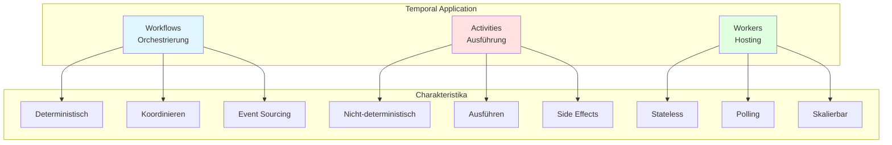
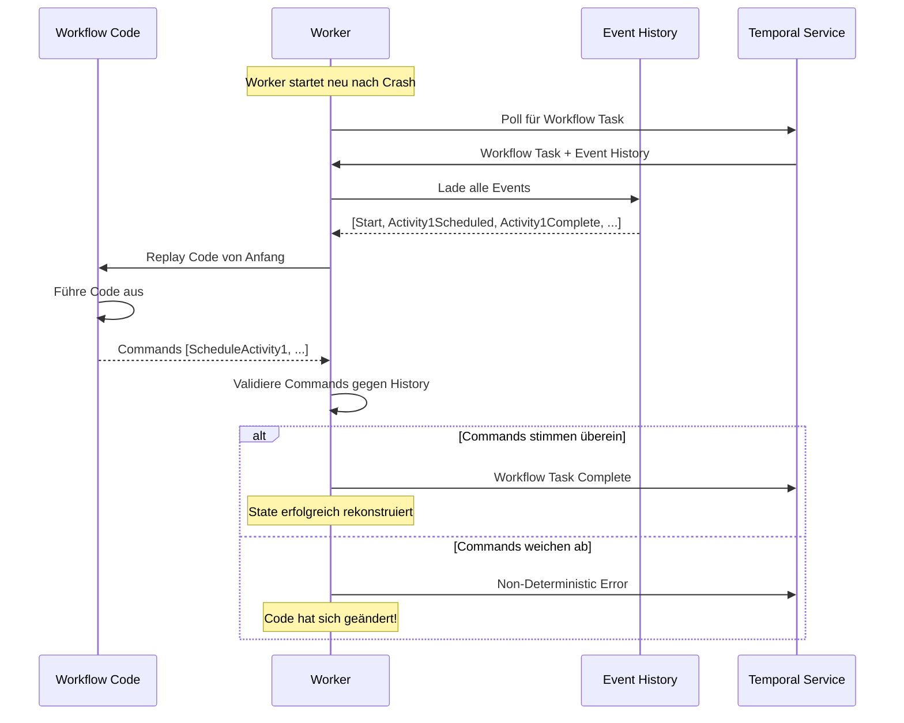
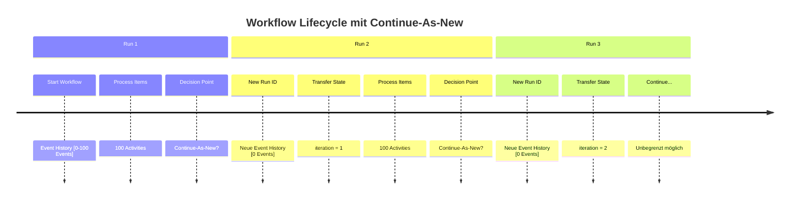
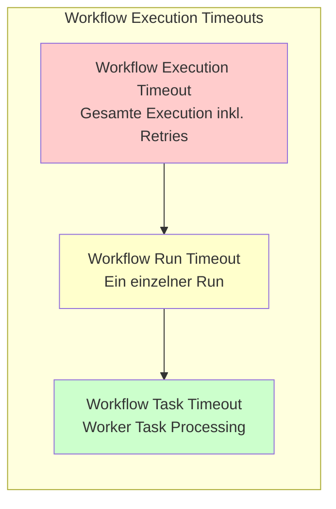
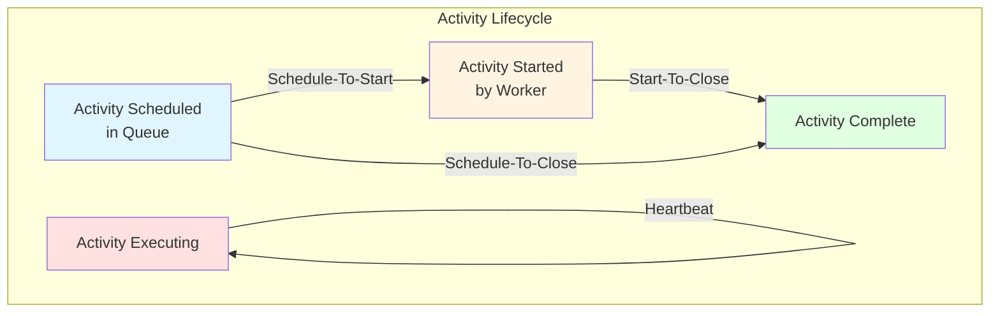
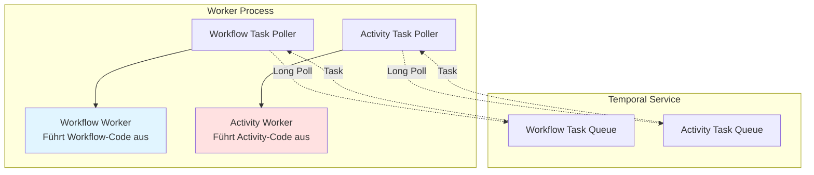
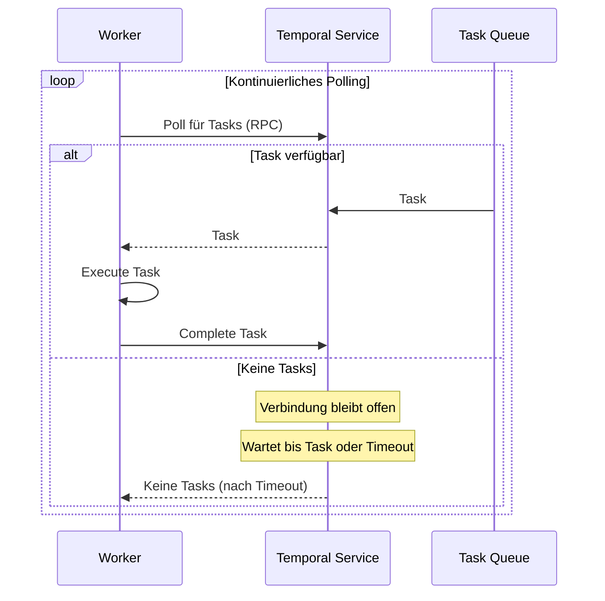
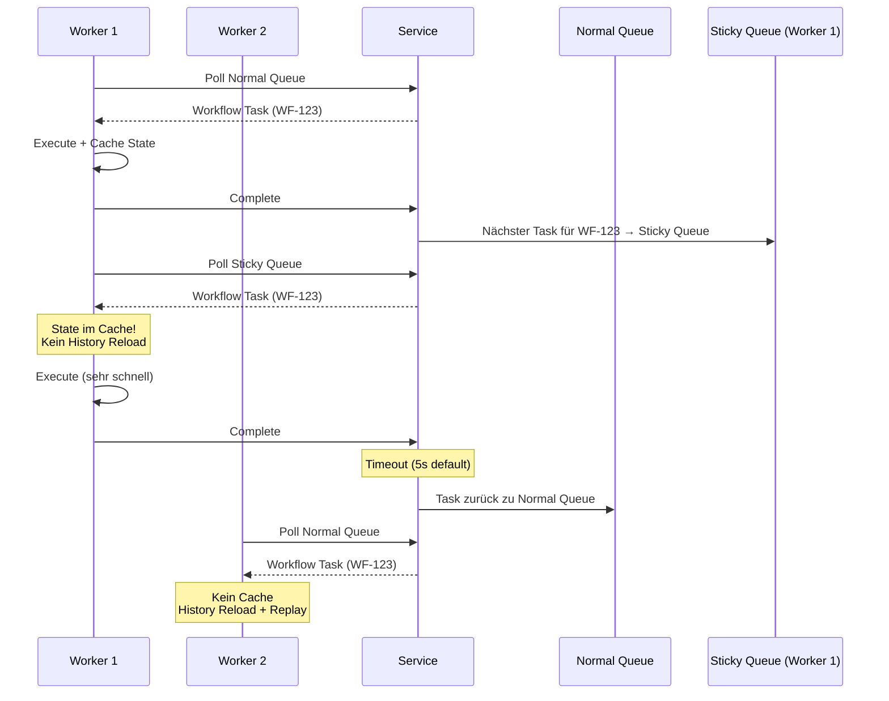
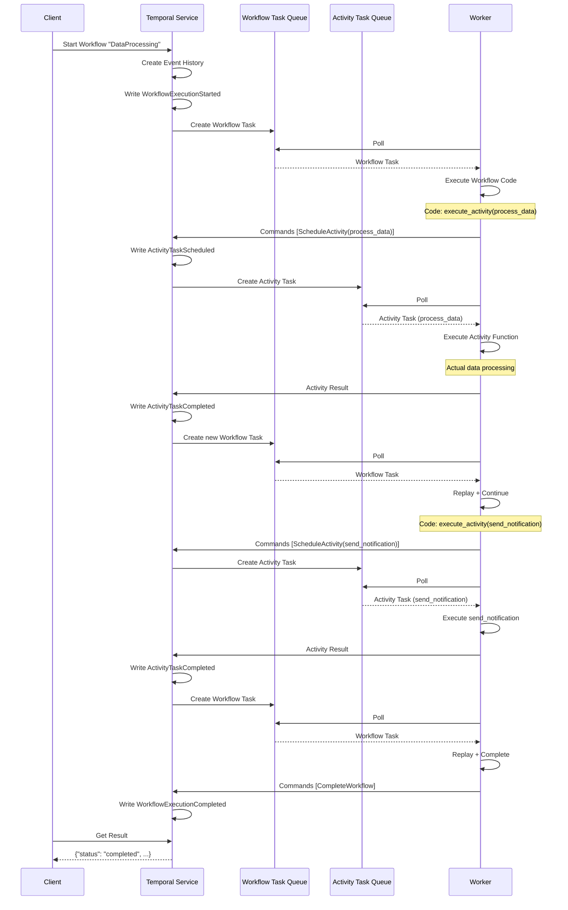
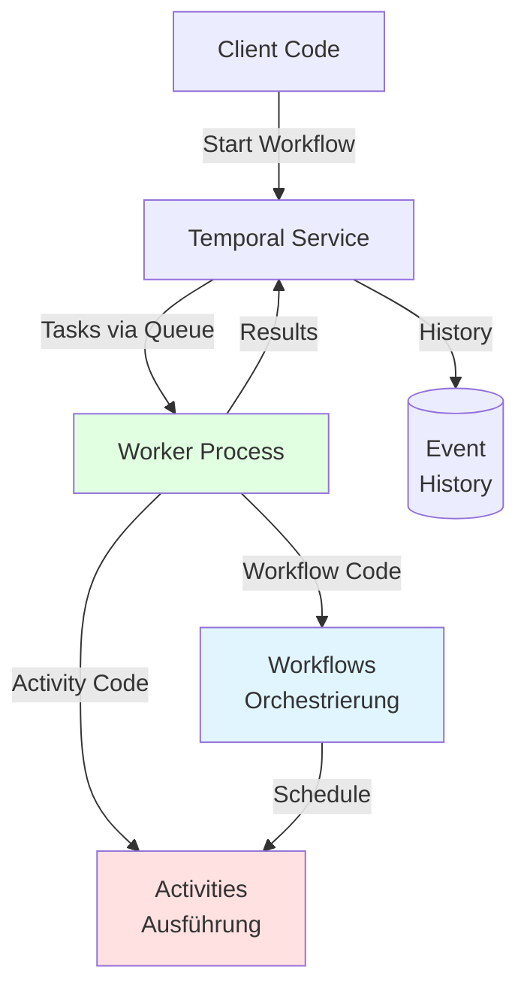

# Kapitel 2: Kernbausteine – Workflows, Activities, Worker

Nach der Einführung in Temporal im vorherigen Kapitel tauchen wir nun tief in die drei fundamentalen Bausteine ein, die das Herzstück jeder Temporal-Anwendung bilden: **Workflows**, **Activities** und **Worker**. Das Verständnis dieser Komponenten und ihres Zusammenspiels ist entscheidend für die erfolgreiche Entwicklung mit Temporal.

## 2.1 Überblick: Die drei Säulen von Temporal

Temporal basiert auf einer klaren Trennung der Verantwortlichkeiten (Separation of Concerns), die in drei Hauptkomponenten unterteilt ist:



**Die Rollen im Detail:**

- **Workflows**: Die Dirigenten des Orchesters – sie definieren *was* passieren soll und in welcher Reihenfolge, führen aber selbst keine Business Logic aus.

- **Activities**: Die Musiker – sie führen die eigentliche Arbeit aus, von Datenbankzugriffen über API-Aufrufe bis hin zu komplexen Berechnungen.

- **Workers**: Die Konzerthalle – sie bieten die Infrastruktur, in der Workflows und Activities ausgeführt werden, und kommunizieren mit dem Temporal Service.

## 2.2 Workflows: Die Orchestrierungslogik

### 2.2.1 Was ist ein Workflow?

Ein Workflow in Temporal ist eine **Funktion oder Methode**, die die Orchestrierungslogik Ihrer Anwendung definiert. Anders als in vielen anderen Workflow-Engines wird ein Temporal-Workflow in einer echten Programmiersprache geschrieben – nicht in YAML, XML oder einer DSL.

**Fundamentale Eigenschaften:**

1. **Deterministisch**: Bei gleichen Inputs immer gleiche Outputs und Commands
2. **Langlebig**: Kann Tage, Monate oder Jahre laufen
3. **Ausfallsicher**: Übersteht Infrastruktur- und Code-Deployments
4. **Versionierbar**: Unterstützt Code-Änderungen bei laufenden Workflows

**Ein einfaches Beispiel aus dem Code:**

```python
from temporalio import workflow
from datetime import timedelta

@workflow.defn
class DataProcessingWorkflow:
    """
    Ein Workflow orchestriert Activities - er führt sie nicht selbst aus.
    """

    @workflow.run
    async def run(self, data: str) -> dict:
        # Ruft Activity auf - delegiert die eigentliche Arbeit
        processed = await workflow.execute_activity(
            process_data,
            data,
            start_to_close_timeout=timedelta(seconds=30),
            retry_policy=RetryPolicy(
                maximum_attempts=3,
                initial_interval=timedelta(seconds=1),
            ),
        )

        # Orchestriert weitere Schritte
        await workflow.execute_activity(
            send_notification,
            f"Processed: {processed}",
            start_to_close_timeout=timedelta(seconds=10),
        )

        return {"input": data, "output": processed, "status": "completed"}
```

> 📁 **Code-Beispiel**: [`../examples/part-01/chapter-02/workflow.py`](../examples/part-01/chapter-02/workflow.py)

### 2.2.2 Der Determinismus-Constraint

**Warum Determinismus?**

Temporal nutzt einen **Replay-Mechanismus**, um Workflow-State zu rekonstruieren. Stellen Sie sich vor, ein Worker-Prozess stürzt ab, während ein Workflow läuft. Wenn der Workflow später auf einem anderen Worker fortgesetzt wird, muss Temporal den exakten State wiederherstellen. Dies geschieht durch:

1. Laden der **Event History** (alle bisherigen Events)
2. **Replay** des Workflow-Codes gegen diese History
3. Vergleich der generierten Commands mit der History
4. Bei Übereinstimmung: Workflow kann fortgesetzt werden



**Was ist verboten in Workflows?**

```python
# ❌ FALSCH: Nicht-deterministisch
@workflow.defn
class BadWorkflow:
    @workflow.run
    async def run(self):
        # ❌ Zufallszahlen
        random_value = random.random()

        # ❌ Aktuelle Zeit
        now = datetime.now()

        # ❌ Direkte I/O-Operationen
        with open('file.txt') as f:
            data = f.read()

        # ❌ Direkte API-Aufrufe
        response = requests.get('https://api.example.com')

        return random_value

# ✅ RICHTIG: Deterministisch
@workflow.defn
class GoodWorkflow:
    @workflow.run
    async def run(self):
        # ✅ Temporal's Zeit-API
        now = workflow.now()

        # ✅ Temporal's Sleep
        await workflow.sleep(timedelta(hours=1))

        # ✅ I/O in Activities auslagern
        data = await workflow.execute_activity(
            read_file,
            'file.txt',
            start_to_close_timeout=timedelta(seconds=10)
        )

        # ✅ API-Aufrufe in Activities
        response = await workflow.execute_activity(
            call_external_api,
            'https://api.example.com',
            start_to_close_timeout=timedelta(seconds=30)
        )

        return {"data": data, "response": response}
```

**Die goldene Regel**: Workflows orchestrieren, Activities führen aus.

### 2.2.3 Long-Running Workflows und Continue-As-New

Temporal-Workflows können theoretisch unbegrenzt lange laufen. In der Praxis gibt es jedoch technische Grenzen:

**Event History Limits:**
- Maximum **50.000 Events** (technisch 51.200)
- Maximum **50 MB** History-Größe
- Performance-Degradation ab ~10.000 Events

**Continue-As-New Pattern:**

Für langlebige Workflows nutzt man das Continue-As-New Pattern:

```python
@workflow.defn
class LongRunningWorkflow:
    @workflow.run
    async def run(self, iteration: int = 0) -> str:
        # Führe Batch von Arbeit aus
        for i in range(100):
            await workflow.execute_activity(
                process_item,
                f"item-{iteration}-{i}",
                start_to_close_timeout=timedelta(minutes=1)
            )

        # Nach 100 Items: Continue-As-New
        # Neue Workflow-Instanz mit frischer Event History
        workflow.continue_as_new(iteration + 1)
```

**Wie Continue-As-New funktioniert:**



**Wann Continue-As-New nutzen?**
- Bei regelmäßigen Checkpoints (täglich, wöchentlich)
- Wenn Event History >10.000 Events erreicht
- Bei häufigen Code-Deployments (vermeidet Versioning-Probleme)

### 2.2.4 Workflow Versioning

Code ändert sich. Workflows laufen lange. Was passiert, wenn laufende Workflows auf neue Code-Versionen treffen?

**Problem:**
```python
# Version 1 (deployed, Workflows laufen)
@workflow.defn
class OrderWorkflow:
    @workflow.run
    async def run(self, order_id: str):
        await workflow.execute_activity(process_payment, ...)
        return "done"

# Version 2 (neues Deployment)
@workflow.defn
class OrderWorkflow:
    @workflow.run
    async def run(self, order_id: str):
        # NEU: Validierung hinzugefügt
        await workflow.execute_activity(validate_order, ...)
        await workflow.execute_activity(process_payment, ...)
        return "done"
```

Beim Replay eines alten Workflows würde der neue Code eine zusätzliche Activity schedulen – **Non-Deterministic Error**!

**Lösung: Patching API**

```python
from temporalio import workflow

@workflow.defn
class OrderWorkflow:
    @workflow.run
    async def run(self, order_id: str):
        # Patching: Unterstütze alte UND neue Workflows
        if workflow.patched("add-validation"):
            # Neuer Code
            await workflow.execute_activity(validate_order, ...)

        # Alter Code (läuft in beiden Versionen)
        await workflow.execute_activity(process_payment, ...)
        return "done"
```

**Patching-Workflow:**
1. **Patch hinzufügen** mit neuem und altem Code
2. **Warten** bis alle alten Workflows abgeschlossen sind
3. **deprecate_patch()** verwenden
4. **Patch-Code entfernen** im nächsten Deployment

### 2.2.5 Workflow-Timeouts

Temporal bietet verschiedene Timeout-Typen:



**Empfehlung**: Workflow-Timeouts werden **generell nicht empfohlen**. Workflows sind für langlebige, resiliente Ausführung konzipiert. Timeouts sollten nur in Ausnahmefällen gesetzt werden.

## 2.3 Activities: Die Business Logic

### 2.3.1 Was sind Activities?

Activities sind **normale Funktionen**, die einzelne, klar definierte Aktionen ausführen. Im Gegensatz zu Workflows dürfen Activities:

- ✅ I/O-Operationen durchführen
- ✅ Externe APIs aufrufen
- ✅ Datenbanken lesen/schreiben
- ✅ Zufallszahlen generieren
- ✅ Aktuelle Systemzeit verwenden
- ✅ Side Effects haben

**Activities sind der Ort für die eigentliche Business Logic.**

**Beispiel aus dem Code:**

```python
from temporalio import activity

@activity.defn
async def process_data(data: str) -> str:
    """
    Activity für Datenverarbeitung.
    Darf nicht-deterministische Operationen durchführen.
    """
    activity.logger.info(f"Processing data: {data}")

    # Simuliert externe API-Aufrufe, DB-Zugriffe, etc.
    result = data.upper()

    activity.logger.info(f"Data processed: {result}")
    return result

@activity.defn
async def send_notification(message: str) -> None:
    """
    Activity für Side Effects (E-Mail, Webhook, etc.)
    """
    activity.logger.info(f"Sending notification: {message}")

    # In der Praxis: Echter API-Aufruf
    # await email_service.send(message)
    # await webhook.post(message)

    print(f"📧 Notification: {message}")
```

> 📁 **Code-Beispiel**: [`../examples/part-01/chapter-02/activities.py`](../examples/part-01/chapter-02/activities.py)

### 2.3.2 Activity-Timeouts

Activities haben **vier verschiedene Timeout-Typen**:



**1. Start-To-Close Timeout** (wichtigster):
```python
await workflow.execute_activity(
    process_data,
    data,
    start_to_close_timeout=timedelta(minutes=5),  # Max. 5 Min pro Versuch
)
```

**2. Schedule-To-Close Timeout** (inkl. Retries):
```python
await workflow.execute_activity(
    process_data,
    data,
    schedule_to_close_timeout=timedelta(minutes=30),  # Max. 30 Min total
)
```

**3. Schedule-To-Start Timeout** (selten benötigt):
```python
await workflow.execute_activity(
    process_data,
    data,
    schedule_to_start_timeout=timedelta(minutes=10),  # Max. 10 Min in Queue
)
```

**4. Heartbeat Timeout** (für langlebige Activities):
```python
await workflow.execute_activity(
    long_running_task,
    params,
    heartbeat_timeout=timedelta(seconds=30),  # Heartbeat alle 30s
)
```

**Mindestens ein Timeout erforderlich**: Start-To-Close ODER Schedule-To-Close.

### 2.3.3 Retry-Policies und Error Handling

**Default Retry Policy** (wenn nicht anders konfiguriert):

```python
RetryPolicy(
    initial_interval=timedelta(seconds=1),
    backoff_coefficient=2.0,
    maximum_interval=timedelta(seconds=100),
    maximum_attempts=0,  # 0 = unbegrenzt
)
```

**Retry-Berechnung:**
```
retry_wait = min(
    initial_interval × (backoff_coefficient ^ retry_count),
    maximum_interval
)
```

**Beispiel**: Bei `initial_interval=1s` und `backoff_coefficient=2`:
- Retry 1: nach 1 Sekunde
- Retry 2: nach 2 Sekunden
- Retry 3: nach 4 Sekunden
- Retry 4: nach 8 Sekunden
- ...

**Custom Retry Policy:**

```python
from temporalio.common import RetryPolicy

@workflow.defn
class RobustWorkflow:
    @workflow.run
    async def run(self):
        result = await workflow.execute_activity(
            flaky_external_api,
            params,
            start_to_close_timeout=timedelta(seconds=30),
            retry_policy=RetryPolicy(
                initial_interval=timedelta(seconds=1),
                maximum_interval=timedelta(minutes=1),
                backoff_coefficient=2,
                maximum_attempts=5,
                # Diese Fehler NICHT wiederholen
                non_retryable_error_types=["InvalidInputError", "AuthError"],
            ),
        )
        return result
```

**Non-Retryable Errors:**

```python
from temporalio.exceptions import ApplicationError

@activity.defn
async def validate_input(data: str) -> str:
    if not data:
        # Dieser Fehler wird NICHT wiederholt
        raise ApplicationError(
            "Input cannot be empty",
            non_retryable=True
        )
    return data
```

### 2.3.4 Heartbeats für langlebige Activities

Für Activities, die lange laufen (mehrere Minuten oder länger), bieten **Heartbeats** zwei Vorteile:

1. **Schnellere Failure Detection**: Service erkennt Worker-Crashes sofort
2. **Progress Tracking**: Bei Restart kann Activity von letztem Checkpoint fortsetzen

```python
from temporalio import activity

@activity.defn
async def process_large_file(file_path: str, total_items: int) -> str:
    """
    Verarbeitet große Datei mit Progress-Tracking.
    """
    start_index = 0

    # Recover von vorherigem Progress
    if activity.info().is_heartbeat_details_available():
        start_index = activity.heartbeat_details()[0]
        activity.logger.info(f"Resuming from index {start_index}")

    for i in range(start_index, total_items):
        # Verarbeite Item
        await process_item(i)

        # Heartbeat mit Progress
        activity.heartbeat(i)

    return f"Processed {total_items} items"
```

**Workflow-Seite:**

```python
result = await workflow.execute_activity(
    process_large_file,
    args=["big_file.csv", 10000],
    start_to_close_timeout=timedelta(hours=2),
    heartbeat_timeout=timedelta(seconds=30),  # Erwarte Heartbeat alle 30s
)
```

**Wann Heartbeats nutzen?**
- ✅ Große Datei-Downloads oder -Verarbeitung
- ✅ ML-Model-Training
- ✅ Batch-Processing mit vielen Items
- ❌ Schnelle API-Aufrufe (< 1 Minute)

### 2.3.5 Idempotenz – Die wichtigste Best Practice

**Activities sollten IMMER idempotent sein**: Mehrfache Ausführung = gleiches Ergebnis.

**Warum?**
- Temporal garantiert **At-Least-Once Execution** für Activities
- Bei Netzwerkfehlern kann unklar sein, ob Activity erfolgreich war
- Temporal wiederholt die Activity im Zweifel

**Beispiel: Geldüberweisung (nicht idempotent):**

```python
# ❌ GEFÄHRLICH: Nicht idempotent
@activity.defn
async def transfer_money(from_account: str, to_account: str, amount: float):
    # Was passiert bei Retry?
    # → Geld wird mehrfach überwiesen!
    await bank_api.transfer(from_account, to_account, amount)
```

**Lösung: Idempotency Keys**

```python
# ✅ SICHER: Idempotent
@activity.defn
async def transfer_money(
    from_account: str,
    to_account: str,
    amount: float,
    idempotency_key: str
):
    # Prüfe ob bereits ausgeführt
    if await bank_api.is_processed(idempotency_key):
        return await bank_api.get_result(idempotency_key)

    # Führe Überweisung aus
    result = await bank_api.transfer(
        from_account,
        to_account,
        amount,
        idempotency_key=idempotency_key
    )

    return result
```

**Idempotency Key Generierung im Workflow:**

```python
@workflow.defn
class PaymentWorkflow:
    @workflow.run
    async def run(self, order_id: str, amount: float):
        # Generiere deterministischen Idempotency Key
        idempotency_key = f"payment-{order_id}-{workflow.info().run_id}"

        await workflow.execute_activity(
            transfer_money,
            args=[
                "account-A",
                "account-B",
                amount,
                idempotency_key
            ],
            start_to_close_timeout=timedelta(minutes=5),
        )
```

### 2.3.6 Local Activities – Der Spezialfall

**Local Activities** werden im gleichen Prozess wie der Workflow ausgeführt, **ohne** separate Task Queue:

```python
result = await workflow.execute_local_activity(
    quick_calculation,
    params,
    start_to_close_timeout=timedelta(seconds=5),
)
```

**Wann nutzen?**
- ✅ Sehr kurze Activities (< 1 Sekunde)
- ✅ Hoher Throughput erforderlich (1000+ Activities/Sekunde)
- ✅ Einfache Berechnungen ohne externe Dependencies

**Limitierungen:**
- ❌ Keine Heartbeats
- ❌ Bei Retry wird gesamte Activity wiederholt (kein Checkpoint)
- ❌ Höheres Risiko bei nicht-idempotenten Operationen

**Empfehlung**: Nutze reguläre Activities als Default. Local Activities nur für sehr spezifische Performance-Optimierungen.

## 2.4 Workers: Die Laufzeitumgebung

### 2.4.1 Worker-Architektur

Workers sind **eigenständige Prozesse**, die außerhalb des Temporal Service laufen und:

1. **Task Queues pollen** (long-polling RPC)
2. **Workflow- und Activity-Code ausführen**
3. **Ergebnisse zurück an Temporal Service senden**



**Worker Setup – Beispiel aus dem Code:**

```python
from temporalio.worker import Worker
from shared.temporal_helpers import create_temporal_client

async def main():
    # 1. Verbinde zu Temporal
    client = await create_temporal_client()

    # 2. Erstelle Worker
    worker = Worker(
        client,
        task_queue="book-examples",
        workflows=[DataProcessingWorkflow],  # Registriere Workflows
        activities=[process_data, send_notification],  # Registriere Activities
    )

    # 3. Starte Worker (blockiert bis Ctrl+C)
    await worker.run()
```

> 📁 **Code-Beispiel**: [`../examples/part-01/chapter-02/worker.py`](../examples/part-01/chapter-02/worker.py)

### 2.4.2 Task Queues und Polling

**Task Queue Eigenschaften:**

- **Lightweight**: Dynamisch erstellt, keine explizite Registration
- **On-Demand**: Wird beim ersten Workflow/Activity-Start erstellt
- **Persistent**: Tasks bleiben erhalten bei Worker-Ausfällen
- **Load Balancing**: Automatische Verteilung über alle Worker

**Long-Polling Mechanismus:**



**Pull-basiert, nicht Push**:
- Worker holen Tasks nur, wenn Kapazität vorhanden
- Verhindert Überlastung
- Automatisches Backpressure-Handling

### 2.4.3 Task Queue Routing und Partitioning

**Routing-Strategien:**

```python
# 1. Standard: Ein Task Queue für alles
worker = Worker(
    client,
    task_queue="default",
    workflows=[WorkflowA, WorkflowB],
    activities=[activity1, activity2, activity3],
)

# 2. Separierung nach Funktion
workflow_worker = Worker(
    client,
    task_queue="workflows",
    workflows=[WorkflowA, WorkflowB],
)

activity_worker = Worker(
    client,
    task_queue="activities",
    activities=[activity1, activity2, activity3],
)

# 3. Isolation kritischer Activities (Bulkheading)
critical_worker = Worker(
    client,
    task_queue="critical-activities",
    activities=[payment_activity],
)

background_worker = Worker(
    client,
    task_queue="background-activities",
    activities=[send_email, generate_report],
)
```

**Warum Isolation?**
- Verhindert, dass langsame Activities kritische blockieren
- Bessere Ressourcen-Allokation
- Dedizierte Skalierung möglich

**Task Queue Partitioning:**

```python
# Default: 4 Partitionen
# → Höherer Throughput, keine FIFO-Garantie

# Single Partition für FIFO-Garantie
# (via Temporal Server Config)
```

### 2.4.4 Sticky Execution – Performance-Optimierung

**Problem**: Bei jedem Workflow Task muss Worker die komplette Event History laden und Workflow replayed.

**Lösung**: Sticky Execution



**Vorteile:**
- 10-100x schnellere Task-Verarbeitung
- Reduzierte Last auf History Service
- Geringere Latenz

**Automatisch aktiviert** – keine Konfiguration erforderlich!

### 2.4.5 Worker Scaling und Deployment

**Horizontal Scaling:**

Workers sind **stateless** – Workflow-State ist im Temporal Service, nicht im Worker.

```python
# Gleicher Code auf allen Workers
# Kann beliebig skaliert werden

# Worker 1 (Server A)
worker1 = Worker(client, task_queue="production", ...)
await worker1.run()

# Worker 2 (Server B)
worker2 = Worker(client, task_queue="production", ...)
await worker2.run()

# Worker 3 (Server C)
worker3 = Worker(client, task_queue="production", ...)
await worker3.run()
```

**Deployment Patterns:**

1. **Dedizierte Worker Processes** (empfohlen für Production):
```bash
# Separate Prozesse nur für Temporal
python worker.py
```

2. **Combined Worker + Application**:
```python
# Im gleichen Prozess wie Web Server
# Nur für Development/kleine Apps

async def start_services():
    # Starte Web Server
    web_server = await start_web_server()

    # Starte Worker (im Hintergrund)
    worker = Worker(...)
    asyncio.create_task(worker.run())
```

3. **Worker Fleets** (High Availability):
```
Kubernetes Deployment:
- 10+ Worker Pods
- Auto-Scaling basierend auf Task Queue Länge
- Rolling Updates ohne Downtime
```

**Skalierungs-Strategien:**

| Szenario | Lösung |
|----------|--------|
| Höherer Workflow-Throughput | Mehr Worker Processes |
| Langlebige Activities | Mehr Activity Task Slots pro Worker |
| CPU-intensive Activities | Weniger Slots, mehr CPU pro Worker |
| I/O-bound Activities | Mehr Slots, weniger CPU pro Worker |
| Kritische Activities isolieren | Separate Task Queue + dedizierte Worker |

### 2.4.6 Worker Tuning und Konfiguration

**Task Slots – Concurrency Control:**

```python
worker = Worker(
    client,
    task_queue="production",
    workflows=[...],
    activities=[...],
    max_concurrent_workflow_tasks=100,  # Max. parallele Workflow Tasks
    max_concurrent_activities=50,       # Max. parallele Activities
    max_concurrent_local_activities=100, # Max. parallele Local Activities
)
```

**Resource-Based Auto-Tuning** (empfohlen):

```python
from temporalio.worker import ResourceBasedTunerConfig, ResourceBasedSlotConfig

worker = Worker(
    client,
    task_queue="production",
    workflows=[...],
    activities=[...],
    tuner=ResourceBasedTunerConfig(
        # Workflow Task Slots
        workflow_task_slot_supplier=ResourceBasedSlotConfig(
            target_cpu_usage=0.8,      # Ziel: 80% CPU
            target_memory_usage=0.8,   # Ziel: 80% Memory
            minimum_slots=5,
            maximum_slots=100,
        ),
        # Activity Task Slots
        activity_task_slot_supplier=ResourceBasedSlotConfig(
            target_cpu_usage=0.7,
            target_memory_usage=0.7,
        ),
    ),
)
```

**Vorteile:**
- Verhindert Out-of-Memory Errors
- Optimiert Durchsatz automatisch
- Passt sich an Workload an

## 2.5 Das Zusammenspiel: Ein komplettes Beispiel

Betrachten wir ein vollständiges Beispiel: **Datenverarbeitung mit Benachrichtigung**.

### 2.5.1 Der komplette Flow



### 2.5.2 Event History Timeline

Die Event History für diesen Flow:

```
1.  WorkflowExecutionStarted
    - WorkflowType: DataProcessingWorkflow
    - Input: "Sample Data"

2.  WorkflowTaskScheduled

3.  WorkflowTaskStarted

4.  WorkflowTaskCompleted
    - Commands: [ScheduleActivityTask(process_data)]

5.  ActivityTaskScheduled
    - ActivityType: process_data

6.  ActivityTaskStarted

7.  ActivityTaskCompleted
    - Result: "SAMPLE DATA"

8.  WorkflowTaskScheduled

9.  WorkflowTaskStarted

10. WorkflowTaskCompleted
    - Commands: [ScheduleActivityTask(send_notification)]

11. ActivityTaskScheduled
    - ActivityType: send_notification

12. ActivityTaskStarted

13. ActivityTaskCompleted

14. WorkflowTaskScheduled

15. WorkflowTaskStarted

16. WorkflowTaskCompleted
    - Commands: [CompleteWorkflowExecution]

17. WorkflowExecutionCompleted
    - Result: {"input": "Sample Data", "output": "SAMPLE DATA", "status": "completed"}
```

### 2.5.3 Code-Beispiel ausführen

**Voraussetzungen:**
```bash
# 1. Temporal Server starten (Docker)
docker compose up -d

# 2. Dependencies installieren
cd ../examples/part-01/chapter-02
uv sync
```

**Terminal 1 – Worker starten:**
```bash
uv run python worker.py
```

Ausgabe:
```
INFO - Starting Temporal Worker...
INFO - Worker registered workflows and activities:
INFO -   - Workflows: ['DataProcessingWorkflow']
INFO -   - Activities: ['process_data', 'send_notification']
INFO - Worker is running and polling for tasks...
INFO - Press Ctrl+C to stop
```

**Terminal 2 – Workflow starten:**
```bash
uv run python workflow.py
```

Ausgabe:
```
INFO - Processing data: Sample Data
INFO - Data processed successfully: SAMPLE DATA
INFO - Sending notification: Processed: SAMPLE DATA
📧 Notification: Processed: SAMPLE DATA
INFO - Notification sent successfully

✅ Workflow Result: {'input': 'Sample Data', 'output': 'SAMPLE DATA', 'status': 'completed'}
```

## 2.6 Best Practices

### 2.6.1 Workflow Best Practices

1. **Orchestrieren, nicht Implementieren**
   ```python
   # ❌ Schlecht: Business Logic im Workflow
   @workflow.defn
   class BadWorkflow:
       @workflow.run
       async def run(self, data: list):
           result = []
           for item in data:
               # Komplexe Business Logic
               processed = item.strip().upper().replace("_", "-")
               result.append(processed)
           return result

   # ✅ Gut: Logic in Activity
   @workflow.defn
   class GoodWorkflow:
       @workflow.run
       async def run(self, data: list):
           return await workflow.execute_activity(
               process_items,
               data,
               start_to_close_timeout=timedelta(minutes=5)
           )
   ```

2. **Kurze Workflow-Funktionen**
   - Lange Workflows in kleinere Child Workflows aufteilen
   - Verbessert Wartbarkeit und Testbarkeit

3. **Continue-As-New bei langen Laufzeiten**
   - Spätestens bei 10.000 Events
   - Oder: Regelmäßige Checkpoints (täglich/wöchentlich)

4. **Determinismus-Tests schreiben**
   ```python
   from temporalio.testing import WorkflowEnvironment

   async def test_workflow_determinism():
       async with await WorkflowEnvironment.start_time_skipping() as env:
           # Teste Workflow mit verschiedenen Szenarien
           ...
   ```

### 2.6.2 Activity Best Practices

1. **IMMER idempotent**
   - Nutze Idempotency Keys
   - Prüfe ob Operation bereits durchgeführt wurde

2. **Passende Granularität**
   - Nicht zu fein: Bloated History
   - Nicht zu grob: Schwierige Idempotenz, ineffiziente Retries

3. **Timeouts immer setzen**
   - Mindestens Start-To-Close
   - Heartbeats für langlebige Activities

4. **Error Handling**
   ```python
   @activity.defn
   async def robust_activity(params):
       try:
           return await external_api.call(params)
       except TemporaryError as e:
           # Retry durch Temporal
           raise
       except PermanentError as e:
           # Nicht wiederholen
           raise ApplicationError(str(e), non_retryable=True)
   ```

### 2.6.3 Worker Best Practices

1. **Dedizierte Worker Processes in Production**
   - Nicht im gleichen Prozess wie Web Server

2. **Task Queue Isolation für kritische Activities**
   ```python
   # Zahlungen isoliert
   payment_worker = Worker(
       client,
       task_queue="payments",
       activities=[payment_activity],
   )

   # Background Jobs separat
   background_worker = Worker(
       client,
       task_queue="background",
       activities=[email_activity, report_activity],
   )
   ```

3. **Resource-Based Tuning nutzen**
   - Verhindert Out-of-Memory
   - Optimiert Throughput automatisch

4. **Monitoring und Metriken**
   ```python
   # Wichtige Metriken überwachen:
   # - worker_task_slots_available (sollte >0 sein)
   # - temporal_sticky_cache_hit_total
   # - temporal_activity_execution_failed_total
   ```

## 2.7 Zusammenfassung

In diesem Kapitel haben wir die drei Kernbausteine von Temporal kennengelernt:

**Workflows** orchestrieren den gesamten Prozess:
- Deterministisch und replay-fähig
- Langlebig (Tage bis Jahre)
- Geschrieben in normalen Programmiersprachen
- Dürfen KEINE I/O-Operationen durchführen

**Activities** führen die eigentliche Arbeit aus:
- Nicht-deterministisch
- Dürfen I/O, externe APIs, Side Effects
- Automatische Retries mit konfigurierbaren Policies
- Sollten IMMER idempotent sein

**Workers** hostet Workflow- und Activity-Code:
- Pollen Task Queues via long-polling
- Stateless und horizontal skalierbar
- Führen Workflow-Replay und Activity-Execution aus
- Sticky Execution für Performance

**Das große Bild:**



Mit diesem Verständnis der Kernbausteine können wir im nächsten Kapitel tiefer in die **Architektur des Temporal Service** eintauchen und verstehen, wie Frontend, History Service, Matching Service und Persistence Layer zusammenarbeiten.

---

**[⬆ Zurück zum Inhaltsverzeichnis](README.md)**

**Nächstes Kapitel**: [Kapitel 3: Architektur des Temporal Service](part-01-chapter-03.md)

**Code-Beispiele für dieses Kapitel**: [`examples/part-01/chapter-02/`](../examples/part-01/chapter-02/)
