# Kapitel 3: Architektur des Temporal Service

Nachdem wir in den vorherigen Kapiteln die Grundkonzepte und Kernbausteine von Temporal kennengelernt haben, tauchen wir nun tief in die **Architektur des Temporal Service** ein. Der Temporal Service ist das Herzstück des gesamten Systems – er koordiniert Workflows, speichert den State, verwaltet Task Queues und garantiert die Ausführung. Ein fundiertes Verständnis dieser Architektur ist entscheidend für den Betrieb und die Skalierung von Temporal in Production.

## 3.1 Architektur-Übersicht

### 3.1.1 Die vier Kernkomponenten

Der Temporal Service besteht aus **vier unabhängig skalierbaren Diensten**:

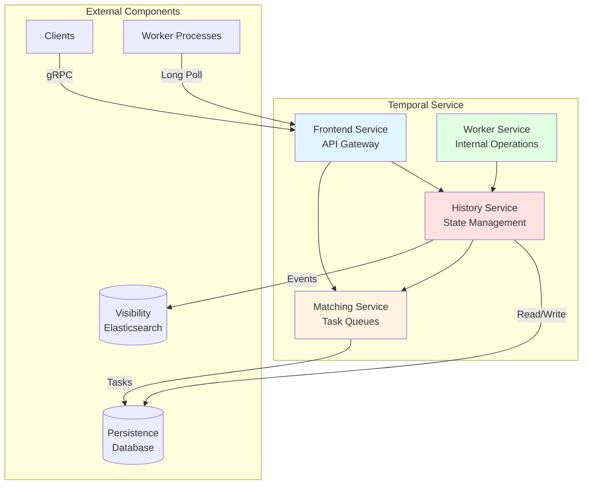

**Frontend Service**:
- Stateless API Gateway
- Entry Point für alle Client- und Worker-Requests
- Request-Validierung und Rate Limiting
- Routing zu History und Matching Service

**History Service**:
- Verwaltet Workflow Execution State
- Speichert Event History (Event Sourcing)
- Koordiniert Workflow-Lifecycle
- **Sharded**: Feste Anzahl von Shards, die Workflow-Executions zugeordnet werden

**Matching Service**:
- Verwaltet Task Queues
- Dispatcht Tasks an Worker
- Long-Polling Mechanismus
- **Partitioned**: Task Queues in Partitionen für Skalierung

**Worker Service** (interner Dienst):
- Führt interne System-Workflows aus
- Replication Queue Processing
- Archival Operations
- **Nicht** die Worker-Prozesse der Anwender!

### 3.1.2 Architekturprinzipien

**Event Sourcing als Fundament**:
Temporal speichert eine append-only Event History für jede Workflow Execution. Der komplette Workflow-State kann durch Replay dieser History rekonstruiert werden.

**Separation of Concerns**:
- Frontend: API und Routing
- History: State Management und Koordination
- Matching: Task Dispatching
- Persistence: Daten-Speicherung

**Unabhängige Skalierung**:
Jeder Dienst kann unabhängig horizontal skaliert werden, um verschiedenen Workload-Charakteristiken gerecht zu werden.

## 3.2 Frontend Service: Das API Gateway

### 3.2.1 Rolle und Verantwortlichkeiten

Der Frontend Service ist der **einzige öffentliche Entry Point** zum Temporal Service:

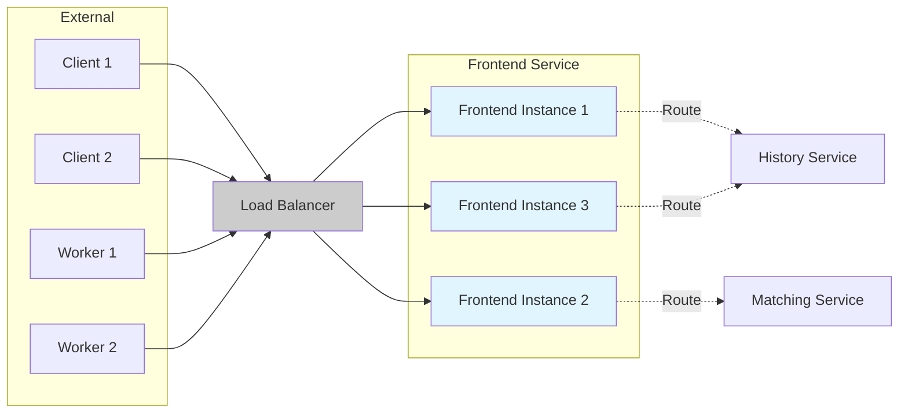

**API Exposure**:
- **gRPC API** (Port 7233): Primäres Protokoll für Clients und Workers
- **HTTP API** (Port 8233): HTTP-Proxy für Web UI und HTTP-Clients
- **Protocol Buffers**: Serialisierung mit protobuf

**Request Handling**:
1. Empfängt API-Requests (StartWorkflow, SignalWorkflow, PollWorkflowTask, etc.)
2. Validiert Requests auf Korrektheit
3. Führt Rate Limiting durch
4. Routet zu History oder Matching Service

### 3.2.2 Rate Limiting

Frontend implementiert **Multi-Level Rate Limiting**:

```python
# Namespace-Level RPS Limit
# Pro Namespace maximal N Requests/Sekunde
frontend.namespacerps = 1200

# Persistence-Level QPS Limit
# Schützt Datenbank vor Überlastung
frontend.persistenceMaxQPS = 10000

# Task Queue-Level Limits
# Pro Task Queue maximal M Dispatches/Sekunde
```

**Warum Rate Limiting?**
- Schutz vor übermäßiger Last
- Fairness zwischen Namespaces (Multi-Tenancy)
- Vermeidung von Database-Überlastung
- Backpressure für Clients

### 3.2.3 Namespace Routing

**Multi-Tenancy durch Namespaces**:

Namespaces bieten logische Isolation:
- Workflow Executions isoliert pro Namespace
- Separate Resource Limits
- Unabhängige Retention Policies
- Verschiedene Archival Configurations

**Routing-Mechanismus**:
Frontend bestimmt aus Request-Header, welcher Namespace betroffen ist, und routet entsprechend.

### 3.2.4 Stateless Design

**Horizontale Skalierung ohne Limits**:

```bash
# Einfaches Hinzufügen neuer Frontend Instances
kubectl scale deployment temporal-frontend --replicas=10
```

Eigenschaften:
- Keine Session-Affinität erforderlich
- Kein Shared State zwischen Instances
- Load Balancer verteilt Traffic
- Einfaches Rolling Update

## 3.3 History Service: Das Herzstück

### 3.3.1 Event Sourcing und State Management

Der History Service verwaltet den **kompletten Lifecycle** jeder Workflow Execution:

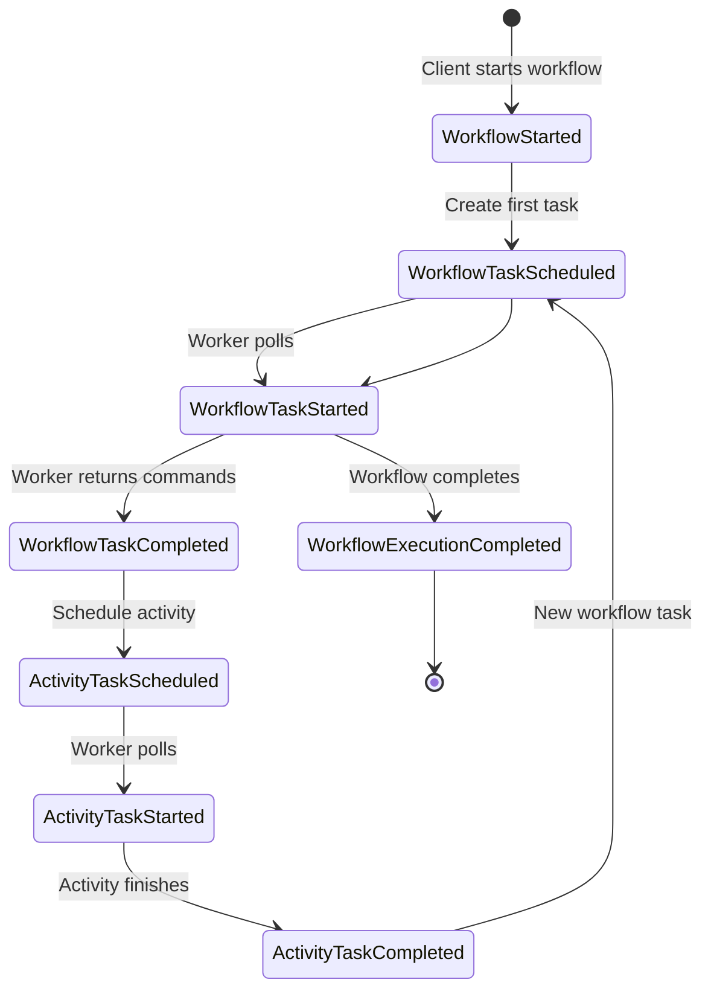

**Zwei Formen von State**:

1. **Mutable State** (veränderlich):
   - Aktueller Snapshot der Workflow Execution
   - Tracked: Laufende Activities, Timer, Child Workflows, pending Signals
   - **In-Memory Cache** für kürzlich verwendete Executions
   - **In Database** persistiert (typischerweise eine Zeile)
   - Wird bei jeder State Transition aktualisiert

2. **Immutable Event History** (unveränderlich):
   - Append-Only Log aller Workflow Events
   - **Source of Truth**: Workflow-State kann komplett rekonstruiert werden
   - Definiert in Protocol Buffer Specifications
   - Limits: 51.200 Events oder 50 MB (Warnung bei 10.240 Events/10 MB)

### 3.3.2 Sharding-Architektur

**Fixed Shard Count**:

Der History Service nutzt Sharding für Parallelität:

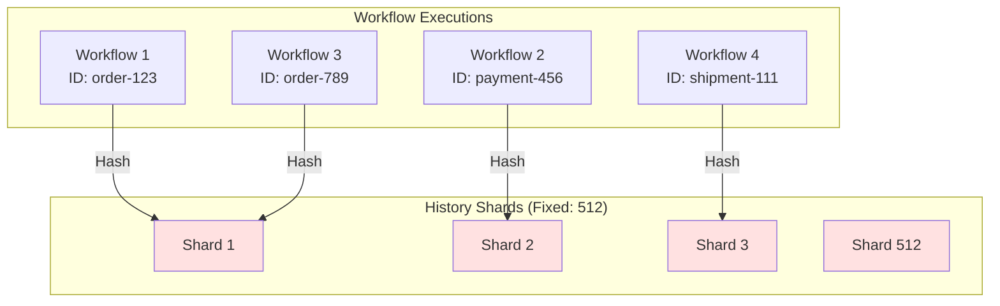

**Shard Assignment**:
```
shard_id = hash(workflow_id + namespace) % shard_count
```

**Eigenschaften**:
- Shard Count wird **bei Cluster-Erstellung** festgelegt
- **Nicht änderbar** nach Cluster-Start
- Empfohlen: 128-512 Shards für kleine Cluster, selten >4096
- Jeder Shard ist eine Unit of Parallelism
- Alle Updates innerhalb eines Shards sind **sequenziell**

**Performance-Implikationen**:

```
Max Throughput pro Shard = 1 / (Database Operation Latency)

Beispiel:
- DB Latency: 10ms
- Max Throughput: 1 / 0.01s = 100 Updates/Sekunde pro Shard
- 512 Shards → ~51.200 Updates/Sekunde gesamt
```

### 3.3.3 Interne Task Queues

Jeder History Shard verwaltet **interne Queues** für verschiedene Task-Typen:

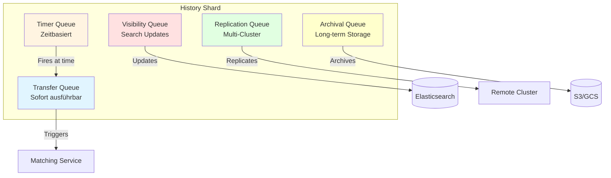

**1. Transfer Queue**:
- Sofort ausführbare Tasks
- Enqueued Workflow/Activity Tasks zu Matching
- Erzeugt Timer

**2. Timer Queue**:
- Zeitbasierte Events
- Workflow Timeouts, Retries, Delays
- Cron Triggers
- Fires zur definierten Zeit, erzeugt oft Transfer Tasks

**3. Visibility Queue**:
- Updates für Visibility Store (Elasticsearch)
- Ermöglicht Workflow-Suche und -Filterung
- Powert Web UI Queries

**4. Replication Queue** (Multi-Cluster):
- Repliziert Events zu Remote Clusters
- Async Replication für High Availability

**5. Archival Queue**:
- Triggert Archivierung nach Retention Period
- Langzeitspeicherung (S3, GCS, etc.)

### 3.3.4 Workflow State Transition

**Transaktionaler Ablauf**:

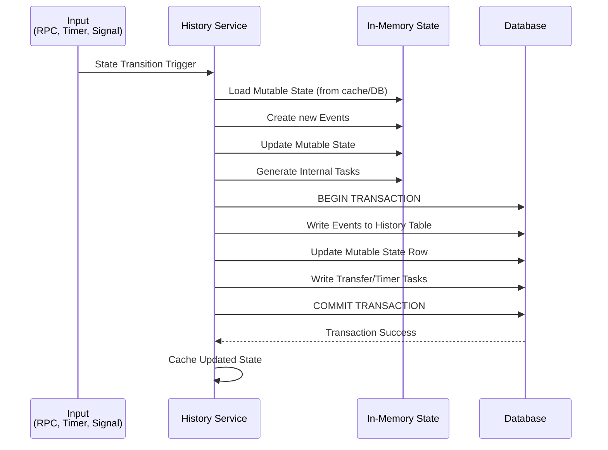

**Consistency durch Transactions**:
- Mutable State und Event History werden **atomar** committed
- Verhindert Inkonsistenzen bei Crashes
- Database Transactions garantieren ACID-Eigenschaften

**Transactional Outbox Pattern**:
- Transfer Tasks werden mit State in DB persistiert
- Task Processing erfolgt asynchron
- Verhindert Divergenz zwischen State und Task Queues

### 3.3.5 Cache-Mechanismen

**Mutable State Cache**:
```python
# Pro-Shard Cache
# Cached kürzlich verwendete Workflow Executions
# Vermeidet teure History Replays

cache_size_per_shard = 1000  # Beispiel
```

**Vorteile**:
- Schneller Zugriff auf aktiven Workflow State
- Reduziert Database Reads
- Kritisch für Performance bei hoher Last

**Cache Miss**:
Bei Cache Miss muss History Service:
1. Event History aus DB laden
2. Komplette History replayed
3. State rekonstruieren
4. In Cache einfügen

**Geplante Verbesserung**: Host-Level Cache, der von allen Shards geteilt wird.

## 3.4 Matching Service: Task Queue Management

### 3.4.1 Aufgaben und Verantwortlichkeiten

Der Matching Service verwaltet **alle user-facing Task Queues**:

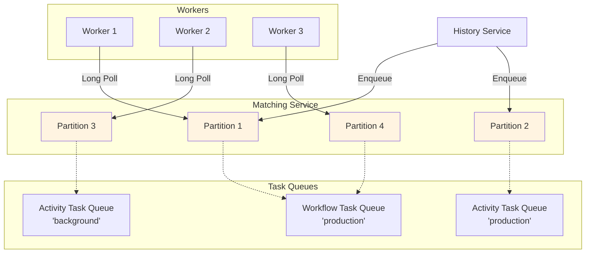

**Core Functions**:
- Task Queue Verwaltung
- Task Dispatching an Workers
- Long-Poll Protocol Implementation
- Load Balancing über Worker Processes

### 3.4.2 Task Queue Partitioning

**Default: 4 Partitionen pro Task Queue**

```python
# Task Queue "production" mit 4 Partitionen
task_queue_partitions = {
    "production": [
        "production_partition_0",
        "production_partition_1",
        "production_partition_2",
        "production_partition_3",
    ]
}
```

**Partition Charakteristika**:
- Tasks werden **zufällig** einer Partition zugeordnet
- Worker Polls werden **gleichmäßig** verteilt
- Partitionen sind **Units of Scaling** für Matching Service
- Partition Count anpassbar basierend auf Last

**Hierarchische Organisation**:

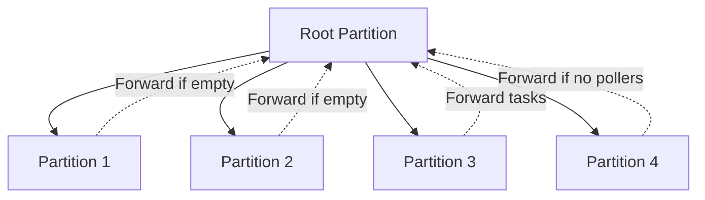

**Forwarding Mechanismus**:
- Leere Partitionen forwarden Polls zur Parent Partition
- Partitionen ohne Poller forwarden Tasks zur Parent
- Ermöglicht effiziente Ressourcennutzung

### 3.4.3 Sync Match vs Async Match

**Zwei Dispatch-Modi**:

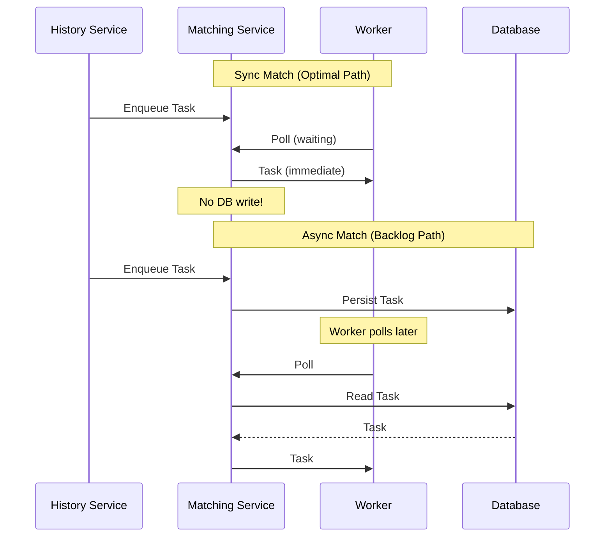

**Sync Match** (Optimal):
- Task sofort an wartenden Worker geliefert
- **Keine Database-Persistierung** erforderlich
- Zero Backlog Szenario
- Höchste Performance
- Metrik: `sync_match_rate` sollte hoch sein (>90%)

**Async Match** (Backlog):
- Task wird in DB persistiert
- Worker holt später aus Backlog
- Tritt auf wenn keine Worker verfügbar
- Niedrigere Performance (DB Round-Trip)
- Tasks FIFO aus Backlog

**Special Cases**:
- **Nexus/Query Tasks**: Niemals persistiert, nur Sync Match
- **Sticky Workflow Tasks**: Bei Sync Match Fail → DB Persistence

### 3.4.4 Load Balancing

**Worker-Pull Model**:

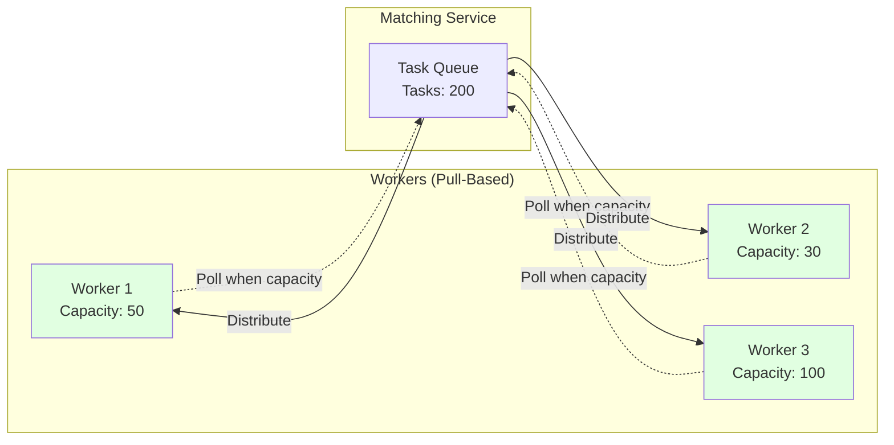

**Vorteile**:
- Natürliches Load Balancing
- Workers holen nur wenn Kapazität vorhanden
- Verhindert Worker-Überlastung
- Kein Worker Discovery/DNS erforderlich

**Backlog Management**:
- Monitor `BacklogIncreaseRate` Metrik
- Balance Worker Count mit Task Volume
- Scale Workers um Sync Match Rate zu maximieren

### 3.4.5 Sticky Execution Optimization

**Problem**: Bei jedem Workflow Task muss Worker Event History laden und replayed.

**Lösung**: Sticky Task Queues

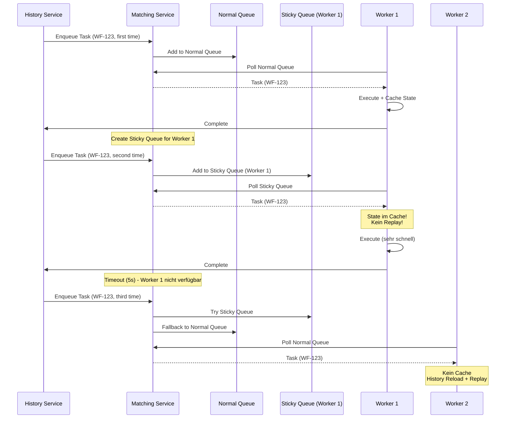

**Vorteile**:
- **10-100x schnellere** Task-Verarbeitung
- Reduzierte Last auf History Service
- Geringere Latenz für Workflows

**Automatisch aktiviert** – keine Konfiguration erforderlich!

## 3.5 Worker Service: Interne Operationen

### 3.5.1 Unterschied zu User Workers

**WICHTIG**: Worker Service ≠ User Worker Processes!

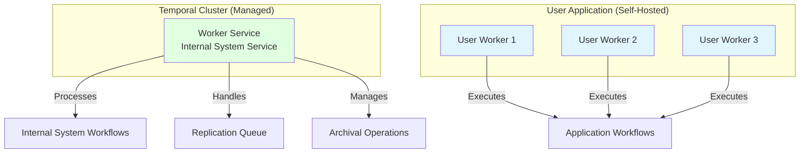

### 3.5.2 Aufgaben des Worker Service

**Interne Background-Verarbeitung**:

1. **System Workflows**:
   - Workflow Deletions
   - Dead-Letter Queue Handling
   - Batch Operations

2. **Replication Queue Processing**:
   - Multi-Cluster Replication
   - Event-Synchronisation zu Remote Clusters

3. **Archival Operations**:
   - Langzeit-Archivierung abgeschlossener Workflows
   - Upload zu S3, GCS, etc.

4. **Kafka Visibility Processor** (Version < 1.5.0):
   - Event Processing für Elasticsearch

**Self-Hosting**:
Nutzt Temporal's eigene Workflow Engine für Cluster-Level Operationen – "Temporal orchestriert Temporal"!

## 3.6 Persistence Layer: Datenspeicherung

### 3.6.1 Unterstützte Datenbanken

**Primary Persistence** (temporal_default):

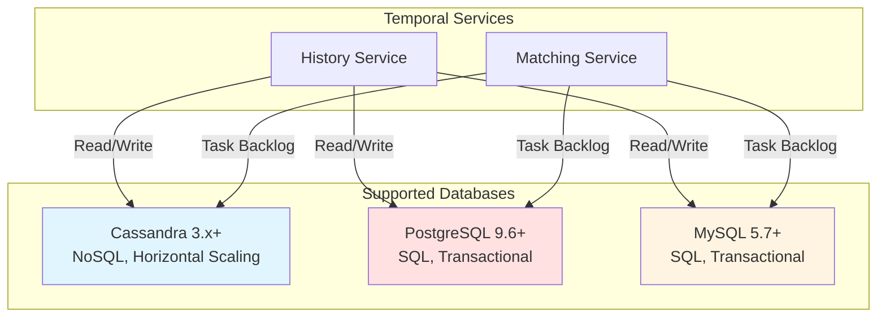

**Cassandra**:
- Natürliche horizontale Skalierung
- Multi-Datacenter Replication
- Eventual Consistency Model
- Empfohlen für massive Scale

**PostgreSQL/MySQL**:
- Vertikale Skalierung
- Read Replicas für Visibility Queries
- Connection Pooling kritisch
- Ausreichend für die meisten Production Deployments

### 3.6.2 Datenmodell

**Zwei-Schema-Ansatz**:

**1. temporal_default** (Core Persistence):

```
Tables:
- executions: Mutable State of Workflow Executions
- history_node: Append-Only Event Log (partitioned)
- tasks: Transfer, Timer, Visibility, Replication Queues
- namespaces: Namespace Metadata, Retention Policies
- queue_metadata: Task Queue Checkpoints
```

**2. temporal_visibility** (Search/Query):

```
Tables:
- executions_visibility: Indexed Workflow Metadata
  - workflow_id, workflow_type, status, start_time, close_time
  - custom_search_attributes (JSON/Searchable)
```

**Event History Storage Pattern**:

```python
# Events werden in Batches gespeichert (History Nodes)
# Jeder Node: ~100-200 Events
# Optimiert für sequentielles Lesen

history_nodes = [
    {
        "node_id": 1,
        "events": [1..100],  # WorkflowStarted bis Event 100
        "prev_txn_id": 0,
        "txn_id": 12345
    },
    {
        "node_id": 2,
        "events": [101..200],
        "prev_txn_id": 12345,
        "txn_id": 12456
    },
]
```

### 3.6.3 Visibility Store

**Database Visibility** (Basic):

```sql
-- Einfache SQL Queries
SELECT * FROM executions_visibility
WHERE workflow_type = 'OrderProcessing'
  AND status = 'Running'
  AND start_time > '2025-01-01'
ORDER BY start_time DESC
LIMIT 100;
```

Limitierungen:
- Begrenzte Query-Capabilities
- Performance-Probleme bei großen Datasets
- Verfügbar: PostgreSQL 12+, MySQL 8.0.17+

**Elasticsearch Visibility** (Advanced, empfohlen):

```json
// Komplexe Queries möglich
{
  "query": {
    "bool": {
      "must": [
        {"term": {"WorkflowType": "OrderProcessing"}},
        {"term": {"ExecutionStatus": "Running"}},
        {"range": {"StartTime": {"gte": "2025-01-01"}}}
      ],
      "filter": [
        {"term": {"CustomStringField": "VIP"}}
      ]
    }
  },
  "sort": [{"StartTime": "desc"}],
  "size": 100
}
```

Vorteile:
- High-Performance Indexing
- Komplexe Such-Queries
- Custom Attributes und Filter
- Entlastet Haupt-Datenbank

**Design Consideration**:
Elasticsearch nimmt Query-Last von der Main Database – kritisch für Skalierung!

### 3.6.4 Konsistenz-Garantien

**Strong Consistency** (Writes):

```python
# Database Transaction gewährleistet Konsistenz
BEGIN TRANSACTION
    UPDATE executions SET mutable_state = ... WHERE ...
    INSERT INTO history_node VALUES (...)
    INSERT INTO tasks VALUES (...)
COMMIT
```

- History Service nutzt DB Transactions
- Mutable State + Events atomar committed
- Einzelner Shard verarbeitet alle Updates sequenziell
- Verhindert Race Conditions

**Eventual Consistency** (Reads):

- Visibility Data eventual consistent
- Multi-Cluster Replication asynchron
- Replication Lag möglich bei Failover

**Event Sourcing Benefits**:
- **Exactly-Once Execution** Semantics
- Komplette Audit Trail
- State Reconstruction jederzeit möglich
- Replay für Debugging

## 3.7 Kommunikationsflüsse

### 3.7.1 Workflow Start Flow

Der komplette Flow vom Client bis zur ersten Workflow Task Execution:

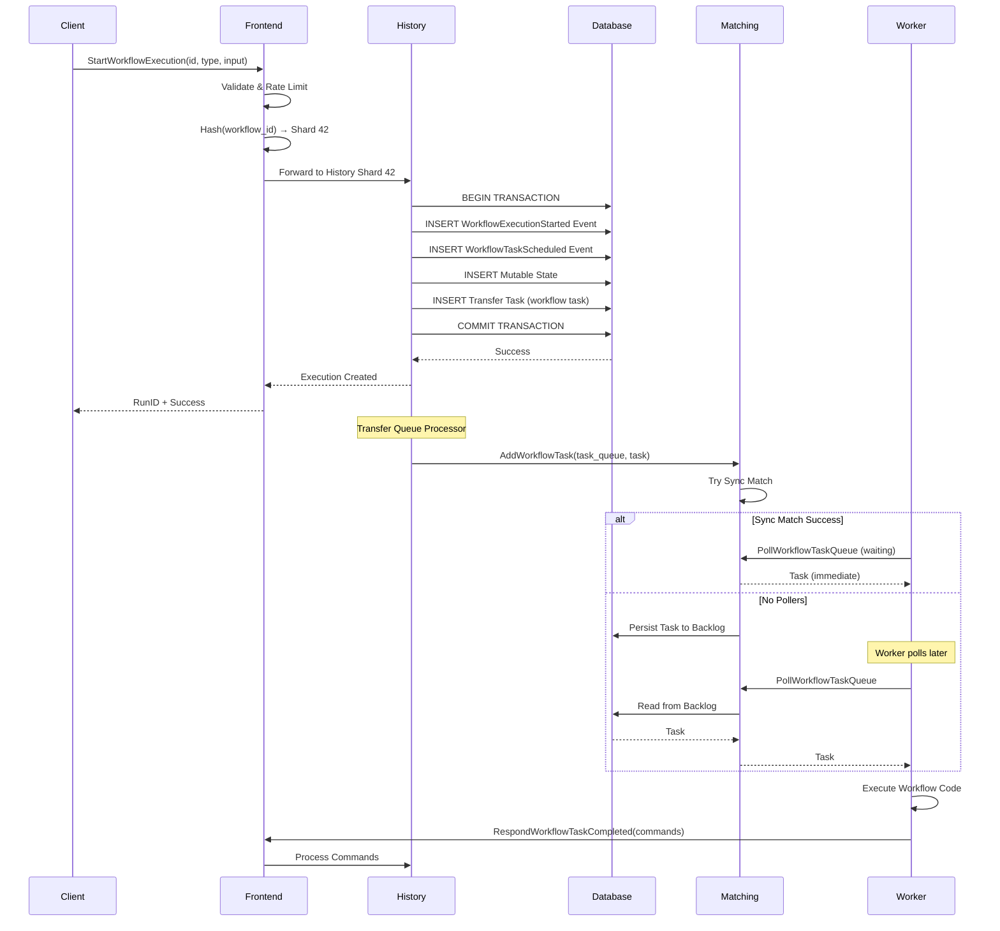

### 3.7.2 Activity Execution Flow

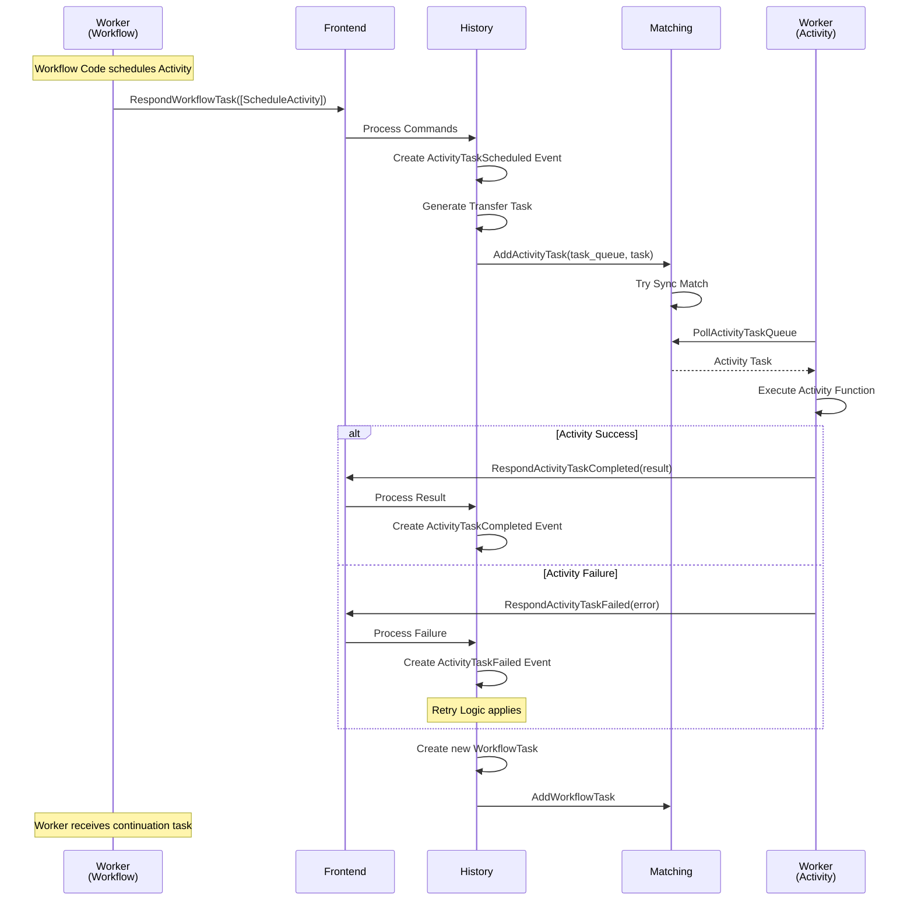

### 3.7.3 Long-Polling Mechanismus

**Worker Long-Poll Detail**:

```python
# Worker SDK Code (vereinfacht)
async def poll_workflow_tasks():
    while True:
        try:
            # Long Poll mit ~60s Timeout
            response = await client.poll_workflow_task_queue(
                task_queue="production",
                timeout=60  # Sekunden
            )

            if response.has_task:
                # Task sofort erhalten (Sync Match!)
                await execute_workflow_task(response.task)
            else:
                # Timeout - keine Tasks verfügbar
                # Sofort erneut pollen
                continue

        except Exception as e:
            # Fehlerbehandlung
            await asyncio.sleep(1)
```

**Server-Seite (Matching Service)**:

```python
# Matching Service (konzeptuell)
async def handle_poll_request(poll_request):
    # Try Sync Match
    task = try_get_task_immediately(poll_request.task_queue)

    if task:
        # Sync Match erfolgreich!
        return task

    # Kein Task verfügbar - halte Verbindung offen
    task = await wait_for_task_or_timeout(
        poll_request.task_queue,
        timeout=60
    )

    if task:
        return task
    else:
        return empty_response
```

**Vorteile**:
- Minimale Latenz bei Task-Verfügbarkeit
- Reduzierte Netzwerk-Overhead (keine Poll-Loops)
- Natürliches Backpressure Handling

## 3.8 Skalierung und High Availability

### 3.8.1 Unabhängige Service-Skalierung

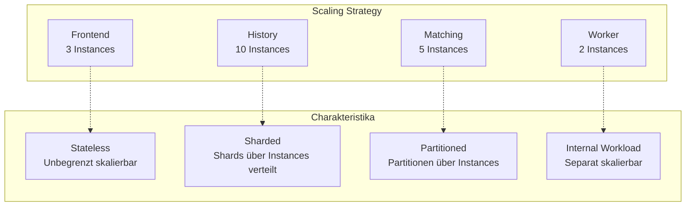

**Frontend Service**:
- **Stateless** → Beliebig horizontal skalieren
- Hinter Load Balancer
- Keine Koordinations-Overhead

**History Service**:
- Instanzen hinzufügen
- Shards dynamisch über Instances verteilt
- Ringpop koordiniert Shard Ownership
- **Constraint**: Total Shard Count fixed

**Matching Service**:
- Instanzen hinzufügen
- Task Queue Partitionen über Instances verteilt
- Consistent Hashing für Partition Placement

### 3.8.2 Database Scaling

**Bottleneck**: Database oft ultimatives Performance-Limit

**Cassandra**:
```bash
# Natürliche horizontale Skalierung
# Neue Nodes hinzufügen
nodetool status
# Rebalancing automatisch
```

**PostgreSQL/MySQL**:
```sql
-- Vertikale Skalierung: Größere Instances
-- Read Replicas für Visibility Queries
-- Connection Pooling kritisch

max_connections = 200
shared_buffers = 8GB
effective_cache_size = 24GB
```

### 3.8.3 Multi-Cluster Replication

**Global Namespaces** für High Availability:

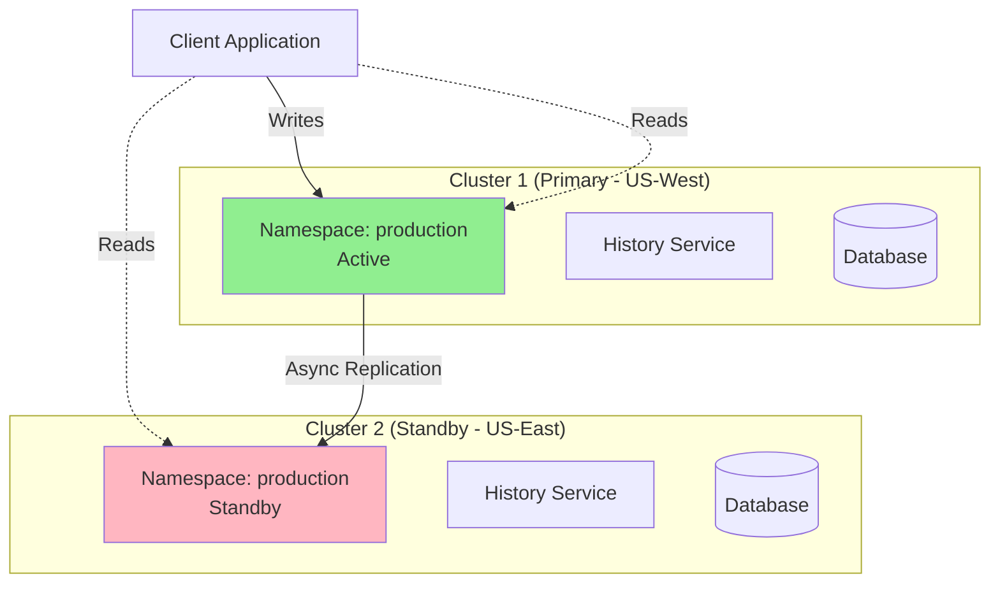

**Charakteristika**:
- **Async Replication**: Hoher Throughput
- **Nicht strongly consistent** über Clusters
- Replication Lag bei Failover → potentieller Progress Loss
- Visibility APIs funktionieren auf Active und Standby

**Failover Process**:
1. Namespace auf Backup Cluster aktiviert
2. Workflows setzen fort vom letzten replizierten State
3. Einige in-flight Activity Tasks können re-executed werden
4. Akzeptabel für Disaster Recovery Szenarien

### 3.8.4 Performance-Metriken

**Key Metrics zu überwachen**:

```python
# History Service
"shard_lock_latency": < 5ms,  # Idealerweise ~1ms
"cache_hit_rate": > 80%,
"transfer_task_latency": < 100ms,

# Matching Service
"sync_match_rate": > 90%,  # Hoch halten!
"backlog_size": < 1000,
"poll_success_rate": > 95%,

# Database
"query_latency_p99": < 50ms,
"connection_pool_utilization": 60-80%,
"persistence_rps": < max_qps,
```

**Sticky Execution Optimization**:
```
sticky_cache_hit_rate: > 70%
→ Drastisch reduzierte History Replays
→ 10-100x schnellere Task-Verarbeitung
```

## 3.9 Praktisches Beispiel: Service Interaction

Schauen wir uns das Code-Beispiel für Kapitel 3 an:

```python
@workflow.defn
class ServiceArchitectureWorkflow:
    """
    Demonstriert Service-Architektur-Konzepte.
    """

    @workflow.run
    async def run(self) -> dict:
        workflow.logger.info("Workflow started - event logged in history")

        # Frontend → History: Workflow gestartet
        # History → Database: WorkflowExecutionStarted Event
        # History → History Cache: Mutable State gecached

        steps = ["Frontend processing", "History service update", "Task scheduling"]

        for i, step in enumerate(steps, 1):
            workflow.logger.info(f"Step {i}: {step}")
            # Jedes Log → Event in History

        # History → Matching: Workflow Task scheduled
        # Matching → Worker: Task dispatched (hoffentlich Sync Match!)

        workflow.logger.info("Workflow completed - final event in history")

        return {
            "message": "Architecture demonstration complete",
            "steps_completed": len(steps)
        }
```

> 📁 **Code-Beispiel**: [`../examples/part-01/chapter-03/service_interaction.py`](../examples/part-01/chapter-03/service_interaction.py)

**Workflow ausführen**:

```bash
# Terminal 1: Worker starten
cd ../examples/part-01/chapter-03
uv run python -m temporalio.worker \
    --task-queue book-examples \
    service_interaction

# Terminal 2: Workflow starten
uv run python service_interaction.py
```

**Ausgabe zeigt Service-Interaktionen**:
```
=== Temporal Service Architecture Demonstration ===

1. Client connecting to Temporal Frontend...
   ✓ Connected to Temporal service

2. Starting workflow (ID: architecture-demo-001)
   Frontend schedules task...
   History service creates event log...
   ✓ Workflow started

3. Waiting for workflow completion...
   Worker polls task queue...
   Worker executes workflow code...
   History service logs each event...
   ✓ Workflow completed

4. Accessing workflow history...
   ✓ Retrieved 17 events from history service

=== Architecture Components Demonstrated ===
✓ Client - Initiated workflow
✓ Frontend - Accepted workflow request
✓ History Service - Stored event log
✓ Task Queue - Delivered tasks to worker
✓ Worker - Executed workflow code
```

## 3.10 Zusammenfassung

In diesem Kapitel haben wir die **Architektur des Temporal Service** im Detail kennengelernt:

**Die vier Kernkomponenten**:

1. **Frontend Service** – Stateless API Gateway
   - Entry Point für alle Requests
   - Rate Limiting und Validation
   - Routing zu History und Matching

2. **History Service** – State Management
   - Verwaltet Workflow Execution Lifecycle
   - Event Sourcing mit Mutable State + Immutable Events
   - Sharded für Parallelität
   - Interne Task Queues (Transfer, Timer, Visibility, etc.)

3. **Matching Service** – Task Queue Management
   - Verwaltet alle user-facing Task Queues
   - Partitioned für Skalierung
   - Sync Match (optimal) vs Async Match (Backlog)
   - Long-Polling Protocol

4. **Worker Service** – Interne Operationen
   - Replication, Archival, System Workflows
   - Unterschied zu User Worker Processes

**Persistence Layer**:
- Cassandra, PostgreSQL, MySQL
- Event History + Mutable State
- Visibility Store (Database oder Elasticsearch)
- Strong Consistency bei Writes

**Kommunikationsflüsse**:
- Client → Frontend → History → Database
- History → Matching → Worker (Long-Poll)
- Event Sourcing garantiert Consistency

**Skalierung**:
- Unabhängige Service-Skalierung
- Frontend: Unbegrenzt horizontal
- History: Via Shard-Distribution
- Matching: Via Partition-Distribution
- Multi-Cluster für High Availability

**Performance-Optimierungen**:
- Sticky Execution (10-100x schneller)
- Sync Match (kein DB Round-Trip)
- Mutable State Cache
- Partitioning für Parallelität

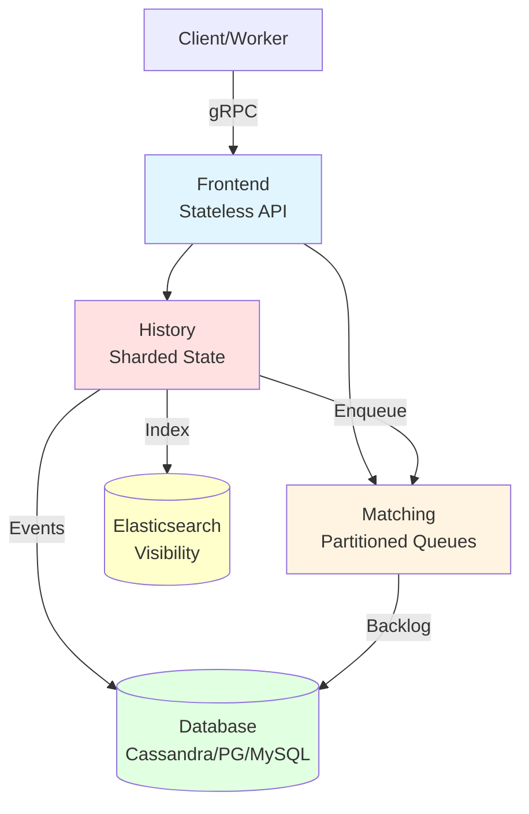

Mit diesem tiefen Verständnis der Temporal Service Architektur können wir nun in **Teil II** eintauchen, wo wir uns auf die **praktische Nutzung der SDKs** konzentrieren und fortgeschrittene Entwicklungstechniken erlernen.

---

**Nächster Teil**: [Teil II: Der SDK-Fokus](../part-ii-sdk-fokus/README.md)

**Code-Beispiele für dieses Kapitel**: [`../examples/part-01/chapter-03/`](../examples/part-01/chapter-03/)
