# Kapitel 6: Kommunikation mit Workflows - Signale, Queries und Updates

## Einleitung

In den vorherigen Kapiteln haben Sie gelernt, wie man Workflows definiert und programmiert. Doch in der realen Welt existieren Workflows nicht isoliert – sie müssen mit externen Systemen, Benutzern und anderen Workflows kommunizieren. Ein Approval-Workflow muss auf Genehmigungsentscheidungen warten, ein Bestellprozess muss Statusabfragen beantworten, und lange laufende Prozesse müssen auf externe Events reagieren können.

Temporal bietet drei leistungsstarke Mechanismen für die Kommunikation mit laufenden Workflows:

1. **Signale (Signals)**: Asynchrone, fire-and-forget Nachrichten zur Zustandsänderung
2. **Queries**: Synchrone, read-only Abfragen des Workflow-Zustands
3. **Updates**: Synchrone Zustandsänderungen mit Rückgabewerten und Validierung

Dieses Kapitel erklärt detailliert, wie diese drei Mechanismen funktionieren, wann Sie welchen verwenden sollten, und welche Best Practices und Fallstricke es zu beachten gilt.

### Lernziele

Nach diesem Kapitel können Sie:

- Signale implementieren und verstehen, wann sie geeignet sind
- Queries für effiziente Zustandsabfragen nutzen
- Updates mit Validierung für synchrone Operationen einsetzen
- Zwischen den drei Mechanismen fundiert entscheiden
- Human-in-the-Loop Workflows implementieren
- Häufige Fehler und Anti-Patterns vermeiden

## 6.1 Signale (Signals) - Asynchrone Workflow-Kommunikation

### 6.1.1 Definition und Zweck

**Signale** sind asynchrone, fire-and-forget Nachrichten, die den Zustand eines laufenden Workflows ändern, ohne dass der Sender auf eine Antwort warten muss. Wenn ein Signal empfangen wird, persistiert Temporal sowohl das Event als auch die Payload dauerhaft in der Event History.

**Hauptmerkmale von Signalen:**

- **Asynchron**: Server akzeptiert Signal sofort ohne auf Verarbeitung zu warten
- **Non-blocking**: Sender erhält keine Rückgabewerte oder Exceptions
- **Dauerhaft**: Erzeugt `WorkflowExecutionSignaled` Event in der Event History
- **Geordnet**: Signale werden in der Reihenfolge verarbeitet, in der sie empfangen wurden
- **Gepuffert**: Können vor Workflow-Start gesendet werden; werden dann gepuffert und beim Start verarbeitet

**Sequenzdiagramm: Signal-Ablauf**

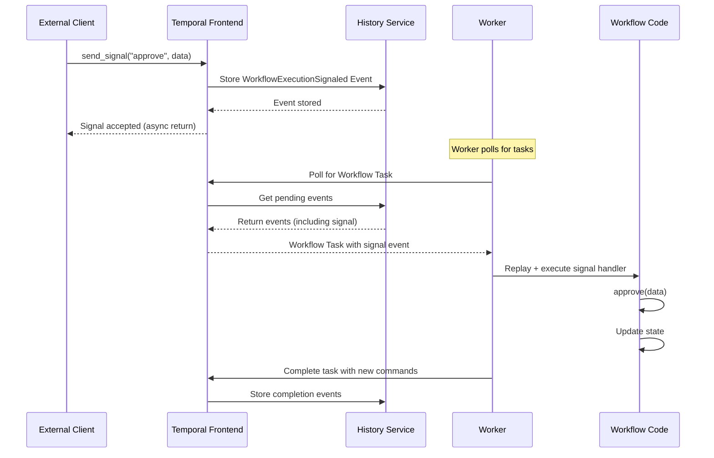

**Wann Signale verwenden:**

- ✅ Asynchrone Benachrichtigungen ohne Rückmeldung
- ✅ Event-gesteuerte Workflows (z.B. "neuer Upload", "Zahlung eingegangen")
- ✅ Human-in-the-Loop mit wait conditions
- ✅ Externe System-Integrationen mit fire-and-forget Semantik
- ❌ Wenn Sie wissen müssen, ob Operation erfolgreich war → Update verwenden
- ❌ Wenn Sie Validierung vor Ausführung brauchen → Update verwenden

### 6.1.2 Signal Handler definieren

Signal Handler werden mit dem `@workflow.signal` Decorator dekoriert und können synchron (`def`) oder asynchron (`async def`) sein.

**Einfacher Signal Handler:**

```python
from temporalio import workflow
from typing import Optional
from dataclasses import dataclass

@dataclass
class ApprovalInput:
    """Typsichere Signal-Daten mit Dataclass"""
    approver_name: str
    approved: bool
    comment: str = ""

@workflow.defn
class ApprovalWorkflow:
    """Workflow mit Signal-basierter Genehmigung"""

    @workflow.init
    def __init__(self) -> None:
        # WICHTIG: Initialisierung mit @workflow.init
        # garantiert Ausführung vor Signal Handlern
        self.approved: Optional[bool] = None
        self.approver_name: Optional[str] = None
        self.comment: str = ""

    @workflow.signal
    def approve(self, input: ApprovalInput) -> None:
        """Signal Handler - ändert Workflow-Zustand"""
        self.approved = input.approved
        self.approver_name = input.approver_name
        self.comment = input.comment

        workflow.logger.info(
            f"Approval decision received from {input.approver_name}: "
            f"{'approved' if input.approved else 'rejected'}"
        )

    @workflow.run
    async def run(self, request_id: str) -> str:
        """Wartet auf Signal via wait_condition"""
        workflow.logger.info(f"Waiting for approval on request {request_id}")

        # Warten bis Signal empfangen wurde
        await workflow.wait_condition(lambda: self.approved is not None)

        if self.approved:
            return f"Request approved by {self.approver_name}"
        else:
            return f"Request rejected by {self.approver_name}: {self.comment}"
```

**Asynchroner Signal Handler mit Activities:**

Signal Handler können auch asynchron sein und Activities, Child Workflows oder Timers ausführen:

```python
from datetime import timedelta

@workflow.defn
class OrderWorkflow:
    @workflow.init
    def __init__(self) -> None:
        self.orders: list[dict] = []

    @workflow.signal
    async def process_order(self, order: dict) -> None:
        """Async Signal Handler kann Activities ausführen"""
        # Validierung via Activity
        validated_order = await workflow.execute_activity(
            validate_order,
            order,
            start_to_close_timeout=timedelta(seconds=10),
        )

        # Zustand aktualisieren
        self.orders.append(validated_order)

        workflow.logger.info(f"Processed order: {validated_order['order_id']}")
```

**Best Practice: Leichtgewichtige Signal Handler**

```python
# ✓ Empfohlen: Signal aktualisiert Zustand, Workflow verarbeitet
@workflow.signal
def add_order(self, order: dict) -> None:
    """Leichtgewichtiger Handler - nur Zustand ändern"""
    self.pending_orders.append(order)

@workflow.run
async def run(self) -> None:
    """Haupt-Workflow verarbeitet gepufferte Orders"""
    while True:
        # Warte auf neue Orders
        await workflow.wait_condition(lambda: len(self.pending_orders) > 0)

        # Verarbeite alle gepufferten Orders
        while self.pending_orders:
            order = self.pending_orders.pop(0)

            # Verarbeitung im Haupt-Workflow
            await workflow.execute_activity(
                process_order_activity,
                order,
                start_to_close_timeout=timedelta(minutes=5),
            )
```

### 6.1.3 Signale von externen Clients senden

Um ein Signal an einen laufenden Workflow zu senden, benötigen Sie ein Workflow Handle:

```python
from temporalio.client import Client

async def send_approval_signal():
    """Signal von externem Client senden"""
    # Verbindung zum Temporal Service
    client = await Client.connect("localhost:7233")

    # Handle für existierenden Workflow abrufen
    workflow_handle = client.get_workflow_handle_for(
        ApprovalWorkflow,
        workflow_id="approval-request-123"
    )

    # Signal senden (fire-and-forget)
    await workflow_handle.signal(
        ApprovalWorkflow.approve,
        ApprovalInput(
            approver_name="Alice Johnson",
            approved=True,
            comment="Budget approved"
        )
    )

    print("Signal sent successfully")
    # Kehrt sofort zurück - wartet nicht auf Verarbeitung!
```

**Typsicheres Signaling mit Workflow-Referenz:**

```python
# Empfohlen: Typsicher mit Workflow-Klasse
await workflow_handle.signal(
    ApprovalWorkflow.approve,  # Methoden-Referenz (typsicher)
    ApprovalInput(...)
)

# Alternativ: String-basiert (anfällig für Tippfehler)
await workflow_handle.signal(
    "approve",  # String-basiert
    ApprovalInput(...)
)
```

### 6.1.4 Signal-with-Start Pattern

Das **Signal-with-Start** Pattern ermöglicht lazy Workflow-Initialisierung: Es sendet ein Signal an einen existierenden Workflow oder startet einen neuen, falls keiner existiert.

**Use Case: Shopping Cart Workflow**

```python
@workflow.defn
class ShoppingCartWorkflow:
    """Lazy-initialisierter Shopping Cart via Signal-with-Start"""

    @workflow.init
    def __init__(self) -> None:
        self.items: list[dict] = []
        self.total = 0.0

    @workflow.signal
    def add_item(self, item: dict) -> None:
        """Items zum Warenkorb hinzufügen"""
        self.items.append(item)
        self.total += item['price']
        workflow.logger.info(f"Added {item['name']} - Total: ${self.total:.2f}")

    @workflow.run
    async def run(self) -> dict:
        """Warenkorb läuft 24h, dann automatischer Checkout"""
        # Warte 24 Stunden auf weitere Items
        await asyncio.sleep(timedelta(hours=24))

        # Automatischer Checkout
        if len(self.items) > 0:
            await workflow.execute_activity(
                process_checkout,
                {"items": self.items, "total": self.total},
                start_to_close_timeout=timedelta(minutes=5),
            )

        return {"items": len(self.items), "total": self.total}

# Client: Signal-with-Start verwenden
async def add_to_cart(user_id: str, item: dict):
    """Item zum User-Warenkorb hinzufügen (lazy init)"""
    client = await Client.connect("localhost:7233")

    # Start Workflow mit Initial-Signal
    await client.start_workflow(
        ShoppingCartWorkflow.run,
        id=f"cart-{user_id}",  # Ein Warenkorb pro User
        task_queue="shopping",
        start_signal="add_item",  # Signal-Name
        start_signal_args=[item],  # Signal-Argumente
    )

    print(f"Item added to cart for user {user_id}")
```

**Ablaufdiagramm: Signal-with-Start**

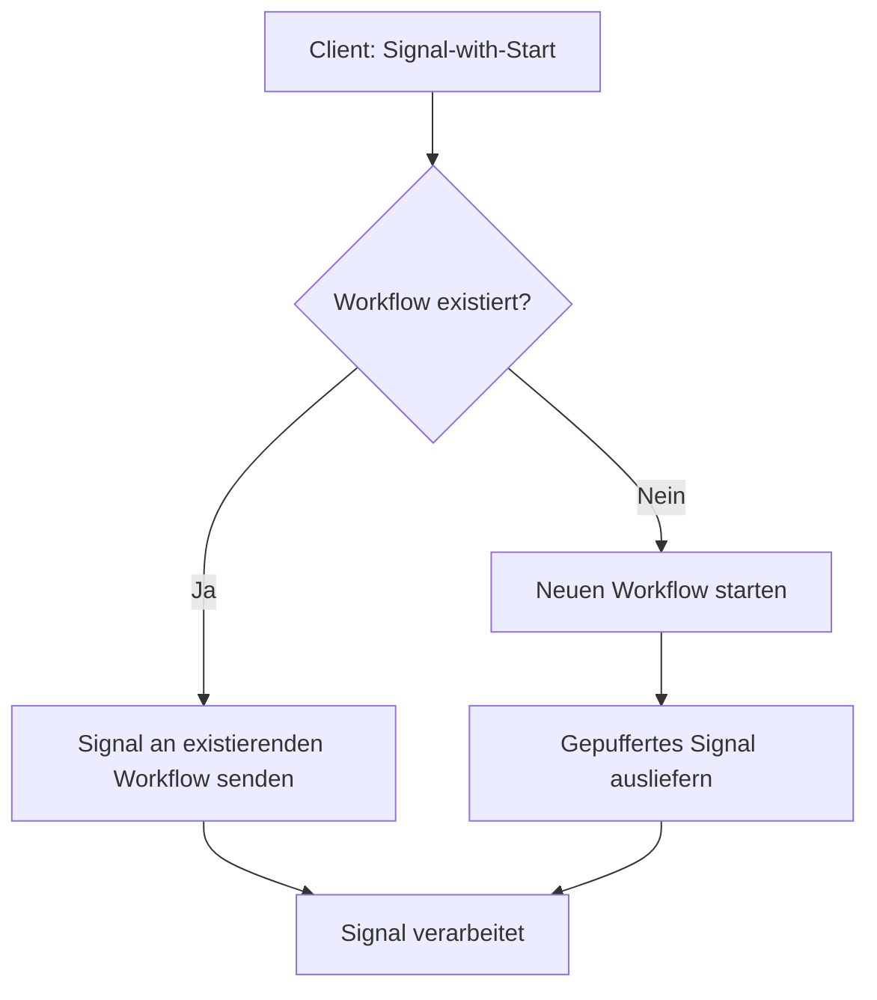

**Vorteile:**

- ✅ Idempotent: Mehrfache Aufrufe sicher
- ✅ Race-condition sicher: Kein "create before send signal" Problem
- ✅ Lazy Initialization: Workflow nur wenn nötig
- ✅ Perfekt für User-Sessions, Shopping Carts, etc.

### 6.1.5 Wait Conditions mit Signalen

Die `workflow.wait_condition()` Funktion ist das Kernstück für Signal-basierte Koordination:

**Einfache Wait Condition:**

```python
@workflow.run
async def run(self) -> str:
    # Warten bis Signal empfangen
    await workflow.wait_condition(lambda: self.approved is not None)

    # Fortfahren nach Signal
    return "Approved!"
```

**Wait Condition mit Timeout:**

```python
import asyncio

@workflow.run
async def run(self) -> str:
    try:
        # Warte maximal 7 Tage auf Approval
        await workflow.wait_condition(
            lambda: self.approved is not None,
            timeout=timedelta(days=7)
        )
        return "Approved!"
    except asyncio.TimeoutError:
        # Automatische Ablehnung nach Timeout
        return "Approval timeout - request auto-rejected"
```

**Mehrere Bedingungen kombinieren:**

```python
@workflow.defn
class MultiStageWorkflow:
    @workflow.init
    def __init__(self) -> None:
        self.stage1_complete = False
        self.stage2_complete = False
        self.payment_confirmed = False

    @workflow.signal
    def complete_stage1(self) -> None:
        self.stage1_complete = True

    @workflow.signal
    def complete_stage2(self) -> None:
        self.stage2_complete = True

    @workflow.signal
    def confirm_payment(self, amount: float) -> None:
        self.payment_confirmed = True

    @workflow.run
    async def run(self) -> str:
        # Warte auf ALLE Bedingungen
        await workflow.wait_condition(
            lambda: (
                self.stage1_complete and
                self.stage2_complete and
                self.payment_confirmed
            ),
            timeout=timedelta(hours=48)
        )

        return "All conditions met - proceeding"
```

**Wait Condition Pattern Visualisierung:**

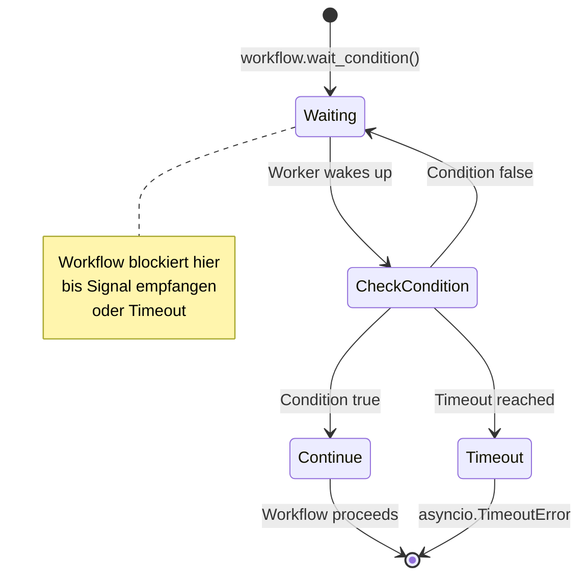

### 6.1.6 Signal-Reihenfolge und Garantien

**Ordering Guarantee:**

Temporal garantiert, dass Signale in der Reihenfolge verarbeitet werden, in der sie empfangen wurden:

```python
# Client sendet 3 Signale schnell hintereinander
await handle.signal(MyWorkflow.signal1, "first")
await handle.signal(MyWorkflow.signal2, "second")
await handle.signal(MyWorkflow.signal3, "third")

# Workflow-Handler werden GARANTIERT in dieser Reihenfolge ausgeführt:
# 1. signal1("first")
# 2. signal2("second")
# 3. signal3("third")
```

**Event History Eintrag:**

Jedes Signal erzeugt einen `WorkflowExecutionSignaled` Event:

```json
{
  "eventType": "WorkflowExecutionSignaled",
  "eventId": 42,
  "workflowExecutionSignaledEventAttributes": {
    "signalName": "approve",
    "input": {
      "payloads": [...]
    }
  }
}
```

**Replay-Sicherheit:**

Bei Replay werden Signale in derselben Reihenfolge aus der Event History gelesen und ausgeführt - deterministisch.

### 6.1.7 Praktische Anwendungsfälle für Signale

#### Use Case 1: Human-in-the-Loop Expense Approval

```python
from decimal import Decimal
from datetime import datetime

@dataclass
class ExpenseRequest:
    request_id: str
    employee: str
    amount: Decimal
    description: str
    category: str

@dataclass
class ApprovalDecision:
    approved: bool
    approver: str
    timestamp: datetime
    comment: str

@workflow.defn
class ExpenseApprovalWorkflow:
    @workflow.init
    def __init__(self) -> None:
        self.decision: Optional[ApprovalDecision] = None

    @workflow.signal
    def approve(self, approver: str, comment: str = "") -> None:
        """Manager genehmigt Expense"""
        self.decision = ApprovalDecision(
            approved=True,
            approver=approver,
            timestamp=datetime.now(timezone.utc),
            comment=comment
        )

    @workflow.signal
    def reject(self, approver: str, reason: str) -> None:
        """Manager lehnt Expense ab"""
        self.decision = ApprovalDecision(
            approved=False,
            approver=approver,
            timestamp=datetime.now(timezone.utc),
            comment=reason
        )

    @workflow.run
    async def run(self, request: ExpenseRequest) -> str:
        # Benachrichtigung an Manager senden
        await workflow.execute_activity(
            send_approval_notification,
            request,
            start_to_close_timeout=timedelta(minutes=5),
        )

        # Warte bis zu 7 Tage auf Entscheidung
        try:
            await workflow.wait_condition(
                lambda: self.decision is not None,
                timeout=timedelta(days=7)
            )
        except asyncio.TimeoutError:
            # Auto-Reject nach Timeout
            self.decision = ApprovalDecision(
                approved=False,
                approver="system",
                timestamp=datetime.now(timezone.utc),
                comment="Approval timeout - automatically rejected"
            )

        # Entscheidung verarbeiten
        if self.decision.approved:
            await workflow.execute_activity(
                process_approved_expense,
                request,
                start_to_close_timeout=timedelta(minutes=10),
            )
            return f"Expense ${request.amount} approved by {self.decision.approver}"
        else:
            await workflow.execute_activity(
                notify_rejection,
                request,
                self.decision.comment,
                start_to_close_timeout=timedelta(minutes=5),
            )
            return f"Expense rejected: {self.decision.comment}"
```

#### Use Case 2: Event-getriebener Multi-Stage Prozess

```python
@workflow.defn
class DataPipelineWorkflow:
    """Event-getriebene Daten-Pipeline mit Signalen"""

    @workflow.init
    def __init__(self) -> None:
        self.data_uploaded = False
        self.validation_complete = False
        self.transform_complete = False
        self.uploaded_data_location: Optional[str] = None

    @workflow.signal
    def notify_upload_complete(self, data_location: str) -> None:
        """Signal: Daten-Upload abgeschlossen"""
        self.data_uploaded = True
        self.uploaded_data_location = data_location
        workflow.logger.info(f"Data uploaded to {data_location}")

    @workflow.signal
    def notify_validation_complete(self) -> None:
        """Signal: Validierung abgeschlossen"""
        self.validation_complete = True
        workflow.logger.info("Validation complete")

    @workflow.signal
    def notify_transform_complete(self) -> None:
        """Signal: Transformation abgeschlossen"""
        self.transform_complete = True
        workflow.logger.info("Transform complete")

    @workflow.run
    async def run(self, pipeline_id: str) -> str:
        workflow.logger.info(f"Starting pipeline {pipeline_id}")

        # Stage 1: Warte auf Upload
        await workflow.wait_condition(lambda: self.data_uploaded)

        # Stage 2: Starte Validierung
        await workflow.execute_activity(
            start_validation,
            self.uploaded_data_location,
            start_to_close_timeout=timedelta(minutes=5),
        )

        # Warte auf Validierungs-Signal (externe Validierung)
        await workflow.wait_condition(lambda: self.validation_complete)

        # Stage 3: Starte Transformation
        await workflow.execute_activity(
            start_transformation,
            self.uploaded_data_location,
            start_to_close_timeout=timedelta(minutes=5),
        )

        # Warte auf Transform-Signal
        await workflow.wait_condition(lambda: self.transform_complete)

        # Stage 4: Finalisierung
        await workflow.execute_activity(
            finalize_pipeline,
            pipeline_id,
            start_to_close_timeout=timedelta(minutes=10),
        )

        return f"Pipeline {pipeline_id} completed successfully"
```

**Pipeline Zustandsdiagramm:**

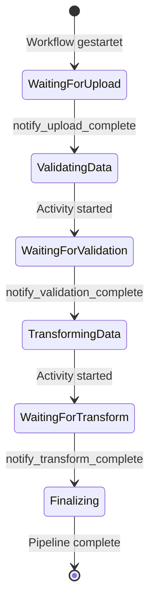

### 6.1.8 Signal Best Practices

**1. Dataclasses für Signal-Parameter:**

```python
# ✓ Gut: Typsicher und erweiterbar
@dataclass
class SignalInput:
    field1: str
    field2: int
    field3: Optional[str] = None  # Einfach neue Felder hinzufügen

@workflow.signal
def my_signal(self, input: SignalInput) -> None:
    ...

# ✗ Schlecht: Untypisiert und schwer zu warten
@workflow.signal
def my_signal(self, data: dict) -> None:
    ...
```

**2. Idempotenz implementieren:**

```python
@workflow.signal
def process_payment(self, payment_id: str, amount: Decimal) -> None:
    """Idempotenter Signal Handler"""
    # Prüfen ob bereits verarbeitet
    if payment_id in self.processed_payments:
        workflow.logger.warn(f"Duplicate payment signal: {payment_id}")
        return

    # Verarbeiten und markieren
    self.processed_payments.add(payment_id)
    self.total_amount += amount
```

**3. Signal-Limits beachten:**

```python
# ⚠️ Problem: Zu viele Signale
for i in range(10000):
    await handle.signal(MyWorkflow.process_item, f"item-{i}")
# Kann Event History Limit (50,000 Events) überschreiten!

# ✓ Lösung: Batch-Signale
items = [f"item-{i}" for i in range(10000)]
await handle.signal(MyWorkflow.process_batch, items)
```

**4. @workflow.init für Initialisierung:**

```python
# ✓ Korrekt: @workflow.init garantiert Ausführung vor Handlern
@workflow.init
def __init__(self) -> None:
    self.counter = 0
    self.items = []

# ✗ Falsch: run() könnte NACH Signal Handler ausgeführt werden
@workflow.run
async def run(self) -> None:
    self.counter = 0  # Zu spät!
```

## 6.2 Queries - Synchrone Zustandsabfragen

### 6.2.1 Definition und Zweck

**Queries** sind synchrone, read-only Anfragen, die den Zustand eines Workflows inspizieren ohne ihn zu verändern. Queries erzeugen keine Events in der Event History und können sogar auf abgeschlossene Workflows (innerhalb der Retention Period) ausgeführt werden.

**Hauptmerkmale von Queries:**

- **Synchron**: Aufrufer wartet auf Antwort
- **Read-only**: Können Workflow-Zustand NICHT ändern
- **Non-blocking**: Können keine Activities oder Timers ausführen
- **History-free**: Erzeugen KEINE Event History Einträge
- **Auf abgeschlossenen Workflows**: Query funktioniert nach Workflow-Ende

**Query Sequenzdiagramm:**

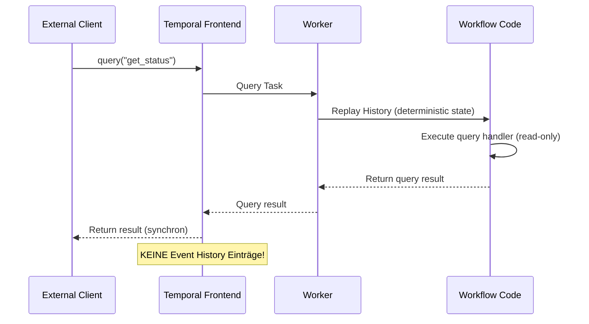

**Wann Queries verwenden:**

- ✅ Zustand abfragen ohne zu ändern
- ✅ Progress Tracking (Fortschritt anzeigen)
- ✅ Debugging (aktueller Zustand inspizieren)
- ✅ Dashboards mit Echtzeit-Status
- ✅ Nach Workflow-Ende Status abrufen
- ❌ Zustand ändern → Signal oder Update verwenden
- ❌ Kontinuierliches Polling → Update mit wait_condition besser

### 6.2.2 Query Handler definieren

Query Handler werden mit `@workflow.query` dekoriert und MÜSSEN synchron sein (`def`, NICHT `async def`):

```python
from enum import Enum
from typing import List

class OrderStatus(Enum):
    PENDING = "pending"
    PROCESSING = "processing"
    SHIPPED = "shipped"
    DELIVERED = "delivered"

@dataclass
class OrderProgress:
    """Query-Rückgabewert mit vollständiger Info"""
    status: OrderStatus
    items_processed: int
    total_items: int
    percent_complete: float
    current_step: str

@workflow.defn
class OrderProcessingWorkflow:
    @workflow.init
    def __init__(self) -> None:
        self.status = OrderStatus.PENDING
        self.items_processed = 0
        self.total_items = 0
        self.current_step = "Initialization"

    @workflow.query
    def get_status(self) -> str:
        """Einfacher Status-Query"""
        return self.status.value

    @workflow.query
    def get_progress(self) -> OrderProgress:
        """Detaillierter Progress-Query mit Dataclass"""
        return OrderProgress(
            status=self.status,
            items_processed=self.items_processed,
            total_items=self.total_items,
            percent_complete=(
                (self.items_processed / self.total_items * 100)
                if self.total_items > 0 else 0
            ),
            current_step=self.current_step
        )

    @workflow.query
    def get_items_remaining(self) -> int:
        """Berechneter Query-Wert"""
        return self.total_items - self.items_processed

    @workflow.run
    async def run(self, order_id: str, items: List[str]) -> str:
        self.total_items = len(items)
        self.status = OrderStatus.PROCESSING

        for i, item in enumerate(items):
            self.current_step = f"Processing item {item}"

            await workflow.execute_activity(
                process_item,
                item,
                start_to_close_timeout=timedelta(minutes=5),
            )

            self.items_processed = i + 1

        self.status = OrderStatus.SHIPPED
        self.current_step = "Shipped to customer"

        return f"Order {order_id} completed"
```

### 6.2.3 Queries von Clients ausführen

```python
async def monitor_order_progress(order_id: str):
    """Query-basiertes Progress Monitoring"""
    client = await Client.connect("localhost:7233")

    # Handle für Workflow abrufen
    handle = client.get_workflow_handle_for(
        OrderProcessingWorkflow,
        workflow_id=order_id
    )

    # Einfacher Status-Query
    status = await handle.query(OrderProcessingWorkflow.get_status)
    print(f"Order status: {status}")

    # Detaillierter Progress-Query
    progress = await handle.query(OrderProcessingWorkflow.get_progress)
    print(f"Progress: {progress.percent_complete:.1f}%")
    print(f"Current step: {progress.current_step}")
    print(f"Items: {progress.items_processed}/{progress.total_items}")

    # Berechneter Query
    remaining = await handle.query(OrderProcessingWorkflow.get_items_remaining)
    print(f"Items remaining: {remaining}")
```

**Query auf abgeschlossenen Workflow:**

```python
async def query_completed_workflow(workflow_id: str):
    """Query funktioniert auch nach Workflow-Ende"""
    client = await Client.connect("localhost:7233")

    handle = client.get_workflow_handle(workflow_id)

    try:
        # Funktioniert innerhalb der Retention Period!
        final_status = await handle.query("get_status")
        print(f"Final status: {final_status}")
    except Exception as e:
        print(f"Query failed: {e}")
```

### 6.2.4 Query-Einschränkungen

**1. Queries MÜSSEN synchron sein:**

```python
# ✓ Korrekt: Synchrone Query
@workflow.query
def get_data(self) -> dict:
    return {"status": self.status}

# ✗ FALSCH: Async nicht erlaubt!
@workflow.query
async def get_data(self) -> dict:  # TypeError!
    return {"status": self.status}
```

**2. Queries können KEINE Activities ausführen:**

```python
# ✗ FALSCH: Keine Activities in Queries!
@workflow.query
def get_external_data(self) -> dict:
    # Kompiliert, aber schlägt zur Laufzeit fehl!
    result = await workflow.execute_activity(...)  # ERROR!
    return result
```

**3. Queries dürfen Zustand NICHT ändern:**

```python
# ✗ FALSCH: State-Mutation in Query
@workflow.query
def increment_counter(self) -> int:
    self.counter += 1  # Verletzt Read-Only Constraint!
    return self.counter

# ✓ Korrekt: Read-Only Query
@workflow.query
def get_counter(self) -> int:
    return self.counter

# ✓ Für Mutation: Update verwenden
@workflow.update
def increment_counter(self) -> int:
    self.counter += 1
    return self.counter
```

**Vergleich: Query vs Update für State Access**

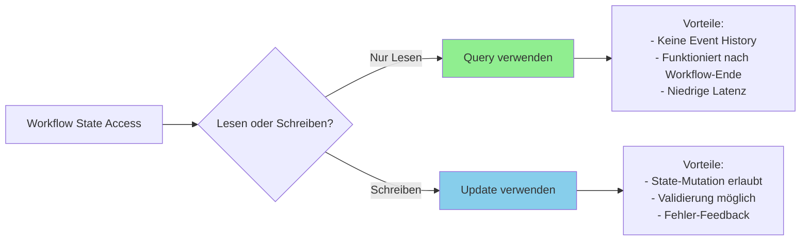

### 6.2.5 Stack Trace Query für Debugging

Temporal bietet einen eingebauten `__stack_trace` Query für Debugging:

```bash
# CLI: Stack Trace abrufen
temporal workflow stack --workflow-id stuck-workflow-123
```

```python
# Programmatisch: Stack Trace abrufen
async def debug_workflow(workflow_id: str):
    client = await Client.connect("localhost:7233")
    handle = client.get_workflow_handle(workflow_id)

    # Eingebauter Stack Trace Query
    stack_trace = await handle.query("__stack_trace")
    print(f"Workflow stack trace:\n{stack_trace}")
```

**Wann Stack Trace verwenden:**

- ✅ Workflow scheint "hängen zu bleiben"
- ✅ Debugging von wait_condition Problemen
- ✅ Verstehen wo Workflow aktuell wartet
- ✅ Identifizieren von Deadlocks

### 6.2.6 Praktische Query Use Cases

#### Use Case 1: Real-Time Dashboard

```python
@dataclass
class DashboardData:
    """Aggregierte Daten für Dashboard"""
    total_processed: int
    total_failed: int
    current_batch: int
    average_processing_time: float
    estimated_completion: datetime

@workflow.defn
class BatchProcessingWorkflow:
    @workflow.init
    def __init__(self) -> None:
        self.processed = 0
        self.failed = 0
        self.current_batch = 0
        self.processing_times: List[float] = []
        self.start_time = datetime.now(timezone.utc)

    @workflow.query
    def get_dashboard_data(self) -> DashboardData:
        """Real-time Dashboard Query"""
        avg_time = (
            sum(self.processing_times) / len(self.processing_times)
            if self.processing_times else 0
        )

        remaining = self.total_batches - self.current_batch
        eta_seconds = remaining * avg_time
        eta = datetime.now(timezone.utc) + timedelta(seconds=eta_seconds)

        return DashboardData(
            total_processed=self.processed,
            total_failed=self.failed,
            current_batch=self.current_batch,
            average_processing_time=avg_time,
            estimated_completion=eta
        )

    @workflow.run
    async def run(self, total_batches: int) -> str:
        self.total_batches = total_batches

        for batch_num in range(total_batches):
            self.current_batch = batch_num
            batch_start = time.time()

            try:
                await workflow.execute_activity(
                    process_batch,
                    batch_num,
                    start_to_close_timeout=timedelta(minutes=10),
                )
                self.processed += 1
            except Exception as e:
                self.failed += 1
                workflow.logger.error(f"Batch {batch_num} failed: {e}")

            # Tracking für ETA
            batch_time = time.time() - batch_start
            self.processing_times.append(batch_time)

        return f"Processed {self.processed} batches, {self.failed} failed"
```

**Dashboard Client:**

```python
async def display_dashboard(workflow_id: str):
    """Live Dashboard mit Query Polling"""
    client = await Client.connect("localhost:7233")
    handle = client.get_workflow_handle_for(
        BatchProcessingWorkflow,
        workflow_id
    )

    while True:
        try:
            # Dashboard-Daten abfragen
            data = await handle.query(
                BatchProcessingWorkflow.get_dashboard_data
            )

            # Anzeigen (vereinfacht)
            print(f"\n{'='*50}")
            print(f"Batch Progress Dashboard")
            print(f"{'='*50}")
            print(f"Processed: {data.total_processed}")
            print(f"Failed: {data.total_failed}")
            print(f"Current Batch: {data.current_batch}")
            print(f"Avg Time: {data.average_processing_time:.2f}s")
            print(f"ETA: {data.estimated_completion}")

            # Prüfen ob abgeschlossen
            result = await handle.result(timeout=0.1)
            print(f"\nWorkflow completed: {result}")
            break

        except asyncio.TimeoutError:
            # Workflow läuft noch
            await asyncio.sleep(2)  # Update alle 2 Sekunden
```

#### Use Case 2: State Inspection für Debugging

```python
@workflow.defn
class ComplexWorkflow:
    """Workflow mit umfangreichem State für Debugging"""

    @workflow.query
    def get_full_state(self) -> dict:
        """Vollständiger State Dump für Debugging"""
        return {
            "status": self.status.value,
            "current_stage": self.current_stage,
            "pending_operations": len(self.pending_ops),
            "completed_tasks": self.completed_tasks,
            "errors": [str(e) for e in self.errors],
            "metadata": self.metadata,
            "last_updated": self.last_updated.isoformat(),
        }

    @workflow.query
    def get_pending_operations(self) -> List[dict]:
        """Detaillierte Pending Operations"""
        return [
            {
                "id": op.id,
                "type": op.type,
                "created_at": op.created_at.isoformat(),
                "retry_count": op.retry_count,
            }
            for op in self.pending_ops
        ]
```

### 6.2.7 Query Best Practices

**1. Pre-compute komplexe Werte:**

```python
# ✗ Schlecht: Schwere Berechnung in Query
@workflow.query
def get_statistics(self) -> dict:
    # Vermeiden: O(n) Berechnung bei jedem Query!
    total = sum(item.price for item in self.items)
    avg = total / len(self.items)
    return {"total": total, "average": avg}

# ✓ Gut: Inkrementell updaten, Query nur lesen
@workflow.signal
def add_item(self, item: Item) -> None:
    self.items.append(item)
    # Statistiken inkrementell updaten
    self.total += item.price
    self.count += 1
    self.average = self.total / self.count

@workflow.query
def get_statistics(self) -> dict:
    # Instant return - keine Berechnung
    return {"total": self.total, "average": self.average}
```

**2. Dataclass für Query-Responses:**

```python
# ✓ Gut: Typsicher und selbst-dokumentierend
@dataclass
class WorkflowStatus:
    state: str
    progress_percent: float
    items_processed: int
    errors: List[str]

@workflow.query
def get_status(self) -> WorkflowStatus:
    return WorkflowStatus(...)
```

**3. Nicht kontinuierlich pollen:**

```python
# ✗ Ineffizient: Tight polling loop
async def wait_for_completion_bad(handle):
    while True:
        status = await handle.query(MyWorkflow.get_status)
        if status == "completed":
            break
        await asyncio.sleep(0.5)  # Sehr ineffizient!

# ✓ Besser: Update mit wait_condition (siehe Updates Sektion)
# Oder: Workflow result() awaiten
async def wait_for_completion_good(handle):
    result = await handle.result()  # Wartet automatisch
    return result
```

## 6.3 Updates - Synchrone Zustandsänderungen

### 6.3.1 Definition und Zweck

**Updates** sind synchrone, getrackte Write-Operationen, die Workflow-Zustand ändern UND ein Ergebnis an den Aufrufer zurückgeben. Sie kombinieren die State-Mutation von Signalen mit der synchronen Response von Queries, plus optionale Validierung.

**Hauptmerkmale von Updates:**

- **Synchron**: Aufrufer erhält Response oder Error
- **Validiert**: Optionale Validators lehnen ungültige Updates ab
- **Tracked**: Erzeugt Event History Einträge
- **Blocking**: Kann Activities, Child Workflows, wait conditions ausführen
- **Reliable**: Sender weiß ob Update erfolgreich war oder fehlschlug

**Update Sequenzdiagramm:**

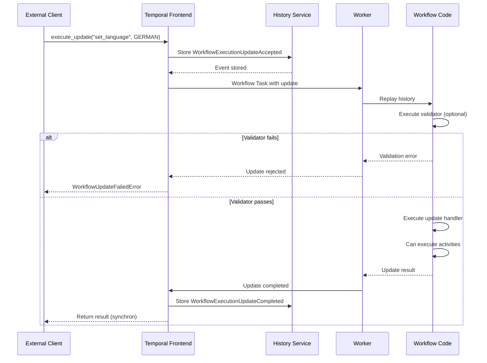

**Updates vs Signals Entscheidungsbaum:**

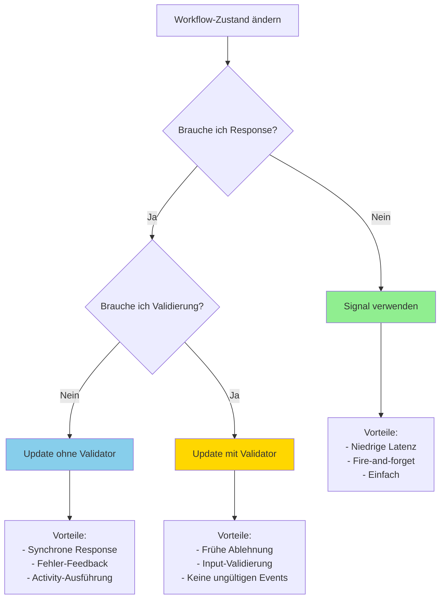

### 6.3.2 Update Handler mit Validierung

**Einfacher Update Handler:**

```python
from enum import Enum

class Language(Enum):
    ENGLISH = "en"
    GERMAN = "de"
    SPANISH = "es"
    FRENCH = "fr"

@workflow.defn
class GreetingWorkflow:
    @workflow.init
    def __init__(self) -> None:
        self.language = Language.ENGLISH
        self.greetings = {
            Language.ENGLISH: "Hello",
            Language.GERMAN: "Hallo",
            Language.SPANISH: "Hola",
            Language.FRENCH: "Bonjour",
        }

    @workflow.update
    def set_language(self, language: Language) -> Language:
        """Update Handler - gibt vorherige Sprache zurück"""
        previous_language = self.language
        self.language = language
        workflow.logger.info(f"Language changed from {previous_language} to {language}")
        return previous_language

    @set_language.validator
    def validate_language(self, language: Language) -> None:
        """Validator - lehnt nicht unterstützte Sprachen ab"""
        if language not in self.greetings:
            raise ValueError(f"Language {language.name} not supported")

    @workflow.run
    async def run(self) -> str:
        # Warte auf Language-Updates...
        await asyncio.sleep(timedelta(hours=24))
        return self.greetings[self.language]
```

**Update Handler mit Activity-Ausführung:**

```python
from asyncio import Lock
from decimal import Decimal

@dataclass
class PaymentInfo:
    payment_method: str
    amount: Decimal
    card_token: str

@dataclass
class PaymentResult:
    success: bool
    transaction_id: str
    amount: Decimal

@workflow.defn
class OrderWorkflow:
    @workflow.init
    def __init__(self) -> None:
        self.lock = Lock()  # Concurrency-Schutz
        self.order_status = "pending"
        self.total_amount = Decimal("0.00")

    @workflow.update
    async def process_payment(self, payment: PaymentInfo) -> PaymentResult:
        """Async Update - kann Activities ausführen"""
        async with self.lock:  # Verhindert concurrent execution
            # Activity ausführen für Zahlung
            result = await workflow.execute_activity(
                charge_payment,
                payment,
                start_to_close_timeout=timedelta(seconds=30),
                retry_policy=RetryPolicy(
                    initial_interval=timedelta(seconds=1),
                    maximum_attempts=3,
                )
            )

            # Workflow-State updaten
            if result.success:
                self.order_status = "paid"
                workflow.logger.info(f"Payment successful: {result.transaction_id}")
            else:
                workflow.logger.error("Payment failed")

            return result

    @process_payment.validator
    def validate_payment(self, payment: PaymentInfo) -> None:
        """Validator - prüft vor Activity-Ausführung"""
        # Status-Check
        if self.order_status != "pending":
            raise ValueError(
                f"Cannot process payment in status: {self.order_status}"
            )

        # Amount-Check
        if payment.amount <= 0:
            raise ValueError("Payment amount must be positive")

        if payment.amount != self.total_amount:
            raise ValueError(
                f"Payment amount {payment.amount} does not match "
                f"order total {self.total_amount}"
            )

        # Card token Check
        if not payment.card_token or len(payment.card_token) < 10:
            raise ValueError("Invalid card token")
```

### 6.3.3 Validator-Charakteristiken

**Validators müssen folgende Regeln einhalten:**

1. **Synchron** - Nur `def`, NICHT `async def`
2. **Read-Only** - Dürfen State NICHT mutieren
3. **Non-Blocking** - Keine Activities, Timers, wait conditions
4. **Selbe Parameter** - Wie der Update Handler
5. **Return None** - Raise Exception zum Ablehnen

```python
# ✓ Korrekt: Validator Implementierung
@workflow.update
def add_item(self, item: CartItem) -> int:
    """Item hinzufügen, return neue Anzahl"""
    self.items.append(item)
    return len(self.items)

@add_item.validator
def validate_add_item(self, item: CartItem) -> None:
    """Validator - synchron, read-only"""
    # Item-Validierung
    if not item.sku or len(item.sku) == 0:
        raise ValueError("Item SKU is required")

    # Cart-Limits
    if len(self.items) >= 100:
        raise ValueError("Cart is full (max 100 items)")

    # Duplikat-Check
    if any(i.sku == item.sku for i in self.items):
        raise ValueError(f"Item {item.sku} already in cart")

    # Validation passed - kein expliziter Return

# ✗ FALSCH: Async Validator
@add_item.validator
async def validate_add_item(self, item: CartItem) -> None:  # ERROR!
    # Async nicht erlaubt
    result = await some_async_check(item)

# ✗ FALSCH: State Mutation
@add_item.validator
def validate_add_item(self, item: CartItem) -> None:
    self.validation_count += 1  # ERROR! Read-only

# ✗ FALSCH: Activities ausführen
@add_item.validator
def validate_add_item(self, item: CartItem) -> None:
    # ERROR! Keine Activities in Validator
    result = await workflow.execute_activity(...)
```

**Validator Execution Flow:**

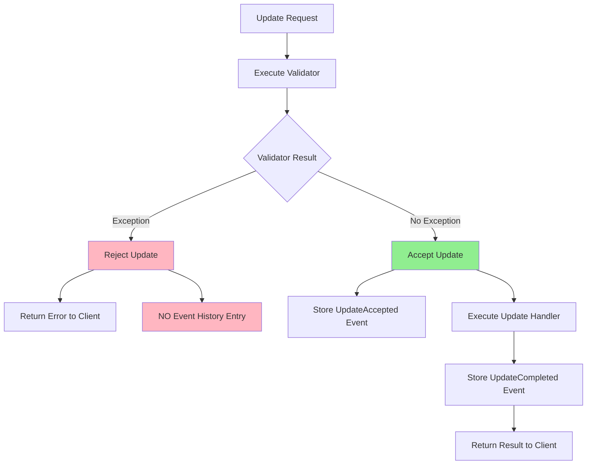

### 6.3.4 Updates von Clients senden

**Execute Update (Wait for Completion):**

```python
from temporalio.client import Client
from temporalio.exceptions import WorkflowUpdateFailedError

async def update_workflow_language():
    """Update ausführen und auf Completion warten"""
    client = await Client.connect("localhost:7233")

    workflow_handle = client.get_workflow_handle_for(
        GreetingWorkflow,
        workflow_id="greeting-123"
    )

    try:
        # Update ausführen - wartet auf Validator + Handler
        previous_lang = await workflow_handle.execute_update(
            GreetingWorkflow.set_language,
            Language.GERMAN
        )
        print(f"Language changed from {previous_lang} to German")

    except WorkflowUpdateFailedError as e:
        # Validator rejected ODER Handler exception
        print(f"Update failed: {e}")
        # Event History: KEINE Einträge wenn Validator rejected
```

**Start Update (Non-blocking):**

```python
from temporalio.client import WorkflowUpdateStage

async def start_update_non_blocking():
    """Update starten, später auf Result warten"""
    client = await Client.connect("localhost:7233")

    workflow_handle = client.get_workflow_handle_for(
        OrderWorkflow,
        workflow_id="order-456"
    )

    payment = PaymentInfo(
        payment_method="credit_card",
        amount=Decimal("99.99"),
        card_token="tok_abc123xyz"
    )

    # Update starten - wartet nur bis ACCEPTED
    update_handle = await workflow_handle.start_update(
        OrderWorkflow.process_payment,
        payment,
        wait_for_stage=WorkflowUpdateStage.ACCEPTED,
    )

    print("Update accepted by workflow (validator passed)")

    # Andere Arbeit erledigen...
    await do_other_work()

    # Später: Auf Completion warten
    try:
        result = await update_handle.result()
        print(f"Payment processed: {result.transaction_id}")
    except Exception as e:
        print(f"Payment failed: {e}")
```

**WorkflowUpdateStage Optionen:**

```python
# ADMITTED: Warten bis Server Update empfangen hat (selten verwendet)
handle = await workflow_handle.start_update(
    MyWorkflow.my_update,
    data,
    wait_for_stage=WorkflowUpdateStage.ADMITTED,
)

# ACCEPTED: Warten bis Validator passed (empfohlen für non-blocking)
handle = await workflow_handle.start_update(
    MyWorkflow.my_update,
    data,
    wait_for_stage=WorkflowUpdateStage.ACCEPTED,  # Default für start_update
)

# COMPLETED: Warten bis Handler fertig (default für execute_update)
result = await workflow_handle.execute_update(
    MyWorkflow.my_update,
    data,
    # Implizit: wait_for_stage=WorkflowUpdateStage.COMPLETED
)
```

### 6.3.5 Update-with-Start Pattern

Ähnlich wie Signal-with-Start - Update an existierenden Workflow senden ODER neuen starten:

```python
from temporalio.client import WithStartWorkflowOperation
from temporalio.common import WorkflowIDConflictPolicy

async def update_or_start_shopping_cart(user_id: str, item: CartItem):
    """Update-with-Start für Shopping Cart"""
    client = await Client.connect("localhost:7233")

    # Workflow Start Operation definieren
    start_op = WithStartWorkflowOperation(
        ShoppingCartWorkflow.run,
        id=f"cart-{user_id}",
        id_conflict_policy=WorkflowIDConflictPolicy.USE_EXISTING,
        task_queue="shopping",
    )

    try:
        # Update-with-Start ausführen
        cart_total = await client.execute_update_with_start_workflow(
            ShoppingCartWorkflow.add_item,
            item,
            start_workflow_operation=start_op,
        )

        print(f"Item added. Cart total: ${cart_total}")

    except WorkflowUpdateFailedError as e:
        print(f"Failed to add item: {e}")

    # Workflow Handle abrufen
    workflow_handle = await start_op.workflow_handle()
    return workflow_handle
```

### 6.3.6 Updates vs Signals - Detaillierter Vergleich

| Feature | Signal | Update |
|---------|--------|--------|
| **Response** | Keine (fire-and-forget) | Gibt Result oder Error zurück |
| **Synchron** | Nein | Ja |
| **Validierung** | Nein | Optional mit Validator |
| **Event History** | Immer (WorkflowExecutionSignaled) | Nur wenn validiert (Accepted + Completed) |
| **Latenz** | Niedrig (async return) | Höher (wartet auf Response) |
| **Fehler-Feedback** | Nein | Ja (Exception an Client) |
| **Activities ausführen** | Ja (async handler) | Ja (async handler) |
| **Use Case** | Async Notifications | Synchrone State Changes |
| **Read-After-Write** | Polling mit Query nötig | Built-in Response |
| **Worker Required** | Kann ohne Worker senden | Worker muss acknowledgment geben |
| **Best für** | Event-driven, fire-and-forget | Request-Response, Validierung |

**Entscheidungsmatrix:**

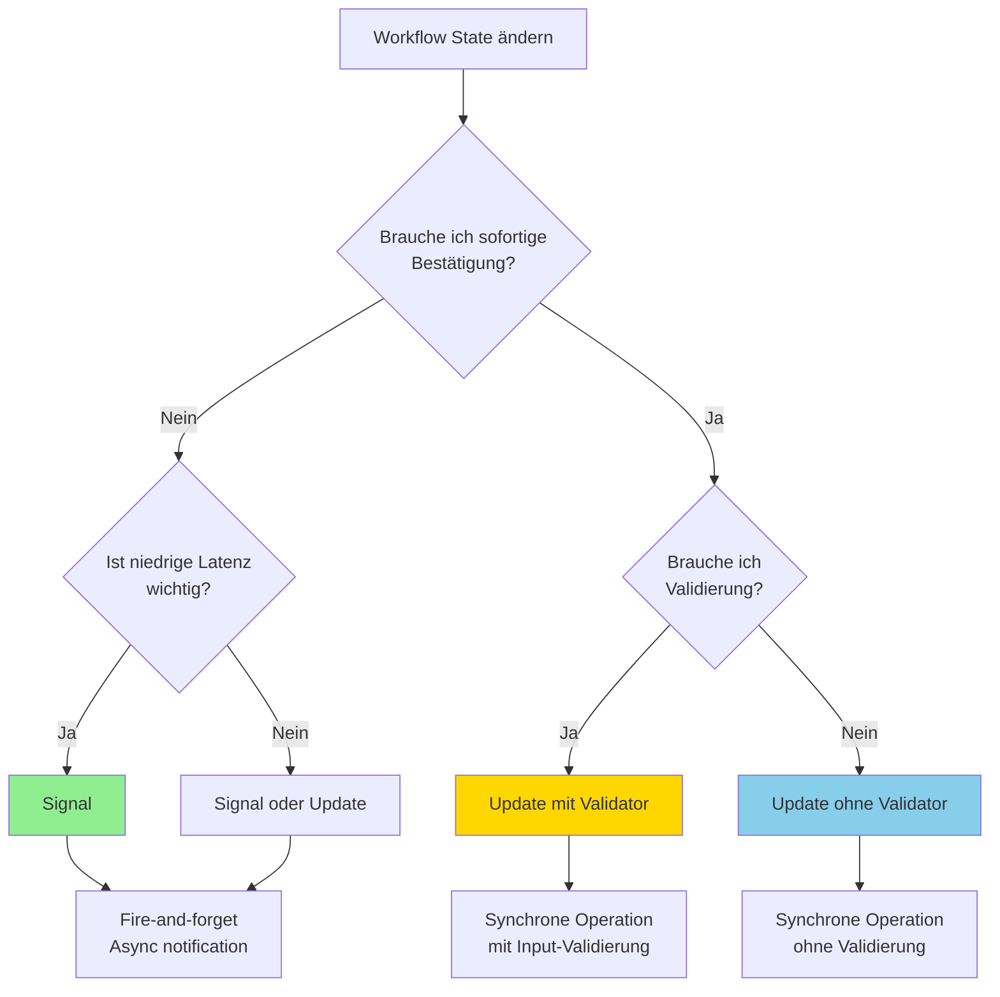

**Code-Beispiel: Signal vs Update**

```python
# Scenario: Item zum Warenkorb hinzufügen

# Option 1: Mit Signal (fire-and-forget)
@workflow.signal
def add_item_signal(self, item: CartItem) -> None:
    """Signal - keine Response"""
    self.items.append(item)
    self.total += item.price

# Client (Signal)
await handle.signal(CartWorkflow.add_item_signal, item)
# Kehrt sofort zurück - weiß nicht ob erfolgreich!

# Wenn Status prüfen will: Query nötig
total = await handle.query(CartWorkflow.get_total)  # Extra roundtrip

# ============================================

# Option 2: Mit Update (synchrone Response)
@workflow.update
def add_item_update(self, item: CartItem) -> dict:
    """Update - gibt neuen State zurück"""
    self.items.append(item)
    self.total += item.price
    return {"items": len(self.items), "total": self.total}

@add_item_update.validator
def validate_add_item(self, item: CartItem) -> None:
    """Frühe Ablehnung ungültiger Items"""
    if len(self.items) >= 100:
        raise ValueError("Cart full")
    if item.price < 0:
        raise ValueError("Invalid price")

# Client (Update)
try:
    result = await handle.execute_update(CartWorkflow.add_item_update, item)
    print(f"Added! Total: ${result['total']}")
except WorkflowUpdateFailedError as e:
    print(f"Failed: {e}")  # Sofortiges Feedback!
```

### 6.3.7 Error Handling bei Updates

**Validator Rejection:**

```python
# Client Code
try:
    result = await workflow_handle.execute_update(
        CartWorkflow.add_item,
        invalid_item  # z.B. leere SKU
    )
except WorkflowUpdateFailedError as e:
    # Validator hat rejected
    print(f"Validation failed: {e}")
    # Event History: KEINE Einträge (frühe Ablehnung)
```

**Handler Exception:**

```python
@workflow.update
async def process_order(self, order: Order) -> Receipt:
    """Handler mit Activity - Exception propagiert zu Client"""
    # Activity failure propagiert
    receipt = await workflow.execute_activity(
        charge_customer,
        order,
        start_to_close_timeout=timedelta(seconds=30),
    )
    return receipt

# Client
try:
    receipt = await workflow_handle.execute_update(
        OrderWorkflow.process_order,
        order
    )
    print(f"Order processed: {receipt.id}")

except WorkflowUpdateFailedError as e:
    # Handler raised exception ODER Activity failed
    print(f"Order processing failed: {e}")
    # Event History: UpdateAccepted + UpdateFailed Events
```

**Idempotenz mit Update Info:**

```python
from temporalio import workflow

@workflow.update
async def process_payment(self, payment_id: str, amount: Decimal) -> str:
    """Idempotenter Update Handler"""

    # Update ID für Deduplizierung abrufen
    update_info = workflow.current_update_info()

    if update_info and update_info.id in self.processed_updates:
        # Bereits verarbeitet (wichtig bei Continue-As-New)
        workflow.logger.info(f"Duplicate update: {update_info.id}")
        return self.update_results[update_info.id]

    # Payment verarbeiten
    result = await workflow.execute_activity(
        charge_payment,
        payment_id,
        amount,
        start_to_close_timeout=timedelta(seconds=30),
    )

    # Für Deduplizierung speichern
    if update_info:
        self.processed_updates.add(update_info.id)
        self.update_results[update_info.id] = result

    return result
```

### 6.3.8 Unfinished Handler Policy

Kontrolle über Verhalten wenn Workflow endet während Update läuft:

```python
@workflow.update(
    unfinished_policy=workflow.HandlerUnfinishedPolicy.ABANDON
)
async def optional_update(self, data: str) -> None:
    """Update der abgebrochen werden kann"""
    # Lange laufende Operation
    await workflow.execute_activity(
        process_data,
        data,
        start_to_close_timeout=timedelta(hours=1),
    )

# Best Practice: Auf Handler-Completion warten vor Workflow-Ende
@workflow.run
async def run(self) -> str:
    # Haupt-Workflow Logik
    ...

    # Alle Handler fertigstellen lassen
    await workflow.wait_condition(
        lambda: workflow.all_handlers_finished()
    )

    return "Completed"
```

## 6.4 Patterns und Best Practices

### 6.4.1 Human-in-the-Loop Approval Pattern

Ein häufiges Pattern: Workflow wartet auf menschliche Genehmigung mit Timeout.

**Multi-Level Approval Workflow:**

```python
from typing import Dict, Optional

@dataclass
class ApprovalRequest:
    request_id: str
    requester: str
    amount: Decimal
    description: str

@dataclass
class ApprovalDecision:
    approved: bool
    approver: str
    timestamp: datetime
    comment: str

@workflow.defn
class MultiLevelApprovalWorkflow:
    """Mehrstufige Genehmigung basierend auf Betrag"""

    @workflow.init
    def __init__(self) -> None:
        self.approvals: Dict[str, ApprovalDecision] = {}
        self.required_approvers: List[str] = []

    def _get_required_approvers(self, amount: Decimal) -> List[str]:
        """Bestimme erforderliche Genehmiger basierend auf Betrag"""
        if amount < Decimal("1000"):
            return ["manager"]
        elif amount < Decimal("10000"):
            return ["manager", "director"]
        else:
            return ["manager", "director", "vp"]

    @workflow.signal
    def approve_manager(self, decision: ApprovalDecision) -> None:
        """Manager Genehmigung"""
        self.approvals["manager"] = decision
        workflow.logger.info(f"Manager approval: {decision.approved}")

    @workflow.signal
    def approve_director(self, decision: ApprovalDecision) -> None:
        """Director Genehmigung"""
        self.approvals["director"] = decision
        workflow.logger.info(f"Director approval: {decision.approved}")

    @workflow.signal
    def approve_vp(self, decision: ApprovalDecision) -> None:
        """VP Genehmigung"""
        self.approvals["vp"] = decision
        workflow.logger.info(f"VP approval: {decision.approved}")

    @workflow.query
    def get_approval_status(self) -> Dict[str, str]:
        """Aktueller Genehmigungs-Status"""
        status = {}
        for role in self.required_approvers:
            if role in self.approvals:
                decision = self.approvals[role]
                status[role] = "approved" if decision.approved else "rejected"
            else:
                status[role] = "pending"
        return status

    @workflow.query
    def is_fully_approved(self) -> bool:
        """Alle erforderlichen Genehmigungen vorhanden?"""
        if len(self.approvals) < len(self.required_approvers):
            return False

        return all(
            role in self.approvals and self.approvals[role].approved
            for role in self.required_approvers
        )

    @workflow.run
    async def run(self, request: ApprovalRequest) -> str:
        # Erforderliche Genehmiger bestimmen
        self.required_approvers = self._get_required_approvers(request.amount)

        workflow.logger.info(
            f"Request {request.request_id} requires approval from: "
            f"{', '.join(self.required_approvers)}"
        )

        # Genehmigungs-Requests senden
        await workflow.execute_activity(
            send_approval_requests,
            request,
            self.required_approvers,
            start_to_close_timeout=timedelta(minutes=5),
        )

        # Auf alle Genehmigungen warten (max 14 Tage)
        try:
            await workflow.wait_condition(
                lambda: len(self.approvals) >= len(self.required_approvers),
                timeout=timedelta(days=14)
            )
        except asyncio.TimeoutError:
            return (
                f"Approval timeout - only {len(self.approvals)} of "
                f"{len(self.required_approvers)} approvals received"
            )

        # Prüfen ob alle approved
        if not self.is_fully_approved():
            rejected_by = [
                role for role, decision in self.approvals.items()
                if not decision.approved
            ]

            # Ablehnung verarbeiten
            await workflow.execute_activity(
                notify_rejection,
                request,
                rejected_by,
                start_to_close_timeout=timedelta(minutes=5),
            )

            return f"Request rejected by: {', '.join(rejected_by)}"

        # Alle approved - Request verarbeiten
        await workflow.execute_activity(
            process_approved_request,
            request,
            start_to_close_timeout=timedelta(minutes=10),
        )

        return (
            f"Request approved by all {len(self.required_approvers)} approvers "
            f"and processed successfully"
        )
```

**Approval Workflow Zustandsdiagramm:**

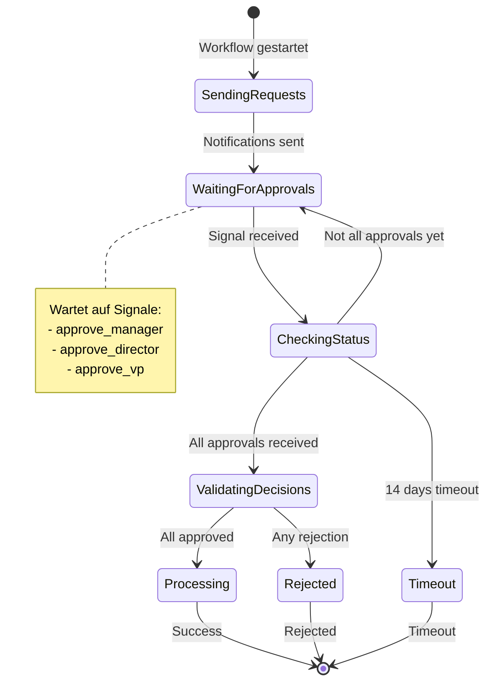

### 6.4.2 Progress Tracking mit Updates statt Query Polling

**Ineffizient: Query Polling**

```python
# ✗ Ineffizient: Kontinuierliches Query Polling
async def wait_for_progress_old(handle, target_progress: int):
    """Veraltetes Pattern - vermeiden!"""
    while True:
        progress = await handle.query(MyWorkflow.get_progress)
        if progress >= target_progress:
            return progress
        await asyncio.sleep(1)  # Verschwendung!
```

**Effizient: Update mit wait_condition**

```python
@workflow.defn
class DataMigrationWorkflow:
    """Progress Tracking mit Update statt Polling"""

    @workflow.init
    def __init__(self) -> None:
        self.progress = 0
        self.total_records = 0
        self.completed = False

    @workflow.update
    async def wait_for_progress(self, min_progress: int) -> int:
        """Warte bis Progress erreicht, dann return"""
        # Workflow benachrichtigt Client wenn bereit
        await workflow.wait_condition(
            lambda: self.progress >= min_progress or self.completed
        )
        return self.progress

    @workflow.query
    def get_current_progress(self) -> int:
        """Sofortiger Progress-Check (wenn nötig)"""
        return self.progress

    @workflow.run
    async def run(self, total_records: int) -> str:
        self.total_records = total_records

        for i in range(total_records):
            await workflow.execute_activity(
                migrate_record,
                i,
                start_to_close_timeout=timedelta(seconds=30),
            )
            self.progress = i + 1

            # Log alle 10%
            if (i + 1) % (total_records // 10) == 0:
                workflow.logger.info(
                    f"Progress: {(i+1)/total_records*100:.0f}%"
                )

        self.completed = True
        return f"Migrated {total_records} records"

# Client: Effiziente Progress-Überwachung
async def monitor_migration_progress(handle):
    """✓ Effizienter Ansatz mit Update"""
    # Warte auf 50% Progress
    progress = await handle.execute_update(
        DataMigrationWorkflow.wait_for_progress,
        min_progress=50
    )
    print(f"50% checkpoint reached: {progress} records")

    # Warte auf 100%
    progress = await handle.execute_update(
        DataMigrationWorkflow.wait_for_progress,
        min_progress=100
    )
    print(f"100% complete: {progress} records")
```

**Vorteile Update-basiertes Progress Tracking:**

- ✅ Ein Request statt hunderte Queries
- ✅ Workflow benachrichtigt Client aktiv
- ✅ Keine Polling-Overhead
- ✅ Präzise Benachrichtigung genau wenn Milestone erreicht
- ✅ Server-Push statt Client-Pull

### 6.4.3 Externe Workflow Handles

Workflows können mit anderen Workflows kommunizieren via externe Handles:

```python
@workflow.defn
class OrchestratorWorkflow:
    """Koordiniert mehrere Worker Workflows"""

    @workflow.run
    async def run(self, worker_ids: List[str]) -> dict:
        results = {}

        for worker_id in worker_ids:
            # Externes Workflow Handle abrufen
            worker_handle = workflow.get_external_workflow_handle_for(
                WorkerWorkflow.run,
                workflow_id=f"worker-{worker_id}"
            )

            # Signal an externes Workflow senden
            await worker_handle.signal(
                WorkerWorkflow.process_task,
                TaskData(task_id=f"task-{worker_id}", priority=1)
            )

            workflow.logger.info(f"Task sent to worker {worker_id}")

        # Warte auf alle Worker
        await asyncio.sleep(timedelta(minutes=10))

        # Optional: Externe Workflows canceln
        # await worker_handle.cancel()

        return {"workers_coordinated": len(worker_ids)}

@workflow.defn
class WorkerWorkflow:
    """Worker Workflow empfängt Signale"""

    @workflow.init
    def __init__(self) -> None:
        self.tasks: List[TaskData] = []

    @workflow.signal
    async def process_task(self, task: TaskData) -> None:
        """Empfange Task vom Orchestrator"""
        result = await workflow.execute_activity(
            process_task_activity,
            task,
            start_to_close_timeout=timedelta(minutes=5),
        )
        self.tasks.append(result)

    @workflow.run
    async def run(self) -> List[str]:
        # Warte auf Tasks oder Timeout
        await workflow.wait_condition(
            lambda: len(self.tasks) >= 5,
            timeout=timedelta(hours=1)
        )
        return self.tasks
```

**Event History bei externen Signalen:**

- `SignalExternalWorkflowExecutionInitiated` im Sender's History
- `WorkflowExecutionSignaled` im Empfänger's History

### 6.4.4 Signal Buffering vor Workflow-Start

Signale die VOR Workflow-Start gesendet werden, werden automatisch gepuffert:

```python
async def start_with_buffered_signals():
    """Signale werden gepuffert bis Workflow startet"""
    client = await Client.connect("localhost:7233")

    # Workflow starten (Worker braucht Zeit zum Aufnehmen)
    handle = await client.start_workflow(
        MyWorkflow.run,
        id="workflow-123",
        task_queue="my-queue",
    )

    # Signale SOFORT senden (werden gepuffert wenn Workflow noch nicht läuft)
    await handle.signal(MyWorkflow.signal_1, "data1")
    await handle.signal(MyWorkflow.signal_2, "data2")
    await handle.signal(MyWorkflow.signal_3, "data3")

    # Wenn Workflow startet: Alle gepufferten Signale in Reihenfolge ausgeliefert
```

**Wichtige Überlegungen:**

- Signale in Reihenfolge gepuffert
- Alle vor erstem Workflow Task ausgeliefert
- Workflow-State muss initialisiert sein BEVOR Handler ausführen
- `@workflow.init` verwenden um uninitialisierte Variablen zu vermeiden

**Buffering Visualisierung:**

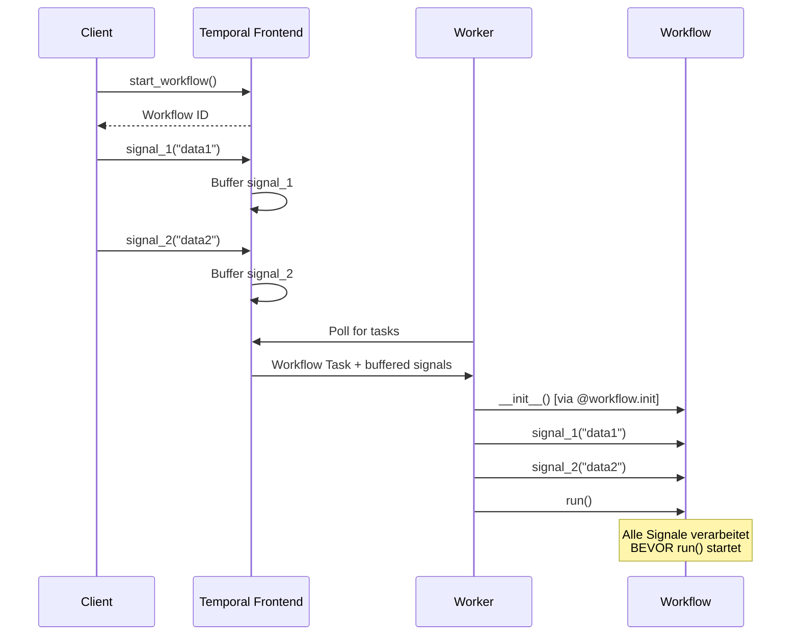

### 6.4.5 Concurrency Safety bei async Handlern

**Problem: Race Conditions**

```python
# ✗ Problem: Race Condition bei concurrent Updates
@workflow.update
async def withdraw(self, amount: Decimal) -> Decimal:
    # Mehrere Updates können interleaven!
    current = await workflow.execute_activity(
        get_balance, ...
    )  # Point A
    # Anderer Handler könnte hier ausführen!
    new_balance = current - amount  # Point B
    # Und hier!
    await workflow.execute_activity(
        set_balance, new_balance, ...
    )  # Point C
    return new_balance
```

**Lösung: asyncio.Lock**

```python
from asyncio import Lock

@workflow.defn
class BankAccountWorkflow:
    @workflow.init
    def __init__(self) -> None:
        self.lock = Lock()  # Concurrency-Schutz
        self.balance = Decimal("1000.00")

    @workflow.update
    async def withdraw(self, amount: Decimal) -> Decimal:
        """Thread-safe Withdrawal mit Lock"""
        async with self.lock:  # Nur ein Handler gleichzeitig
            # Kritischer Bereich
            current_balance = await workflow.execute_activity(
                get_current_balance,
                start_to_close_timeout=timedelta(seconds=10),
            )

            if current_balance < amount:
                raise ValueError("Insufficient funds")

            # Betrag abziehen
            self.balance = current_balance - amount

            # Externes System updaten
            await workflow.execute_activity(
                update_balance,
                self.balance,
                start_to_close_timeout=timedelta(seconds=10),
            )

            return self.balance

    @withdraw.validator
    def validate_withdraw(self, amount: Decimal) -> None:
        if amount <= 0:
            raise ValueError("Amount must be positive")
        if amount > Decimal("10000.00"):
            raise ValueError("Amount exceeds daily limit")
```

**Alternative: Message Queue Pattern**

```python
from collections import deque
from typing import Deque

@workflow.defn
class QueueBasedWorkflow:
    """Natürliche Serialisierung via Queue"""

    @workflow.init
    def __init__(self) -> None:
        self.message_queue: Deque[str] = deque()

    @workflow.signal
    def add_message(self, message: str) -> None:
        """Leichtgewichtiger Handler - nur queuen"""
        if len(self.message_queue) >= 1000:
            workflow.logger.warn("Queue full, dropping message")
            return

        self.message_queue.append(message)

    @workflow.run
    async def run(self) -> None:
        """Haupt-Workflow verarbeitet Queue"""
        while True:
            # Warte auf Messages
            await workflow.wait_condition(
                lambda: len(self.message_queue) > 0
            )

            # Verarbeite alle gepufferten Messages
            while self.message_queue:
                message = self.message_queue.popleft()

                # Verarbeitung (natürlich serialisiert)
                await workflow.execute_activity(
                    process_message,
                    message,
                    start_to_close_timeout=timedelta(seconds=30),
                )

            # Prüfe ob fortfahren
            if self.should_shutdown:
                break
```

**Vorteile Queue Pattern:**

- ✅ Natürliche FIFO Serialisierung
- ✅ Keine Race Conditions
- ✅ Kann Messages batchen
- ✅ Keine Locks nötig

**Nachteile:**

- ❌ Komplexerer Code
- ❌ Schwieriger typsicher zu machen
- ❌ Weniger bequem als direkte Handler

### 6.4.6 Continue-As-New mit Handlern

**Problem: Unfertige Handler bei Continue-As-New**

```python
# ⚠️ Problem: Handler könnte bei Continue-As-New abgebrochen werden
@workflow.run
async def run(self) -> None:
    while True:
        # Arbeit erledigen
        self.iteration += 1

        if workflow.info().is_continue_as_new_suggested():
            # PROBLEM: Signal/Update Handler könnten noch laufen!
            workflow.continue_as_new(iteration=self.iteration)
```

**Lösung: Handler-Completion warten**

```python
@workflow.defn
class LongRunningWorkflow:
    @workflow.init
    def __init__(self, iteration: int = 0) -> None:
        self.iteration = iteration
        self.total_processed = 0

    @workflow.signal
    async def process_item(self, item: str) -> None:
        """Async Signal Handler"""
        result = await workflow.execute_activity(
            process_item_activity,
            item,
            start_to_close_timeout=timedelta(minutes=5),
        )
        self.total_processed += 1

    @workflow.run
    async def run(self) -> None:
        while True:
            self.iteration += 1

            # Batch-Verarbeitung
            await workflow.execute_activity(
                batch_process,
                start_to_close_timeout=timedelta(minutes=10),
            )

            # Prüfe ob Continue-As-New nötig
            if workflow.info().is_continue_as_new_suggested():
                workflow.logger.info(
                    "Event history approaching limits - Continue-As-New"
                )

                # ✓ WICHTIG: Warte auf alle Handler
                await workflow.wait_condition(
                    lambda: workflow.all_handlers_finished()
                )

                # Jetzt sicher für Continue-As-New
                workflow.continue_as_new(
                    iteration=self.iteration,
                    total_processed=self.total_processed
                )

            # Nächste Iteration
            await asyncio.sleep(timedelta(hours=1))
```

**Idempotenz über Continue-As-New hinweg:**

```python
from typing import Set

@workflow.defn
class IdempotentWorkflow:
    @workflow.init
    def __init__(self, processed_update_ids: Set[str] = None) -> None:
        # IDs bereits verarbeiteter Updates
        self.processed_update_ids = processed_update_ids or set()

    @workflow.update
    async def process_payment(self, payment_id: str) -> str:
        """Idempotenter Update über Continue-As-New"""
        # Update ID für Deduplizierung
        update_info = workflow.current_update_info()

        if update_info and update_info.id in self.processed_update_ids:
            workflow.logger.info(f"Skipping duplicate update: {update_info.id}")
            return "already_processed"

        # Payment verarbeiten
        result = await workflow.execute_activity(
            charge_payment,
            payment_id,
            start_to_close_timeout=timedelta(seconds=30),
        )

        # Als verarbeitet markieren
        if update_info:
            self.processed_update_ids.add(update_info.id)

        return result

    @workflow.run
    async def run(self) -> None:
        while True:
            # Workflow-Logik...

            if workflow.info().is_continue_as_new_suggested():
                await workflow.wait_condition(
                    lambda: workflow.all_handlers_finished()
                )

                # IDs an nächste Iteration übergeben
                workflow.continue_as_new(
                    processed_update_ids=self.processed_update_ids
                )
```

## 6.5 Häufige Fehler und Anti-Patterns

### 6.5.1 Uninitialisierte State-Zugriffe

**Problem:**

```python
# ✗ FALSCH: Handler kann vor run() ausgeführt werden!
@workflow.defn
class BadWorkflow:
    @workflow.run
    async def run(self, name: str) -> str:
        self.name = name  # Initialisiert hier
        await workflow.wait_condition(lambda: self.approved)
        return f"Hello {self.name}"

    @workflow.signal
    def approve(self) -> None:
        self.approved = True
        # Wenn Signal vor run() gesendet: self.name existiert nicht!
        # AttributeError!
```

**Lösung:**

```python
# ✓ KORREKT: @workflow.init garantiert Ausführung vor Handlern
@workflow.defn
class GoodWorkflow:
    @workflow.init
    def __init__(self, name: str) -> None:
        self.name = name  # Garantiert zuerst ausgeführt
        self.approved = False

    @workflow.run
    async def run(self, name: str) -> str:
        await workflow.wait_condition(lambda: self.approved)
        return f"Hello {self.name}"

    @workflow.signal
    def approve(self) -> None:
        self.approved = True  # self.name existiert garantiert
```

### 6.5.2 State-Mutation in Queries

**Problem:**

```python
# ✗ FALSCH: Queries müssen read-only sein!
@workflow.query
def get_and_increment_counter(self) -> int:
    self.counter += 1  # ERROR! State-Mutation
    return self.counter
```

**Lösung:**

```python
# ✓ KORREKT: Query nur lesen, Update für Mutation
@workflow.query
def get_counter(self) -> int:
    return self.counter  # Read-only

@workflow.update
def increment_counter(self) -> int:
    self.counter += 1  # Mutations in Updates erlaubt
    return self.counter
```

### 6.5.3 Async Query Handler

**Problem:**

```python
# ✗ FALSCH: Queries können nicht async sein!
@workflow.query
async def get_status(self) -> str:  # TypeError!
    return self.status
```

**Lösung:**

```python
# ✓ KORREKT: Queries müssen synchron sein
@workflow.query
def get_status(self) -> str:
    return self.status
```

### 6.5.4 Nicht auf Handler-Completion warten

**Problem:**

```python
# ✗ FALSCH: Workflow endet während Handler laufen
@workflow.run
async def run(self) -> str:
    await workflow.execute_activity(...)
    return "Done"  # Handler könnten noch laufen!
```

**Lösung:**

```python
# ✓ KORREKT: Auf Handler warten
@workflow.run
async def run(self) -> str:
    await workflow.execute_activity(...)

    # Alle Handler fertigstellen
    await workflow.wait_condition(
        lambda: workflow.all_handlers_finished()
    )

    return "Done"
```

### 6.5.5 Exzessive Signal-Volumes

**Problem:**

```python
# ✗ FALSCH: Zu viele Signale
for i in range(10000):
    await handle.signal(MyWorkflow.process_item, f"item-{i}")
# Überschreitet Event History Limits!
```

**Lösung:**

```python
# ✓ BESSER: Batch-Signale
items = [f"item-{i}" for i in range(10000)]
await handle.signal(MyWorkflow.process_batch, items)

# Oder: Child Workflows für hohe Volumes
for i in range(100):
    await workflow.execute_child_workflow(
        ProcessingWorkflow.run,
        batch=items[i*100:(i+1)*100],
        id=f"batch-{i}",
    )
```

### 6.5.6 Kontinuierliches Query Polling

**Problem:**

```python
# ✗ INEFFIZIENT: Tight polling loop
async def wait_for_completion_bad(handle):
    while True:
        status = await handle.query(MyWorkflow.get_status)
        if status == "completed":
            break
        await asyncio.sleep(0.5)  # Verschwendung!
```

**Lösung:**

```python
# ✓ BESSER: Update mit wait_condition
@workflow.update
async def wait_for_completion(self, target_status: str) -> str:
    await workflow.wait_condition(lambda: self.status == target_status)
    return self.status

# Client
status = await handle.execute_update(
    MyWorkflow.wait_for_completion,
    "completed"
)
```

## 6.6 Praktisches Beispiel: E-Commerce Order Workflow

Vollständiges Beispiel mit Signalen, Queries und Updates:

```python
"""
E-Commerce Order Workflow
Demonstriert Signals, Queries und Updates
"""
from temporalio import workflow, activity
from temporalio.client import Client
from dataclasses import dataclass
from decimal import Decimal
from typing import List, Optional
from datetime import timedelta, datetime, timezone
from enum import Enum
import asyncio

# ==================== Data Models ====================

class OrderStatus(Enum):
    PENDING = "pending"
    PAID = "paid"
    SHIPPED = "shipped"
    DELIVERED = "delivered"
    CANCELLED = "cancelled"

@dataclass
class OrderItem:
    sku: str
    name: str
    quantity: int
    price: Decimal

@dataclass
class PaymentInfo:
    payment_method: str
    amount: Decimal
    card_token: str

@dataclass
class ShippingInfo:
    address: str
    carrier: str
    tracking_number: str

@dataclass
class OrderProgress:
    """Query Response: Order Progress"""
    status: OrderStatus
    items_count: int
    total_amount: str
    payment_status: str
    shipping_status: str

# ==================== Workflow ====================

@workflow.defn
class OrderWorkflow:
    """E-Commerce Order mit Signals, Queries und Updates"""

    @workflow.init
    def __init__(self) -> None:
        self.lock = asyncio.Lock()

        # Order State
        self.order_id: str = ""
        self.customer_id: str = ""
        self.status = OrderStatus.PENDING

        # Items
        self.items: List[OrderItem] = []
        self.total = Decimal("0.00")

        # Payment
        self.payment_transaction_id: Optional[str] = None

        # Shipping
        self.shipping_info: Optional[ShippingInfo] = None

    # ========== Queries: Read-Only State Access ==========

    @workflow.query
    def get_status(self) -> str:
        """Aktueller Order Status"""
        return self.status.value

    @workflow.query
    def get_total(self) -> str:
        """Aktueller Total-Betrag"""
        return str(self.total)

    @workflow.query
    def get_progress(self) -> OrderProgress:
        """Detaillierter Progress"""
        return OrderProgress(
            status=self.status,
            items_count=len(self.items),
            total_amount=str(self.total),
            payment_status=(
                "paid" if self.payment_transaction_id
                else "pending"
            ),
            shipping_status=(
                f"shipped via {self.shipping_info.carrier}"
                if self.shipping_info
                else "not shipped"
            )
        )

    # ========== Updates: Validated State Changes ==========

    @workflow.update
    async def add_item(self, item: OrderItem) -> dict:
        """Item hinzufügen (mit Validierung)"""
        async with self.lock:
            # Inventory prüfen
            available = await workflow.execute_activity(
                check_inventory,
                item,
                start_to_close_timeout=timedelta(seconds=10),
            )

            if not available:
                raise ValueError(f"Item {item.sku} out of stock")

            # Item hinzufügen
            self.items.append(item)
            self.total += item.price * item.quantity

            workflow.logger.info(
                f"Added {item.quantity}x {item.name} - "
                f"Total: ${self.total}"
            )

            return {
                "items": len(self.items),
                "total": str(self.total)
            }

    @add_item.validator
    def validate_add_item(self, item: OrderItem) -> None:
        """Validator: Item nur wenn Order pending"""
        if self.status != OrderStatus.PENDING:
            raise ValueError(
                f"Cannot add items in status: {self.status.value}"
            )

        if item.quantity <= 0:
            raise ValueError("Quantity must be positive")

        if len(self.items) >= 50:
            raise ValueError("Maximum 50 items per order")

    @workflow.update
    async def process_payment(self, payment: PaymentInfo) -> str:
        """Payment verarbeiten (mit Validierung)"""
        async with self.lock:
            # Payment Amount validieren
            if payment.amount != self.total:
                raise ValueError(
                    f"Payment amount {payment.amount} != "
                    f"order total {self.total}"
                )

            # Payment Activity ausführen
            transaction_id = await workflow.execute_activity(
                charge_payment,
                payment,
                start_to_close_timeout=timedelta(seconds=30),
            )

            # State updaten
            self.payment_transaction_id = transaction_id
            self.status = OrderStatus.PAID

            workflow.logger.info(
                f"Payment successful: {transaction_id}"
            )

            return transaction_id

    @process_payment.validator
    def validate_payment(self, payment: PaymentInfo) -> None:
        """Validator: Payment nur wenn pending und Items vorhanden"""
        if self.status != OrderStatus.PENDING:
            raise ValueError(
                f"Cannot process payment in status: {self.status.value}"
            )

        if len(self.items) == 0:
            raise ValueError("Cannot pay for empty order")

        if not payment.card_token or len(payment.card_token) < 10:
            raise ValueError("Invalid card token")

    # ========== Signals: Async Notifications ==========

    @workflow.signal
    async def mark_shipped(self, shipping: ShippingInfo) -> None:
        """Order als shipped markieren"""
        async with self.lock:
            if self.status != OrderStatus.PAID:
                workflow.logger.warn(
                    f"Cannot ship order in status: {self.status.value}"
                )
                return

            # Shipping System updaten
            await workflow.execute_activity(
                update_shipping_system,
                self.order_id,
                shipping,
                start_to_close_timeout=timedelta(seconds=10),
            )

            self.shipping_info = shipping
            self.status = OrderStatus.SHIPPED

            workflow.logger.info(
                f"Order shipped via {shipping.carrier} - "
                f"Tracking: {shipping.tracking_number}"
            )

    @workflow.signal
    def cancel_order(self, reason: str) -> None:
        """Order canceln"""
        if self.status in [OrderStatus.SHIPPED, OrderStatus.DELIVERED]:
            workflow.logger.warn(
                f"Cannot cancel order in status: {self.status.value}"
            )
            return

        self.status = OrderStatus.CANCELLED
        workflow.logger.info(f"Order cancelled: {reason}")

    # ========== Main Workflow ==========

    @workflow.run
    async def run(self, order_id: str, customer_id: str) -> str:
        """Order Workflow Main Logic"""
        self.order_id = order_id
        self.customer_id = customer_id

        workflow.logger.info(
            f"Order {order_id} created for customer {customer_id}"
        )

        # Warte auf Payment (max 7 Tage)
        try:
            await workflow.wait_condition(
                lambda: self.status == OrderStatus.PAID,
                timeout=timedelta(days=7)
            )
        except asyncio.TimeoutError:
            self.status = OrderStatus.CANCELLED
            return f"Order {order_id} cancelled - payment timeout"

        # Warte auf Shipment (max 30 Tage)
        try:
            await workflow.wait_condition(
                lambda: self.status == OrderStatus.SHIPPED,
                timeout=timedelta(days=30)
            )
        except asyncio.TimeoutError:
            workflow.logger.error("Shipment timeout!")
            return f"Order {order_id} paid but not shipped"

        # Simuliere Delivery Tracking
        await asyncio.sleep(timedelta(days=3))

        # Mark als delivered
        self.status = OrderStatus.DELIVERED

        # Delivery Confirmation senden
        await workflow.execute_activity(
            send_delivery_confirmation,
            self.customer_id,
            self.order_id,
            start_to_close_timeout=timedelta(seconds=30),
        )

        workflow.logger.info(f"Order {order_id} delivered successfully")

        return f"Order {order_id} completed - ${self.total} charged"

# ==================== Activities ====================

@activity.defn
async def check_inventory(item: OrderItem) -> bool:
    """Prüfe Inventory-Verfügbarkeit"""
    # Simuliert Inventory-Check
    activity.logger.info(f"Checking inventory for {item.sku}")
    return True

@activity.defn
async def charge_payment(payment: PaymentInfo) -> str:
    """Verarbeite Payment"""
    activity.logger.info(
        f"Charging {payment.amount} via {payment.payment_method}"
    )
    # Simuliert Payment Gateway
    return f"txn_{payment.card_token[:8]}"

@activity.defn
async def update_shipping_system(
    order_id: str,
    shipping: ShippingInfo
) -> None:
    """Update Shipping System"""
    activity.logger.info(
        f"Updating shipping for {order_id} - {shipping.carrier}"
    )

@activity.defn
async def send_delivery_confirmation(
    customer_id: str,
    order_id: str
) -> None:
    """Sende Delivery Confirmation"""
    activity.logger.info(
        f"Sending delivery confirmation to {customer_id} for {order_id}"
    )

# ==================== Client Usage ====================

async def main():
    """Client-seitiger Order Flow"""
    client = await Client.connect("localhost:7233")

    # Order Workflow starten
    order_id = "order-12345"
    handle = await client.start_workflow(
        OrderWorkflow.run,
        order_id,
        "customer-789",
        id=order_id,
        task_queue="orders",
    )

    print(f"Order {order_id} created")

    # Items hinzufügen (Update)
    try:
        result = await handle.execute_update(
            OrderWorkflow.add_item,
            OrderItem(
                sku="LAPTOP-001",
                name="Gaming Laptop",
                quantity=1,
                price=Decimal("1299.99")
            )
        )
        print(f"Item added: {result}")

        result = await handle.execute_update(
            OrderWorkflow.add_item,
            OrderItem(
                sku="MOUSE-001",
                name="Wireless Mouse",
                quantity=2,
                price=Decimal("29.99")
            )
        )
        print(f"Item added: {result}")

    except Exception as e:
        print(f"Failed to add item: {e}")
        return

    # Total abfragen (Query)
    total = await handle.query(OrderWorkflow.get_total)
    print(f"Order total: ${total}")

    # Progress abfragen (Query)
    progress = await handle.query(OrderWorkflow.get_progress)
    print(f"Progress: {progress}")

    # Payment verarbeiten (Update mit Validierung)
    try:
        txn_id = await handle.execute_update(
            OrderWorkflow.process_payment,
            PaymentInfo(
                payment_method="credit_card",
                amount=Decimal(total),
                card_token="tok_1234567890abcdef"
            )
        )
        print(f"Payment processed: {txn_id}")
    except Exception as e:
        print(f"Payment failed: {e}")
        return

    # Status abfragen
    status = await handle.query(OrderWorkflow.get_status)
    print(f"Order status: {status}")

    # Shipment markieren (Signal)
    await handle.signal(
        OrderWorkflow.mark_shipped,
        ShippingInfo(
            address="123 Main St, City, State 12345",
            carrier="UPS",
            tracking_number="1Z999AA10123456784"
        )
    )
    print("Order marked as shipped")

    # Final result abwarten
    result = await handle.result()
    print(f"\nWorkflow completed: {result}")

if __name__ == "__main__":
    asyncio.run(main())
```

**Beispiel Output:**

```
Order order-12345 created
Item added: {'items': 1, 'total': '1299.99'}
Item added: {'items': 2, 'total': '1359.97'}
Order total: $1359.97
Progress: OrderProgress(status=<OrderStatus.PENDING: 'pending'>, items_count=2, total_amount='1359.97', payment_status='pending', shipping_status='not shipped')
Payment processed: txn_1234567890abcdef
Order status: paid
Order marked as shipped

Workflow completed: Order order-12345 completed - $1359.97 charged
```

## 6.7 Zusammenfassung

### Kernkonzepte

**Signals (Signale):**
- Asynchrone, fire-and-forget Zustandsänderungen
- Erzeugen Event History Einträge
- Können vor Workflow-Start gepuffert werden
- Perfekt für Event-driven Patterns und Human-in-the-Loop

**Queries (Abfragen):**
- Synchrone, read-only Zustandsabfragen
- KEINE Event History Einträge
- Funktionieren auf abgeschlossenen Workflows
- Ideal für Dashboards und Monitoring

**Updates (Aktualisierungen):**
- Synchrone Zustandsänderungen mit Response
- Optionale Validierung vor Ausführung
- Event History nur bei erfolgreicher Validierung
- Beste Wahl für Request-Response Patterns

### Entscheidungsbaum

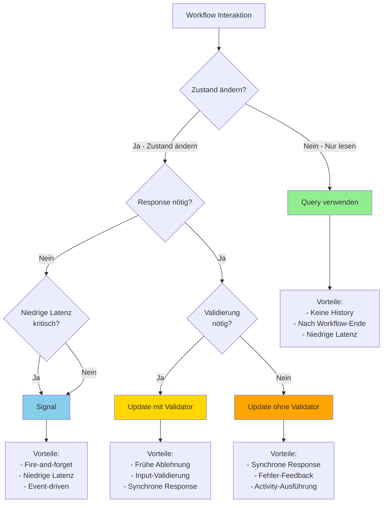

### Best Practices Checkliste

**Allgemein:**
- ✅ `@workflow.init` für State-Initialisierung verwenden
- ✅ Dataclasses für typsichere Parameter nutzen
- ✅ Auf `workflow.all_handlers_finished()` vor Workflow-Ende warten
- ✅ Event History Limits beachten (Continue-As-New)

**Signale:**
- ✅ Handler leichtgewichtig halten
- ✅ Idempotenz implementieren
- ✅ Nicht tausende Signale senden (batchen!)
- ✅ Signal-with-Start für lazy initialization

**Queries:**
- ✅ Nur synchrone (`def`) Handler
- ✅ KEINE State-Mutation
- ✅ Pre-compute komplexe Werte
- ✅ NICHT kontinuierlich pollen

**Updates:**
- ✅ Validators für Input-Validierung
- ✅ `asyncio.Lock` bei concurrent async Handlern
- ✅ Update statt Signal+Query Polling
- ✅ Idempotenz über Continue-As-New

### Häufige Anti-Patterns

| Anti-Pattern | Problem | Lösung |
|-------------|---------|--------|
| State in run() initialisieren | Handler könnten vor run() ausführen | `@workflow.init` verwenden |
| Async Query Handler | TypeError | Nur `def`, nicht `async def` |
| State in Query ändern | Verletzt Read-Only | Update verwenden |
| Nicht auf Handler warten | Workflow endet vorzeitig | `workflow.all_handlers_finished()` |
| Kontinuierliches Query Polling | Ineffizient | Update mit wait_condition |
| Race Conditions in async Handlern | Concurrent execution | `asyncio.Lock` verwenden |
| Tausende Signale | Event History Limit | Batching oder Child Workflows |

### Nächste Schritte

In diesem Kapitel haben Sie die drei Kommunikationsmechanismen von Temporal kennengelernt. Im nächsten Teil des Buchs (Kapitel 7-9) werden wir uns mit **Resilienz** beschäftigen:

- **Kapitel 7**: Error Handling und Retry Policies
- **Kapitel 8**: Workflow Evolution und Versioning
- **Kapitel 9**: Fortgeschrittene Resilienz-Patterns

Die Kommunikationsmuster aus diesem Kapitel bilden die Grundlage für robuste, produktionsreife Temporal-Anwendungen.

---

**[⬆ Zurück zum Inhaltsverzeichnis](README.md)**

**Nächstes Kapitel**: [Kapitel 7: Fehlerbehandlung und Retries](part-03-chapter-07.md)

**Code-Beispiele für dieses Kapitel**: [`examples/part-02/chapter-06/`](../examples/part-02/chapter-06/)
