# Kapitel 7: Error Handling und Retry Policies

## Einleitung

In verteilten Systemen sind Fehler unvermeidlich: Netzwerkverbindungen brechen ab, externe Services werden langsam oder unerreichbar, Datenbanken geraten unter Last, und Timeouts treten auf. Die Fähigkeit, gracefully mit diesen Fehlern umzugehen, ist entscheidend für resiliente Anwendungen.

Temporal wurde von Grund auf entwickelt, um Fehlerbehandlung zu vereinfachen und zu automatisieren. Das Framework übernimmt einen Großteil der komplexen Retry-Logik, während Entwickler die Kontrolle über kritische Business-Entscheidungen behalten.

In diesem Kapitel lernen Sie:

- Den fundamentalen Unterschied zwischen Activity- und Workflow-Fehlern
- Exception-Typen und deren Verwendung im Python SDK
- Retry Policies konfigurieren und anpassen
- Timeouts richtig einsetzen (Activity und Workflow)
- Advanced Error Patterns (SAGA, Circuit Breaker, Dead Letter Queue)
- Testing und Debugging von Fehlerszenarien
- Best Practices für produktionsreife Fehlerbehandlung

### Warum Error Handling in Temporal anders ist

In traditionellen Systemen müssen Entwickler:
- Retry-Logik selbst implementieren
- Exponential Backoff manuell programmieren
- Idempotenz explizit sicherstellen
- Fehlerz

ustände in Datenbanken speichern
- Circuit Breaker selbst bauen

Mit Temporal:
- **Activities haben automatische Retries** (konfigurierbar)
- **Exponential Backoff ist eingebaut**
- **Event History speichert allen State** (kein externes Persistence Layer nötig)
- **Deterministische Replay-Garantien** ermöglichen sichere Fehlerbehandlung
- **Deklarative Retry Policies** statt imperativer Code

## 7.1 Error Handling Grundlagen

### 7.1.1 Activity Errors vs Workflow Errors

Der fundamentalste Unterschied in Temporal's Error-Modell: **Activity-Fehler führen NICHT automatisch zu Workflow-Fehlern**. Dies ist ein bewusstes Design-Pattern für Resilienz.

**Activity Errors:**
- Jede Python Exception in einer Activity wird automatisch in einen `ApplicationError` konvertiert
- Activities haben **Default Retry Policies** und versuchen automatisch erneut
- Activity-Fehler werden im Workflow als `ActivityError` weitergegeben
- Der Workflow entscheidet, wie mit dem Fehler umgegangen wird

**Workflow Errors:**
- Workflows haben **KEINE Default Retry Policy**
- Nur explizite `ApplicationError` Raises führen zum Workflow-Fehler
- Andere Python Exceptions (z.B. `NameError`, `TypeError`) führen zu Workflow Task Retries
- Non-Temporal Exceptions werden als Bugs betrachtet, die durch Code-Fixes behoben werden können

**Visualisierung: Error Flow**

```mermaid
flowchart TD
    A[Activity wirft Exception] --> B{Activity Retry Policy}
    B -->|Retry erlaubt| C[Exponential Backoff]
    C --> D[Activity Retry]
    D --> B
    B -->|Max Attempts erreicht| E[ActivityError an Workflow]

    E --> F{Workflow Error Handling}
    F -->|try/except| G[Workflow behandelt Fehler]
    F -->|Nicht gefangen| H[Workflow wirft ApplicationError]

    G --> I[Workflow fährt fort]
    H --> J[Workflow Status: Failed]

    style A fill:#FFB6C1
    style E fill:#FFA500
    style H fill:#FF4444
    style I fill:#90EE90
```



**Code-Beispiel:**

```python
from temporalio import workflow, activity
from temporalio.exceptions import ActivityError, ApplicationError
from temporalio.common import RetryPolicy
from datetime import timedelta

@activity.defn
async def risky_operation(data: str) -> str:
    """Activity die fehlschlagen kann"""
    if "invalid" in data:
        # Diese Exception wird zu ActivityError im Workflow
        raise ValueError(f"Invalid data: {data}")

    # Simuliere externe API
    result = await external_api.call(data)
    return result

@workflow.defn
class ErrorHandlingWorkflow:
    @workflow.run
    async def run(self, data: str) -> str:
        try:
            # Activity Retry Policy: Max 3 Versuche
            result = await workflow.execute_activity(
                risky_operation,
                data,
                start_to_close_timeout=timedelta(seconds=10),
                retry_policy=RetryPolicy(maximum_attempts=3)
            )
            return f"Success: {result}"

        except ActivityError as e:
            # Activity-Fehler abfangen und behandeln
            workflow.logger.error(f"Activity failed after retries: {e}")

            # Entscheidung: Workflow-Fehler oder graceful handling?
            if "critical" in data:
                # Kritischer Fehler → Workflow schlägt fehl
                raise ApplicationError(
                    "Critical operation failed",
                    non_retryable=True
                ) from e
            else:
                # Nicht-kritisch → Fallback
                return f"Failed with fallback: {e.cause.message if e.cause else str(e)}"
```

**Wichtige Erkenntnisse:**

1. **Separation of Concerns**: Activities führen Work aus (fehleranfällig), Workflows orchestrieren (resilient)
2. **Automatic Retries**: Platform kümmert sich um Retries, Sie konfigurieren nur
3. **Explicit Failure**: Workflows müssen explizit fehlschlagen via `ApplicationError`
4. **Graceful Degradation**: Workflows können Activity-Fehler abfangen und mit Fallback fortfahren

### 7.1.2 Exception-Hierarchie im Python SDK

Das Temporal Python SDK hat eine klare Exception-Hierarchie:

```
TemporalError (Basis für alle Temporal Exceptions)
├── FailureError (Basis für Runtime-Failures)
│   ├── ApplicationError (User-thrown, kontrolliert)
│   ├── ActivityError (Activity fehlgeschlagen)
│   ├── ChildWorkflowError (Child Workflow fehlgeschlagen)
│   ├── CancelledError (Cancellation)
│   ├── TerminatedError (Terminierung)
│   ├── TimeoutError (Timeout)
│   └── ServerError (Server-seitige Fehler)
```

**Exception-Klassen im Detail:**

**1. ApplicationError** - Die primäre Exception für bewusste Fehler

```python
from temporalio.exceptions import ApplicationError

# Einfach
raise ApplicationError("Something went wrong")

# Mit Typ (für Retry Policy)
raise ApplicationError(
    "Payment failed",
    type="PaymentError"
)

# Non-retryable
raise ApplicationError(
    "Invalid input",
    type="ValidationError",
    non_retryable=True  # Keine Retries!
)

# Mit Details (serialisierbar)
raise ApplicationError(
    "Order processing failed",
    type="OrderError",
    details=[{
        "order_id": "12345",
        "reason": "inventory_unavailable",
        "requested": 10,
        "available": 5
    }]
)

# Mit custom retry delay
raise ApplicationError(
    "Rate limited",
    type="RateLimitError",
    next_retry_delay=timedelta(seconds=60)
)
```

**2. ActivityError** - Activity Failure Wrapper

```python
try:
    result = await workflow.execute_activity(...)
except ActivityError as e:
    # Zugriff auf Error-Properties
    workflow.logger.error(f"Activity failed: {e.activity_type}")
    workflow.logger.error(f"Activity ID: {e.activity_id}")
    workflow.logger.error(f"Retry state: {e.retry_state}")

    # Zugriff auf die ursprüngliche Exception (cause)
    if isinstance(e.cause, ApplicationError):
        workflow.logger.error(f"Root cause type: {e.cause.type}")
        workflow.logger.error(f"Root cause message: {e.cause.message}")
        workflow.logger.error(f"Details: {e.cause.details}")
```

**3. ChildWorkflowError** - Child Workflow Failure Wrapper

```python
try:
    result = await workflow.execute_child_workflow(...)
except ChildWorkflowError as e:
    workflow.logger.error(f"Child workflow {e.workflow_type} failed")
    workflow.logger.error(f"Workflow ID: {e.workflow_id}")
    workflow.logger.error(f"Run ID: {e.run_id}")

    # Nested causes navigieren
    current = e.cause
    while current:
        workflow.logger.error(f"Cause: {type(current).__name__}: {current}")
        if hasattr(current, 'cause'):
            current = current.cause
        else:
            break
```

**4. TimeoutError** - Timeout Wrapper

```python
try:
    result = await workflow.execute_activity(...)
except TimeoutError as e:
    # Timeout-Typ ermitteln
    from temporalio.api.enums.v1 import TimeoutType

    if e.type == TimeoutType.TIMEOUT_TYPE_START_TO_CLOSE:
        workflow.logger.error("Activity execution timed out")
    elif e.type == TimeoutType.TIMEOUT_TYPE_HEARTBEAT:
        workflow.logger.error("Activity heartbeat timed out")
        # Last heartbeat details abrufen
        if e.last_heartbeat_details:
            workflow.logger.info(f"Last progress: {e.last_heartbeat_details}")
```

**Exception-Hierar

chie Visualisierung:**


### 7.1.3 Retriable vs Non-Retriable Errors

Ein kritisches Konzept: **Welche Fehler sollen retry-ed werden, welche nicht?**

**Retriable Errors (Transiente Fehler):**
- Netzwerk-Timeouts
- Verbindungsfehler
- Service temporarily unavailable (503)
- Rate Limiting (429)
- Datenbank Deadlocks
- Temporäre Ressourcen-Knappheit

**Non-Retryable Errors (Permanente Fehler):**
- Authentication failures (401, 403)
- Resource not found (404)
- Bad Request / Validierung (400)
- Business Logic Failures (Insufficient funds, Invalid state)
- Permanente Authorization Errors

**Entscheidungsbaum:**

```mermaid
flowchart TD
    A[Fehler aufgetreten] --> B{Wird der Fehler<br/>durch Warten behoben?}
    B -->|Ja| C[RETRIABLE]
    B -->|Nein| D{Kann User<br/>das Problem lösen?}

    D -->|Ja| E[NON-RETRIABLE<br/>mit aussagekräftiger Message]
    D -->|Nein| F{Ist es ein Bug<br/>im Code?}

    F -->|Ja| G[NON-RETRIABLE<br/>+ Alert an Ops]
    F -->|Nein| H[NON-RETRIABLE<br/>+ Detailed Error Info]

    C --> I[Retry Policy<br/>mit Exponential Backoff]
    E --> J[Sofortiges Failure<br/>mit Details für User]

    style C fill:#90EE90
    style E fill:#FFB6C1
    style G fill:#FF4444
    style H fill:#FFA500
```



**Implementierungs-Beispiel:**

```python
from enum import Enum

class ErrorCategory(Enum):
    TRANSIENT = "transient"      # Retry
    VALIDATION = "validation"     # Don't retry
    AUTH = "authentication"       # Don't retry
    BUSINESS = "business_logic"   # Don't retry
    RATE_LIMIT = "rate_limit"     # Retry mit delay

@activity.defn
async def smart_error_handling(order_id: str) -> str:
    """Activity mit intelligentem Error Handling"""
    try:
        # External API call
        response = await payment_api.charge(order_id)
        return response.transaction_id

    except NetworkError as e:
        # Transient → Allow retry
        raise ApplicationError(
            f"Network error (will retry): {e}",
            type="NetworkError"
        ) from e

    except RateLimitError as e:
        # Rate limit → Retry mit custom delay
        raise ApplicationError(
            "API rate limit exceeded",
            type="RateLimitError",
            next_retry_delay=timedelta(seconds=60)
        ) from e

    except AuthenticationError as e:
        # Auth failure → Don't retry
        raise ApplicationError(
            "Payment service authentication failed",
            type="AuthenticationError",
            non_retryable=True
        ) from e

    except ValidationError as e:
        # Invalid input → Don't retry
        raise ApplicationError(
            f"Invalid order data: {e.errors}",
            type="ValidationError",
            non_retryable=True,
            details=[{"order_id": order_id, "errors": e.errors}]
        ) from e

    except InsufficientFundsError as e:
        # Business logic → Don't retry
        raise ApplicationError(
            "Payment declined: Insufficient funds",
            type="PaymentDeclinedError",
            non_retryable=True,
            details=[{
                "order_id": order_id,
                "amount_requested": e.amount,
                "balance": e.current_balance
            }]
        ) from e

# Im Workflow: Retry Policy mit non_retryable_error_types
@workflow.defn
class SmartOrderWorkflow:
    @workflow.run
    async def run(self, order_id: str) -> dict:
        try:
            transaction_id = await workflow.execute_activity(
                smart_error_handling,
                order_id,
                start_to_close_timeout=timedelta(seconds=30),
                retry_policy=RetryPolicy(
                    initial_interval=timedelta(seconds=1),
                    maximum_attempts=5,
                    backoff_coefficient=2.0,
                    # Diese Error-Typen NICHT retry-en
                    non_retryable_error_types=[
                        "ValidationError",
                        "AuthenticationError",
                        "PaymentDeclinedError"
                    ]
                )
            )
            return {"success": True, "transaction_id": transaction_id}

        except ActivityError as e:
            if isinstance(e.cause, ApplicationError):
                # Detailliertes Error-Handling basierend auf Typ
                error_type = e.cause.type

                if error_type == "PaymentDeclinedError":
                    # Kunde benachrichtigen
                    await self.notify_customer("Payment declined")
                    return {"success": False, "reason": "insufficient_funds"}

                elif error_type == "ValidationError":
                    # Log für Debugging
                    workflow.logger.error(f"Validation failed: {e.cause.details}")
                    return {"success": False, "reason": "invalid_data"}

            # Unbehandelter Fehler → Workflow schlägt fehl
            raise
```

## 7.2 Retry Policies

Retry Policies sind das Herzstück von Temporal's Resilienz. Sie definieren **wie** und **wie oft** ein fehlgeschlagener Versuch wiederholt wird.

### 7.2.1 RetryPolicy Konfiguration

**Vollständige Parameter:**

```python
from temporalio.common import RetryPolicy
from datetime import timedelta

retry_policy = RetryPolicy(
    # Backoff-Intervall für ersten Retry (Default: 1s)
    initial_interval=timedelta(seconds=1),

    # Multiplikator für jeden weiteren Retry (Default: 2.0)
    backoff_coefficient=2.0,

    # Maximales Backoff-Intervall (Default: 100x initial_interval)
    maximum_interval=timedelta(seconds=100),

    # Maximale Anzahl Versuche (0 = unbegrenzt, Default: 0)
    maximum_attempts=5,

    # Error-Typen die NICHT retry-ed werden
    non_retryable_error_types=["ValidationError", "AuthError"]
)
```

**Parameter-Beschreibung:**

| Parameter | Typ | Default | Beschreibung |
|-----------|-----|---------|--------------|
| `initial_interval` | timedelta | 1s | Wartezeit vor erstem Retry |
| `backoff_coefficient` | float | 2.0 | Multiplikator pro Retry |
| `maximum_interval` | timedelta | 100x initial | Max Wartezeit zwischen Retries |
| `maximum_attempts` | int | 0 (∞) | Max Anzahl Versuche (inkl. Original) |
| `non_retryable_error_types` | List[str] | None | Error-Types ohne Retry |

### 7.2.2 Exponential Backoff

**Formel:**
```
next_interval = min(
    initial_interval × (backoff_coefficient ^ current_attempt),
    maximum_interval
)
```

**Beispiel-Progression** (initial=1s, coefficient=2.0, max=100s):

```
Versuch 1: Sofort (Original)
Versuch 2: +1s  = 1s  Wartezeit
Versuch 3: +2s  = 3s  Gesamtzeit
Versuch 4: +4s  = 7s  Gesamtzeit
Versuch 5: +8s  = 15s Gesamtzeit
Versuch 6: +16s = 31s Gesamtzeit
Versuch 7: +32s = 63s Gesamtzeit
Versuch 8: +64s = 127s Gesamtzeit (aber gecapped bei 100s)
Versuch 9+: +100s (max_interval)
```

**Visualisierung:**


**Warum Exponential Backoff?**

1. **Thundering Herd vermeiden**: Nicht alle Clients retry gleichzeitig
2. **Service-Erholung**: Geben externen Services Zeit zu recovern
3. **Ressourcen-Schonung**: Reduziert Load während Ausfall-Perioden
4. **Progressive Degradation**: Schnelle erste Retries, dann geduldiger

**Code-Beispiel mit verschiedenen Strategien:**

```python
# Strategie 1: Aggressive Retries (schnelle Transients)
quick_retry = RetryPolicy(
    initial_interval=timedelta(milliseconds=100),
    maximum_interval=timedelta(seconds=1),
    backoff_coefficient=1.5,
    maximum_attempts=10
)

# Strategie 2: Geduldige Retries (externe Services)
patient_retry = RetryPolicy(
    initial_interval=timedelta(seconds=5),
    maximum_interval=timedelta(minutes=5),
    backoff_coefficient=2.0,
    maximum_attempts=20
)

# Strategie 3: Limited Retries (kritische Operationen)
limited_retry = RetryPolicy(
    initial_interval=timedelta(seconds=1),
    maximum_interval=timedelta(seconds=10),
    backoff_coefficient=2.0,
    maximum_attempts=3  # Nur 3 Versuche
)

# Strategie 4: Custom Delay (Rate Limiting)
@activity.defn
async def rate_limited_activity() -> str:
    try:
        return await external_api.call()
    except RateLimitError as e:
        # Custom delay basierend auf API Response
        retry_after = e.retry_after_seconds
        raise ApplicationError(
            "Rate limited",
            next_retry_delay=timedelta(seconds=retry_after)
        ) from e
```

### 7.2.3 Default Retry-Verhalten

**Activities:**
- Haben **automatisch** eine Default Retry Policy
- Retry **unbegrenzt** bis Erfolg
- Default `initial_interval`: 1 Sekunde
- Default `backoff_coefficient`: 2.0
- Default `maximum_interval`: 100 Sekunden
- Default `maximum_attempts`: 0 (unbegrenzt)

**Workflows:**
- Haben **KEINE** Default Retry Policy
- Müssen explizit konfiguriert werden wenn Retries gewünscht
- Design-Philosophie: Workflows sollten Issues durch Activities behandeln

**Child Workflows:**
- Können Retry Policies konfiguriert bekommen
- Unabhängig vom Parent Workflow

**Beispiel: Defaults überschreiben**

```python
# Activity OHNE Retries
await workflow.execute_activity(
    one_shot_activity,
    start_to_close_timeout=timedelta(seconds=10),
    retry_policy=RetryPolicy(maximum_attempts=1)  # Nur 1 Versuch
)

# Activity MIT custom Retries
await workflow.execute_activity(
    my_activity,
    start_to_close_timeout=timedelta(seconds=10),
    retry_policy=RetryPolicy(
        initial_interval=timedelta(seconds=2),
        maximum_attempts=5
    )
)

# Workflow MIT Retries (vom Client)
await client.execute_workflow(
    MyWorkflow.run,
    args=["data"],
    id="workflow-id",
    task_queue="my-queue",
    retry_policy=RetryPolicy(
        maximum_interval=timedelta(seconds=10),
        maximum_attempts=3
    )
)
```

### 7.2.4 Retry Policy für Activities, Workflows und Child Workflows

**1. Activity Retry Policy:**

```python
@workflow.defn
class MyWorkflow:
    @workflow.run
    async def run(self) -> str:
        return await workflow.execute_activity(
            my_activity,
            "arg",
            start_to_close_timeout=timedelta(seconds=10),
            retry_policy=RetryPolicy(
                initial_interval=timedelta(seconds=1),
                maximum_attempts=5,
                non_retryable_error_types=["ValidationError"]
            )
        )
```

**2. Workflow Retry Policy (vom Client):**

```python
from temporalio.client import Client

client = await Client.connect("localhost:7233")

# Workflow mit Retry
handle = await client.execute_workflow(
    MyWorkflow.run,
    "argument",
    id="workflow-id",
    task_queue="my-queue",
    retry_policy=RetryPolicy(
        maximum_interval=timedelta(seconds=10),
        maximum_attempts=3
    )
)
```

**3. Child Workflow Retry Policy:**

```python
@workflow.defn
class ParentWorkflow:
    @workflow.run
    async def run(self) -> str:
        # Child mit Retry Policy
        result = await workflow.execute_child_workflow(
            ChildWorkflow.run,
            "arg",
            retry_policy=RetryPolicy(
                initial_interval=timedelta(seconds=2),
                maximum_attempts=3
            )
        )
        return result
```

**Vergleichstabelle:**

| Aspekt | Activity | Workflow | Child Workflow |
|--------|----------|----------|----------------|
| Default Policy | Ja (unbegrenzt) | Nein | Nein |
| Konfiguration | Bei execute_activity | Beim Client-Start | Bei execute_child_workflow |
| Scope | Pro Activity-Call | Gesamte Execution | Pro Child Workflow |
| Empfehlung | Fast immer Retry | Selten Retry | Manchmal Retry |

## 7.3 Activity Error Handling

### 7.3.1 Exceptions werfen und fangen

**In Activities werfen:**

```python
from temporalio import activity
from temporalio.exceptions import ApplicationError

@activity.defn
async def process_payment(amount: float, card_token: str) -> str:
    """Payment Activity mit detailliertem Error Handling"""
    attempt = activity.info().attempt

    activity.logger.info(
        f"Processing payment (attempt {attempt})",
        extra={"amount": amount, "card_token": card_token[:4] + "****"}
    )

    try:
        # Call Payment Service
        result = await payment_service.charge(amount, card_token)
        return result.transaction_id

    except InsufficientFundsError as e:
        # Business Logic Error → Don't retry
        raise ApplicationError(
            "Payment declined: Insufficient funds",
            type="InsufficientFundsError",
            non_retryable=True,
            details=[{
                "amount": amount,
                "available_balance": e.available_balance,
                "shortfall": amount - e.available_balance
            }]
        ) from e

    except NetworkTimeoutError as e:
        # Transient Network Error → Allow retry mit custom delay
        delay = min(5 * attempt, 30)  # 5s, 10s, 15s, ..., max 30s
        raise ApplicationError(
            f"Network timeout on attempt {attempt}",
            type="NetworkError",
            next_retry_delay=timedelta(seconds=delay)
        ) from e

    except CardDeclinedError as e:
        # Permanent Card Issue → Don't retry
        raise ApplicationError(
            f"Card declined: {e.reason}",
            type="CardDeclinedError",
            non_retryable=True,
            details=[{"reason": e.reason, "card_last4": card_token[-4:]}]
        ) from e

    except Exception as e:
        # Unknown Error → Retry mit logging
        activity.logger.error(
            f"Unexpected error processing payment",
            extra={"error_type": type(e).__name__},
            exc_info=True
        )
        raise ApplicationError(
            f"Payment processing failed: {type(e).__name__}",
            type="UnexpectedError"
        ) from e
```

**Im Workflow fangen:**

```python
@workflow.defn
class PaymentWorkflow:
    @workflow.run
    async def run(self, amount: float, card_token: str) -> dict:
        """Workflow mit umfassendem Activity Error Handling"""

        try:
            transaction_id = await workflow.execute_activity(
                process_payment,
                args=[amount, card_token],
                start_to_close_timeout=timedelta(seconds=30),
                retry_policy=RetryPolicy(
                    maximum_attempts=3,
                    non_retryable_error_types=[
                        "InsufficientFundsError",
                        "CardDeclinedError"
                    ]
                )
            )

            # Success
            return {
                "success": True,
                "transaction_id": transaction_id
            }

        except ActivityError as e:
            # Activity failed nach allen Retries
            workflow.logger.error(
                f"Payment activity failed",
                extra={
                    "activity_type": e.activity_type,
                    "retry_state": e.retry_state,
                    "attempt": activity.info().attempt if e.cause else 0
                }
            )

            # Zugriff auf Root Cause
            if isinstance(e.cause, ApplicationError):
                error_type = e.cause.type
                error_message = e.cause.message
                error_details = e.cause.details

                workflow.logger.error(
                    f"Root cause: {error_type}: {error_message}",
                    extra={"details": error_details}
                )

                # Typ-spezifisches Handling
                if error_type == "InsufficientFundsError":
                    # Kunde benachrichtigen
                    await workflow.execute_activity(
                        send_notification,
                        args=[{
                            "type": "payment_declined",
                            "reason": "insufficient_funds",
                            "amount": amount
                        }],
                        start_to_close_timeout=timedelta(seconds=10)
                    )

                    return {
                        "success": False,
                        "error": "insufficient_funds",
                        "details": error_details
                    }

                elif error_type == "CardDeclinedError":
                    return {
                        "success": False,
                        "error": "card_declined",
                        "details": error_details
                    }

            # Unbehandelte Fehler → Workflow schlägt fehl
            raise ApplicationError(
                f"Payment failed: {e}",
                non_retryable=True
            ) from e
```

### 7.3.2 Heartbeats für Long-Running Activities

Heartbeats erfüllen drei kritische Funktionen:

1. **Progress Tracking**: Signalisiert Fortschritt an Temporal Service
2. **Cancellation Detection**: Ermöglicht Activity Cancellation
3. **Resumption Support**: Bei Retry kann Activity von letztem Heartbeat fortfahren

**Heartbeat Implementation:**

```python
import asyncio
from temporalio import activity

@activity.defn
async def long_batch_processing(total_items: int) -> str:
    """Long-running Activity mit Heartbeats"""
    processed = 0

    activity.logger.info(f"Starting batch processing: {total_items} items")

    try:
        for item_id in range(total_items):
            # Check for cancellation
            if activity.is_cancelled():
                activity.logger.info(f"Activity cancelled after {processed} items")
                raise asyncio.CancelledError("Activity cancelled by user")

            # Process item
            await process_single_item(item_id)
            processed += 1

            # Send heartbeat with progress
            activity.heartbeat({
                "processed": processed,
                "total": total_items,
                "percent": (processed / total_items) * 100,
                "current_item": item_id
            })

            # Log progress alle 10%
            if processed % (total_items // 10) == 0:
                activity.logger.info(
                    f"Progress: {processed}/{total_items} "
                    f"({processed/total_items*100:.0f}%)"
                )

        activity.logger.info(f"Batch processing completed: {processed} items")
        return f"Processed {processed} items successfully"

    except asyncio.CancelledError:
        # Cleanup bei Cancellation
        await cleanup_partial_work(processed)
        activity.logger.info(f"Cleaned up after processing {processed} items")
        raise  # Must re-raise
```

**Resumable Activity (mit Heartbeat Details):**

```python
@activity.defn
async def resumable_batch_processing(total_items: int) -> str:
    """Activity die bei Retry von letztem Heartbeat fortfährt"""

    # Check für vorherigen Fortschritt
    heartbeat_details = activity.info().heartbeat_details
    start_from = 0

    if heartbeat_details:
        # Resume von letztem Heartbeat
        last_progress = heartbeat_details[0]
        start_from = last_progress.get("processed", 0)
        activity.logger.info(f"Resuming from item {start_from}")
    else:
        activity.logger.info("Starting fresh batch processing")

    processed = start_from

    for item_id in range(start_from, total_items):
        # Process item
        await process_single_item(item_id)
        processed += 1

        # Heartbeat mit aktuellem Fortschritt
        activity.heartbeat({
            "processed": processed,
            "total": total_items,
            "last_item_id": item_id,
            "timestamp": time.time()
        })

    return f"Processed {processed} items (resumed from {start_from})"
```

**Heartbeat Timeout konfigurieren:**

```python
@workflow.defn
class BatchWorkflow:
    @workflow.run
    async def run(self, total_items: int) -> str:
        return await workflow.execute_activity(
            long_batch_processing,
            args=[total_items],
            start_to_close_timeout=timedelta(minutes=30),  # Gesamtzeit
            heartbeat_timeout=timedelta(seconds=30),       # Max Zeit zwischen Heartbeats
            retry_policy=RetryPolicy(maximum_attempts=3)
        )
```

**Wichtige Heartbeat-Regeln:**

1. **Throttling**: Heartbeats werden automatisch gedrosselt (ca. 30-60s)
2. **Cancellation**: Nur Activities mit `heartbeat_timeout` können gecancelt werden
3. **Resumption**: Heartbeat Details persistieren über Retries
4. **Performance**: Heartbeats sollten nicht zu frequent sein (alle paar Sekunden reicht)

### 7.3.3 Activity Timeouts

Es gibt **vier Activity Timeout-Typen**, die verschiedene Aspekte kontrollieren:

**Timeout-Übersicht:**


**1. Start-To-Close Timeout** (Empfohlen!)

- Maximale Zeit für **einzelne** Activity Task Execution
- Gilt pro Retry-Versuch
- **Triggers Retry** bei Überschreitung
- **WICHTIG**: Dieser Timeout ist stark empfohlen!

```python
await workflow.execute_activity(
    my_activity,
    args=["data"],
    start_to_close_timeout=timedelta(seconds=30)  # Jeder Versuch max 30s
)
```

**2. Schedule-To-Close Timeout**

- Maximale Zeit für **gesamte** Activity Execution (inkl. aller Retries)
- Stoppt alle weiteren Retries bei Überschreitung
- **Triggers KEIN Retry** (Budget erschöpft)

```python
await workflow.execute_activity(
    my_activity,
    args=["data"],
    start_to_close_timeout=timedelta(seconds=10),   # Pro Versuch
    schedule_to_close_timeout=timedelta(minutes=5)  # Gesamt über alle Versuche
)
```

**3. Schedule-To-Start Timeout**

- Maximale Zeit von Scheduling bis Worker Pickup
- Erkennt Worker Crashes oder Queue Congestion
- **Triggers KEIN Retry** (würde in gleiche Queue zurück)

```python
await workflow.execute_activity(
    my_activity,
    args=["data"],
    start_to_close_timeout=timedelta(seconds=30),
    schedule_to_start_timeout=timedelta(minutes=5)  # Max 5 Min in Queue
)
```

**4. Heartbeat Timeout**

- Maximale Zeit zwischen Activity Heartbeats
- Erforderlich für Activity Cancellation
- **Triggers Retry** bei Überschreitung

```python
await workflow.execute_activity(
    long_running_activity,
    args=[1000],
    start_to_close_timeout=timedelta(minutes=30),
    heartbeat_timeout=timedelta(seconds=30)  # Heartbeat alle 30s erforderlich
)
```

**Vollständiges Beispiel:**

```python
@workflow.defn
class TimeoutDemoWorkflow:
    @workflow.run
    async def run(self) -> dict:
        results = {}

        # Scenario 1: Quick API call
        results["api"] = await workflow.execute_activity(
            quick_api_call,
            start_to_close_timeout=timedelta(seconds=5),
            schedule_to_close_timeout=timedelta(seconds=30),
            retry_policy=RetryPolicy(maximum_attempts=5)
        )

        # Scenario 2: Long-running with heartbeat
        results["batch"] = await workflow.execute_activity(
            long_batch_process,
            args=[1000],
            start_to_close_timeout=timedelta(minutes=30),
            heartbeat_timeout=timedelta(seconds=30),
            schedule_to_close_timeout=timedelta(hours=2)
        )

        # Scenario 3: With queue monitoring
        results["scalable"] = await workflow.execute_activity(
            scalable_activity,
            start_to_close_timeout=timedelta(seconds=10),
            schedule_to_start_timeout=timedelta(minutes=5),
            schedule_to_close_timeout=timedelta(minutes=10)
        )

        return results
```

**Timeout vs Retry Interaktion:**

| Timeout Typ | Triggers Retry? | Use Case |
|-------------|-----------------|----------|
| Start-To-Close | ✅ Ja | Einzelne Execution überwachen |
| Schedule-To-Close | ❌ Nein | Gesamt-Budget kontrollieren |
| Schedule-To-Start | ❌ Nein | Queue Issues erkennen |
| Heartbeat | ✅ Ja | Long-running Progress überwachen |

**Best Practices:**

1. **Immer Start-To-Close setzen** (Temporal empfiehlt dies stark)
2. **Schedule-To-Close optional** für Budget-Kontrolle
3. **Schedule-To-Start bei Scaling-Concerns**
4. **Heartbeat für Long-Running** (> 1 Minute)

### 7.3.4 Activity Cancellation

Activity Cancellation ermöglicht graceful shutdown von laufenden Activities.

**Requirements:**
1. Activity muss Heartbeats senden
2. Heartbeat Timeout muss gesetzt sein
3. Activity muss `asyncio.CancelledError` behandeln

**Cancellable Activity Implementation:**

```python
import asyncio
from temporalio import activity

@activity.defn
async def cancellable_long_operation(data_size: int) -> str:
    """Activity mit Cancellation Support"""
    processed = 0

    activity.logger.info(f"Starting operation: {data_size} items")

    try:
        while processed < data_size:
            # Check Cancellation
            if activity.is_cancelled():
                activity.logger.info(
                    f"Cancellation detected at {processed}/{data_size}"
                )
                raise asyncio.CancelledError("Operation cancelled by user")

            # Do work chunk
            await process_chunk(processed, min(processed + 100, data_size))
            processed += 100

            # Send heartbeat (enables cancellation detection)
            activity.heartbeat({
                "processed": processed,
                "total": data_size,
                "percent": (processed / data_size) * 100
            })

            # Small sleep to avoid tight loop
            await asyncio.sleep(0.5)

        activity.logger.info("Operation completed successfully")
        return f"Processed {processed} items"

    except asyncio.CancelledError:
        # Cleanup logic
        activity.logger.info(f"Cleaning up after processing {processed} items")
        await cleanup_resources(processed)

        # Save state for potential resume
        await save_progress(processed)

        # Must re-raise to signal cancellation
        raise

    except Exception as e:
        activity.logger.error(f"Operation failed: {e}")
        await cleanup_resources(processed)
        raise
```

**Workflow-seitige Cancellation:**

```python
@workflow.defn
class CancellableWorkflow:
    @workflow.run
    async def run(self, data_size: int, timeout_seconds: int) -> str:
        # Start activity (nicht sofort await)
        activity_handle = workflow.start_activity(
            cancellable_long_operation,
            args=[data_size],
            start_to_close_timeout=timedelta(minutes=30),
            heartbeat_timeout=timedelta(seconds=30),  # Required!
        )

        try:
            # Wait mit Custom Timeout
            result = await asyncio.wait_for(
                activity_handle,
                timeout=timeout_seconds
            )
            return result

        except asyncio.TimeoutError:
            # Timeout → Cancel Activity
            workflow.logger.info(f"Timeout after {timeout_seconds}s - cancelling activity")
            activity_handle.cancel()

            try:
                # Wait for cancellation to complete
                await activity_handle
            except asyncio.CancelledError:
                workflow.logger.info("Activity cancelled successfully")

            return "Operation timed out and was cancelled"
```

**Client-seitige Cancellation:**

```python
from temporalio.client import Client

# Start Workflow
client = await Client.connect("localhost:7233")
handle = await client.start_workflow(
    CancellableWorkflow.run,
    args=[10000, 60],
    id="cancellable-workflow-1",
    task_queue="my-queue"
)

# Cancel von extern
await asyncio.sleep(30)  # Nach 30 Sekunden canceln
await handle.cancel()

# Check result
try:
    result = await handle.result()
except asyncio.CancelledError:
    print("Workflow was cancelled")
```

## 7.4 Workflow Error Handling

### 7.4.1 Try/Except in Workflows

Workflows können Activity-Fehler abfangen und behandeln:

**Basic Pattern:**

```python
@workflow.defn
class OrderWorkflow:
    @workflow.run
    async def run(self, order: Order) -> OrderResult:
        inventory_id = None
        payment_id = None

        try:
            # Step 1: Reserve Inventory
            workflow.logger.info("Reserving inventory...")
            inventory_id = await workflow.execute_activity(
                reserve_inventory,
                args=[order.items],
                start_to_close_timeout=timedelta(seconds=30)
            )

            # Step 2: Process Payment
            workflow.logger.info("Processing payment...")
            payment_id = await workflow.execute_activity(
                process_payment,
                args=[order.payment_info, order.total],
                start_to_close_timeout=timedelta(seconds=30),
                retry_policy=RetryPolicy(
                    maximum_attempts=3,
                    non_retryable_error_types=["InsufficientFundsError"]
                )
            )

            # Step 3: Ship Order
            workflow.logger.info("Shipping order...")
            tracking = await workflow.execute_activity(
                ship_order,
                args=[order.address, inventory_id],
                start_to_close_timeout=timedelta(minutes=5)
            )

            return OrderResult(success=True, tracking=tracking)

        except ActivityError as e:
            workflow.logger.error(f"Order failed: {e}")

            # Compensating Transactions (SAGA Pattern)
            if payment_id:
                workflow.logger.info("Refunding payment...")
                await workflow.execute_activity(
                    refund_payment,
                    args=[payment_id],
                    start_to_close_timeout=timedelta(seconds=30)
                )

            if inventory_id:
                workflow.logger.info("Releasing inventory...")
                await workflow.execute_activity(
                    release_inventory,
                    args=[inventory_id],
                    start_to_close_timeout=timedelta(seconds=30)
                )

            # Determine failure reason
            if isinstance(e.cause, ApplicationError):
                if e.cause.type == "InsufficientFundsError":
                    return OrderResult(
                        success=False,
                        error="Payment declined: Insufficient funds"
                    )

            # Re-raise für unbehandelte Fehler
            raise
```

### 7.4.2 ApplicationError vs Non-Determinism Errors

**ApplicationError (Bewusster Workflow-Fehler):**

```python
@workflow.defn
class ValidationWorkflow:
    @workflow.run
    async def run(self, data: dict) -> str:
        # Business Logic Validation
        if not data.get("required_field"):
            # Explizites Workflow Failure
            raise ApplicationError(
                "Invalid workflow input: missing required_field",
                type="ValidationError",
                non_retryable=True,
                details=[{"received_data": data}]
            )

        # Workflow fährt fort
        return "Success"
```

**Non-Determinism Errors (Bug im Workflow Code):**

```python
import random
import datetime

@workflow.defn
class BadWorkflow:
    @workflow.run
    async def run(self) -> str:
        # ❌ FALSCH: Non-deterministic!
        random_value = random.random()  # Anders bei Replay!
        now = datetime.datetime.now()   # Anders bei Replay!

        # ✅ RICHTIG: Temporal APIs verwenden
        random_value = workflow.random().random()
        now = workflow.now()

        return "Success"
```

**Unterschiede:**

| Aspekt | ApplicationError | Non-Determinism Error |
|--------|------------------|----------------------|
| **Zweck** | Business Logic Failure | Code Bug |
| **Ursache** | Bewusster Raise | Geänderter/Non-Det Code |
| **Retry** | Konfigurierbar | Task Retry unendlich |
| **Fix** | Im Workflow-Code behandeln | Code fixen + redeploy |
| **History** | Execution → Failed | Task retry loop |

**Non-Determinism vermeiden:**

1. **Kein non-deterministic Code:**
   - ❌ `random.random()`
   - ❌ `datetime.now()`
   - ❌ `uuid.uuid4()`
   - ❌ External I/O im Workflow
   - ✅ `workflow.random()`
   - ✅ `workflow.now()`
   - ✅ `workflow.uuid4()`

2. **Sandbox nutzen** (aktiviert per Default):

```python
from temporalio.worker import Worker

worker = Worker(
    client,
    task_queue="my-queue",
    workflows=[MyWorkflow],
    activities=[my_activity],
    # Sandbox enabled by default - schützt vor Non-Determinism
)
```

### 7.4.3 Child Workflow Error Handling

**Child Workflows mit Error Handling:**

```python
@workflow.defn
class ParentWorkflow:
    @workflow.run
    async def run(self, orders: list[Order]) -> dict:
        """Parent verarbeitet mehrere Child Workflows"""
        successful = []
        failed = []

        for order in orders:
            try:
                # Execute Child Workflow
                result = await workflow.execute_child_workflow(
                    OrderWorkflow.run,
                    args=[order],
                    retry_policy=RetryPolicy(
                        maximum_attempts=3,
                        initial_interval=timedelta(seconds=2)
                    ),
                    # Parent Close Policy
                    parent_close_policy=ParentClosePolicy.ABANDON
                )

                successful.append({
                    "order_id": order.id,
                    "result": result
                })
                workflow.logger.info(f"Order {order.id} completed")

            except ChildWorkflowError as e:
                workflow.logger.error(f"Order {order.id} failed: {e}")

                # Navigate nested error causes
                root_cause = e.cause
                while hasattr(root_cause, 'cause') and root_cause.cause:
                    root_cause = root_cause.cause

                failed.append({
                    "order_id": order.id,
                    "error": str(e),
                    "root_cause": str(root_cause)
                })

        return {
            "successful_count": len(successful),
            "failed_count": len(failed),
            "successful": successful,
            "failed": failed
        }
```

**Parent Close Policies:**

```python
from temporalio.common import ParentClosePolicy

# Terminate child when parent closes
parent_close_policy=ParentClosePolicy.TERMINATE

# Cancel child when parent closes
parent_close_policy=ParentClosePolicy.REQUEST_CANCEL

# Let child continue independently (default)
parent_close_policy=ParentClosePolicy.ABANDON
```

## 7.5 Advanced Error Patterns

### 7.5.1 SAGA Pattern für Distributed Transactions

Das SAGA Pattern implementiert verteilte Transaktionen durch Compensation Actions.

**Konzept:**
- Jeder Schritt hat eine entsprechende Compensation (Undo)
- Bei Fehler werden alle bisherigen Schritte kompensiert
- Reihenfolge: **Reverse Order** (LIFO)

**Vollständige SAGA Implementation:**

```python
from dataclasses import dataclass, field
from typing import Optional, List, Tuple, Callable

@dataclass
class BookingRequest:
    user_id: str
    car_id: str
    hotel_id: str
    flight_id: str

@dataclass
class BookingResult:
    success: bool
    car_booking: Optional[str] = None
    hotel_booking: Optional[str] = None
    flight_booking: Optional[str] = None
    error: Optional[str] = None

# Forward Activities
@activity.defn
async def book_car(car_id: str) -> str:
    """Book car reservation"""
    if "invalid" in car_id:
        raise ValueError("Invalid car ID")
    activity.logger.info(f"Car booked: {car_id}")
    return f"car_booking_{car_id}"

@activity.defn
async def book_hotel(hotel_id: str) -> str:
    """Book hotel reservation"""
    if "invalid" in hotel_id:
        raise ValueError("Invalid hotel ID")
    activity.logger.info(f"Hotel booked: {hotel_id}")
    return f"hotel_booking_{hotel_id}"

@activity.defn
async def book_flight(flight_id: str) -> str:
    """Book flight reservation"""
    if "invalid" in flight_id:
        raise ValueError("Invalid flight ID")
    activity.logger.info(f"Flight booked: {flight_id}")
    return f"flight_booking_{flight_id}"

# Compensation Activities
@activity.defn
async def undo_book_car(booking_id: str) -> None:
    """Cancel car reservation"""
    activity.logger.info(f"Cancelling car booking: {booking_id}")
    await asyncio.sleep(0.5)

@activity.defn
async def undo_book_hotel(booking_id: str) -> None:
    """Cancel hotel reservation"""
    activity.logger.info(f"Cancelling hotel booking: {booking_id}")
    await asyncio.sleep(0.5)

@activity.defn
async def undo_book_flight(booking_id: str) -> None:
    """Cancel flight reservation"""
    activity.logger.info(f"Cancelling flight booking: {booking_id}")
    await asyncio.sleep(0.5)

# SAGA Workflow
@workflow.defn
class TripBookingSaga:
    """SAGA Pattern für Trip Booking"""

    @workflow.run
    async def run(self, request: BookingRequest) -> BookingResult:
        # Track completed steps mit Compensations
        compensations: List[Tuple[Callable, str]] = []
        result = BookingResult(success=False)

        try:
            # Step 1: Book Car
            workflow.logger.info("Step 1: Booking car...")
            result.car_booking = await workflow.execute_activity(
                book_car,
                args=[request.car_id],
                start_to_close_timeout=timedelta(seconds=30),
                retry_policy=RetryPolicy(maximum_attempts=3)
            )
            compensations.append((undo_book_car, result.car_booking))
            workflow.logger.info(f"✓ Car booked: {result.car_booking}")

            # Step 2: Book Hotel
            workflow.logger.info("Step 2: Booking hotel...")
            result.hotel_booking = await workflow.execute_activity(
                book_hotel,
                args=[request.hotel_id],
                start_to_close_timeout=timedelta(seconds=30),
                retry_policy=RetryPolicy(
                    maximum_attempts=3,
                    non_retryable_error_types=["ValueError"]
                )
            )
            compensations.append((undo_book_hotel, result.hotel_booking))
            workflow.logger.info(f"✓ Hotel booked: {result.hotel_booking}")

            # Step 3: Book Flight
            workflow.logger.info("Step 3: Booking flight...")
            result.flight_booking = await workflow.execute_activity(
                book_flight,
                args=[request.flight_id],
                start_to_close_timeout=timedelta(seconds=30),
                retry_policy=RetryPolicy(maximum_attempts=3)
            )
            compensations.append((undo_book_flight, result.flight_booking))
            workflow.logger.info(f"✓ Flight booked: {result.flight_booking}")

            # All steps successful!
            result.success = True
            workflow.logger.info("🎉 Trip booking completed successfully")
            return result

        except Exception as e:
            # Fehler → Execute Compensations in REVERSE order
            workflow.logger.error(f"❌ Booking failed: {e}. Executing compensations...")
            result.error = str(e)

            for compensation_activity, booking_id in reversed(compensations):
                try:
                    await workflow.execute_activity(
                        compensation_activity,
                        args=[booking_id],
                        start_to_close_timeout=timedelta(seconds=30),
                        retry_policy=RetryPolicy(
                            maximum_attempts=5,  # Compensations robuster!
                            initial_interval=timedelta(seconds=2)
                        )
                    )
                    workflow.logger.info(
                        f"✓ Compensation successful: {compensation_activity.__name__}"
                    )
                except Exception as comp_error:
                    # Log aber fortfahren mit anderen Compensations
                    workflow.logger.error(
                        f"⚠ Compensation failed: {compensation_activity.__name__}: {comp_error}"
                    )

            workflow.logger.info("All compensations completed")
            return result
```

**SAGA Flow Visualisierung:**


**SAGA Best Practices:**

1. **Idempotenz**: Alle Forward & Compensation Activities müssen idempotent sein
2. **Compensation Resilience**: Compensations mit aggressiveren Retry Policies
3. **Partial Success Tracking**: Genau tracken welche Steps erfolgreich waren
4. **Compensation Logging**: Ausführliches Logging für Debugging
5. **State Preservation**: Workflow State nutzen für SAGA Progress

### 7.5.2 Circuit Breaker Pattern

Circuit Breaker verhindert Cascade Failures durch Blocking bei wiederholten Fehlern.

**States:**
- **CLOSED**: Normal operation (Requests gehen durch)
- **OPEN**: Blocking requests (Service hat Probleme)
- **HALF_OPEN**: Testing recovery (Einzelne Requests testen)

**Implementation:**

```python
from enum import Enum
from datetime import datetime, timedelta

class CircuitState(Enum):
    CLOSED = "closed"
    OPEN = "open"
    HALF_OPEN = "half_open"

@dataclass
class CircuitBreakerState:
    state: CircuitState = CircuitState.CLOSED
    failure_count: int = 0
    last_failure_time: Optional[datetime] = None
    success_count: int = 0

@workflow.defn
class CircuitBreakerWorkflow:
    def __init__(self) -> None:
        self.circuit = CircuitBreakerState()
        self.failure_threshold = 5
        self.timeout = timedelta(seconds=60)
        self.half_open_success_threshold = 2

    @workflow.run
    async def run(self, requests: list[str]) -> dict:
        """Process requests mit Circuit Breaker"""
        results = []

        for request in requests:
            try:
                result = await self.call_with_circuit_breaker(request)
                results.append({"request": request, "result": result, "status": "success"})
            except ApplicationError as e:
                results.append({"request": request, "error": str(e), "status": "failed"})

        return {
            "total": len(requests),
            "successful": sum(1 for r in results if r["status"] == "success"),
            "failed": sum(1 for r in results if r["status"] == "failed"),
            "results": results
        }

    async def call_with_circuit_breaker(self, request: str) -> str:
        """Call mit Circuit Breaker Protection"""

        # Check circuit state
        if self.circuit.state == CircuitState.OPEN:
            # Check timeout
            time_since_failure = workflow.now() - self.circuit.last_failure_time

            if time_since_failure < self.timeout:
                # Circuit still open
                raise ApplicationError(
                    f"Circuit breaker is OPEN (failures: {self.circuit.failure_count})",
                    type="CircuitBreakerOpen",
                    non_retryable=True
                )
            else:
                # Try half-open
                self.circuit.state = CircuitState.HALF_OPEN
                self.circuit.success_count = 0
                workflow.logger.info("Circuit breaker entering HALF_OPEN state")

        # Attempt the call
        try:
            result = await workflow.execute_activity(
                external_service_call,
                args=[request],
                start_to_close_timeout=timedelta(seconds=10),
                retry_policy=RetryPolicy(maximum_attempts=1)  # No retries!
            )

            # Success
            await self.on_success()
            return result

        except ActivityError as e:
            # Failure
            await self.on_failure()
            raise

    async def on_success(self) -> None:
        """Handle successful call"""
        if self.circuit.state == CircuitState.HALF_OPEN:
            self.circuit.success_count += 1

            if self.circuit.success_count >= self.half_open_success_threshold:
                # Enough successes → Close circuit
                self.circuit.state = CircuitState.CLOSED
                self.circuit.failure_count = 0
                workflow.logger.info("✓ Circuit breaker CLOSED")

        elif self.circuit.state == CircuitState.CLOSED:
            # Reset failure count
            self.circuit.failure_count = 0

    async def on_failure(self) -> None:
        """Handle failed call"""
        self.circuit.failure_count += 1
        self.circuit.last_failure_time = workflow.now()

        if self.circuit.state == CircuitState.HALF_OPEN:
            # Failure in half-open → Reopen
            self.circuit.state = CircuitState.OPEN
            workflow.logger.warning("⚠ Circuit breaker reopened due to failure")

        elif self.circuit.failure_count >= self.failure_threshold:
            # Too many failures → Open circuit
            self.circuit.state = CircuitState.OPEN
            workflow.logger.warning(
                f"⚠ Circuit breaker OPENED after {self.circuit.failure_count} failures"
            )
```

**Circuit Breaker State Machine:**


### 7.5.3 Dead Letter Queue Pattern

DLQ Pattern routet persistierend fehlerhafte Items in separate Queue für manuelle Verarbeitung.

```python
@dataclass
class ProcessingItem:
    id: str
    data: str
    retry_count: int = 0
    errors: list[str] = field(default_factory=list)

@workflow.defn
class DLQWorkflow:
    """Workflow mit Dead Letter Queue Pattern"""

    def __init__(self) -> None:
        self.max_retries = 3
        self.dlq_items: List[ProcessingItem] = []

    @workflow.run
    async def run(self, items: list[ProcessingItem]) -> dict:
        successful = []
        failed = []

        for item in items:
            try:
                result = await self.process_with_dlq(item)
                successful.append({"id": item.id, "result": result})
            except ApplicationError as e:
                workflow.logger.error(f"Item {item.id} sent to DLQ: {e}")
                failed.append(item.id)

        # Send DLQ items to persistent storage
        if self.dlq_items:
            await self.send_to_dlq(self.dlq_items)

        return {
            "successful": len(successful),
            "failed": len(failed),
            "dlq_count": len(self.dlq_items),
            "results": successful
        }

    async def process_with_dlq(self, item: ProcessingItem) -> str:
        """Process mit DLQ fallback"""
        while item.retry_count < self.max_retries:
            try:
                # Attempt processing
                result = await workflow.execute_activity(
                    process_item,
                    args=[item.data],
                    start_to_close_timeout=timedelta(seconds=30),
                    retry_policy=RetryPolicy(maximum_attempts=1)
                )
                return result

            except ActivityError as e:
                item.retry_count += 1
                item.errors.append(str(e))

                if item.retry_count < self.max_retries:
                    # Exponential backoff
                    wait_time = 2 ** item.retry_count
                    await asyncio.sleep(timedelta(seconds=wait_time))
                    workflow.logger.warning(
                        f"Retrying item {item.id} (attempt {item.retry_count})"
                    )
                else:
                    # Max retries → DLQ
                    workflow.logger.error(
                        f"Item {item.id} failed {item.retry_count} times - sending to DLQ"
                    )
                    self.dlq_items.append(item)

                    raise ApplicationError(
                        f"Item {item.id} sent to DLQ after {item.retry_count} failures",
                        type="MaxRetriesExceeded",
                        details=[{
                            "item_id": item.id,
                            "retry_count": item.retry_count,
                            "errors": item.errors
                        }]
                    )

        raise ApplicationError("Unexpected state")

    async def send_to_dlq(self, items: List[ProcessingItem]) -> None:
        """Send items to Dead Letter Queue"""
        await workflow.execute_activity(
            write_to_dlq,
            args=[items],
            start_to_close_timeout=timedelta(seconds=60),
            retry_policy=RetryPolicy(
                maximum_attempts=5,  # DLQ writes must be reliable!
                initial_interval=timedelta(seconds=5)
            )
        )
        workflow.logger.info(f"✓ Sent {len(items)} items to DLQ")

@activity.defn
async def write_to_dlq(items: List[ProcessingItem]) -> None:
    """Write failed items to DLQ storage"""
    for item in items:
        activity.logger.error(
            f"DLQ item: {item.id}",
            extra={
                "retry_count": item.retry_count,
                "errors": item.errors,
                "data": item.data
            }
        )
        # Write to database, SQS, file, etc.
        await dlq_storage.write(item)
```

## 7.6 Zusammenfassung

**Kernkonzepte Error Handling:**

1. **Activity vs Workflow Errors**: Activities haben Default Retries, Workflows nicht
2. **Exception-Hierarchie**: `ApplicationError` für bewusste Fehler, `ActivityError` als Wrapper
3. **Retry Policies**: Deklarative Konfiguration mit Exponential Backoff
4. **Timeouts**: 4 Activity-Timeouts, 3 Workflow-Timeouts
5. **Advanced Patterns**: SAGA für Compensations, Circuit Breaker für Cascades, DLQ für Persistent Failures

**Best Practices Checkliste:**

- ✅ Start-To-Close Timeout immer setzen
- ✅ Non-Retryable Errors explizit markieren
- ✅ Idempotenz für alle Activities implementieren
- ✅ SAGA Pattern für Distributed Transactions
- ✅ Heartbeats für Long-Running Activities
- ✅ Circuit Breaker bei externen Services
- ✅ DLQ für persistierende Failures
- ✅ Ausführliches Error Logging mit Context
- ✅ Replay Tests für Non-Determinism
- ✅ Monitoring und Alerting

Im nächsten Kapitel (Kapitel 8) werden wir uns mit **Workflow Evolution und Versioning** beschäftigen - wie Sie Workflows sicher ändern können während sie laufen.
