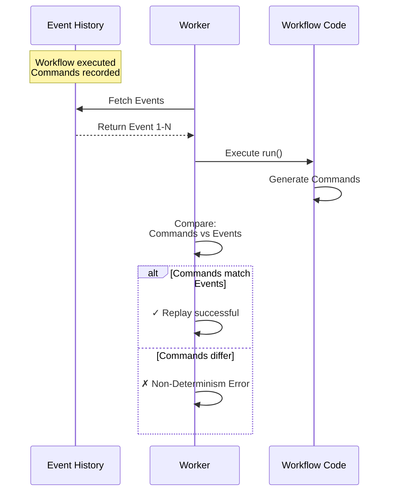
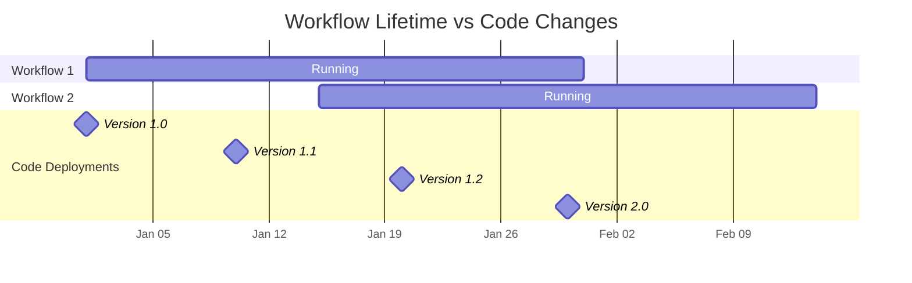
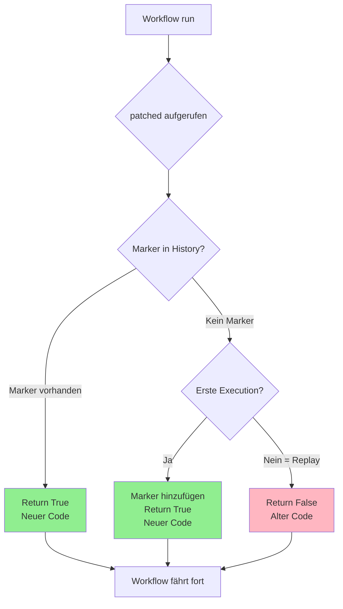
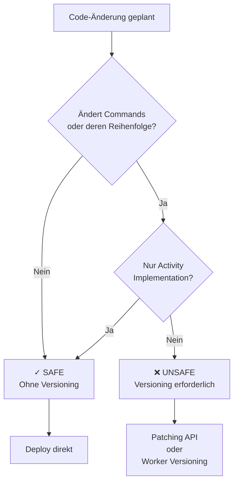
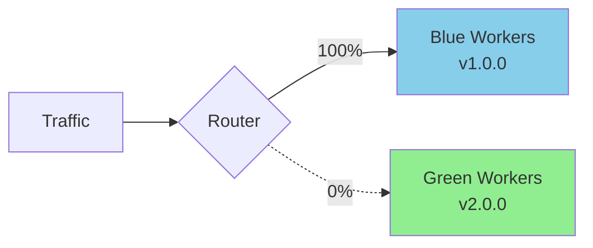
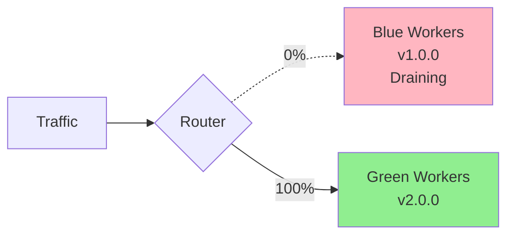
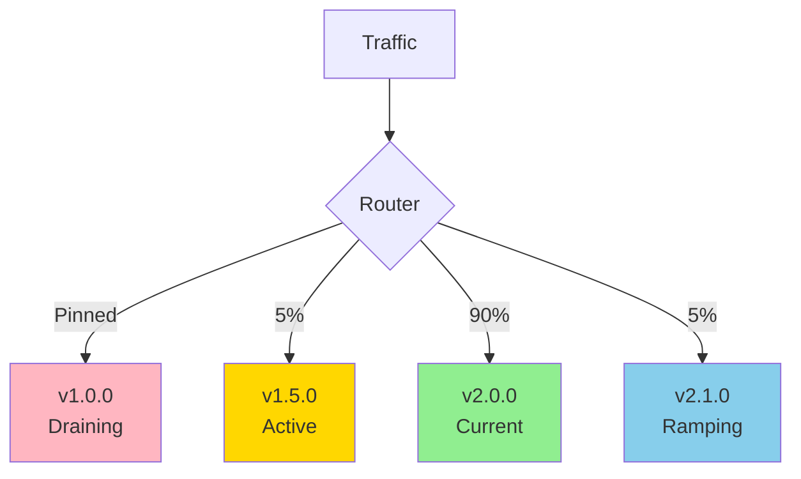
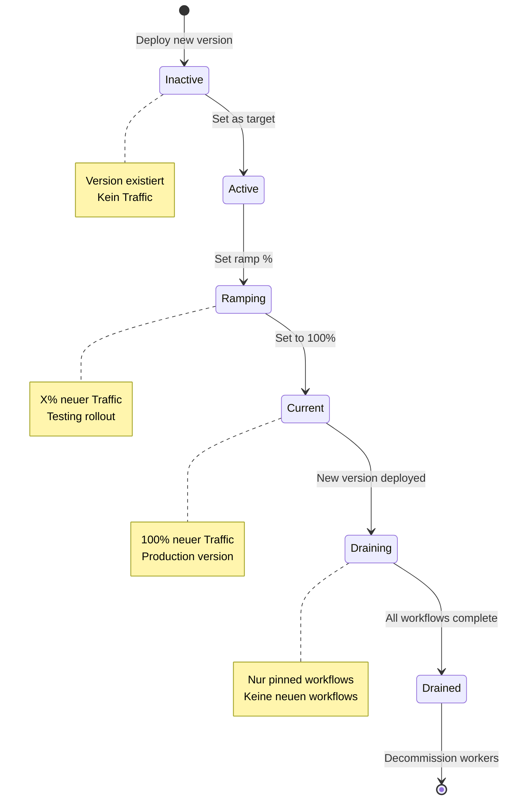

# Kapitel 8: Workflow Evolution und Versioning

## Einleitung

Eine der größten Herausforderungen in verteilten Systemen ist die Evolution von langlebigem Code. Während traditionelle Web-Services einfach neu deployed werden können, laufen Temporal Workflows oft über Tage, Wochen, Monate oder sogar Jahre. Was passiert, wenn Sie den Code ändern müssen, während tausende Workflows noch laufen?

Temporal löst dieses Problem durch ein ausgeklügeltes Versioning-System, das **Determinismus** erhält während gleichzeitig Code-Evolution ermöglicht wird. Ohne Versioning würden Code-Änderungen laufende Workflows brechen. Mit Versioning können Sie sicher deployen, Features hinzufügen und Bugs fixen – ohne existierende Executions zu gefährden.

### Das Grundproblem

**Scenario**: Sie haben 10,000 laufende Order-Workflows. Jeder läuft 30 Tage. Sie müssen einen zusätzlichen Fraud-Check hinzufügen.

**Ohne Versioning**:
```python
# Alter Code
@workflow.defn
class OrderWorkflow:
    @workflow.run
    async def run(self, order: Order) -> Result:
        payment = await workflow.execute_activity(process_payment, ...)
        return Result(payment=payment)

# Neuer Code - deployed auf laufende Workflows
@workflow.defn
class OrderWorkflow:
    @workflow.run
    async def run(self, order: Order) -> Result:
        payment = await workflow.execute_activity(process_payment, ...)
        # NEU: Fraud Check hinzugefügt
        fraud = await workflow.execute_activity(check_fraud, ...)  # ❌ BREAKS REPLAY!
        return Result(payment=payment)
```

**Problem**: Wenn ein alter Workflow replayedwird, erwartet das System die gleiche Befehlsfolge. Die neue Activity `check_fraud` existiert aber nicht in der History → **Non-Determinism Error**.

**Mit Versioning**:
```python
@workflow.defn
class OrderWorkflow:
    @workflow.run
    async def run(self, order: Order) -> Result:
        payment = await workflow.execute_activity(process_payment, ...)

        # Versioning: Neue Workflows nutzen neuen Code, alte den alten
        if workflow.patched("add-fraud-check"):
            fraud = await workflow.execute_activity(check_fraud, ...)  # ✅ SAFE!

        return Result(payment=payment)
```

Jetzt können beide Versionen parallel laufen!

### Lernziele

Nach diesem Kapitel können Sie:

- Verstehen warum Determinismus Versioning erforderlich macht
- Die Patching API verwenden (`workflow.patched()`)
- Worker Versioning mit Build IDs implementieren
- Sichere vs. unsichere Code-Änderungen identifizieren
- Replay Tests schreiben
- Migrations-Patterns für Breaking Changes anwenden
- Version Sprawl vermeiden
- Workflows sicher über Jahre hinweg evolutionieren

## 8.1 Versioning Fundamentals

### 8.1.1 Determinismus und Replay

**Was ist Determinismus?**

Ein Workflow ist **deterministisch**, wenn jede Execution die gleichen Commands in der gleichen Reihenfolge produziert bei gleichem Input. Diese Eigenschaft ermöglicht:

- Workflow Replay nach Worker Crashes
- Lange schlafende Workflows (Monate/Jahre)
- Zuverlässige Workflow-Relocation zwischen Workers
- State-Rekonstruktion aus Event History

**Wie Replay funktioniert:**



**Kritischer Punkt**: Das System führt nicht die Commands aus der History erneut aus, sondern **verwendet die aufgezeichneten Results** um State zu rekonstruieren. Wenn der neue Code eine andere Befehlsfolge produziert → Fehler.

**Beispiel: Non-Determinism Error**

```python
# Version 1 (deployed, 1000 workflows running)
@workflow.defn
class OrderWorkflow:
    @workflow.run
    async def run(self, order: Order) -> Result:
        # Command 1: ScheduleActivityTask (process_payment)
        payment = await workflow.execute_activity(process_payment, ...)
        # Command 2: CompleteWorkflowExecution
        return Result(payment=payment)

# Version 2 (deployed while v1 workflows still running)
@workflow.defn
class OrderWorkflow:
    @workflow.run
    async def run(self, order: Order) -> Result:
        # Command 1: ScheduleActivityTask (validate_order) ← NEU!
        await workflow.execute_activity(validate_order, ...)
        # Command 2: ScheduleActivityTask (process_payment)
        payment = await workflow.execute_activity(process_payment, ...)
        # Command 3: CompleteWorkflowExecution
        return Result(payment=payment)
```

**Was passiert beim Replay:**

```
Event History (v1):
  Event 1: WorkflowExecutionStarted
  Event 2: ActivityTaskScheduled (process_payment)
  Event 3: ActivityTaskCompleted
  Event 4: WorkflowExecutionCompleted

Replay mit v2 Code:
  ✗ Erwartet: ScheduleActivityTask (validate_order)
  ✗ Gefunden: ActivityTaskScheduled (process_payment)

  → NondeterminismError!
```

### 8.1.2 Warum Versioning komplex ist

**Langlebigkeit von Workflows:**



Workflow 1 durchlebt **4 Code-Versionen** während seiner Laufzeit!

**Herausforderungen:**

1. **Backwards Compatibility**: Neue Code-Version muss alte Workflows replyen können
2. **Version Sprawl**: Zu viele Versionen → Code-Komplexität
3. **Testing**: Replay-Tests für alle Versionen
4. **Cleanup**: Wann können alte Versionen entfernt werden?
5. **Documentation**: Welche Version macht was?

### 8.1.3 Drei Versioning-Ansätze

Temporal bietet drei Hauptstrategien:

**1. Patching API** (Code-Level Versioning)

```python
if workflow.patched("my-change"):
    # Neuer Code-Pfad
    await new_implementation()
else:
    # Alter Code-Pfad
    await old_implementation()
```

**Vorteile:**
- Granulare Kontrolle
- Beide Pfade im gleichen Code
- Funktioniert sofort

**Nachteile:**
- Code-Komplexität wächst
- Manuelle Verwaltung
- Version Sprawl bei vielen Changes

**2. Worker Versioning** (Infrastructure-Level)

```python
worker = Worker(
    client,
    task_queue="orders",
    workflows=[OrderWorkflow],
    deployment_config=WorkerDeploymentConfig(
        deployment_name="order-service",
        build_id="v2.0.0",  # Version identifier
    )
)
```

**Vorteile:**
- Saubere Code-Trennung
- Automatisches Routing
- Gradual Rollout möglich

**Nachteile:**
- Infrastruktur-Overhead (mehrere Worker-Pools)
- Noch in Public Preview
- Komplexere Deployments

**3. Workflow-Name Versioning** (Cutover)

```python
@workflow.defn(name="ProcessOrder_v2")
class ProcessOrderWorkflowV2:
    # Völlig neue Implementation
    pass

# Alter Workflow bleibt für Kompatibilität
@workflow.defn(name="ProcessOrder")
class ProcessOrderWorkflowV1:
    # Legacy code
    pass
```

**Vorteile:**
- Klare Trennung
- Einfach zu verstehen
- Keine Patching-Logik

**Nachteile:**
- Code-Duplizierung
- Kann laufende Workflows nicht versionieren
- Client-Code muss updaten

**Wann welchen Ansatz?**

| Scenario | Empfohlener Ansatz |
|----------|-------------------|
| Kleine Änderungen, wenige Versionen | Patching API |
| Häufige Updates, viele Versionen | Worker Versioning |
| Komplettes Redesign | Workflow-Name Versioning |
| < 10 laufende Workflows | Workflow-Name Versioning |
| Breaking Changes in Datenstruktur | Worker Versioning |

## 8.2 Patching API

Der Python SDK nutzt `workflow.patched()` für Code-Level Versioning.

### 8.2.1 Grundlagen

**API:**

```python
from temporalio import workflow

if workflow.patched(patch_id: str) -> bool:
    # Neuer Code-Pfad
    pass
else:
    # Alter Code-Pfad
    pass
```

**Verhalten:**

| Situation | Rückgabewert | Reason |
|-----------|-------------|--------|
| Erste Execution (neu) | `True` | Marker wird hinzugefügt, neuer Code läuft |
| Replay MIT Marker | `True` | Marker in History, neuer Code läuft |
| Replay OHNE Marker | `False` | Alter Workflow, alter Code läuft |

**Beispiel:**

```python
from temporalio import workflow
from datetime import timedelta

@workflow.defn
class OrderWorkflow:
    @workflow.run
    async def run(self, order: Order) -> Result:
        # Payment verarbeiten
        payment = await workflow.execute_activity(
            process_payment,
            args=[order],
            start_to_close_timeout=timedelta(minutes=5),
        )

        # Patch: Fraud Check hinzufügen
        if workflow.patched("add-fraud-check-v1"):
            # Neuer Code-Pfad (nach Deployment)
            workflow.logger.info("Running fraud check (new version)")
            fraud_result = await workflow.execute_activity(
                check_fraud,
                args=[order, payment],
                start_to_close_timeout=timedelta(minutes=2),
            )

            if not fraud_result.is_safe:
                raise FraudDetectedError(f"Fraud detected: {fraud_result.reason}")
        else:
            # Alter Code-Pfad (für Replay alter Workflows)
            workflow.logger.info("Skipping fraud check (old version)")

        return Result(payment=payment)
```

**Was passiert:**



### 8.2.2 Drei-Schritte-Prozess

**Schritt 1: Patch einführen**

```python
@workflow.defn
class OrderWorkflow:
    @workflow.run
    async def run(self, order: Order) -> Result:
        payment = await workflow.execute_activity(process_payment, ...)

        # STEP 1: Patch mit if/else
        if workflow.patched("add-fraud-check-v1"):
            fraud = await workflow.execute_activity(check_fraud, ...)
        # Else-Block leer = alter Code macht nichts

        return Result(payment=payment)
```

**Deployment**: Alle neuen Workflows nutzen Fraud Check, alte nicht.

**Schritt 2: Patch deprecaten**

Nach allen alten Workflows sind abgeschlossen:

```python
@workflow.defn
class OrderWorkflow:
    @workflow.run
    async def run(self, order: Order) -> Result:
        payment = await workflow.execute_activity(process_payment, ...)

        # STEP 2: deprecate_patch() + nur neuer Code
        workflow.deprecate_patch("add-fraud-check-v1")
        fraud = await workflow.execute_activity(check_fraud, ...)

        return Result(payment=payment)
```

**Zweck von `deprecate_patch()`**:
- Fügt Marker hinzu OHNE Replay zu brechen
- Erlaubt Entfernung des if/else
- Brücke zwischen Patching und Clean Code

**Schritt 3: Patch entfernen**

Nach Retention Period ist abgelaufen:

```python
@workflow.defn
class OrderWorkflow:
    @workflow.run
    async def run(self, order: Order) -> Result:
        payment = await workflow.execute_activity(process_payment, ...)

        # STEP 3: Clean code - kein Versioning mehr
        fraud = await workflow.execute_activity(check_fraud, ...)

        return Result(payment=payment)
```

**Timeline:**

```
Tag 0:   Deploy Patch (Step 1)
         - Neue Workflows: Fraud Check
         - Alte Workflows: Kein Fraud Check

Tag 30:  Alle alten Workflows abgeschlossen
         - Verify: Keine laufenden Workflows ohne Patch

Tag 31:  Deploy deprecate_patch (Step 2)
         - Code hat nur noch neuen Pfad
         - Kompatibel mit alter History

Tag 61:  Retention Period abgelaufen
         - Alte Histories gelöscht

Tag 68:  Remove Patch (Step 3 + Safety Margin)
         - Clean Code ohne Versioning Calls
```

### 8.2.3 Mehrere Patches / Nested Patches

**Pattern für multiple Versionen:**

```python
@workflow.defn
class OrderWorkflow:
    @workflow.run
    async def run(self, order: Order) -> Result:
        payment = await workflow.execute_activity(process_payment, ...)

        # Version 3 (neueste)
        if workflow.patched("add-notifications-v3"):
            await self._send_notifications(order, payment)
            fraud = await workflow.execute_activity(check_fraud_v2, ...)

        # Version 2
        elif workflow.patched("add-fraud-check-v2"):
            fraud = await workflow.execute_activity(check_fraud_v2, ...)

        # Version 1 (älteste)
        else:
            # Original code - kein Fraud Check
            pass

        return Result(payment=payment)
```

**Wichtige Regel**: **Neuesten Code ZUERST** (top of if-block).

Warum? Frische Executions sollen immer die neueste Version nutzen. Wenn ältere Versionen zuerst geprüft werden, könnte eine neue Execution fälschlicherweise einen älteren Pfad nehmen.

**Beispiel - FALSCH:**

```python
# ✗ FALSCH: Alte Version zuerst
if workflow.patched("v1"):
    # Version 1 code
elif workflow.patched("v2"):
    # Version 2 code - neue Executions könnten v1 nehmen!
```

**Beispiel - RICHTIG:**

```python
# ✓ RICHTIG: Neue Version zuerst
if workflow.patched("v2"):
    # Version 2 code - neue Executions nehmen diesen
elif workflow.patched("v1"):
    # Version 1 code
else:
    # Version 0 (original)
```

### 8.2.4 Best Practices für Patch IDs

**Gute Naming Conventions:**

```python
# ✓ GUT: Beschreibend + Versionnummer
workflow.patched("add-fraud-check-v1")
workflow.patched("change-payment-params-v2")
workflow.patched("remove-legacy-validation-v1")

# ✓ GUT: Datum für Tracking
workflow.patched("refactor-2025-01-15")

# ✓ GUT: Ticket-Referenz
workflow.patched("JIRA-1234-add-validation")

# ✗ SCHLECHT: Nicht beschreibend
workflow.patched("patch1")
workflow.patched("fix")
workflow.patched("update")

# ✗ SCHLECHT: Keine Version Info
workflow.patched("add-fraud-check")  # Was wenn wir v2 brauchen?
```

**Dokumentation im Code:**

```python
@workflow.defn
class OrderWorkflow:
    """
    Order Processing Workflow.

    Versioning History:
    - v1 (2024-01-01): Initial implementation
    - v2 (2024-06-15): Added fraud check
      Patch: "add-fraud-check-v1"
      Deployed: 2024-06-15
      Deprecated: 2024-08-01
      Removed: 2024-10-01
    - v3 (2024-09-01): Multi-currency support
      Patch: "multi-currency-v1"
      Deployed: 2024-09-01
      Status: ACTIVE
    """

    @workflow.run
    async def run(self, order: Order) -> Result:
        # Patch: add-fraud-check-v1
        # Added: 2024-06-15
        # Status: REMOVED (2024-10-01)
        # All workflows now have fraud check
        fraud = await workflow.execute_activity(check_fraud, ...)

        # Patch: multi-currency-v1
        # Added: 2024-09-01
        # Status: ACTIVE
        if workflow.patched("multi-currency-v1"):
            currency = order.currency
        else:
            currency = "USD"  # Default für alte Workflows

        # ... rest of workflow
```

## 8.3 Sichere vs. Unsichere Code-Änderungen

### 8.3.1 Was kann OHNE Versioning geändert werden?

**Kategorie 1: Activity Implementation**

```python
# ✓ SICHER: Activity-Logik ändern
@activity.defn
async def process_payment(payment: Payment) -> Receipt:
    # ALLE Änderungen hier sind safe:
    # - Database Schema ändern
    # - API Endpoints ändern
    # - Error Handling anpassen
    # - Business Logic updaten
    # - Performance optimieren
    pass
```

**Warum sicher?** Activities werden außerhalb des Replay-Mechanismus ausgeführt. Nur das **Result** wird in der History gespeichert, nicht die Logic.

**Kategorie 2: Workflow Logging**

```python
@workflow.defn
class MyWorkflow:
    @workflow.run
    async def run(self) -> None:
        workflow.logger.info("Starting")  # ✓ SAFE to add/remove/change
        result = await workflow.execute_activity(...)
        workflow.logger.debug(f"Result: {result}")  # ✓ SAFE
```

**Warum sicher?** Logging erzeugt keine Events in der History.

**Kategorie 3: Query Handler** (read-only)

```python
@workflow.defn
class MyWorkflow:
    @workflow.query
    def get_status(self) -> str:  # ✓ SAFE to add
        return self._status

    @workflow.query
    def get_progress(self) -> dict:  # ✓ SAFE to modify
        return {"processed": self._processed, "total": self._total}
```

**Kategorie 4: Signal Handler hinzufügen**

```python
@workflow.defn
class MyWorkflow:
    @workflow.signal
    async def new_signal(self, data: str) -> None:  # ✓ SAFE wenn noch nie gesendet
        self._data = data
```

**Wichtig**: Nur safe wenn das Signal noch nie gesendet wurde!

**Kategorie 5: Dataclass Fields mit Defaults**

```python
@dataclass
class WorkflowInput:
    name: str
    age: int
    email: str = ""      # ✓ SAFE to add with default
    phone: str = ""      # ✓ SAFE to add with default
```

**Forward Compatible**: Alte Workflows können neue Dataclass-Version deserializen.

### 8.3.2 Was BRICHT Determinismus?

**Kategorie 1: Activity Calls hinzufügen/entfernen**

```python
# VORHER
@workflow.defn
class MyWorkflow:
    @workflow.run
    async def run(self) -> None:
        result1 = await workflow.execute_activity(activity1, ...)
        result2 = await workflow.execute_activity(activity2, ...)

# NACHHER - ❌ BREAKS DETERMINISM
@workflow.defn
class MyWorkflow:
    @workflow.run
    async def run(self) -> None:
        result1 = await workflow.execute_activity(activity1, ...)
        # activity2 entfernt - BREAKS REPLAY
        result3 = await workflow.execute_activity(activity3, ...)  # Neu - BREAKS REPLAY
```

**Warum broken?** Event History erwartet `ScheduleActivityTask` für activity2, bekommt aber activity3.

**Kategorie 2: Activity Reihenfolge ändern**

```python
# VORHER
result1 = await workflow.execute_activity(activity1, ...)
result2 = await workflow.execute_activity(activity2, ...)

# NACHHER - ❌ BREAKS DETERMINISM
result2 = await workflow.execute_activity(activity2, ...)  # Reihenfolge getauscht
result1 = await workflow.execute_activity(activity1, ...)
```

**Kategorie 3: Activity Parameter ändern**

```python
# VORHER
await workflow.execute_activity(
    process_order,
    args=[order_id, customer_id],  # 2 Parameter
    ...
)

# NACHHER - ❌ BREAKS DETERMINISM
await workflow.execute_activity(
    process_order,
    args=[order_id, customer_id, payment_method],  # 3 Parameter
    ...
)
```

**Kategorie 4: Conditional Logic ändern**

```python
# VORHER
if amount > 100:
    await workflow.execute_activity(large_order, ...)
else:
    await workflow.execute_activity(small_order, ...)

# NACHHER - ❌ BREAKS DETERMINISM
if amount > 500:  # Threshold geändert
    await workflow.execute_activity(large_order, ...)
```

**Bei Replay**: Ein Workflow mit amount=300 nahm vorher den `large_order` Pfad, jetzt nimmt er `small_order` → Non-Determinism.

**Kategorie 5: Sleep/Timer ändern**

```python
# VORHER
await asyncio.sleep(300)  # 5 Minuten

# NACHHER - ❌ BREAKS DETERMINISM
await asyncio.sleep(600)  # 10 Minuten - anderer Timer
# Oder Timer entfernen
```

**Kategorie 6: Non-Deterministic Functions**

```python
# ❌ FALSCH - Non-Deterministic
import random
import datetime
import uuid

@workflow.defn
class BadWorkflow:
    @workflow.run
    async def run(self) -> None:
        random_val = random.randint(1, 100)  # ❌ WRONG
        current_time = datetime.datetime.now()  # ❌ WRONG
        unique_id = str(uuid.uuid4())  # ❌ WRONG
```

**Beim Replay**: Unterschiedliche Werte → unterschiedliche Commands → Non-Determinism.

### 8.3.3 Deterministische Alternativen

**Python SDK Deterministic APIs:**

```python
from temporalio import workflow

@workflow.defn
class DeterministicWorkflow:
    @workflow.run
    async def run(self) -> None:
        # ✓ RICHTIG - Deterministic time
        current_time = workflow.now()
        timestamp_ns = workflow.time_ns()

        # ✓ RICHTIG - Deterministic random
        rng = workflow.random()
        random_number = rng.randint(1, 100)
        random_float = rng.random()

        # ✓ RICHTIG - UUID via Activity
        unique_id = await workflow.execute_activity(
            generate_uuid,
            schedule_to_close_timeout=timedelta(seconds=5),
        )

        # ✓ RICHTIG - Deterministic logging
        workflow.logger.info(f"Processing at {current_time}")

@activity.defn
async def generate_uuid() -> str:
    """Activities können non-deterministisch sein"""
    return str(uuid.uuid4())
```

**Warum funktioniert das?**

- `workflow.now()`: Gibt Workflow Start Time zurück (konstant bei Replay)
- `workflow.random()`: Seeded RNG basierend auf History
- Activities: Results aus History, nicht neu ausgeführt

**Decision Matrix:**



### 8.3.4 Safe Change Pattern mit Versioning

**Beispiel: Activity hinzufügen**

```python
# Schritt 1: Original Code
@workflow.defn
class OrderWorkflow:
    @workflow.run
    async def run(self, order: Order) -> Result:
        payment = await workflow.execute_activity(process_payment, ...)
        return Result(payment=payment)

# Schritt 2: Mit Patching neue Activity hinzufügen
@workflow.defn
class OrderWorkflow:
    @workflow.run
    async def run(self, order: Order) -> Result:
        payment = await workflow.execute_activity(process_payment, ...)

        # Patch: Neue Activity
        if workflow.patched("add-fraud-check-v1"):
            fraud = await workflow.execute_activity(check_fraud, ...)
            if not fraud.is_safe:
                raise FraudDetectedError()

        return Result(payment=payment)

# Schritt 3: Später deprecate
@workflow.defn
class OrderWorkflow:
    @workflow.run
    async def run(self, order: Order) -> Result:
        payment = await workflow.execute_activity(process_payment, ...)

        workflow.deprecate_patch("add-fraud-check-v1")
        fraud = await workflow.execute_activity(check_fraud, ...)
        if not fraud.is_safe:
            raise FraudDetectedError()

        return Result(payment=payment)

# Schritt 4: Schließlich clean code
@workflow.defn
class OrderWorkflow:
    @workflow.run
    async def run(self, order: Order) -> Result:
        payment = await workflow.execute_activity(process_payment, ...)

        # Clean code - Fraud Check ist Standard
        fraud = await workflow.execute_activity(check_fraud, ...)
        if not fraud.is_safe:
            raise FraudDetectedError()

        return Result(payment=payment)
```

## 8.4 Worker Versioning (Build IDs)

Worker Versioning ist der moderne Ansatz für Workflow-Versionierung (Public Preview, GA erwartet Q4 2025).

### 8.4.1 Konzepte

**Build ID**: Eindeutiger Identifier für eine Worker-Version

```python
from temporalio.worker import Worker, WorkerDeploymentConfig

worker = Worker(
    client,
    task_queue="orders",
    workflows=[OrderWorkflow],
    activities=[process_payment, check_fraud],
    deployment_config=WorkerDeploymentConfig(
        deployment_name="order-service",
        build_id="v1.5.2",  # Semantic versioning
    )
)
```

**Workflow Pinning**: Workflow bleibt auf ursprünglicher Worker-Version

**Vorteile:**
- Eliminiert Code-Level Patching
- Workflows können Breaking Changes enthalten
- Einfacheres Code-Management

**Nachteil:**
- Muss mehrere Worker-Pools laufen lassen
- Alte Versionen blockieren bis alle Workflows complete

### 8.4.2 Deployment Strategies

**Blue-Green Deployment:**



**Nach Cutover:**



**Eigenschaften:**
- Zwei simultane Versionen
- Klarer Cutover-Point
- Instant Rollback möglich
- Einfach zu verstehen

**Rainbow Deployment:**



**Eigenschaften:**
- Viele simultane Versionen
- Graduelle Migration
- Workflow Pinning optimal
- Komplexer aber flexibler

### 8.4.3 Gradual Rollout

**Ramp Percentages:**

```bash
# Start: 1% Traffic zu neuer Version
temporal task-queue versioning insert-assignment-rule \
  --task-queue orders \
  --build-id v2.0.0 \
  --percentage 1

# Monitoring...
# Error rate OK? → Increase

# 5% Traffic
temporal task-queue versioning insert-assignment-rule \
  --task-queue orders \
  --build-id v2.0.0 \
  --percentage 5

# 25% Traffic
temporal task-queue versioning insert-assignment-rule \
  --task-queue orders \
  --build-id v2.0.0 \
  --percentage 25

# 100% Traffic
temporal task-queue versioning insert-assignment-rule \
  --task-queue orders \
  --build-id v2.0.0 \
  --percentage 100
```

**Ablauf:**

```
1% → Monitor 1 day → 5% → Monitor 1 day → 25% → Monitor → 100%
```

**Was wird monitored:**
- Error Rate
- Latency
- Completion Rate
- Activity Failures

### 8.4.4 Version Lifecycle States



### 8.4.5 Python Worker Configuration

```python
from temporalio.common import WorkerDeploymentVersion
from temporalio.worker import Worker, WorkerDeploymentConfig

async def create_worker(build_id: str):
    """Create worker with versioning"""
    client = await Client.connect("localhost:7233")

    worker = Worker(
        client,
        task_queue="orders",
        workflows=[OrderWorkflowV2],  # Neue Version
        activities=[process_payment_v2, check_fraud_v2],
        deployment_config=WorkerDeploymentConfig(
            deployment_name="order-service",
            build_id=build_id,
        ),
        # Optional: Max concurrent workflows
        max_concurrent_workflow_tasks=100,
    )

    return worker

# Deploy v1 workers
worker_v1 = await create_worker("v1.5.2")

# Deploy v2 workers (parallel)
worker_v2 = await create_worker("v2.0.0")

# Beide Workers laufen parallel
await asyncio.gather(
    worker_v1.run(),
    worker_v2.run(),
)
```

## 8.5 Testing Versioned Workflows

### 8.5.1 Replay Testing

**Zweck**: Verifizieren dass neuer Code kompatibel mit existierenden Workflow Histories ist.

**Basic Replay Test:**

```python
import json
import pytest
from temporalio.client import WorkflowHistory
from temporalio.worker import Replayer

from workflows import OrderWorkflow

@pytest.mark.asyncio
async def test_replay_workflow_history():
    """Test dass neuer Code alte Histories replyen kann"""

    # History von Production laden
    with open("tests/histories/order_workflow_history.json") as f:
        history_json = json.load(f)

    # Replayer mit NEUEM Workflow-Code
    replayer = Replayer(workflows=[OrderWorkflow])

    # Replay - wirft Exception bei Non-Determinism
    await replayer.replay_workflow(
        WorkflowHistory.from_json("test-workflow-id", history_json)
    )

    # Test passed = Neuer Code ist kompatibel!
```

**History von Production fetchen:**

```bash
# CLI: History als JSON exportieren
temporal workflow show \
  --workflow-id order-12345 \
  --namespace production \
  --output json > workflow_history.json
```

**Programmatisch:**

```python
from temporalio.client import Client

async def fetch_workflow_history(workflow_id: str) -> dict:
    """Fetch history für Replay Testing"""
    client = await Client.connect("localhost:7233")

    handle = client.get_workflow_handle(workflow_id)
    history = await handle.fetch_history()

    return history.to_json()
```

### 8.5.2 CI/CD Integration

**GitHub Actions Workflow:**

```yaml
# .github/workflows/replay-test.yml
name: Temporal Replay Tests

on:
  pull_request:
    paths:
      - 'workflows/**'
      - 'activities/**'

jobs:
  replay-test:
    runs-on: ubuntu-latest

    steps:
      - uses: actions/checkout@v3

      - name: Set up Python
        uses: actions/setup-python@v4
        with:
          python-version: '3.11'

      - name: Install dependencies
        run: |
          pip install -r requirements.txt

      - name: Download production histories
        env:
          TEMPORAL_ADDRESS: ${{ secrets.TEMPORAL_PROD_ADDRESS }}
          TEMPORAL_NAMESPACE: production
        run: |
          # Download recent workflow histories
          python scripts/download_histories.py \
            --workflow-type OrderWorkflow \
            --limit 50 \
            --output tests/histories/

      - name: Run replay tests
        run: |
          pytest tests/test_replay.py -v

      - name: Fail on non-determinism
        run: |
          if [ $? -ne 0 ]; then
            echo "❌ Non-determinism detected! Do not merge."
            exit 1
          fi
          echo "✅ All replay tests passed"
```

**Replay Test Script:**

```python
# tests/test_replay.py
import json
import pytest
from pathlib import Path
from temporalio.worker import Replayer
from temporalio.client import WorkflowHistory

from workflows import OrderWorkflow, PaymentWorkflow

ALL_WORKFLOWS = [OrderWorkflow, PaymentWorkflow]

@pytest.mark.asyncio
async def test_replay_all_production_histories():
    """Test neuen Code gegen Production Histories"""

    histories_dir = Path("tests/histories")

    if not histories_dir.exists():
        pytest.skip("No histories to test")

    replayer = Replayer(workflows=ALL_WORKFLOWS)

    failed_replays = []

    for history_file in histories_dir.glob("*.json"):
        with open(history_file) as f:
            history_data = json.load(f)

        try:
            await replayer.replay_workflow(
                WorkflowHistory.from_json(
                    history_file.stem,
                    history_data
                )
            )
            print(f"✓ Successfully replayed {history_file.name}")

        except Exception as e:
            failed_replays.append({
                "file": history_file.name,
                "error": str(e)
            })
            print(f"✗ Failed to replay {history_file.name}: {e}")

    # Fail test wenn irgendein Replay fehlschlug
    if failed_replays:
        error_msg = "Non-determinism detected in:\n"
        for failure in failed_replays:
            error_msg += f"  - {failure['file']}: {failure['error']}\n"
        pytest.fail(error_msg)
```

**Script zum History Download:**

```python
# scripts/download_histories.py
import asyncio
import json
import argparse
from pathlib import Path
from temporalio.client import Client

async def download_histories(
    workflow_type: str,
    limit: int,
    output_dir: Path,
):
    """Download recent workflow histories für Testing"""

    client = await Client.connect("localhost:7233")

    # Query für laufende Workflows
    query = f'WorkflowType="{workflow_type}" AND ExecutionStatus="Running"'

    workflows = client.list_workflows(query=query)

    count = 0
    async for workflow in workflows:
        if count >= limit:
            break

        # Fetch history
        handle = client.get_workflow_handle(workflow.id)
        history = await handle.fetch_history()

        # Save to file
        output_file = output_dir / f"{workflow.id}.json"
        with open(output_file, "w") as f:
            json.dump(history.to_json(), f, indent=2)

        print(f"Downloaded: {workflow.id}")
        count += 1

    print(f"\nTotal downloaded: {count} histories")

if __name__ == "__main__":
    parser = argparse.ArgumentParser()
    parser.add_argument("--workflow-type", required=True)
    parser.add_argument("--limit", type=int, default=50)
    parser.add_argument("--output", required=True)

    args = parser.parse_args()

    output_dir = Path(args.output)
    output_dir.mkdir(parents=True, exist_ok=True)

    asyncio.run(download_histories(
        args.workflow_type,
        args.limit,
        output_dir,
    ))
```

### 8.5.3 Testing Version Transitions

```python
@pytest.mark.asyncio
async def test_patched_workflow_new_execution():
    """Test dass neue Workflows neuen Code-Pfad nutzen"""

    async with await WorkflowEnvironment.start_time_skipping() as env:
        async with Worker(
            env.client,
            task_queue="test-queue",
            workflows=[OrderWorkflow],
            activities=[process_payment, check_fraud],
        ):
            # Neue Workflow-Execution
            result = await env.client.execute_workflow(
                OrderWorkflow.run,
                order,
                id="test-new-workflow",
                task_queue="test-queue",
            )

            # Verify: Fraud check wurde ausgeführt
            assert result.fraud_checked is True

@pytest.mark.asyncio
async def test_patched_workflow_replay():
    """Test dass alte Workflows alten Code-Pfad nutzen"""

    # History VOR Patch laden
    with open("tests/pre_patch_history.json") as f:
        old_history = json.load(f)

    # Replay sollte erfolgreich sein
    replayer = Replayer(workflows=[OrderWorkflow])
    await replayer.replay_workflow(
        WorkflowHistory.from_json("old-workflow", old_history)
    )

    # Success = Alter Pfad wurde korrekt gefolgt
```

## 8.6 Migration Patterns

### 8.6.1 Multi-Step Backward-Compatible Migration

**Scenario**: Activity Parameter ändern

**Step 1: Optional Fields**

```python
from dataclasses import dataclass
from typing import Optional

# Alte Struktur
@dataclass
class PaymentParams:
    order_id: str
    amount: float

# Step 1: Neue Fields optional hinzufügen
@dataclass
class PaymentParams:
    order_id: str
    amount: float
    payment_method: Optional[str] = None  # NEU, optional
    currency: Optional[str] = "USD"        # NEU, mit Default
```

**Step 2: Activity handhabt beide**

```python
@activity.defn
async def process_payment(params: PaymentParams) -> Payment:
    """Handle alte und neue Parameter"""

    # Defaults für alte Calls
    payment_method = params.payment_method or "credit_card"
    currency = params.currency or "USD"

    # Process mit neuer Logic
    result = await payment_processor.process(
        order_id=params.order_id,
        amount=params.amount,
        method=payment_method,
        currency=currency,
    )

    return result
```

**Step 3: Workflow nutzt neue Parameters (mit Patching)**

```python
@workflow.defn
class OrderWorkflow:
    @workflow.run
    async def run(self, order: Order) -> Result:
        if workflow.patched("payment-params-v2"):
            # Neuer Code - nutzt neue Parameters
            payment = await workflow.execute_activity(
                process_payment,
                args=[PaymentParams(
                    order_id=order.id,
                    amount=order.total,
                    payment_method=order.payment_method,
                    currency=order.currency,
                )],
                schedule_to_close_timeout=timedelta(minutes=5),
            )
        else:
            # Alter Code - nutzt alte Parameters
            payment = await workflow.execute_activity(
                process_payment,
                args=[PaymentParams(
                    order_id=order.id,
                    amount=order.total,
                )],
                schedule_to_close_timeout=timedelta(minutes=5),
            )

        return Result(payment=payment)
```

**Step 4: Nach Migration Fields required machen**

```python
# Nach allen alten Workflows complete
@dataclass
class PaymentParams:
    order_id: str
    amount: float
    payment_method: str  # Jetzt required
    currency: str = "USD"  # Required mit Default
```

### 8.6.2 Continue-As-New mit Versioning

**Pattern**: Long-running Entity Workflows die periodisch Version Updates bekommen.

```python
@workflow.defn
class EntityWorkflow:
    """
    Entity Workflow läuft unbegrenzt mit Continue-As-New.
    Updates automatisch auf neue Versionen.
    """

    def __init__(self) -> None:
        self._state: dict = {}
        self._iteration = 0

    @workflow.run
    async def run(self, initial_state: dict) -> None:
        self._state = initial_state

        while True:
            # Process iteration
            await self._process_iteration()

            self._iteration += 1

            # Continue-As-New alle 100 Iterationen
            if (
                self._iteration >= 100
                or workflow.info().is_continue_as_new_suggested()
            ):
                workflow.logger.info(
                    f"Continue-As-New after {self._iteration} iterations"
                )

                # Continue-As-New picked automatisch neue Version auf!
                workflow.continue_as_new(self._state)

            await asyncio.sleep(60)

    async def _process_iteration(self):
        """Versioned iteration logic"""

        # Version 2: Validation hinzugefügt
        if workflow.patched("add-validation-v2"):
            await self._validate_state()

        # Core logic
        await workflow.execute_activity(
            process_entity_state,
            args=[self._state],
            schedule_to_close_timeout=timedelta(minutes=5),
        )
```

**Vorteile:**
- Natural version upgrade points
- History bleibt bounded
- Keine Manual Migration nötig

## 8.7 Zusammenfassung

**Kernkonzepte:**

1. **Determinismus**: Temporal's Replay-Mechanismus erfordert dass Workflows deterministisch sind
2. **Versioning erforderlich**: Jede Code-Änderung die Commands ändert braucht Versioning
3. **Drei Ansätze**: Patching API, Worker Versioning, Workflow-Name Versioning
4. **Safe Changes**: Activity Implementation, Logging, Queries können ohne Versioning geändert werden
5. **Unsafe Changes**: Activity Calls hinzufügen/entfernen, Reihenfolge ändern, Parameter ändern

**Patching API Workflow:**

```
1. workflow.patched("id") → if/else blocks
2. workflow.deprecate_patch("id") → nur neuer Code
3. Remove patch call → clean code
```

**Best Practices:**

- ✅ Replay Tests in CI/CD
- ✅ Production Histories regelmäßig testen
- ✅ Max 3 active Patches pro Workflow
- ✅ Dokumentation für jedes Patch
- ✅ Cleanup Timeline planen
- ✅ Monitoring für Version Adoption

**Häufige Fehler:**

- ❌ Versioning vergessen
- ❌ `random.random()` statt `workflow.random()`
- ❌ Kein Replay Testing
- ❌ Version Sprawl (zu viele Patches)
- ❌ Alte Versionen nicht entfernen

Im nächsten Kapitel (Kapitel 9) werden wir **Fortgeschrittene Resilienz-Patterns** behandeln - komplexe Patterns für Production-Ready Systeme.

---

**[⬆ Zurück zum Inhaltsverzeichnis](README.md)**

**Nächstes Kapitel**: [Kapitel 9: Workflow-Evolution und Versionierung](part-03-chapter-09.md)

**Code-Beispiele für dieses Kapitel**: [`examples/part-03/chapter-08/`](../examples/part-03/chapter-08/)
