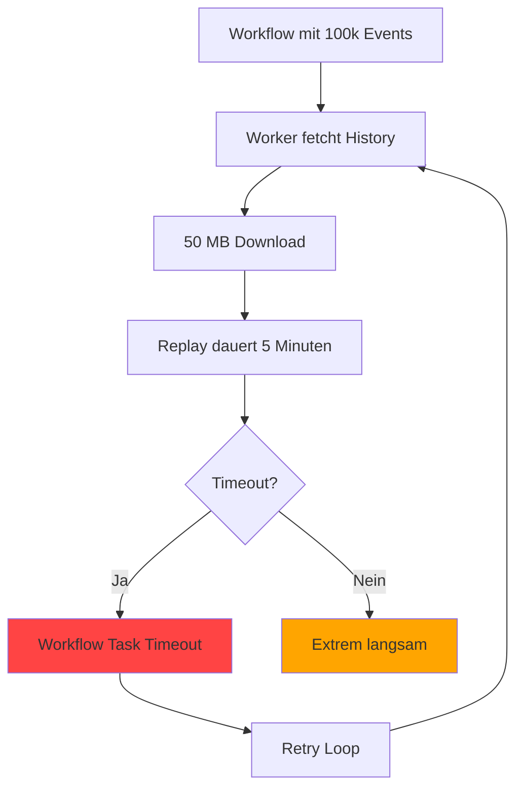
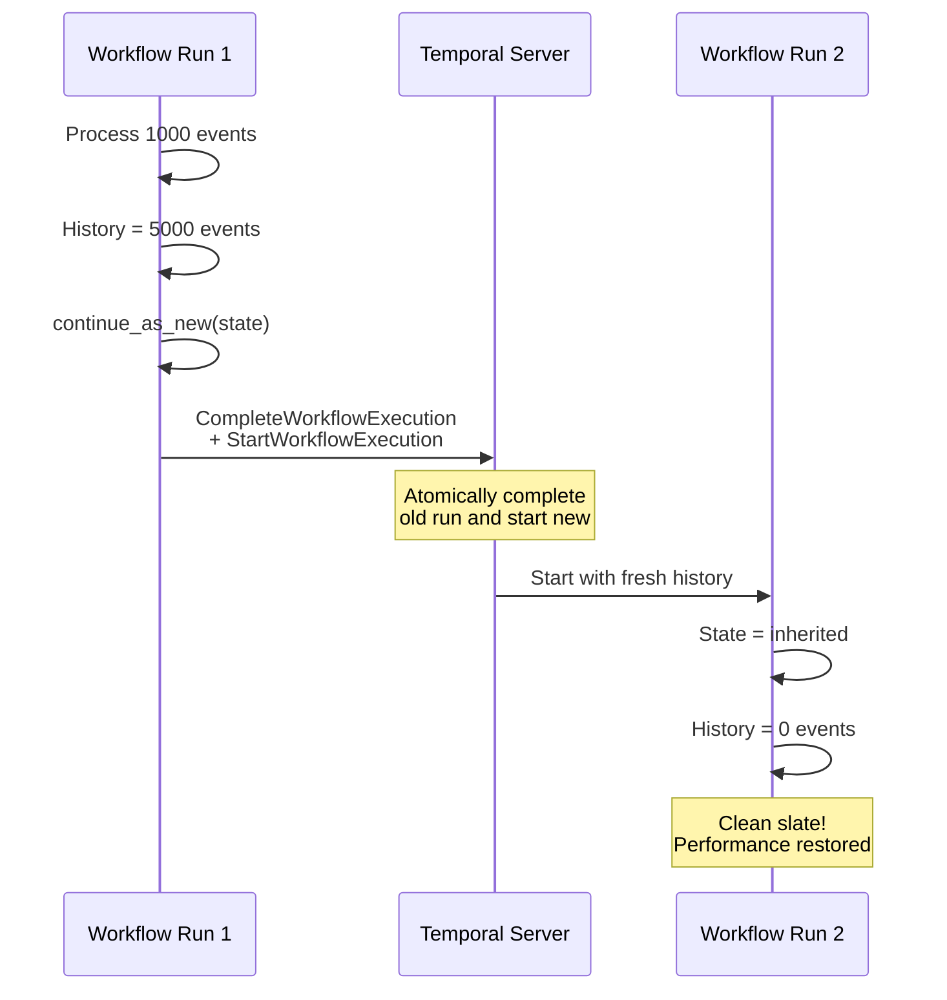
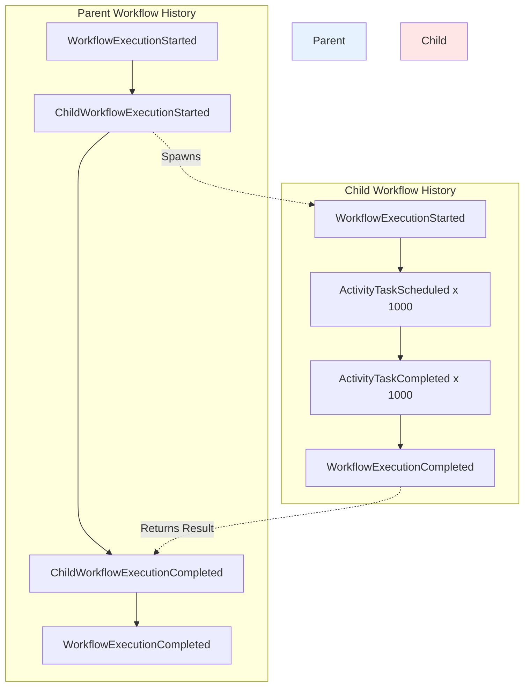

# Kapitel 9: Fortgeschrittene Resilienz-Patterns

## Einleitung

In den vorherigen Kapiteln haben Sie die Grundlagen von Error Handling, Retry Policies und Workflow Evolution kennengelernt. Diese Konzepte bilden das Fundament für resiliente Temporal-Anwendungen. Doch in Production-Systemen stoßen Sie auf komplexere Herausforderungen: Workflows die Monate laufen, Hunderttausende Events akkumulieren, Millionen parallele Executions koordinieren oder mit externen Rate Limits umgehen müssen.

Dieses Kapitel behandelt fortgeschrittene Patterns, die Temporal von einer robusten Orchestration-Platform zu einem hochskalierbaren, produktionsreifen System machen.

### Wann brauchen Sie Advanced Patterns?

**Continue-As-New**: Ihr Workflow läuft 6 Monate und hat 500,000 Events in der History
**Child Workflows**: Sie müssen 10,000 Sub-Tasks parallel orchestrieren
**Parallel Execution**: Batch-Verarbeitung von 100,000 Orders pro Stunde
**Rate Limiting**: Externe API erlaubt nur 100 Requests/Minute
**Graceful Degradation**: Service-Ausfälle dürfen Business nicht stoppen
**State Management**: Workflow-State ist 5 MB groß
**Advanced Recovery**: Manuelle Intervention bei kritischen Fehlern erforderlich

### Lernziele

Nach diesem Kapitel können Sie:

- Continue-As-New korrekt einsetzen um unbegrenzt lange Workflows zu ermöglichen
- Child Workflows für Skalierung und Isolation nutzen
- Parallele Activity Execution effizient orchestrieren
- Rate Limiting auf Worker- und Activity-Level implementieren
- Graceful Degradation mit Fallback-Mechanismen bauen
- Large State und Payloads in Workflows handhaben
- Human-in-the-Loop Patterns für manuelle Approvals implementieren
- Production-Ready Monitoring und Observability aufsetzen

## 9.1 Continue-As-New Pattern

### 9.1.1 Das Event History Problem

Jede Workflow-Execution speichert ihre komplette Event History: jede Activity, jeder Timer, jedes Signal, jede State-Transition. Diese History wächst mit jeder Operation.

**Problem**: History hat praktische Limits:

```
Workflow läuft 365 Tage
├─ 1 Activity pro Stunde
├─ 1 Signal alle 10 Minuten
├─ State Updates jede Minute
└─ Total Events: ~500,000

Event History Size: ~50 MB
Performance Impact: Replay dauert Minuten!
```

**Temporal Limits:**
- **Empfohlenes Maximum**: 50,000 Events
- **Hard Limit**: Konfigurierbar (Default 50,000-200,000)
- **Performance Degradation**: Ab 10,000 Events merklich

**Was passiert bei zu großer History:**



### 9.1.2 Continue-As-New Lösung

**Konzept**: "Reboot" des Workflows mit neuem State, History wird zurückgesetzt.

```python
from temporalio import workflow
import asyncio

@workflow.defn
class LongRunningEntityWorkflow:
    """
    Entity Workflow läuft unbegrenzt mit Continue-As-New.
    Beispiel: IoT Device Management, User Session, Subscription
    """

    def __init__(self) -> None:
        self._events_processed = 0
        self._state = {}
        self._iteration = 0

    @workflow.run
    async def run(self, entity_id: str, initial_state: dict) -> None:
        """Main workflow - läuft bis Continue-As-New"""

        self._state = initial_state
        workflow.logger.info(
            f"Entity workflow started (iteration {self._iteration})",
            extra={"entity_id": entity_id}
        )

        while True:
            # Warte auf Signals oder Timer
            await workflow.wait_condition(
                lambda: len(self._pending_events) > 0,
                timeout=timedelta(hours=1)
            )

            # Process events
            for event in self._pending_events:
                await self._process_event(event)
                self._events_processed += 1

            self._pending_events.clear()

            # Check für Continue-As-New
            if self._should_continue_as_new():
                workflow.logger.info(
                    f"Continuing as new (processed {self._events_processed} events)",
                    extra={"iteration": self._iteration}
                )

                # Continue-As-New mit updated State
                workflow.continue_as_new(
                    args=[entity_id, self._state]
                )

    def _should_continue_as_new(self) -> bool:
        """Decision logic für Continue-As-New"""

        # Option 1: Nach fixer Anzahl Events
        if self._events_processed >= 1000:
            return True

        # Option 2: Temporal's Suggestion (basierend auf History Size)
        if workflow.info().is_continue_as_new_suggested():
            return True

        # Option 3: Nach Zeit
        elapsed = workflow.now() - workflow.info().start_time
        if elapsed > timedelta(days=7):
            return True

        return False

    @workflow.signal
    async def process_event(self, event: dict) -> None:
        """Signal Handler für Events"""
        self._pending_events.append(event)
```

**Was passiert bei Continue-As-New:**



**Wichtige Eigenschaften:**

1. **Atomic**: Altes Workflow-Ende + Neues Workflow-Start = eine Operation
2. **Same Workflow ID**: Workflow ID bleibt gleich
3. **New Run ID**: Jeder Continue bekommt neue Run ID
4. **State Migration**: Übergebe explizit State via args
5. **Fresh History**: Event History startet bei 0

### 9.1.3 State Migration

**Best Practices für State Übergabe:**

```python
from dataclasses import dataclass, asdict
from typing import Optional, List
import json

@dataclass
class EntityState:
    """Serializable State für Continue-As-New"""
    entity_id: str
    balance: float
    transactions: List[dict]
    metadata: dict
    version: int = 1  # State Schema Version

    def to_dict(self) -> dict:
        """Serialize für Continue-As-New"""
        return asdict(self)

    @classmethod
    def from_dict(cls, data: dict) -> "EntityState":
        """Deserialize mit Version Handling"""
        version = data.get("version", 1)

        if version == 1:
            return cls(**data)
        elif version == 2:
            # Migration logic für v1 -> v2
            return cls._migrate_v1_to_v2(data)
        else:
            raise ValueError(f"Unknown state version: {version}")

@workflow.defn
class AccountWorkflow:
    def __init__(self) -> None:
        self._state: Optional[EntityState] = None

    @workflow.run
    async def run(self, entity_id: str, state_dict: Optional[dict] = None) -> None:
        # Initialize oder restore State
        if state_dict:
            self._state = EntityState.from_dict(state_dict)
            workflow.logger.info("Restored from Continue-As-New")
        else:
            self._state = EntityState(
                entity_id=entity_id,
                balance=0.0,
                transactions=[],
                metadata={}
            )
            workflow.logger.info("Fresh workflow start")

        # ... workflow logic ...

        # Continue-As-New
        if self._should_continue():
            workflow.continue_as_new(
                args=[entity_id, self._state.to_dict()]
            )
```

**Größenbeschränkungen beachten:**

```python
# ❌ FALSCH: State zu groß
@dataclass
class BadState:
    large_list: List[dict]  # 10 MB!

# Continue-As-New schlägt fehl wenn State > 2 MB

# ✅ RICHTIG: State compact halten
@dataclass
class GoodState:
    summary: dict  # Nur Zusammenfassung
    last_checkpoint: str

# Details in Activities/externe Storage auslagern
```

### 9.1.4 Frequency-Based vs Suggested Continue-As-New

**Pattern 1: Frequency-Based (Deterministisch)**

```python
@workflow.defn
class FrequencyBasedWorkflow:
    def __init__(self) -> None:
        self._counter = 0

    @workflow.run
    async def run(self, state: dict) -> None:
        while True:
            await self._process_batch()
            self._counter += 1

            # Continue alle 100 Batches
            if self._counter >= 100:
                workflow.logger.info("Continue-As-New after 100 batches")
                workflow.continue_as_new(state)

            await asyncio.sleep(timedelta(minutes=5))
```

**Vorteile**: Vorhersehbar, testbar
**Nachteile**: Ignoriert tatsächliche History Size

**Pattern 2: Suggested Continue-As-New (Dynamisch)**

```python
@workflow.defn
class SuggestedBasedWorkflow:
    @workflow.run
    async def run(self, state: dict) -> None:
        while True:
            await self._process_batch()

            # Temporal schlägt Continue vor wenn nötig
            if workflow.info().is_continue_as_new_suggested():
                workflow.logger.info(
                    "Continue-As-New suggested by Temporal",
                    extra={"history_size": workflow.info().get_current_history_length()}
                )
                workflow.continue_as_new(state)

            await asyncio.sleep(timedelta(minutes=5))
```

**Vorteile**: Adaptiv, optimal für History Size
**Nachteile**: Non-deterministisch (Suggestion kann bei Replay anders sein)

**Best Practice: Hybrid Approach**

```python
@workflow.defn
class HybridWorkflow:
    @workflow.run
    async def run(self, state: dict) -> None:
        iteration = 0

        while True:
            await self._process_batch()
            iteration += 1

            # Continue wenn EINE der Bedingungen erfüllt
            should_continue = (
                iteration >= 1000  # Max Iterations
                or workflow.info().is_continue_as_new_suggested()  # History zu groß
                or workflow.now() - workflow.info().start_time > timedelta(days=30)  # Max Time
            )

            if should_continue:
                workflow.continue_as_new(state)

            await asyncio.sleep(timedelta(hours=1))
```

## 9.2 Child Workflows

### 9.2.1 Wann Child Workflows nutzen?

Child Workflows sind eigenständige Workflow-Executions, gestartet von einem Parent Workflow. Sie bieten **Event History Isolation** und **Independent Lifecycle**.

**Use Cases:**

**1. Fan-Out Pattern**
```python
# Parent orchestriert 1000 Child Workflows
await asyncio.gather(*[
    workflow.execute_child_workflow(ProcessOrder.run, order)
    for order in orders
])
```

**2. Long-Running Sub-Tasks**
```python
# Child läuft Wochen, Parent monitored nur
child_handle = await workflow.start_child_workflow(
    DataPipelineWorkflow.run,
    dataset_id
)
# Parent kann weiter arbeiten
```

**3. Retry Isolation**
```python
# Child hat eigene Retry Policy, unabhängig vom Parent
await workflow.execute_child_workflow(
    RiskyOperation.run,
    data,
    retry_policy=RetryPolicy(maximum_attempts=10)
)
```

**4. Multi-Tenant Isolation**
```python
# Jeder Tenant bekommt eigenen Child Workflow
for tenant in tenants:
    await workflow.execute_child_workflow(
        TenantProcessor.run,
        tenant,
        id=f"tenant-{tenant.id}"  # Separate Workflow ID
    )
```

### 9.2.2 Parent vs Child Event History

**Kritischer Unterschied**: Child Workflows haben **separate Event Histories**.



**Parent History**: Nur Start/Complete Events für Child
**Child History**: Komplette Execution Details

**Vorteil**: Parent bleibt schlank, auch wenn Child komplex ist.

### 9.2.3 Child Workflow Patterns

**Pattern 1: Fire-and-Forget**

```python
@workflow.defn
class ParentWorkflow:
    @workflow.run
    async def run(self, tasks: List[Task]) -> str:
        """Start Children und warte NICHT auf Completion"""

        for task in tasks:
            # start_child_workflow gibt Handle zurück ohne zu warten
            handle = await workflow.start_child_workflow(
                ProcessTaskWorkflow.run,
                args=[task],
                id=f"task-{task.id}",
                parent_close_policy=ParentClosePolicy.ABANDON
            )

            workflow.logger.info(f"Started child {task.id}")

        # Parent beendet, Children laufen weiter!
        return "All children started"
```

**Pattern 2: Wait-All (Fan-Out/Fan-In)**

```python
@workflow.defn
class BatchProcessorWorkflow:
    @workflow.run
    async def run(self, items: List[Item]) -> dict:
        """Parallel processing mit Warten auf alle Results"""

        # Start alle Children parallel
        child_futures = [
            workflow.execute_child_workflow(
                ProcessItemWorkflow.run,
                item,
                id=f"item-{item.id}"
            )
            for item in items
        ]

        # Warte auf ALLE
        results = await asyncio.gather(*child_futures, return_exceptions=True)

        # Analyze results
        successful = [r for r in results if not isinstance(r, Exception)]
        failed = [r for r in results if isinstance(r, Exception)]

        return {
            "total": len(items),
            "successful": len(successful),
            "failed": len(failed),
            "results": successful
        }
```

**Pattern 3: Throttled Parallel Execution**

```python
import asyncio
from temporalio import workflow

@workflow.defn
class ThrottledBatchWorkflow:
    @workflow.run
    async def run(self, items: List[Item]) -> dict:
        """Process mit max 10 parallelen Children"""

        semaphore = asyncio.Semaphore(10)  # Max 10 concurrent
        results = []

        async def process_with_semaphore(item: Item):
            async with semaphore:
                return await workflow.execute_child_workflow(
                    ProcessItemWorkflow.run,
                    item,
                    id=f"item-{item.id}"
                )

        # Start alle, aber Semaphore limitiert Parallelität
        results = await asyncio.gather(*[
            process_with_semaphore(item)
            for item in items
        ])

        return {"processed": len(results)}
```

**Pattern 4: Rolling Window**

```python
@workflow.defn
class RollingWindowWorkflow:
    @workflow.run
    async def run(self, items: List[Item]) -> dict:
        """Process in Batches von 100"""

        batch_size = 100
        results = []

        for i in range(0, len(items), batch_size):
            batch = items[i:i + batch_size]

            workflow.logger.info(f"Processing batch {i//batch_size + 1}")

            # Process Batch parallel
            batch_results = await asyncio.gather(*[
                workflow.execute_child_workflow(
                    ProcessItemWorkflow.run,
                    item,
                    id=f"item-{item.id}"
                )
                for item in batch
            ])

            results.extend(batch_results)

            # Optional: Pause zwischen Batches
            await asyncio.sleep(timedelta(seconds=5))

        return {"total_processed": len(results)}
```

### 9.2.4 Parent Close Policies

Was passiert mit Children wenn Parent beendet/canceled/terminated wird?

```python
from temporalio.common import ParentClosePolicy

# Policy 1: TERMINATE - Kill children wenn parent schließt
await workflow.start_child_workflow(
    ChildWorkflow.run,
    args=[data],
    parent_close_policy=ParentClosePolicy.TERMINATE
)

# Policy 2: REQUEST_CANCEL - Cancellation request an children
await workflow.start_child_workflow(
    ChildWorkflow.run,
    args=[data],
    parent_close_policy=ParentClosePolicy.REQUEST_CANCEL
)

# Policy 3: ABANDON - Children laufen weiter (default)
await workflow.start_child_workflow(
    ChildWorkflow.run,
    args=[data],
    parent_close_policy=ParentClosePolicy.ABANDON
)
```

**Decision Matrix:**

| Scenario | Empfohlene Policy |
|----------|-------------------|
| Parent verwaltet Child Lifecycle vollständig | TERMINATE |
| Child kann gracefully canceln | REQUEST_CANCEL |
| Child ist unabhängig | ABANDON |
| Data Pipeline (Parent orchestriert) | TERMINATE |
| Long-running Entity Workflow | ABANDON |
| User Session Management | REQUEST_CANCEL |

## 9.3 Parallel Execution Patterns

### 9.3.1 Activity Parallelism mit asyncio.gather()

**Basic Parallel Activities:**

```python
from temporalio import workflow
import asyncio
from datetime import timedelta

@workflow.defn
class ParallelActivitiesWorkflow:
    @workflow.run
    async def run(self, order_id: str) -> dict:
        """Execute multiple activities in parallel"""

        # Start all activities concurrently
        inventory_future = workflow.execute_activity(
            reserve_inventory,
            args=[order_id],
            start_to_close_timeout=timedelta(seconds=30)
        )

        payment_future = workflow.execute_activity(
            process_payment,
            args=[order_id],
            start_to_close_timeout=timedelta(seconds=30)
        )

        shipping_quote_future = workflow.execute_activity(
            get_shipping_quote,
            args=[order_id],
            start_to_close_timeout=timedelta(seconds=30)
        )

        # Wait for all to complete
        inventory, payment, shipping = await asyncio.gather(
            inventory_future,
            payment_future,
            shipping_quote_future
        )

        return {
            "inventory_reserved": inventory,
            "payment_processed": payment,
            "shipping_cost": shipping
        }
```

**Warum parallel?**

```
Sequential:
├─ reserve_inventory: 2s
├─ process_payment: 3s
└─ get_shipping_quote: 1s
Total: 6s

Parallel:
├─ reserve_inventory: 2s ┐
├─ process_payment: 3s   ├─ Concurrent
└─ get_shipping_quote: 1s┘
Total: 3s (longest activity)
```

### 9.3.2 Partial Failure Handling

**Problem**: Was wenn eine Activity fehlschlägt?

```python
@workflow.defn
class PartialFailureWorkflow:
    @workflow.run
    async def run(self, items: List[str]) -> dict:
        """Handle partial failures gracefully"""

        # Execute all, capture exceptions
        results = await asyncio.gather(*[
            workflow.execute_activity(
                process_item,
                args=[item],
                start_to_close_timeout=timedelta(seconds=30),
                retry_policy=RetryPolicy(maximum_attempts=3)
            )
            for item in items
        ], return_exceptions=True)

        # Separate successful from failed
        successful = []
        failed = []

        for i, result in enumerate(results):
            if isinstance(result, Exception):
                failed.append({
                    "item": items[i],
                    "error": str(result)
                })
            else:
                successful.append({
                    "item": items[i],
                    "result": result
                })

        workflow.logger.info(
            f"Batch complete: {len(successful)} success, {len(failed)} failed"
        )

        # Decide: Fail workflow if any failed?
        if failed and len(failed) / len(items) > 0.1:  # >10% failure rate
            raise ApplicationError(
                f"Batch processing failed: {len(failed)} items",
                details=[{"failed_items": failed}]
            )

        return {
            "successful": successful,
            "failed": failed,
            "success_rate": len(successful) / len(items)
        }
```

### 9.3.3 Dynamic Parallelism mit Batching

**Problem**: 10,000 Items zu verarbeiten → 10,000 Activities spawnen?

**Lösung**: Batching

```python
@workflow.defn
class BatchedParallelWorkflow:
    @workflow.run
    async def run(self, items: List[Item]) -> dict:
        """Process large dataset mit batching"""

        batch_size = 100  # Activity verarbeitet 100 Items
        max_parallel = 10  # Max 10 Activities parallel

        # Split in batches
        batches = [
            items[i:i + batch_size]
            for i in range(0, len(items), batch_size)
        ]

        workflow.logger.info(f"Processing {len(items)} items in {len(batches)} batches")

        all_results = []

        # Process batches mit concurrency limit
        for batch_group in self._chunk_list(batches, max_parallel):
            # Execute batch group parallel
            batch_results = await asyncio.gather(*[
                workflow.execute_activity(
                    process_batch,
                    args=[batch],
                    start_to_close_timeout=timedelta(minutes=5),
                    retry_policy=RetryPolicy(maximum_attempts=3)
                )
                for batch in batch_group
            ])

            all_results.extend(batch_results)

        return {
            "batches_processed": len(batches),
            "items_processed": len(items)
        }

    def _chunk_list(self, lst: List, chunk_size: int) -> List[List]:
        """Split list into chunks"""
        return [lst[i:i + chunk_size] for i in range(0, len(lst), chunk_size)]
```

**Performance Comparison:**

```
Scenario: 10,000 Items

Approach 1: Sequential
└─ 10,000 activities x 1s = 10,000s (~3 hours)

Approach 2: Unbounded Parallel
└─ 10,000 activities spawned
└─ Worker overload, Temporal Server pressure

Approach 3: Batched (100 items/batch, 10 parallel)
└─ 100 batches, 10 parallel
└─ ~100s total time
```

### 9.3.4 MapReduce Pattern

**Full MapReduce Workflow:**

```python
from typing import Any, Callable, List
from temporalio import workflow
import asyncio

@workflow.defn
class MapReduceWorkflow:
    """MapReduce Pattern für verteilte Verarbeitung"""

    @workflow.run
    async def run(
        self,
        dataset: List[Any],
        map_activity: str,
        reduce_activity: str,
        chunk_size: int = 100,
        max_parallel: int = 10
    ) -> Any:
        """
        Map-Reduce Execution:
        1. Split dataset in chunks
        2. Map: Process chunks parallel
        3. Reduce: Aggregate results
        """

        # ========== MAP PHASE ==========
        workflow.logger.info(f"MAP: Processing {len(dataset)} items")

        # Split in chunks
        chunks = [
            dataset[i:i + chunk_size]
            for i in range(0, len(dataset), chunk_size)
        ]

        # Map: Process all chunks parallel (mit limit)
        map_results = []
        for chunk_group in self._chunk_list(chunks, max_parallel):
            results = await asyncio.gather(*[
                workflow.execute_activity(
                    map_activity,
                    args=[chunk],
                    start_to_close_timeout=timedelta(minutes=5),
                    retry_policy=RetryPolicy(maximum_attempts=3)
                )
                for chunk in chunk_group
            ])
            map_results.extend(results)

        workflow.logger.info(f"MAP complete: {len(map_results)} results")

        # ========== REDUCE PHASE ==========
        workflow.logger.info(f"REDUCE: Aggregating {len(map_results)} results")

        # Reduce: Aggregate all map results
        final_result = await workflow.execute_activity(
            reduce_activity,
            args=[map_results],
            start_to_close_timeout=timedelta(minutes=10),
            retry_policy=RetryPolicy(maximum_attempts=3)
        )

        workflow.logger.info("REDUCE complete")

        return final_result

    def _chunk_list(self, lst: List, chunk_size: int) -> List[List]:
        return [lst[i:i + chunk_size] for i in range(0, len(lst), chunk_size)]


# Activities für MapReduce
@activity.defn
async def map_activity(chunk: List[dict]) -> dict:
    """Map function: Process chunk"""
    total = 0
    for item in chunk:
        # Process item
        total += item.get("value", 0)

    return {"chunk_sum": total, "count": len(chunk)}

@activity.defn
async def reduce_activity(map_results: List[dict]) -> dict:
    """Reduce function: Aggregate"""
    grand_total = sum(r["chunk_sum"] for r in map_results)
    total_count = sum(r["count"] for r in map_results)

    return {
        "total": grand_total,
        "count": total_count,
        "average": grand_total / total_count if total_count > 0 else 0
    }
```

## 9.4 Rate Limiting und Throttling

### 9.4.1 Warum Rate Limiting?

**Externe API Limits:**
```
Third-Party API:
├─ 100 requests/minute
├─ 1000 requests/hour
└─ 10,000 requests/day
```

Ohne Rate Limiting → Exceeding limits → API errors → Workflow failures

### 9.4.2 Worker-Level Rate Limiting

**Global Rate Limit über Worker Configuration:**

```python
from temporalio.worker import Worker

worker = Worker(
    client,
    task_queue="api-calls",
    workflows=[APIWorkflow],
    activities=[call_external_api],
    # Max concurrent activity executions
    max_concurrent_activities=10,
    # Max concurrent activity tasks
    max_concurrent_activity_tasks=50,
)
```

**Limitation**: Gilt pro Worker. Bei Scale-out (multiple Workers) → multiply limit.

### 9.4.3 Activity-Level Rate Limiting mit Semaphore

**Workflow-Managed Semaphore:**

```python
import asyncio
from temporalio import workflow

@workflow.defn
class RateLimitedWorkflow:
    """Workflow mit Activity Rate Limiting"""

    def __init__(self) -> None:
        # Semaphore: Max 5 concurrent API calls
        self._api_semaphore = asyncio.Semaphore(5)

    @workflow.run
    async def run(self, requests: List[dict]) -> List[dict]:
        """Process requests mit rate limit"""

        async def call_with_limit(request: dict):
            async with self._api_semaphore:
                return await workflow.execute_activity(
                    call_external_api,
                    args=[request],
                    start_to_close_timeout=timedelta(seconds=30),
                    retry_policy=RetryPolicy(
                        maximum_attempts=3,
                        initial_interval=timedelta(seconds=2)
                    )
                )

        # All requests, aber max 5 concurrent
        results = await asyncio.gather(*[
            call_with_limit(req)
            for req in requests
        ])

        return results
```

### 9.4.4 Token Bucket Rate Limiter

**Advanced Pattern für präzise Rate Limits:**

```python
from dataclasses import dataclass
from datetime import timedelta
from temporalio import workflow
import asyncio

@dataclass
class TokenBucket:
    """Token Bucket für Rate Limiting"""
    capacity: int  # Max tokens
    refill_rate: float  # Tokens pro Sekunde
    tokens: float  # Current tokens
    last_refill: float  # Last refill timestamp

    def consume(self, tokens: int, current_time: float) -> bool:
        """Attempt to consume tokens"""
        # Refill tokens basierend auf elapsed time
        elapsed = current_time - self.last_refill
        self.tokens = min(
            self.capacity,
            self.tokens + (elapsed * self.refill_rate)
        )
        self.last_refill = current_time

        # Check if enough tokens
        if self.tokens >= tokens:
            self.tokens -= tokens
            return True

        return False

    def time_until_available(self, tokens: int) -> float:
        """Sekunden bis genug Tokens verfügbar"""
        if self.tokens >= tokens:
            return 0.0

        needed = tokens - self.tokens
        return needed / self.refill_rate

@workflow.defn
class TokenBucketWorkflow:
    """Rate Limiting mit Token Bucket"""

    def __init__(self) -> None:
        # 100 requests/minute = 1.67 requests/second
        self._bucket = TokenBucket(
            capacity=100,
            refill_rate=100 / 60,  # 1.67/s
            tokens=100,
            last_refill=workflow.time_ns() / 1e9
        )

    @workflow.run
    async def run(self, requests: List[dict]) -> List[dict]:
        """Process mit token bucket rate limit"""
        results = []

        for request in requests:
            # Wait for token availability
            await self._wait_for_token()

            # Execute activity
            result = await workflow.execute_activity(
                call_api,
                args=[request],
                start_to_close_timeout=timedelta(seconds=30)
            )

            results.append(result)

        return results

    async def _wait_for_token(self) -> None:
        """Wait until token available"""
        while True:
            current_time = workflow.time_ns() / 1e9

            if self._bucket.consume(1, current_time):
                # Token consumed
                return

            # Wait until token available
            wait_time = self._bucket.time_until_available(1)
            await asyncio.sleep(timedelta(seconds=wait_time))
```

### 9.4.5 Sliding Window Rate Limiter

**Pattern für zeitbasierte Limits (z.B. 1000/hour):**

```python
from collections import deque
from temporalio import workflow
import asyncio

@workflow.defn
class SlidingWindowWorkflow:
    """Rate Limiting mit Sliding Window"""

    def __init__(self) -> None:
        # Track requests in sliding window
        self._request_timestamps: deque = deque()
        self._max_requests = 1000
        self._window_seconds = 3600  # 1 hour

    @workflow.run
    async def run(self, requests: List[dict]) -> List[dict]:
        results = []

        for request in requests:
            # Wait for slot in window
            await self._wait_for_window_slot()

            # Execute
            result = await workflow.execute_activity(
                call_api,
                args=[request],
                start_to_close_timeout=timedelta(seconds=30)
            )

            results.append(result)

        return results

    async def _wait_for_window_slot(self) -> None:
        """Wait until request slot available in window"""
        while True:
            current_time = workflow.time_ns() / 1e9
            cutoff_time = current_time - self._window_seconds

            # Remove expired timestamps
            while self._request_timestamps and self._request_timestamps[0] < cutoff_time:
                self._request_timestamps.popleft()

            # Check if slot available
            if len(self._request_timestamps) < self._max_requests:
                self._request_timestamps.append(current_time)
                return

            # Wait until oldest request expires
            oldest = self._request_timestamps[0]
            wait_until = oldest + self._window_seconds
            wait_seconds = wait_until - current_time

            if wait_seconds > 0:
                await asyncio.sleep(timedelta(seconds=wait_seconds))
```

## 9.5 Graceful Degradation

### 9.5.1 Fallback Pattern

**Konzept**: Bei Service-Ausfall auf Fallback-Mechanismus zurückfallen.

```python
from temporalio import workflow
from temporalio.exceptions import ActivityError, ApplicationError
import asyncio

@workflow.defn
class GracefulDegradationWorkflow:
    """Workflow mit Fallback-Mechanismen"""

    @workflow.run
    async def run(self, user_id: str) -> dict:
        """
        Get user recommendations:
        1. Try ML-based recommendations (primary)
        2. Fallback to rule-based (secondary)
        3. Fallback to popular items (tertiary)
        """

        # Try primary: ML Recommendations
        try:
            workflow.logger.info("Attempting ML recommendations")
            recommendations = await workflow.execute_activity(
                get_ml_recommendations,
                args=[user_id],
                start_to_close_timeout=timedelta(seconds=10),
                retry_policy=RetryPolicy(
                    maximum_attempts=2,
                    initial_interval=timedelta(seconds=1)
                )
            )

            return {
                "recommendations": recommendations,
                "source": "ml",
                "degraded": False
            }

        except ActivityError as e:
            workflow.logger.warning(f"ML recommendations failed: {e}")

        # Fallback 1: Rule-Based
        try:
            workflow.logger.info("Falling back to rule-based recommendations")
            recommendations = await workflow.execute_activity(
                get_rule_based_recommendations,
                args=[user_id],
                start_to_close_timeout=timedelta(seconds=5),
                retry_policy=RetryPolicy(maximum_attempts=2)
            )

            return {
                "recommendations": recommendations,
                "source": "rules",
                "degraded": True
            }

        except ActivityError as e:
            workflow.logger.warning(f"Rule-based recommendations failed: {e}")

        # Fallback 2: Popular Items (always works)
        workflow.logger.info("Falling back to popular items")
        recommendations = await workflow.execute_activity(
            get_popular_items,
            start_to_close_timeout=timedelta(seconds=3),
            retry_policy=RetryPolicy(maximum_attempts=3)
        )

        return {
            "recommendations": recommendations,
            "source": "popular",
            "degraded": True
        }
```

### 9.5.2 Circuit Breaker mit Fallback

**Integration von Circuit Breaker + Fallback:**

```python
from enum import Enum
from dataclasses import dataclass
from typing import Optional
from temporalio import workflow

class CircuitState(Enum):
    CLOSED = "closed"
    OPEN = "open"
    HALF_OPEN = "half_open"

@dataclass
class CircuitBreakerConfig:
    failure_threshold: int = 5
    timeout_seconds: int = 60
    half_open_attempts: int = 2

@workflow.defn
class CircuitBreakerFallbackWorkflow:
    """Circuit Breaker mit automatischem Fallback"""

    def __init__(self) -> None:
        self._circuit_state = CircuitState.CLOSED
        self._failure_count = 0
        self._last_failure_time: Optional[float] = None
        self._config = CircuitBreakerConfig()

    @workflow.run
    async def run(self, requests: List[dict]) -> List[dict]:
        results = []

        for request in requests:
            result = await self._execute_with_circuit_breaker(request)
            results.append(result)

        return results

    async def _execute_with_circuit_breaker(self, request: dict) -> dict:
        """Execute mit Circuit Breaker Protection + Fallback"""

        # Check circuit state
        await self._update_circuit_state()

        if self._circuit_state == CircuitState.OPEN:
            # Circuit OPEN → Immediate fallback
            workflow.logger.warning("Circuit OPEN - using fallback")
            return await self._execute_fallback(request)

        # Try primary service
        try:
            result = await workflow.execute_activity(
                call_primary_service,
                args=[request],
                start_to_close_timeout=timedelta(seconds=10),
                retry_policy=RetryPolicy(maximum_attempts=1)  # No retries
            )

            # Success → Reset circuit
            await self._on_success()
            return result

        except ActivityError as e:
            # Failure → Update circuit
            await self._on_failure()

            workflow.logger.warning(f"Primary service failed: {e}")

            # Use fallback
            return await self._execute_fallback(request)

    async def _execute_fallback(self, request: dict) -> dict:
        """Fallback execution"""
        return await workflow.execute_activity(
            call_fallback_service,
            args=[request],
            start_to_close_timeout=timedelta(seconds=5),
            retry_policy=RetryPolicy(maximum_attempts=3)
        )

    async def _update_circuit_state(self) -> None:
        """Update circuit state basierend auf Timeouts"""
        if self._circuit_state == CircuitState.OPEN:
            current_time = workflow.time_ns() / 1e9

            if self._last_failure_time:
                elapsed = current_time - self._last_failure_time

                if elapsed > self._config.timeout_seconds:
                    # Timeout elapsed → Try half-open
                    self._circuit_state = CircuitState.HALF_OPEN
                    workflow.logger.info("Circuit HALF_OPEN - testing recovery")

    async def _on_success(self) -> None:
        """Handle successful call"""
        if self._circuit_state == CircuitState.HALF_OPEN:
            # Success in half-open → Close circuit
            self._circuit_state = CircuitState.CLOSED
            self._failure_count = 0
            workflow.logger.info("Circuit CLOSED - service recovered")

        elif self._circuit_state == CircuitState.CLOSED:
            # Reset failure count
            self._failure_count = 0

    async def _on_failure(self) -> None:
        """Handle failed call"""
        self._failure_count += 1
        self._last_failure_time = workflow.time_ns() / 1e9

        if self._circuit_state == CircuitState.HALF_OPEN:
            # Failure in half-open → Reopen
            self._circuit_state = CircuitState.OPEN
            workflow.logger.warning("Circuit OPEN - service still failing")

        elif self._failure_count >= self._config.failure_threshold:
            # Too many failures → Open circuit
            self._circuit_state = CircuitState.OPEN
            workflow.logger.warning(
                f"Circuit OPEN after {self._failure_count} failures"
            )
```

## 9.6 State Management Patterns

### 9.6.1 Large Payload Problem

**Problem**: Workflow State > 2 MB → Performance Issues

```python
# ❌ FALSCH: Large state in workflow
@workflow.defn
class BadWorkflow:
    def __init__(self) -> None:
        self._large_dataset: List[dict] = []  # Can grow to 10 MB!

    @workflow.run
    async def run(self) -> None:
        # Load large data
        self._large_dataset = await workflow.execute_activity(...)
        # State wird bei jedem Workflow Task übertragen → slow!
```

**Temporal Limits:**
- **Payload Size Limit**: 2 MB (default, konfigurierbar bis 4 MB)
- **History Size Limit**: 50 MB (empfohlen)
- **Performance**: State wird bei jedem Task serialisiert/deserialisiert

### 9.6.2 External Storage Pattern

**Lösung**: Large Data in externes Storage, nur Reference in Workflow.

```python
from dataclasses import dataclass
from typing import Optional
from temporalio import workflow

@dataclass
class DataReference:
    """Reference zu externem Storage"""
    storage_key: str
    size_bytes: int
    checksum: str
    storage_type: str = "s3"  # s3, gcs, blob, etc.

@workflow.defn
class ExternalStorageWorkflow:
    """Workflow mit External Storage Pattern"""

    def __init__(self) -> None:
        self._data_ref: Optional[DataReference] = None

    @workflow.run
    async def run(self, dataset_id: str) -> dict:
        """Process large dataset via external storage"""

        # Step 1: Load data und store externally
        workflow.logger.info(f"Loading dataset {dataset_id}")
        self._data_ref = await workflow.execute_activity(
            load_and_store_dataset,
            args=[dataset_id],
            start_to_close_timeout=timedelta(minutes=10),
            heartbeat_timeout=timedelta(seconds=30)
        )

        workflow.logger.info(
            f"Dataset stored: {self._data_ref.storage_key} "
            f"({self._data_ref.size_bytes} bytes)"
        )

        # Step 2: Process via reference
        result = await workflow.execute_activity(
            process_dataset_from_storage,
            args=[self._data_ref],
            start_to_close_timeout=timedelta(minutes=30),
            heartbeat_timeout=timedelta(minutes=1)
        )

        # Step 3: Cleanup external storage
        await workflow.execute_activity(
            cleanup_storage,
            args=[self._data_ref.storage_key],
            start_to_close_timeout=timedelta(minutes=5)
        )

        return result

# Activities
@activity.defn
async def load_and_store_dataset(dataset_id: str) -> DataReference:
    """Load large dataset und store in S3"""
    # Load from database
    data = await database.load_dataset(dataset_id)

    # Store in S3
    storage_key = f"datasets/{dataset_id}/{uuid.uuid4()}.json"
    await s3_client.put_object(
        Bucket="workflow-data",
        Key=storage_key,
        Body=json.dumps(data)
    )

    return DataReference(
        storage_key=storage_key,
        size_bytes=len(json.dumps(data)),
        checksum=hashlib.md5(json.dumps(data).encode()).hexdigest(),
        storage_type="s3"
    )

@activity.defn
async def process_dataset_from_storage(ref: DataReference) -> dict:
    """Process dataset from external storage"""
    # Load from S3
    response = await s3_client.get_object(
        Bucket="workflow-data",
        Key=ref.storage_key
    )
    data = json.loads(response['Body'].read())

    # Process
    result = process_data(data)

    return result
```

### 9.6.3 Compression Pattern

**Alternative**: State komprimieren bei Storage.

```python
import gzip
import base64
from typing import Any
from temporalio import workflow

@workflow.defn
class CompressedStateWorkflow:
    """Workflow mit State Compression"""

    def __init__(self) -> None:
        self._compressed_state: Optional[str] = None

    @workflow.run
    async def run(self) -> dict:
        # Load large state
        large_state = await workflow.execute_activity(
            load_large_state,
            start_to_close_timeout=timedelta(minutes=5)
        )

        # Compress state
        self._compressed_state = self._compress_state(large_state)

        workflow.logger.info(
            f"State compressed: "
            f"{len(json.dumps(large_state))} → {len(self._compressed_state)} bytes"
        )

        # Later: Decompress when needed
        state = self._decompress_state(self._compressed_state)

        return {"status": "complete"}

    def _compress_state(self, state: Any) -> str:
        """Compress state für storage"""
        json_bytes = json.dumps(state).encode('utf-8')
        compressed = gzip.compress(json_bytes)
        return base64.b64encode(compressed).decode('ascii')

    def _decompress_state(self, compressed: str) -> Any:
        """Decompress state"""
        compressed_bytes = base64.b64decode(compressed.encode('ascii'))
        json_bytes = gzip.decompress(compressed_bytes)
        return json.loads(json_bytes.decode('utf-8'))
```

### 9.6.4 Incremental State Updates

**Pattern**: Nur Änderungen tracken statt kompletten State.

```python
from dataclasses import dataclass, field
from typing import Dict, List, Set
from temporalio import workflow

@dataclass
class IncrementalState:
    """State mit incremental updates"""
    processed_ids: Set[str] = field(default_factory=set)
    failed_ids: Set[str] = field(default_factory=set)
    metadata: Dict[str, Any] = field(default_factory=dict)

    # Track only changes
    _added_since_checkpoint: List[str] = field(default_factory=list)
    _checkpoint_size: int = 0

    def add_processed(self, item_id: str):
        """Add processed item"""
        if item_id not in self.processed_ids:
            self.processed_ids.add(item_id)
            self._added_since_checkpoint.append(item_id)

    def should_checkpoint(self, threshold: int = 1000) -> bool:
        """Check if checkpoint needed"""
        return len(self._added_since_checkpoint) >= threshold

@workflow.defn
class IncrementalStateWorkflow:
    """Workflow mit incremental state updates"""

    def __init__(self) -> None:
        self._state = IncrementalState()

    @workflow.run
    async def run(self, items: List[str]) -> dict:
        for item in items:
            # Process item
            await workflow.execute_activity(
                process_item,
                args=[item],
                start_to_close_timeout=timedelta(seconds=30)
            )

            self._state.add_processed(item)

            # Checkpoint state periodically
            if self._state.should_checkpoint():
                await self._checkpoint_state()

        return {
            "processed": len(self._state.processed_ids),
            "failed": len(self._state.failed_ids)
        }

    async def _checkpoint_state(self):
        """Persist state checkpoint"""
        await workflow.execute_activity(
            save_checkpoint,
            args=[{
                "processed_ids": list(self._state.processed_ids),
                "failed_ids": list(self._state.failed_ids),
                "metadata": self._state.metadata
            }],
            start_to_close_timeout=timedelta(seconds=30)
        )

        # Reset incremental tracking
        self._state._added_since_checkpoint.clear()

        workflow.logger.info(
            f"Checkpoint saved: {len(self._state.processed_ids)} processed"
        )
```

## 9.7 Human-in-the-Loop Patterns

### 9.7.1 Manual Approval Pattern

**Use Case**: Kritische Workflows brauchen menschliche Genehmigung.

```python
from temporalio import workflow
import asyncio
from datetime import timedelta

@workflow.defn
class ApprovalWorkflow:
    """Workflow mit Manual Approval"""

    def __init__(self) -> None:
        self._approval_granted: bool = False
        self._rejection_reason: Optional[str] = None

    @workflow.run
    async def run(self, request: dict) -> dict:
        """Execute mit approval requirement"""

        # Step 1: Validation
        workflow.logger.info("Validating request")
        validation = await workflow.execute_activity(
            validate_request,
            args=[request],
            start_to_close_timeout=timedelta(seconds=30)
        )

        if not validation.is_valid:
            return {"status": "rejected", "reason": "validation_failed"}

        # Step 2: Request Approval
        workflow.logger.info("Requesting manual approval")
        await workflow.execute_activity(
            send_approval_request,
            args=[request, workflow.info().workflow_id],
            start_to_close_timeout=timedelta(seconds=30)
        )

        # Step 3: Wait for approval (max 7 days)
        try:
            await workflow.wait_condition(
                lambda: self._approval_granted or self._rejection_reason is not None,
                timeout=timedelta(days=7)
            )
        except asyncio.TimeoutError:
            workflow.logger.warning("Approval timeout - auto-rejecting")
            return {"status": "timeout", "reason": "no_approval_within_7_days"}

        # Check approval result
        if self._rejection_reason:
            workflow.logger.info(f"Request rejected: {self._rejection_reason}")
            return {"status": "rejected", "reason": self._rejection_reason}

        # Step 4: Execute approved action
        workflow.logger.info("Approval granted - executing")
        result = await workflow.execute_activity(
            execute_approved_action,
            args=[request],
            start_to_close_timeout=timedelta(minutes=30)
        )

        return {"status": "approved", "result": result}

    @workflow.signal
    async def approve(self) -> None:
        """Signal: Approve request"""
        self._approval_granted = True
        workflow.logger.info("Approval signal received")

    @workflow.signal
    async def reject(self, reason: str) -> None:
        """Signal: Reject request"""
        self._rejection_reason = reason
        workflow.logger.info(f"Rejection signal received: {reason}")

    @workflow.query
    def get_status(self) -> dict:
        """Query: Current approval status"""
        return {
            "approved": self._approval_granted,
            "rejected": self._rejection_reason is not None,
            "rejection_reason": self._rejection_reason,
            "waiting": not self._approval_granted and not self._rejection_reason
        }
```

**Client-seitige Approval:**

```python
from temporalio.client import Client

async def approve_workflow(workflow_id: str):
    """Approve workflow extern"""
    client = await Client.connect("localhost:7233")

    handle = client.get_workflow_handle(workflow_id)

    # Send approval signal
    await handle.signal(ApprovalWorkflow.approve)

    print(f"Workflow {workflow_id} approved")

async def reject_workflow(workflow_id: str, reason: str):
    """Reject workflow extern"""
    client = await Client.connect("localhost:7233")

    handle = client.get_workflow_handle(workflow_id)

    # Send rejection signal
    await handle.signal(ApprovalWorkflow.reject, reason)

    print(f"Workflow {workflow_id} rejected: {reason}")
```

### 9.7.2 Multi-Step Approval Chain

**Pattern**: Mehrstufige Genehmigungskette.

```python
from enum import Enum
from dataclasses import dataclass
from typing import List, Optional

class ApprovalLevel(Enum):
    MANAGER = "manager"
    DIRECTOR = "director"
    VP = "vp"
    CEO = "ceo"

@dataclass
class ApprovalStep:
    level: ApprovalLevel
    approved_by: Optional[str] = None
    approved_at: Optional[float] = None
    rejected: bool = False
    rejection_reason: Optional[str] = None

@workflow.defn
class MultiStepApprovalWorkflow:
    """Workflow mit Multi-Level Approval Chain"""

    def __init__(self) -> None:
        self._approval_chain: List[ApprovalStep] = []
        self._current_step = 0

    @workflow.run
    async def run(self, request: dict, amount: float) -> dict:
        """Execute mit approval chain basierend auf amount"""

        # Determine approval chain basierend auf amount
        if amount < 10000:
            levels = [ApprovalLevel.MANAGER]
        elif amount < 100000:
            levels = [ApprovalLevel.MANAGER, ApprovalLevel.DIRECTOR]
        elif amount < 1000000:
            levels = [ApprovalLevel.MANAGER, ApprovalLevel.DIRECTOR, ApprovalLevel.VP]
        else:
            levels = [ApprovalLevel.MANAGER, ApprovalLevel.DIRECTOR, ApprovalLevel.VP, ApprovalLevel.CEO]

        # Initialize approval chain
        self._approval_chain = [ApprovalStep(level=level) for level in levels]

        workflow.logger.info(
            f"Approval chain: {[step.level.value for step in self._approval_chain]}"
        )

        # Process each approval step
        for i, step in enumerate(self._approval_chain):
            self._current_step = i

            workflow.logger.info(f"Requesting {step.level.value} approval")

            # Notify approver
            await workflow.execute_activity(
                notify_approver,
                args=[step.level.value, request, workflow.info().workflow_id],
                start_to_close_timeout=timedelta(seconds=30)
            )

            # Wait for approval (24 hours timeout per level)
            try:
                await workflow.wait_condition(
                    lambda: step.approved_by is not None or step.rejected,
                    timeout=timedelta(hours=24)
                )
            except asyncio.TimeoutError:
                workflow.logger.warning(f"{step.level.value} approval timeout")
                return {
                    "status": "timeout",
                    "level": step.level.value,
                    "reason": "approval_timeout"
                }

            # Check result
            if step.rejected:
                workflow.logger.info(
                    f"Rejected at {step.level.value}: {step.rejection_reason}"
                )
                return {
                    "status": "rejected",
                    "level": step.level.value,
                    "reason": step.rejection_reason
                }

            workflow.logger.info(
                f"{step.level.value} approved by {step.approved_by}"
            )

        # All approvals granted → Execute
        workflow.logger.info("All approvals granted - executing")
        result = await workflow.execute_activity(
            execute_approved_action,
            args=[request],
            start_to_close_timeout=timedelta(minutes=30)
        )

        return {
            "status": "approved",
            "approval_chain": [
                {
                    "level": step.level.value,
                    "approved_by": step.approved_by,
                    "approved_at": step.approved_at
                }
                for step in self._approval_chain
            ],
            "result": result
        }

    @workflow.signal
    async def approve_step(self, level: str, approver: str) -> None:
        """Approve current step"""
        current_step = self._approval_chain[self._current_step]

        if current_step.level.value == level:
            current_step.approved_by = approver
            current_step.approved_at = workflow.time_ns() / 1e9
            workflow.logger.info(f"Step approved: {level} by {approver}")

    @workflow.signal
    async def reject_step(self, level: str, reason: str) -> None:
        """Reject current step"""
        current_step = self._approval_chain[self._current_step]

        if current_step.level.value == level:
            current_step.rejected = True
            current_step.rejection_reason = reason
            workflow.logger.info(f"Step rejected: {level} - {reason}")

    @workflow.query
    def get_approval_status(self) -> dict:
        """Query approval status"""
        return {
            "current_step": self._current_step,
            "total_steps": len(self._approval_chain),
            "steps": [
                {
                    "level": step.level.value,
                    "approved": step.approved_by is not None,
                    "rejected": step.rejected,
                    "pending": step.approved_by is None and not step.rejected
                }
                for step in self._approval_chain
            ]
        }
```

## 9.8 Zusammenfassung

**Kernkonzepte:**

1. **Continue-As-New**: Unbegrenzte Workflow-Laufzeit durch History-Reset
2. **Child Workflows**: Event History Isolation und unabhängiger Lifecycle
3. **Parallel Execution**: Effiziente Batch-Verarbeitung mit asyncio.gather()
4. **Rate Limiting**: Token Bucket, Sliding Window, Semaphore-Patterns
5. **Graceful Degradation**: Fallback-Mechanismen und Circuit Breaker
6. **State Management**: External Storage, Compression, Incremental Updates
7. **Human-in-the-Loop**: Manual Approvals und Multi-Level Chains

**Best Practices Checkliste:**

- ✅ Continue-As-New bei >10,000 Events oder Temporal Suggestion
- ✅ Child Workflows für Event History Isolation
- ✅ Batching bei >1000 parallelen Activities
- ✅ Rate Limiting für externe APIs implementieren
- ✅ Fallback-Mechanismen für kritische Services
- ✅ State < 2 MB halten, sonst External Storage
- ✅ Approval Workflows mit Timeout
- ✅ Monitoring für alle Advanced Patterns

**Wann welches Pattern?**

| Scenario | Pattern |
|----------|---------|
| Workflow > 30 Tage | Continue-As-New |
| >1000 Sub-Tasks | Child Workflows |
| Batch Processing | Parallel Execution + Batching |
| Externe API mit Limits | Rate Limiting (Token Bucket) |
| Service-Ausfälle möglich | Graceful Degradation |
| State > 2 MB | External Storage |
| Manuelle Genehmigung | Human-in-the-Loop |

Im nächsten Kapitel (Teil IV: Betrieb) werden wir uns mit **Production Deployments, Monitoring und Operations** beschäftigen - wie Sie Temporal-Systeme in Production betreiben.

---

**[⬆ Zurück zum Inhaltsverzeichnis](README.md)**

**Nächstes Kapitel**: [Kapitel 10: Produktions-Deployment](part-04-chapter-10.md)

**Code-Beispiele für dieses Kapitel**: [`examples/part-03/chapter-09/`](../examples/part-03/chapter-09/)
