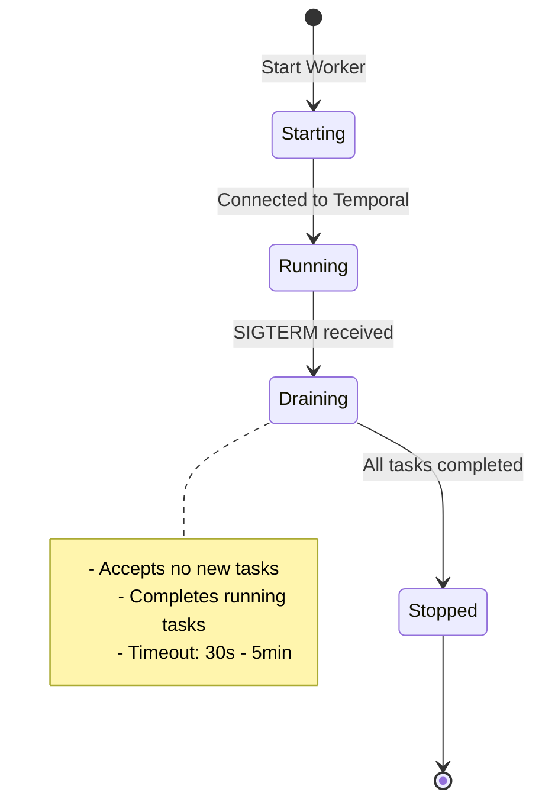
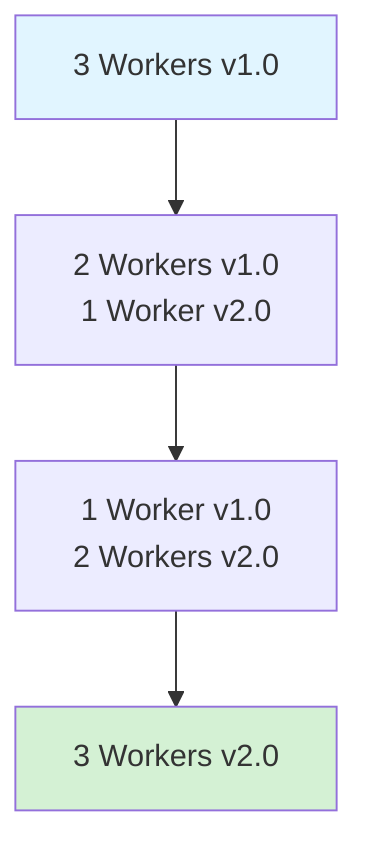
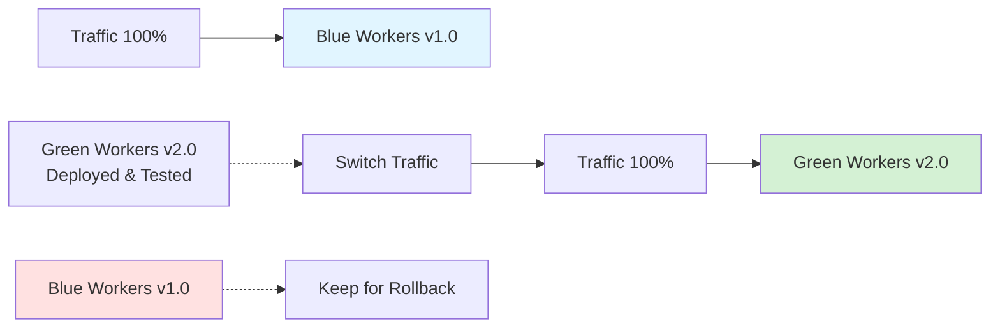
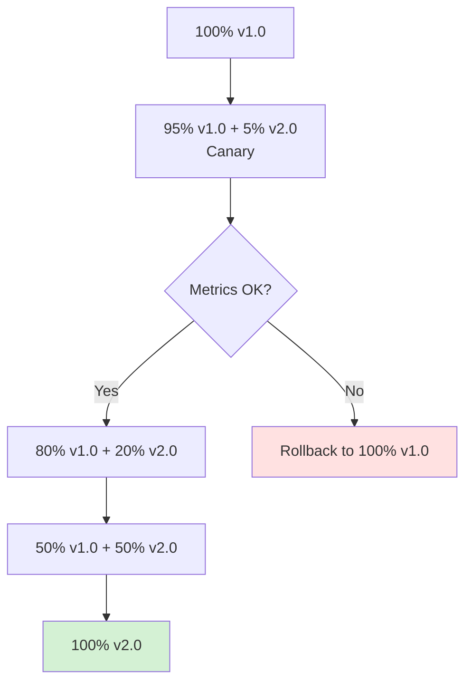
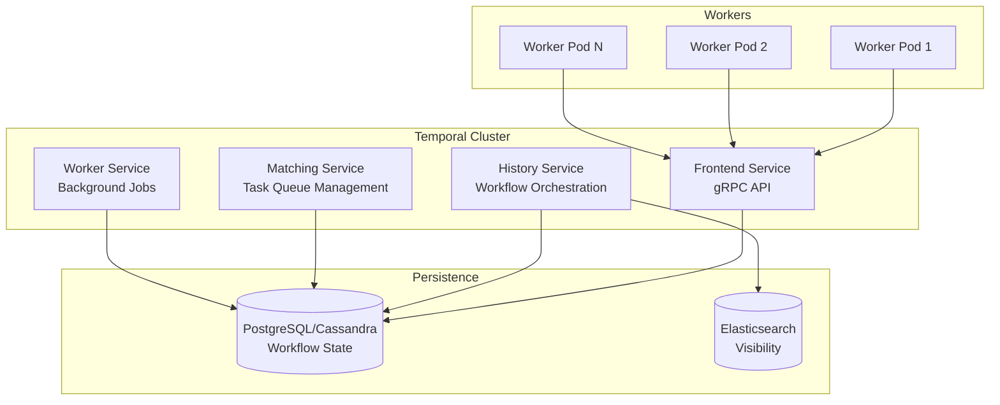
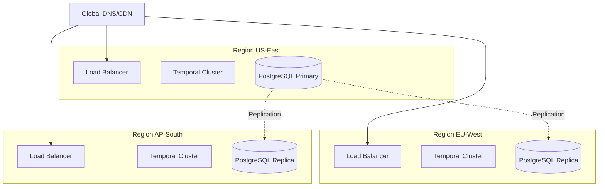

# Kapitel 10: Deployment und Production Best Practices

## Einleitung

Temporal in der Entwicklung zum Laufen zu bringen ist einfach – `temporal server start-dev` und los geht's. Aber der Sprung in die Production ist eine andere Herausforderung. Sie müssen über High Availability, Zero-Downtime Deployments, Kapazitätsplanung, Disaster Recovery und vieles mehr nachdenken.

Dieses Kapitel behandelt alles, was Sie wissen müssen, um Temporal sicher und zuverlässig in Production zu betreiben. Von Deployment-Strategien über Worker-Management bis hin zu Temporal Server-Konfiguration.

### Das Grundproblem

**Scenario**: Sie haben 50,000 laufende Workflows in Production. Ein neues Feature muss deployed werden. Aber:

- Workflows laufen über Wochen/Monate
- Worker dürfen nicht einfach beendet werden (laufende Activities!)
- Code-Änderungen müssen abwärtskompatibel sein
- Zero Downtime ist Pflicht
- Rollback muss möglich sein

**Ohne Best Practices**:
```bash
# FALSCH: Workers einfach neu starten
kubectl delete pods -l app=temporal-worker  # ❌ Kills running activities!
kubectl apply -f new-worker.yaml
```

**Ergebnis**:
- Activities werden abgebrochen
- Workflows müssen retries durchführen
- Potentieller Datenverlust
- Service-Degradation

**Mit Best Practices**:
```bash
# RICHTIG: Graceful shutdown + Rolling deployment
kubectl set image deployment/temporal-worker worker=v2.0.0  # ✅
# Kubernetes terminiert Pods graceful
# Workers beenden aktuelle Tasks
# Neue Workers starten parallel
```

### Lernziele

Nach diesem Kapitel können Sie:

- Verschiedene Deployment-Strategien (Blue-Green, Canary, Rolling) anwenden
- Workers graceful shutdownn und zero-downtime deployments durchführen
- Temporal Server selbst hosten oder Cloud nutzen
- High Availability und Disaster Recovery implementieren
- Capacity Planning durchführen
- Production Checklisten anwenden
- Monitoring und Alerting aufsetzen (Details in Kapitel 11)
- Security Best Practices implementieren (Details in Kapitel 13)

## 10.1 Worker Deployment Strategies

### 10.1.1 Graceful Shutdown

**Warum wichtig?**

Workers führen Activities aus, die Minuten oder Stunden dauern können. Ein abruptes Beenden würde:
- Laufende Activities abbrechen
- Externe State inkonsistent lassen
- Unnötige Retries auslösen

**Lifecycle eines Workers:**



**Python Implementation:**

```python
"""
Graceful Worker Shutdown
"""

import asyncio
import signal
from temporalio.client import Client
from temporalio.worker import Worker
import logging

logger = logging.getLogger(__name__)

class GracefulWorker:
    """Worker with graceful shutdown support"""

    def __init__(
        self,
        client: Client,
        task_queue: str,
        workflows: list,
        activities: list,
        shutdown_timeout: float = 300.0  # 5 minutes
    ):
        self.client = client
        self.task_queue = task_queue
        self.workflows = workflows
        self.activities = activities
        self.shutdown_timeout = shutdown_timeout
        self.worker: Worker | None = None
        self._shutdown_event = asyncio.Event()

    async def run(self):
        """Run worker with graceful shutdown handling"""

        # Setup signal handlers
        loop = asyncio.get_running_loop()

        def signal_handler(sig):
            logger.info(f"Received signal {sig}, initiating graceful shutdown...")
            self._shutdown_event.set()

        # Handle SIGTERM (Kubernetes pod termination)
        loop.add_signal_handler(signal.SIGTERM, lambda: signal_handler("SIGTERM"))
        # Handle SIGINT (Ctrl+C)
        loop.add_signal_handler(signal.SIGINT, lambda: signal_handler("SIGINT"))

        # Create and start worker
        logger.info(f"Starting worker on task queue: {self.task_queue}")

        async with Worker(
            self.client,
            task_queue=self.task_queue,
            workflows=self.workflows,
            activities=self.activities,
            # Important: Enable graceful shutdown
            graceful_shutdown_timeout=timedelta(seconds=self.shutdown_timeout)
        ) as self.worker:

            logger.info("✓ Worker started and polling for tasks")

            # Wait for shutdown signal
            await self._shutdown_event.wait()

            logger.info("Shutdown signal received, draining tasks...")
            logger.info(f"Waiting up to {self.shutdown_timeout}s for tasks to complete")

            # Worker will automatically:
            # 1. Stop accepting new tasks
            # 2. Wait for running tasks to complete
            # 3. Timeout after graceful_shutdown_timeout

        logger.info("✓ Worker stopped gracefully")

# Usage
async def main():
    client = await Client.connect("localhost:7233")

    worker = GracefulWorker(
        client=client,
        task_queue="production-queue",
        workflows=[MyWorkflow],
        activities=[my_activity],
        shutdown_timeout=300.0
    )

    await worker.run()

if __name__ == "__main__":
    asyncio.run(main())
```

**Kubernetes Deployment mit Graceful Shutdown:**

```yaml
# deployment.yaml
apiVersion: apps/v1
kind: Deployment
metadata:
  name: temporal-worker
spec:
  replicas: 3
  strategy:
    type: RollingUpdate
    rollingUpdate:
      maxUnavailable: 1
      maxSurge: 1

  template:
    metadata:
      labels:
        app: temporal-worker
        version: v2.0.0

    spec:
      containers:
      - name: worker
        image: myregistry/temporal-worker:v2.0.0

        # Resource limits
        resources:
          requests:
            memory: "512Mi"
            cpu: "500m"
          limits:
            memory: "1Gi"
            cpu: "1000m"

        # Graceful shutdown configuration
        lifecycle:
          preStop:
            exec:
              # Optional: Custom pre-stop hook
              # Worker already handles SIGTERM gracefully
              command: ["/bin/sh", "-c", "sleep 5"]

        # Health checks
        livenessProbe:
          httpGet:
            path: /health
            port: 8080
          initialDelaySeconds: 30
          periodSeconds: 10
          timeoutSeconds: 5

        readinessProbe:
          httpGet:
            path: /ready
            port: 8080
          initialDelaySeconds: 5
          periodSeconds: 5

      # Termination grace period (must be > graceful_shutdown_timeout!)
      terminationGracePeriodSeconds: 360  # 6 minutes
```

**Best Practices:**

✅ **DO:**
- Set `graceful_shutdown_timeout` > longest expected activity duration
- Set Kubernetes `terminationGracePeriodSeconds` > `graceful_shutdown_timeout` + buffer
- Log shutdown progress for observability
- Monitor drain duration metrics
- Test graceful shutdown in staging

❌ **DON'T:**
- Use `SIGKILL` for routine shutdowns
- Set timeout too short (activities will be aborted)
- Ignore health check failures
- Skip testing shutdown behavior

### 10.1.2 Rolling Deployment

**Pattern**: Schrittweises Ersetzen alter Workers durch neue.

**Vorteile:**
- ✅ Zero Downtime
- ✅ Automatisches Rollback bei Fehlern
- ✅ Kapazität bleibt konstant
- ✅ Standard in Kubernetes

**Nachteile:**
- ⚠️ Zwei Versionen laufen parallel
- ⚠️ Code muss backward-compatible sein
- ⚠️ Langsamer als Blue-Green

**Flow:**



**Kubernetes RollingUpdate:**

```yaml
apiVersion: apps/v1
kind: Deployment
metadata:
  name: temporal-worker
spec:
  replicas: 10
  strategy:
    type: RollingUpdate
    rollingUpdate:
      maxUnavailable: 2  # Max 2 workers down at once
      maxSurge: 2        # Max 2 extra workers during rollout

  template:
    spec:
      containers:
      - name: worker
        image: myregistry/temporal-worker:v2.0.0
```

**Deployment Process:**

```bash
# 1. Update image
kubectl set image deployment/temporal-worker \
  worker=myregistry/temporal-worker:v2.0.0

# 2. Monitor rollout
kubectl rollout status deployment/temporal-worker

# Output:
# Waiting for deployment "temporal-worker" rollout to finish: 2 out of 10 new replicas have been updated...
# Waiting for deployment "temporal-worker" rollout to finish: 5 out of 10 new replicas have been updated...
# deployment "temporal-worker" successfully rolled out

# 3. If problems occur, rollback
kubectl rollout undo deployment/temporal-worker
```

**Health Check during Rollout:**

```python
"""
Health check endpoint for Kubernetes probes
"""

from fastapi import FastAPI
from temporalio.worker import Worker

app = FastAPI()

worker: Worker | None = None

@app.get("/health")
async def health():
    """Liveness probe: Is the process alive?"""
    return {"status": "ok"}

@app.get("/ready")
async def ready():
    """Readiness probe: Is worker ready to accept tasks?"""
    if worker is None or not worker.is_running:
        return {"status": "not_ready"}, 503

    return {"status": "ready"}

# Run alongside worker
async def run_worker_with_health_check():
    import uvicorn

    # Start health check server
    config = uvicorn.Config(app, host="0.0.0.0", port=8080)
    server = uvicorn.Server(config)

    # Run both concurrently
    await asyncio.gather(
        server.serve(),
        run_worker()  # Your worker logic
    )
```

### 10.1.3 Blue-Green Deployment

**Pattern**: Zwei identische Environments (Blue = alt, Green = neu). Traffic wird komplett umgeschaltet.

**Vorteile:**
- ✅ Instant Rollback (switch back)
- ✅ Beide Versionen getestet vor Switch
- ✅ Zero Downtime
- ✅ Volle Kontrolle über Cutover

**Nachteile:**
- ⚠️ Doppelte Ressourcen während Deployment
- ⚠️ Komplexere Infrastruktur
- ⚠️ Database Schema muss kompatibel sein

**Flow:**



**Implementation with Worker Versioning:**

```python
"""
Blue-Green Deployment mit Worker Versioning (Build IDs)
"""

from temporalio.client import Client
from temporalio.worker import Worker

async def deploy_green_workers():
    """Deploy new GREEN workers with new Build ID"""

    client = await Client.connect("localhost:7233")

    # Green workers mit neuem Build ID
    worker = Worker(
        client,
        task_queue="production-queue",
        workflows=[MyWorkflowV2],  # New version
        activities=[my_activity_v2],
        build_id="v2.0.0",  # GREEN Build ID
        use_worker_versioning=True
    )

    await worker.run()

async def cutover_to_green():
    """Switch traffic from BLUE to GREEN"""

    client = await Client.connect("localhost:7233")

    # Make v2.0.0 the default for new workflows
    await client.update_worker_build_id_compatibility(
        task_queue="production-queue",
        operation=BuildIdOperation.add_new_default("v2.0.0")
    )

    print("✓ Traffic switched to GREEN (v2.0.0)")
    print("  - New workflows → v2.0.0")
    print("  - Running workflows → continue on v1.0.0")

async def rollback_to_blue():
    """Rollback to BLUE version"""

    client = await Client.connect("localhost:7233")

    # Revert to v1.0.0
    await client.update_worker_build_id_compatibility(
        task_queue="production-queue",
        operation=BuildIdOperation.promote_set_by_build_id("v1.0.0")
    )

    print("✓ Rolled back to BLUE (v1.0.0)")
```

**Kubernetes Setup:**

```yaml
# Blue deployment (current production)
apiVersion: apps/v1
kind: Deployment
metadata:
  name: temporal-worker-blue
spec:
  replicas: 5
  template:
    metadata:
      labels:
        app: temporal-worker
        color: blue
        version: v1.0.0
    spec:
      containers:
      - name: worker
        image: myregistry/temporal-worker:v1.0.0
        env:
        - name: BUILD_ID
          value: "v1.0.0"

---

# Green deployment (new version, ready for cutover)
apiVersion: apps/v1
kind: Deployment
metadata:
  name: temporal-worker-green
spec:
  replicas: 5
  template:
    metadata:
      labels:
        app: temporal-worker
        color: green
        version: v2.0.0
    spec:
      containers:
      - name: worker
        image: myregistry/temporal-worker:v2.0.0
        env:
        - name: BUILD_ID
          value: "v2.0.0"
```

**Deployment Procedure:**

```bash
# 1. Deploy GREEN alongside BLUE
kubectl apply -f worker-green.yaml

# 2. Verify GREEN health
kubectl get pods -l color=green
kubectl logs -l color=green --tail=100

# 3. Run smoke tests on GREEN
python scripts/smoke_test.py --build-id v2.0.0

# 4. Cutover traffic to GREEN
python scripts/cutover.py --to green

# 5. Monitor GREEN for issues
# ... wait 1-2 hours ...

# 6. If all good, decommission BLUE
kubectl delete deployment temporal-worker-blue

# 7. If issues, instant rollback
python scripts/cutover.py --to blue
```

### 10.1.4 Canary Deployment

**Pattern**: Neue Version auf kleinem Prozentsatz der Traffic (z.B. 5%), dann schrittweise erhöhen.

**Vorteile:**
- ✅ Minimal Risk (nur 5% betroffen)
- ✅ Frühe Fehler-Erkennung
- ✅ Gradual Rollout
- ✅ A/B Testing möglich

**Nachteile:**
- ⚠️ Komplexere Observability
- ⚠️ Längerer Deployment-Prozess
- ⚠️ Requires Traffic Splitting

**Flow:**



**Implementation mit Worker Versioning:**

```python
"""
Canary Deployment mit schrittweisem Rollout
"""

from temporalio.client import Client
import asyncio

async def canary_rollout():
    """Gradual canary rollout: 5% → 20% → 50% → 100%"""

    client = await Client.connect("localhost:7233")

    stages = [
        {"canary_pct": 5, "wait_minutes": 30},
        {"canary_pct": 20, "wait_minutes": 60},
        {"canary_pct": 50, "wait_minutes": 120},
        {"canary_pct": 100, "wait_minutes": 0},
    ]

    for stage in stages:
        pct = stage["canary_pct"]
        wait = stage["wait_minutes"]

        print(f"\n🚀 Stage: {pct}% canary traffic to v2.0.0")

        # Adjust worker replicas based on percentage
        canary_replicas = max(1, int(10 * pct / 100))
        stable_replicas = 10 - canary_replicas

        # Scale workers (using kubectl or k8s API)
        await scale_workers("blue", stable_replicas)
        await scale_workers("green", canary_replicas)

        print(f"  - Blue (v1.0.0): {stable_replicas} replicas")
        print(f"  - Green (v2.0.0): {canary_replicas} replicas")

        if wait > 0:
            print(f"⏳ Monitoring for {wait} minutes...")
            await asyncio.sleep(wait * 60)

            # Check metrics
            metrics = await check_canary_metrics()

            if not metrics["healthy"]:
                print("❌ Canary metrics unhealthy, rolling back!")
                await rollback()
                return

            print("✅ Canary metrics healthy, continuing rollout")

    print("\n🎉 Canary rollout completed successfully!")
    print("   100% traffic now on v2.0.0")

async def check_canary_metrics() -> dict:
    """Check if canary version is healthy"""
    # Check:
    # - Error rate
    # - Latency p99
    # - Success rate
    # - Custom business metrics

    return {
        "healthy": True,
        "error_rate": 0.01,
        "latency_p99": 450,
        "success_rate": 99.9
    }
```

**Kubernetes + Argo Rollouts:**

```yaml
# Canary with Argo Rollouts (advanced)
apiVersion: argoproj.io/v1alpha1
kind: Rollout
metadata:
  name: temporal-worker
spec:
  replicas: 10

  strategy:
    canary:
      steps:
      - setWeight: 5      # 5% canary
      - pause: {duration: 30m}

      - setWeight: 20     # 20% canary
      - pause: {duration: 1h}

      - setWeight: 50     # 50% canary
      - pause: {duration: 2h}

      - setWeight: 100    # Full rollout

      # Auto-rollback on metrics failure
      analysis:
        templates:
        - templateName: success-rate
        args:
        - name: service-name
          value: temporal-worker

  template:
    spec:
      containers:
      - name: worker
        image: myregistry/temporal-worker:v2.0.0
```

### 10.1.5 Deployment Strategy Decision Matrix

| Faktor | Rolling | Blue-Green | Canary |
|--------|---------|------------|--------|
| **Complexity** | Low | Medium | High |
| **Rollback Speed** | Slow | Instant | Fast |
| **Resource Cost** | Low | High (2x) | Medium |
| **Risk** | Medium | Low | Very Low |
| **Best For** | - Routine updates<br/>- Small teams | - Critical releases<br/>- Need instant rollback | - High-risk changes<br/>- A/B testing |
| **Temporal Feature** | Standard | Worker Versioning | Worker Versioning |

**Empfehlung:**

```python
def choose_deployment_strategy(change_type: str) -> str:
    """Decision tree for deployment strategy"""

    if change_type == "hotfix":
        return "rolling"  # Fast, simple

    elif change_type == "major_release":
        return "blue-green"  # Safe, instant rollback

    elif change_type == "experimental_feature":
        return "canary"  # Gradual, low risk

    elif change_type == "routine_update":
        return "rolling"  # Standard, cost-effective

    else:
        return "canary"  # When in doubt, go safe
```

## 10.2 Temporal Server Deployment

### 10.2.1 Temporal Cloud vs Self-Hosted

**Decision Matrix:**

| Faktor | Temporal Cloud | Self-Hosted |
|--------|----------------|-------------|
| **Setup Time** | Minutes | Days/Weeks |
| **Operational Overhead** | None | High |
| **Cost** | Pay-per-use | Infrastructure + Team |
| **Control** | Limited | Full |
| **Compliance** | SOC2, HIPAA | Your responsibility |
| **Customization** | Limited | Unlimited |
| **Scaling** | Automatic | Manual |
| **Best For** | - Startups<br/>- Focus on business logic<br/>- Fast time-to-market | - Enterprise<br/>- Strict compliance<br/>- Full control needs |

**Temporal Cloud:**

```python
"""
Connecting to Temporal Cloud
"""

from temporalio.client import Client, TLSConfig

async def connect_to_cloud():
    """Connect to Temporal Cloud"""

    client = await Client.connect(
        # Your Temporal Cloud namespace
        target_host="my-namespace.tmprl.cloud:7233",

        # Namespace
        namespace="my-namespace.account-id",

        # TLS configuration (required for Cloud)
        tls=TLSConfig(
            client_cert=open("client-cert.pem", "rb").read(),
            client_private_key=open("client-key.pem", "rb").read(),
        )
    )

    return client

# Usage
client = await connect_to_cloud()
```

**Pros:**
- ✅ No infrastructure management
- ✅ Automatic scaling
- ✅ Built-in monitoring
- ✅ Multi-region support
- ✅ 99.99% SLA

**Cons:**
- ❌ Less control over configuration
- ❌ Pay-per-action pricing
- ❌ Vendor lock-in

### 10.2.2 Self-Hosted: Docker Compose

**For**: Development, small deployments

```yaml
# docker-compose.yml
version: '3.8'

services:
  # PostgreSQL (persistence)
  postgresql:
    image: postgres:13
    environment:
      POSTGRES_PASSWORD: temporal
      POSTGRES_USER: temporal
    volumes:
      - postgres-data:/var/lib/postgresql/data
    networks:
      - temporal-network

  # Temporal Server
  temporal:
    image: temporalio/auto-setup:latest
    depends_on:
      - postgresql
    environment:
      - DB=postgresql
      - DB_PORT=5432
      - POSTGRES_USER=temporal
      - POSTGRES_PWD=temporal
      - POSTGRES_SEEDS=postgresql
      - DYNAMIC_CONFIG_FILE_PATH=config/dynamicconfig/development-sql.yaml
    ports:
      - "7233:7233"  # gRPC
      - "8233:8233"  # HTTP
    volumes:
      - ./dynamicconfig:/etc/temporal/config/dynamicconfig
    networks:
      - temporal-network

  # Temporal Web UI
  temporal-ui:
    image: temporalio/ui:latest
    depends_on:
      - temporal
    environment:
      - TEMPORAL_ADDRESS=temporal:7233
    ports:
      - "8080:8080"
    networks:
      - temporal-network

volumes:
  postgres-data:

networks:
  temporal-network:
    driver: bridge
```

**Start:**

```bash
docker-compose up -d
```

**Pros:**
- ✅ Simple setup
- ✅ Good for dev/test
- ✅ All-in-one

**Cons:**
- ❌ Not production-grade
- ❌ Single point of failure
- ❌ No HA

### 10.2.3 Self-Hosted: Kubernetes (Production)

**For**: Production, high availability

**Architecture:**



**Helm Chart Deployment:**

```bash
# 1. Add Temporal Helm repo
helm repo add temporalio https://go.temporal.io/helm-charts
helm repo update

# 2. Create namespace
kubectl create namespace temporal

# 3. Install with custom values
helm install temporal temporalio/temporal \
  --namespace temporal \
  --values temporal-values.yaml
```

**temporal-values.yaml:**

```yaml
# Temporal Server configuration for production

# High Availability: Multiple replicas
server:
  replicaCount: 3

  resources:
    requests:
      cpu: 1000m
      memory: 2Gi
    limits:
      cpu: 2000m
      memory: 4Gi

  # Frontend service
  frontend:
    replicaCount: 3
    service:
      type: LoadBalancer
      port: 7233

  # History service (most critical)
  history:
    replicaCount: 5
    resources:
      requests:
        cpu: 2000m
        memory: 4Gi

  # Matching service
  matching:
    replicaCount: 3

  # Worker service
  worker:
    replicaCount: 2

# PostgreSQL (persistence)
postgresql:
  enabled: true
  persistence:
    enabled: true
    size: 100Gi
    storageClass: "fast-ssd"

  # HA setup
  replication:
    enabled: true
    readReplicas: 2

  resources:
    requests:
      cpu: 2000m
      memory: 8Gi

# Elasticsearch (visibility)
elasticsearch:
  enabled: true
  replicas: 3
  minimumMasterNodes: 2

  volumeClaimTemplate:
    accessModes: ["ReadWriteOnce"]
    resources:
      requests:
        storage: 100Gi

# Prometheus metrics
prometheus:
  enabled: true

# Grafana dashboards
grafana:
  enabled: true
```

**Verify Installation:**

```bash
# Check pods
kubectl get pods -n temporal

# Expected output:
# NAME                                   READY   STATUS    RESTARTS   AGE
# temporal-frontend-xxxxx                1/1     Running   0          5m
# temporal-history-xxxxx                 1/1     Running   0          5m
# temporal-matching-xxxxx                1/1     Running   0          5m
# temporal-worker-xxxxx                  1/1     Running   0          5m
# temporal-postgresql-0                  1/1     Running   0          5m
# temporal-elasticsearch-0               1/1     Running   0          5m

# Check services
kubectl get svc -n temporal

# Port-forward to access UI
kubectl port-forward -n temporal svc/temporal-frontend 7233:7233
kubectl port-forward -n temporal svc/temporal-web 8080:8080
```

### 10.2.4 High Availability Setup

**Multi-Region Deployment:**



**HA Checklist:**

✅ **Infrastructure:**
- [ ] Multiple availability zones
- [ ] Database replication (PostgreSQL streaming)
- [ ] Load balancer health checks
- [ ] Auto-scaling groups
- [ ] Network redundancy

✅ **Temporal Server:**
- [ ] Frontend: ≥3 replicas
- [ ] History: ≥5 replicas (most critical)
- [ ] Matching: ≥3 replicas
- [ ] Worker: ≥2 replicas

✅ **Database:**
- [ ] PostgreSQL with streaming replication
- [ ] Automated backups (daily)
- [ ] Point-in-time recovery enabled
- [ ] Separate disk for WAL logs
- [ ] Connection pooling (PgBouncer)

✅ **Monitoring:**
- [ ] Prometheus + Grafana
- [ ] Alert on service degradation
- [ ] Dashboard for all services
- [ ] Log aggregation (ELK/Loki)

### 10.2.5 Disaster Recovery

**Backup Strategy:**

```bash
# Automated PostgreSQL backup script

#!/bin/bash
# backup-temporal-db.sh

TIMESTAMP=$(date +%Y%m%d_%H%M%S)
BACKUP_DIR="/backups/temporal"
DB_NAME="temporal"
DB_USER="temporal"

# Full backup
pg_dump -U $DB_USER -d $DB_NAME -F c -b -v \
  -f $BACKUP_DIR/temporal_$TIMESTAMP.dump

# Compress
gzip $BACKUP_DIR/temporal_$TIMESTAMP.dump

# Upload to S3
aws s3 cp $BACKUP_DIR/temporal_$TIMESTAMP.dump.gz \
  s3://my-temporal-backups/daily/

# Cleanup old backups (keep 30 days)
find $BACKUP_DIR -name "*.dump.gz" -mtime +30 -delete

echo "Backup completed: temporal_$TIMESTAMP.dump.gz"
```

**Cron Schedule:**

```bash
# Daily backup at 2 AM
0 2 * * * /scripts/backup-temporal-db.sh >> /var/log/temporal-backup.log 2>&1

# Hourly incremental backup (WAL archiving)
0 * * * * /scripts/archive-wal.sh >> /var/log/wal-archive.log 2>&1
```

**Restore Procedure:**

```bash
#!/bin/bash
# restore-temporal-db.sh

BACKUP_FILE=$1

# Download from S3
aws s3 cp s3://my-temporal-backups/daily/$BACKUP_FILE .

# Decompress
gunzip $BACKUP_FILE

# Restore
pg_restore -U temporal -d temporal -c -v ${BACKUP_FILE%.gz}

echo "Restore completed from $BACKUP_FILE"
```

**DR Runbook:**

```markdown
# Disaster Recovery Runbook

## Scenario 1: Database Corruption

1. **Stop Temporal services**
   ```bash
   kubectl scale deployment temporal-frontend --replicas=0 -n temporal
   kubectl scale deployment temporal-history --replicas=0 -n temporal
   kubectl scale deployment temporal-matching --replicas=0 -n temporal
   ```

2. **Restore from latest backup**
   ```bash
   ./restore-temporal-db.sh temporal_20250118_020000.dump.gz
   ```

3. **Verify database integrity**
   ```bash
   psql -U temporal -d temporal -c "SELECT COUNT(*) FROM executions;"
   ```

4. **Restart services**
   ```bash
   kubectl scale deployment temporal-frontend --replicas=3 -n temporal
   kubectl scale deployment temporal-history --replicas=5 -n temporal
   kubectl scale deployment temporal-matching --replicas=3 -n temporal
   ```

5. **Verify workflows resuming**
   ```bash
   temporal workflow list
   ```

## Scenario 2: Complete Region Failure

1. **Switch DNS to DR region**
   ```bash
   aws route53 change-resource-record-sets \
     --hosted-zone-id Z1234567890ABC \
     --change-batch file://failover.json
   ```

2. **Promote replica to primary**
   ```bash
   kubectl exec -it postgresql-replica-0 -n temporal -- \
     pg_ctl promote
   ```

3. **Scale up DR services**
   ```bash
   kubectl scale deployment temporal-frontend --replicas=3 -n temporal-dr
   kubectl scale deployment temporal-history --replicas=5 -n temporal-dr
   ```

4. **Update worker connections**
   ```python
   # Workers automatically reconnect to new endpoint via DNS
   ```

## RTO/RPO Targets

- **RTO (Recovery Time Objective)**: 15 minutes
- **RPO (Recovery Point Objective)**: 1 hour (last backup)
```

## 10.3 Capacity Planning

### 10.3.1 Worker Sizing

**Factors:**

1. **Workflow Throughput**
   - Workflows/second
   - Average workflow duration
   - Concurrent workflow limit

2. **Activity Characteristics**
   - Average duration
   - CPU/Memory usage
   - External dependencies (API rate limits)

3. **Task Queue Backlog**
   - Acceptable lag
   - Peak vs average load

**Formula:**

```python
"""
Worker Capacity Calculator
"""

from dataclasses import dataclass
from typing import List

@dataclass
class WorkloadProfile:
    """Characterize your workload"""
    workflows_per_second: float
    avg_workflow_duration_sec: float
    activities_per_workflow: int
    avg_activity_duration_sec: float
    activity_cpu_cores: float = 0.1
    activity_memory_mb: float = 256

def calculate_required_workers(profile: WorkloadProfile) -> dict:
    """Calculate required worker capacity"""

    # Concurrent workflows
    concurrent_workflows = profile.workflows_per_second * profile.avg_workflow_duration_sec

    # Concurrent activities
    concurrent_activities = (
        concurrent_workflows *
        profile.activities_per_workflow
    )

    # Worker slots (assuming 100 slots per worker)
    slots_per_worker = 100
    required_workers = max(1, int(concurrent_activities / slots_per_worker) + 1)

    # Resource requirements
    total_cpu = concurrent_activities * profile.activity_cpu_cores
    total_memory_gb = (concurrent_activities * profile.activity_memory_mb) / 1024

    return {
        "concurrent_workflows": int(concurrent_workflows),
        "concurrent_activities": int(concurrent_activities),
        "required_workers": required_workers,
        "total_cpu_cores": round(total_cpu, 2),
        "total_memory_gb": round(total_memory_gb, 2),
        "cpu_per_worker": round(total_cpu / required_workers, 2),
        "memory_per_worker_gb": round(total_memory_gb / required_workers, 2)
    }

# Example
profile = WorkloadProfile(
    workflows_per_second=10,
    avg_workflow_duration_sec=300,  # 5 minutes
    activities_per_workflow=5,
    avg_activity_duration_sec=10,
    activity_cpu_cores=0.1,
    activity_memory_mb=256
)

result = calculate_required_workers(profile)

print("Capacity Planning Results:")
print(f"  Concurrent Workflows: {result['concurrent_workflows']}")
print(f"  Concurrent Activities: {result['concurrent_activities']}")
print(f"  Required Workers: {result['required_workers']}")
print(f"  Total CPU: {result['total_cpu_cores']} cores")
print(f"  Total Memory: {result['total_memory_gb']} GB")
print(f"  Per Worker: {result['cpu_per_worker']} CPU, {result['memory_per_worker_gb']} GB RAM")
```

**Output:**

```
Capacity Planning Results:
  Concurrent Workflows: 3000
  Concurrent Activities: 15000
  Required Workers: 151
  Total CPU: 1500.0 cores
  Total Memory: 3750.0 GB
  Per Worker: 9.93 CPU, 24.83 GB RAM
```

### 10.3.2 Horizontal Pod Autoscaling

**Kubernetes HPA:**

```yaml
# hpa-worker.yaml
apiVersion: autoscaling/v2
kind: HorizontalPodAutoscaler
metadata:
  name: temporal-worker-hpa
  namespace: production
spec:
  scaleTargetRef:
    apiVersion: apps/v1
    kind: Deployment
    name: temporal-worker

  minReplicas: 5
  maxReplicas: 50

  metrics:
  # Scale based on CPU
  - type: Resource
    resource:
      name: cpu
      target:
        type: Utilization
        averageUtilization: 70

  # Scale based on Memory
  - type: Resource
    resource:
      name: memory
      target:
        type: Utilization
        averageUtilization: 80

  # Custom metric: Task queue backlog
  - type: Pods
    pods:
      metric:
        name: temporal_task_queue_backlog
      target:
        type: AverageValue
        averageValue: "100"

  behavior:
    scaleDown:
      stabilizationWindowSeconds: 300  # Wait 5min before scaling down
      policies:
      - type: Percent
        value: 50  # Max 50% pods removed at once
        periodSeconds: 60

    scaleUp:
      stabilizationWindowSeconds: 0  # Scale up immediately
      policies:
      - type: Percent
        value: 100  # Max 100% pods added at once
        periodSeconds: 15
      - type: Pods
        value: 5  # Max 5 pods added at once
        periodSeconds: 15
      selectPolicy: Max  # Use most aggressive policy
```

**Custom Metrics (Prometheus Adapter):**

```yaml
# prometheus-adapter-config.yaml
rules:
- seriesQuery: 'temporal_task_queue_backlog'
  resources:
    template: <<.Resource>>
  name:
    matches: "^(.*)$"
    as: "temporal_task_queue_backlog"
  metricsQuery: 'avg(temporal_task_queue_backlog{queue="production-queue"})'
```

### 10.3.3 Database Sizing

**PostgreSQL Sizing Guidelines:**

| Workflows | Storage | CPU | RAM | IOPS |
|-----------|---------|-----|-----|------|
| 1M active | 100 GB | 4 cores | 16 GB | 3,000 |
| 10M active | 500 GB | 8 cores | 32 GB | 10,000 |
| 100M active | 2 TB | 16 cores | 64 GB | 30,000 |

**Storage Growth Estimation:**

```python
def estimate_storage_growth(
    workflows_per_day: int,
    avg_events_per_workflow: int,
    avg_event_size_bytes: int = 1024,
    retention_days: int = 90
) -> dict:
    """Estimate PostgreSQL storage requirements"""

    # Total workflows in retention window
    total_workflows = workflows_per_day * retention_days

    # Events
    total_events = total_workflows * avg_events_per_workflow

    # Storage (with overhead)
    raw_storage_gb = (total_events * avg_event_size_bytes) / (1024**3)
    storage_with_overhead_gb = raw_storage_gb * 1.5  # 50% overhead for indexes, etc.

    # Growth per day
    daily_growth_gb = (workflows_per_day * avg_events_per_workflow * avg_event_size_bytes) / (1024**3)

    return {
        "total_workflows": total_workflows,
        "total_events": total_events,
        "storage_required_gb": round(storage_with_overhead_gb, 2),
        "daily_growth_gb": round(daily_growth_gb, 2)
    }

# Example
result = estimate_storage_growth(
    workflows_per_day=100000,
    avg_events_per_workflow=50,
    retention_days=90
)

print(f"Storage required: {result['storage_required_gb']} GB")
print(f"Daily growth: {result['daily_growth_gb']} GB")
```

## 10.4 Production Checklist

### 10.4.1 Pre-Deployment

**Code:**
- [ ] All tests passing (unit, integration, replay)
- [ ] Workflow versioning implemented (patching or Build IDs)
- [ ] Error handling and retries configured
- [ ] Logging at appropriate levels
- [ ] No secrets in code (use Secret Manager)
- [ ] Code reviewed and approved

**Infrastructure:**
- [ ] Temporal Server deployed (Cloud or self-hosted)
- [ ] Database configured with replication
- [ ] Backups automated and tested
- [ ] Monitoring and alerting setup
- [ ] Resource limits configured
- [ ] Network policies applied

**Security:**
- [ ] TLS enabled for all connections
- [ ] mTLS configured (if required)
- [ ] RBAC/authorization configured
- [ ] Secrets encrypted at rest
- [ ] Audit logging enabled
- [ ] Vulnerability scanning completed

**Operations:**
- [ ] Runbooks created (incident response, DR)
- [ ] On-call rotation scheduled
- [ ] Escalation paths defined
- [ ] SLOs/SLAs documented

### 10.4.2 Deployment

- [ ] Deploy in off-peak hours
- [ ] Use deployment strategy (Rolling/Blue-Green/Canary)
- [ ] Monitor metrics in real-time
- [ ] Validate with smoke tests
- [ ] Communicate to stakeholders

### 10.4.3 Post-Deployment

- [ ] Verify all workers healthy
- [ ] Check task queue backlog
- [ ] Monitor error rates
- [ ] Review logs for warnings
- [ ] Confirm workflows completing successfully
- [ ] Update documentation
- [ ] Retrospective (lessons learned)

## 10.5 Zusammenfassung

### Wichtigste Konzepte

1. **Graceful Shutdown**
   - Workers müssen laufende Activities abschließen
   - `graceful_shutdown_timeout` > längste Activity
   - Kubernetes `terminationGracePeriodSeconds` entsprechend setzen

2. **Deployment Strategies**
   - **Rolling**: Standard, kostengünstig, moderate Risk
   - **Blue-Green**: Instant Rollback, höhere Kosten
   - **Canary**: Minimales Risk, schrittweise Rollout

3. **Temporal Server**
   - **Cloud**: Einfach, managed, pay-per-use
   - **Self-Hosted**: Volle Kontrolle, höherer Aufwand
   - **HA Setup**: Multi-AZ, Replikation, Load Balancing

4. **Capacity Planning**
   - Worker-Sizing basierend auf Workload-Profil
   - Horizontal Pod Autoscaling für elastische Kapazität
   - Database-Sizing für Storage und IOPS

5. **Production Readiness**
   - Comprehensive Checklisten
   - Automated Backups & DR
   - Monitoring & Alerting (Kapitel 11)

### Best Practices

✅ **DO:**
- Implement graceful shutdown
- Use deployment strategies (not ad-hoc restarts)
- Automate capacity planning
- Test DR procedures regularly
- Monitor all the things (Kapitel 11)

❌ **DON'T:**
- Kill workers abruptly (`SIGKILL`)
- Deploy without versioning
- Skip capacity planning
- Ignore backup testing
- Deploy without monitoring

### Nächste Schritte

- **Kapitel 11**: Monitoring und Observability – Wie Sie Production-Workflows überwachen
- **Kapitel 12**: Testing Strategies – Comprehensive testing für Temporal
- **Kapitel 13**: Security Best Practices – Sichere Temporal-Deployments

### Weiterführende Ressourcen

- [Temporal Docs: Production Deployment](https://docs.temporal.io/cluster-deployment-guide)
- [Temporal Helm Charts](https://github.com/temporalio/helm-charts)
- [Temporal Cloud](https://temporal.io/cloud)
- [Kubernetes Best Practices](https://kubernetes.io/docs/concepts/configuration/overview/)

---

**[⬆ Zurück zum Inhaltsverzeichnis](README.md)**

**Nächstes Kapitel**: [Kapitel 11: Skalierung der Worker](part-04-chapter-11.md)

**Code-Beispiele für dieses Kapitel**: [`examples/part-04/chapter-10/`](../examples/part-04/chapter-10/)

**Praxis-Tipp**: Beginnen Sie mit Temporal Cloud für schnellen Start. Wenn Sie spezifische Compliance- oder Kosten-Anforderungen haben, evaluieren Sie Self-Hosted. Unabhängig davon: Implementieren Sie von Anfang an graceful shutdown und Deployment-Strategien!
