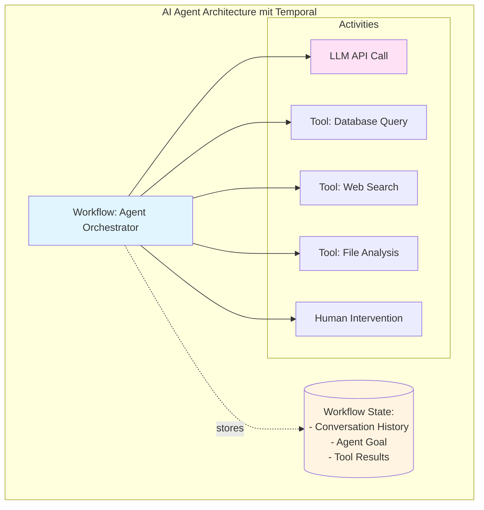
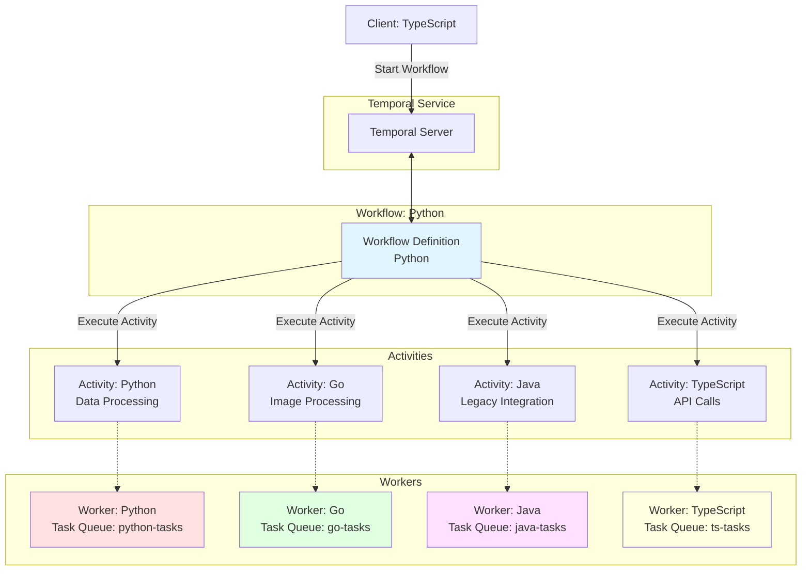
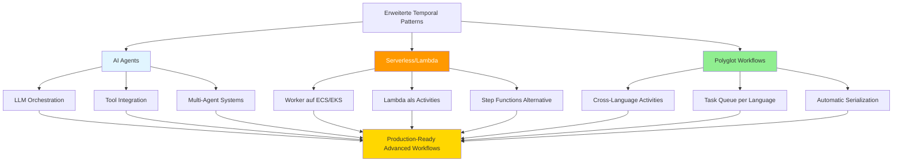

# Kapitel 15: Erweiterte Rezepte (AI Agents, Lambda, Polyglot)

In diesem Kapitel behandeln wir drei fortgeschrittene Anwendungsfälle, die zeigen, wie Temporal in modernen, heterogenen Architekturen eingesetzt wird. Diese Rezepte demonstrieren die Flexibilität und Erweiterbarkeit der Plattform.

## 15.1 Überblick: Die Evolution von Temporal

Während Kapitel 14 klassische Workflow-Muster behandelte, konzentriert sich dieses Kapitel auf neuere, spezialisierte Anwendungsfälle:

- **AI Agents**: Orchestrierung von KI-Agenten mit LLMs und langlebigen Konversationen
- **Serverless Integration**: Kombination von Temporal mit AWS Lambda und anderen FaaS-Plattformen
- **Polyglot Workflows**: Mehrsprachige Workflows über verschiedene SDKs hinweg

Diese Muster repräsentieren den aktuellen Stand der Temporal-Nutzung in der Industrie (Stand 2024/2025).

## 15.2 AI Agents mit Temporal

### 15.2.1 Warum Temporal für AI Agents?

Die Entwicklung von AI-Agenten bringt spezifische Herausforderungen mit sich:

- **Langlebige Konversationen**: Gespräche können über Stunden oder Tage verlaufen
- **Zustandsverwaltung**: Kontext, Ziele und bisherige Interaktionen müssen persistent gespeichert werden
- **Fehlertoleranz**: LLM-APIs können fehlschlagen, Rate-Limits erreichen oder inkonsistente Antworten liefern
- **Human-in-the-Loop**: Menschen müssen in kritischen Momenten eingreifen können
- **Tool-Orchestrierung**: Agenten rufen verschiedene externe Tools auf

**Temporal bietet für all diese Herausforderungen native Lösungen:**



### 15.2.2 Real-World Adoption

Unternehmen, die Temporal für AI Agents nutzen (Stand 2024):

- **Lindy, Dust, ZoomInfo**: AI Agents mit State-Durability
- **Descript & Neosync**: Datenpipelines und GPU-Ressourcen-Koordination
- **OpenAI Integration**: Temporal hat eine offizielle Integration mit dem OpenAI Agents SDK (Public Preview, Python SDK)

### 15.2.3 Grundlegendes AI Agent Pattern

```python
from temporalio import workflow, activity
from datetime import timedelta
from dataclasses import dataclass, field
from typing import List, Optional
import openai

@dataclass
class Message:
    role: str  # "system", "user", "assistant", "tool"
    content: str
    name: Optional[str] = None  # Tool name
    tool_call_id: Optional[str] = None

@dataclass
class AgentState:
    goal: str
    conversation_history: List[Message] = field(default_factory=list)
    tools_used: List[str] = field(default_factory=list)
    completed: bool = False
    result: Optional[str] = None

# Activities: Non-deterministische LLM und Tool Calls

@activity.defn
async def call_llm(messages: List[Message], tools: List[dict]) -> dict:
    """
    Ruft LLM API auf (OpenAI, Claude, etc.).
    Vollständig non-deterministisch - perfekt für Activity.
    """
    activity.logger.info(f"Calling LLM with {len(messages)} messages")

    try:
        response = await openai.ChatCompletion.acreate(
            model="gpt-4",
            messages=[{"role": m.role, "content": m.content} for m in messages],
            tools=tools,
            temperature=0.7,
        )

        return {
            "content": response.choices[0].message.content,
            "tool_calls": response.choices[0].message.tool_calls,
            "finish_reason": response.choices[0].finish_reason
        }
    except Exception as e:
        activity.logger.error(f"LLM API error: {e}")
        raise

@activity.defn
async def execute_tool(tool_name: str, arguments: dict) -> str:
    """
    Führt Tool-Aufrufe aus (Database, APIs, File System, etc.).
    """
    activity.logger.info(f"Executing tool: {tool_name}")

    if tool_name == "search_database":
        # Simuliere Datenbanksuche
        query = arguments.get("query")
        results = await database_search(query)
        return f"Found {len(results)} results: {results}"

    elif tool_name == "web_search":
        # Web-Suche
        query = arguments.get("query")
        results = await web_search_api(query)
        return f"Web search results: {results}"

    elif tool_name == "read_file":
        # Datei lesen
        filepath = arguments.get("filepath")
        content = await read_file_async(filepath)
        return content

    else:
        raise ValueError(f"Unknown tool: {tool_name}")

@activity.defn
async def request_human_input(question: str, context: dict) -> str:
    """
    Fordert menschliche Eingabe an (via UI, Email, Slack, etc.).
    """
    activity.logger.info(f"Requesting human input: {question}")

    # In Production: Sende Notification via Slack/Email
    # und warte auf Webhook/API Call zurück
    notification_result = await send_notification(
        channel="slack",
        message=f"AI Agent needs your input: {question}",
        context=context
    )

    # Placeholder - in Reality würde hier ein Signal empfangen
    return notification_result

# Workflow: Deterministische Orchestrierung

@workflow.defn
class AIAgentWorkflow:
    """
    Orchestriert einen AI Agent mit Tools und optionalem Human-in-the-Loop.

    Der Workflow ist deterministisch, aber die LLM-Calls und Tools sind
    non-deterministisch (daher als Activities implementiert).
    """

    def __init__(self) -> None:
        self.state = AgentState(goal="")
        self.human_input_received = None
        self.max_iterations = 20  # Verhindere infinite loops

    @workflow.run
    async def run(self, goal: str, initial_context: str = "") -> AgentState:
        """
        Führe Agent aus bis Ziel erreicht oder max_iterations.

        Args:
            goal: Das zu erreichende Ziel des Agents
            initial_context: Optionaler initialer Kontext
        """
        self.state.goal = goal

        # System Message
        system_msg = Message(
            role="system",
            content=f"""You are a helpful AI assistant. Your goal is: {goal}

You have access to the following tools:
- search_database: Search internal database
- web_search: Search the web
- read_file: Read a file from the file system
- request_human_help: Ask a human for help

When you have achieved the goal, respond with "GOAL_ACHIEVED: [result]"."""
        )
        self.state.conversation_history.append(system_msg)

        # Initial User Message
        if initial_context:
            user_msg = Message(role="user", content=initial_context)
            self.state.conversation_history.append(user_msg)

        # Available Tools
        tools = [
            {
                "type": "function",
                "function": {
                    "name": "search_database",
                    "description": "Search the internal database",
                    "parameters": {
                        "type": "object",
                        "properties": {
                            "query": {"type": "string", "description": "Search query"}
                        },
                        "required": ["query"]
                    }
                }
            },
            {
                "type": "function",
                "function": {
                    "name": "web_search",
                    "description": "Search the web",
                    "parameters": {
                        "type": "object",
                        "properties": {
                            "query": {"type": "string", "description": "Search query"}
                        },
                        "required": ["query"]
                    }
                }
            },
            {
                "type": "function",
                "function": {
                    "name": "read_file",
                    "description": "Read a file",
                    "parameters": {
                        "type": "object",
                        "properties": {
                            "filepath": {"type": "string", "description": "Path to file"}
                        },
                        "required": ["filepath"]
                    }
                }
            },
            {
                "type": "function",
                "function": {
                    "name": "request_human_help",
                    "description": "Ask a human for help",
                    "parameters": {
                        "type": "object",
                        "properties": {
                            "question": {"type": "string", "description": "Question for human"}
                        },
                        "required": ["question"]
                    }
                }
            }
        ]

        # Agent Loop
        for iteration in range(self.max_iterations):
            workflow.logger.info(f"Agent iteration {iteration + 1}/{self.max_iterations}")

            # Call LLM
            llm_response = await workflow.execute_activity(
                call_llm,
                args=[self.state.conversation_history, tools],
                start_to_close_timeout=timedelta(seconds=60),
                retry_policy=workflow.RetryPolicy(
                    initial_interval=timedelta(seconds=1),
                    maximum_interval=timedelta(seconds=30),
                    maximum_attempts=5,
                    non_retryable_error_types=["InvalidRequestError"]
                )
            )

            # Prüfe, ob Ziel erreicht
            if llm_response.get("content") and "GOAL_ACHIEVED:" in llm_response["content"]:
                self.state.completed = True
                self.state.result = llm_response["content"].replace("GOAL_ACHIEVED:", "").strip()

                # Füge finale Antwort zur History hinzu
                self.state.conversation_history.append(
                    Message(role="assistant", content=llm_response["content"])
                )

                workflow.logger.info(f"Goal achieved: {self.state.result}")
                return self.state

            # Verarbeite Tool Calls
            if llm_response.get("tool_calls"):
                for tool_call in llm_response["tool_calls"]:
                    tool_name = tool_call["function"]["name"]
                    tool_args = tool_call["function"]["arguments"]

                    workflow.logger.info(f"Executing tool: {tool_name}")
                    self.state.tools_used.append(tool_name)

                    # Spezialbehandlung: Human Input
                    if tool_name == "request_human_help":
                        # Warte auf menschliche Eingabe via Signal
                        question = tool_args.get("question")

                        workflow.logger.info(f"Waiting for human input: {question}")

                        # Sende Benachrichtigung (Fire-and-Forget Activity)
                        await workflow.execute_activity(
                            request_human_input,
                            args=[question, {"goal": self.state.goal}],
                            start_to_close_timeout=timedelta(seconds=30)
                        )

                        # Warte auf Signal (kann Stunden/Tage dauern!)
                        await workflow.wait_condition(
                            lambda: self.human_input_received is not None,
                            timeout=timedelta(hours=24)
                        )

                        tool_result = self.human_input_received
                        self.human_input_received = None  # Reset für nächstes Mal

                    else:
                        # Normale Tool Execution
                        tool_result = await workflow.execute_activity(
                            execute_tool,
                            args=[tool_name, tool_args],
                            start_to_close_timeout=timedelta(minutes=5),
                            retry_policy=workflow.RetryPolicy(
                                initial_interval=timedelta(seconds=2),
                                maximum_attempts=3
                            )
                        )

                    # Füge Tool-Result zur Conversation History hinzu
                    self.state.conversation_history.append(
                        Message(
                            role="tool",
                            name=tool_name,
                            content=str(tool_result),
                            tool_call_id=tool_call["id"]
                        )
                    )

            # Füge LLM Response zur History hinzu (wenn kein Tool Call)
            elif llm_response.get("content"):
                self.state.conversation_history.append(
                    Message(role="assistant", content=llm_response["content"])
                )

        # Max iterations erreicht
        workflow.logger.warning("Max iterations reached without achieving goal")
        self.state.completed = False
        self.state.result = "Max iterations reached"
        return self.state

    @workflow.signal
    async def provide_human_input(self, input_text: str):
        """Signal: Menschliche Eingabe bereitstellen."""
        workflow.logger.info(f"Received human input: {input_text}")
        self.human_input_received = input_text

    @workflow.signal
    async def add_user_message(self, message: str):
        """Signal: Neue User-Message hinzufügen (für Multi-Turn)."""
        self.state.conversation_history.append(
            Message(role="user", content=message)
        )

    @workflow.query
    def get_state(self) -> AgentState:
        """Query: Aktueller Agent State."""
        return self.state

    @workflow.query
    def get_conversation_history(self) -> List[Message]:
        """Query: Conversation History."""
        return self.state.conversation_history

    @workflow.query
    def get_tools_used(self) -> List[str]:
        """Query: Welche Tools wurden verwendet?"""
        return self.state.tools_used
```

### 15.2.4 Client: Agent starten und überwachen

```python
from temporalio.client import Client

async def run_ai_agent():
    """Starte AI Agent und überwache Progress."""

    client = await Client.connect("localhost:7233")

    # Starte Agent Workflow
    handle = await client.start_workflow(
        AIAgentWorkflow.run,
        args=[
            "Analyze the sales data from Q4 2024 and create a summary report",
            "Please focus on trends and outliers."
        ],
        id=f"ai-agent-{uuid.uuid4()}",
        task_queue="ai-agents"
    )

    print(f"Started AI Agent: {handle.id}")

    # Überwache Progress
    while True:
        state = await handle.query(AIAgentWorkflow.get_state)

        print(f"\nAgent Status:")
        print(f"  Completed: {state.completed}")
        print(f"  Tools used: {', '.join(state.tools_used)}")
        print(f"  Conversation length: {len(state.conversation_history)} messages")

        if state.completed:
            print(f"\n✅ Goal achieved!")
            print(f"Result: {state.result}")
            break

        await asyncio.sleep(5)

    # Hole finale Conversation History
    history = await handle.query(AIAgentWorkflow.get_conversation_history)
    print("\n=== Conversation History ===")
    for msg in history:
        print(f"{msg.role}: {msg.content[:100]}...")

    result = await handle.result()
    return result
```

### 15.2.5 Multi-Agent Orchestration

Für komplexere Szenarien können mehrere Agents koordiniert werden:

```python
@workflow.defn
class MultiAgentCoordinatorWorkflow:
    """
    Koordiniert mehrere spezialisierte AI Agents.

    Beispiel: Research Agent → Analysis Agent → Report Agent
    """

    @workflow.run
    async def run(self, task: str) -> dict:
        workflow.logger.info(f"Multi-Agent Coordinator started for: {task}")

        # Agent 1: Research Agent
        research_handle = await workflow.start_child_workflow(
            AIAgentWorkflow.run,
            args=[
                f"Research the following topic: {task}",
                "Collect relevant data from database and web."
            ],
            id=f"research-agent-{workflow.info().workflow_id}",
            task_queue="ai-agents"
        )

        research_result = await research_handle

        # Agent 2: Analysis Agent
        analysis_handle = await workflow.start_child_workflow(
            AIAgentWorkflow.run,
            args=[
                "Analyze the following research data and identify key insights",
                f"Research data: {research_result.result}"
            ],
            id=f"analysis-agent-{workflow.info().workflow_id}",
            task_queue="ai-agents"
        )

        analysis_result = await analysis_handle

        # Agent 3: Report Agent
        report_handle = await workflow.start_child_workflow(
            AIAgentWorkflow.run,
            args=[
                "Create a professional report based on the analysis",
                f"Analysis: {analysis_result.result}"
            ],
            id=f"report-agent-{workflow.info().workflow_id}",
            task_queue="ai-agents"
        )

        report_result = await report_handle

        return {
            "task": task,
            "research": research_result.result,
            "analysis": analysis_result.result,
            "report": report_result.result,
            "total_tools_used": (
                len(research_result.tools_used) +
                len(analysis_result.tools_used) +
                len(report_result.tools_used)
            )
        }
```

### 15.2.6 Best Practices für AI Agents

**1. LLM Calls immer als Activities**
```python
# ✅ Richtig: LLM Call als Activity
@activity.defn
async def call_llm(prompt: str) -> str:
    return await openai.complete(prompt)

# ❌ Falsch: LLM Call direkt im Workflow
@workflow.defn
class BadWorkflow:
    @workflow.run
    async def run(self):
        # NICHT deterministisch! Workflow wird fehlschlagen beim Replay
        result = await openai.complete("Hello")
```

**2. Retry Policies für LLM APIs**
```python
# LLMs können Rate-Limits haben oder temporär fehlschlagen
llm_response = await workflow.execute_activity(
    call_llm,
    prompt,
    start_to_close_timeout=timedelta(seconds=60),
    retry_policy=workflow.RetryPolicy(
        initial_interval=timedelta(seconds=1),
        backoff_coefficient=2.0,
        maximum_interval=timedelta(seconds=60),
        maximum_attempts=5,
        # Nicht wiederholen bei Invalid Request
        non_retryable_error_types=["InvalidRequestError", "AuthenticationError"]
    )
)
```

**3. Conversation History Management**
```python
# Begrenze History-Größe für lange Konversationen
def truncate_history(messages: List[Message], max_tokens: int = 4000) -> List[Message]:
    """Behalte nur neueste Messages innerhalb Token-Limit."""
    # Behalte immer System Message
    system_msgs = [m for m in messages if m.role == "system"]
    other_msgs = [m for m in messages if m.role != "system"]

    # Schneide älteste Messages ab
    # (In Production: Token Counting nutzen)
    return system_msgs + other_msgs[-50:]  # Letzte 50 Messages
```

**4. Timeouts für Human-in-the-Loop**
```python
try:
    await workflow.wait_condition(
        lambda: self.human_input_received is not None,
        timeout=timedelta(hours=24)
    )
except asyncio.TimeoutError:
    # Automatische Eskalation oder Fallback
    workflow.logger.warning("Human input timeout - using fallback")
    self.human_input_received = "TIMEOUT: Proceeding without human input"
```

## 15.3 Serverless Integration (AWS Lambda & Co.)

### 15.3.1 Das Serverless-Dilemma

Temporal und Serverless haben unterschiedliche Ausführungsmodelle:

| Aspekt | Temporal Worker | AWS Lambda |
|--------|----------------|------------|
| **Ausführung** | Long-running Prozess | Kurzlebige Invocations (max 15 Min) |
| **State** | In-Memory | Stateless |
| **Infrastruktur** | VM, Container (persistent) | On-Demand |
| **Kosten** | Basierend auf Laufzeit | Pay-per-Invocation |

**Kernproblem**: Temporal Worker benötigen lange laufende Compute-Infrastruktur, während Lambda/Serverless kurzlebig und stateless ist.

**Aber**: Temporal kann trotzdem genutzt werden, um Serverless-Funktionen zu orchestrieren!

### 15.3.2 Integration Pattern 1: SQS + Lambda + Temporal


**Architecture**:
1. S3 Upload triggert SQS Message
2. Lambda Function startet Temporal Workflow
3. Temporal Worker (auf ECS/EC2) führt Workflow aus
4. Workflow ruft Lambda-Funktionen als Activities auf

**Implementierung**:

```python
# Lambda Function: Workflow Starter
import json
import boto3
from temporalio.client import Client

async def lambda_handler(event, context):
    """
    AWS Lambda: Startet Temporal Workflow basierend auf SQS Message.
    """
    # Parse SQS Event
    for record in event['Records']:
        body = json.loads(record['body'])
        s3_key = body['Records'][0]['s3']['object']['key']

        # Connect zu Temporal
        client = await Client.connect("temporal.example.com:7233")

        # Starte Workflow
        handle = await client.start_workflow(
            DataProcessingWorkflow.run,
            args=[s3_key],
            id=f"process-{s3_key}",
            task_queue="data-processing"
        )

        print(f"Started workflow: {handle.id}")

    return {
        'statusCode': 200,
        'body': json.dumps('Workflow started')
    }
```

```python
# Temporal Worker (auf ECS/EC2): Ruft Lambda als Activity auf
import boto3
import json
from temporalio import activity

lambda_client = boto3.client('lambda')

@activity.defn
async def invoke_lambda_activity(function_name: str, payload: dict) -> dict:
    """
    Activity: Ruft AWS Lambda Function auf.
    """
    activity.logger.info(f"Invoking Lambda: {function_name}")

    try:
        response = lambda_client.invoke(
            FunctionName=function_name,
            InvocationType='RequestResponse',  # Synchron
            Payload=json.dumps(payload)
        )

        result = json.loads(response['Payload'].read())

        activity.logger.info(f"Lambda response: {result}")
        return result

    except Exception as e:
        activity.logger.error(f"Lambda invocation failed: {e}")
        raise

@workflow.defn
class DataProcessingWorkflow:
    """
    Workflow: Orchestriert mehrere Lambda Functions.
    """

    @workflow.run
    async def run(self, s3_key: str) -> dict:
        workflow.logger.info(f"Processing S3 file: {s3_key}")

        # Step 1: Lambda für Data Extraction
        extraction_result = await workflow.execute_activity(
            invoke_lambda_activity,
            args=[
                "data-extraction-function",
                {"s3_key": s3_key}
            ],
            start_to_close_timeout=timedelta(minutes=5),
            retry_policy=workflow.RetryPolicy(
                maximum_attempts=3,
                initial_interval=timedelta(seconds=5),
            )
        )

        # Step 2: Lambda für Data Transformation
        transform_result = await workflow.execute_activity(
            invoke_lambda_activity,
            args=[
                "data-transform-function",
                {"data": extraction_result}
            ],
            start_to_close_timeout=timedelta(minutes=5)
        )

        # Step 3: Lambda für Data Loading
        load_result = await workflow.execute_activity(
            invoke_lambda_activity,
            args=[
                "data-load-function",
                {"data": transform_result}
            ],
            start_to_close_timeout=timedelta(minutes=5)
        )

        return {
            "s3_key": s3_key,
            "records_processed": load_result.get("count"),
            "status": "completed"
        }
```

### 15.3.3 Integration Pattern 2: Step Functions Alternative

Temporal kann als robustere Alternative zu AWS Step Functions dienen:

| Feature | AWS Step Functions | Temporal |
|---------|-------------------|----------|
| **Sprache** | JSON (ASL) | Python, Go, Java, TypeScript, etc. |
| **Debugging** | Schwierig | Native IDE Support |
| **Testing** | Komplex | Unit Tests möglich |
| **Versionierung** | Limitiert | Native Code-Versionierung |
| **Local Dev** | Schwierig (Localstack) | Temporal Dev Server |
| **Vendor Lock-In** | AWS only | Cloud-agnostisch |
| **Kosten** | Pro State Transition | Selbst gehostet oder Cloud |

**Migration von Step Functions zu Temporal**:

```python
# Vorher: Step Functions (JSON ASL)
"""
{
  "StartAt": "ProcessData",
  "States": {
    "ProcessData": {
      "Type": "Task",
      "Resource": "arn:aws:lambda:...:function:process",
      "Next": "TransformData"
    },
    "TransformData": {
      "Type": "Task",
      "Resource": "arn:aws:lambda:...:function:transform",
      "Next": "LoadData"
    },
    "LoadData": {
      "Type": "Task",
      "Resource": "arn:aws:lambda:...:function:load",
      "End": true
    }
  }
}
"""

# Nachher: Temporal Workflow (Python)
@workflow.defn
class ETLWorkflow:
    @workflow.run
    async def run(self, input_data: dict) -> dict:
        # Step 1: Process
        processed = await workflow.execute_activity(
            process_data,
            input_data,
            start_to_close_timeout=timedelta(minutes=5)
        )

        # Step 2: Transform
        transformed = await workflow.execute_activity(
            transform_data,
            processed,
            start_to_close_timeout=timedelta(minutes=5)
        )

        # Step 3: Load
        result = await workflow.execute_activity(
            load_data,
            transformed,
            start_to_close_timeout=timedelta(minutes=5)
        )

        return result
```

### 15.3.4 Deployment-Strategien für Worker

**Option 1: AWS ECS (Fargate oder EC2)**

```yaml
# ecs-task-definition.json
{
  "family": "temporal-worker",
  "networkMode": "awsvpc",
  "requiresCompatibilities": ["FARGATE"],
  "cpu": "1024",
  "memory": "2048",
  "containerDefinitions": [
    {
      "name": "temporal-worker",
      "image": "myorg/temporal-worker:latest",
      "environment": [
        {
          "name": "TEMPORAL_ADDRESS",
          "value": "temporal.example.com:7233"
        },
        {
          "name": "TASK_QUEUE",
          "value": "data-processing"
        }
      ],
      "logConfiguration": {
        "logDriver": "awslogs",
        "options": {
          "awslogs-group": "/ecs/temporal-worker",
          "awslogs-region": "us-east-1",
          "awslogs-stream-prefix": "ecs"
        }
      }
    }
  ]
}
```

**Option 2: Kubernetes (EKS)**

```yaml
# temporal-worker-deployment.yaml
apiVersion: apps/v1
kind: Deployment
metadata:
  name: temporal-worker
spec:
  replicas: 3
  selector:
    matchLabels:
      app: temporal-worker
  template:
    metadata:
      labels:
        app: temporal-worker
    spec:
      containers:
      - name: worker
        image: myorg/temporal-worker:latest
        env:
        - name: TEMPORAL_ADDRESS
          value: "temporal.example.com:7233"
        - name: TASK_QUEUE
          value: "data-processing"
        resources:
          requests:
            memory: "512Mi"
            cpu: "500m"
          limits:
            memory: "2Gi"
            cpu: "2000m"
```

### 15.3.5 Cost Optimization

**Hybrid Approach**: Worker auf Reserved Instances + Lambda für Burst

```python
@workflow.defn
class HybridWorkflow:
    """
    Nutzt reguläre Activities für Standard-Tasks,
    Lambda für CPU-intensive Burst-Workloads.
    """

    @workflow.run
    async def run(self, data: dict) -> dict:
        # Standard Processing auf ECS Worker
        normalized = await workflow.execute_activity(
            normalize_data,
            data,
            start_to_close_timeout=timedelta(minutes=2)
        )

        # CPU-intensive Task auf Lambda (burst capacity)
        if data.get("requires_heavy_processing"):
            processed = await workflow.execute_activity(
                invoke_lambda_activity,
                args=["heavy-processing-function", normalized],
                start_to_close_timeout=timedelta(minutes=10)
            )
        else:
            processed = normalized

        # Finale Speicherung auf ECS Worker
        result = await workflow.execute_activity(
            save_to_database,
            processed,
            start_to_close_timeout=timedelta(minutes=1)
        )

        return result
```

## 15.4 Polyglot Workflows

### 15.4.1 Warum Polyglot?

In der Realität nutzen Teams unterschiedliche Sprachen für unterschiedliche Aufgaben:

- **Python**: Data Science, ML, Scripting
- **Go**: High-Performance Services, Infrastructure
- **TypeScript/Node.js**: Frontend-Integration, APIs
- **Java**: Enterprise Applications, Legacy Systems

**Temporal ermöglicht es, diese Sprachen in einem Workflow zu kombinieren!**

### 15.4.2 Architektur-Prinzipien



**Wichtige Regel**:
- ✅ Ein Workflow wird in **einer** Sprache geschrieben
- ✅ Activities können in **verschiedenen** Sprachen sein
- ❌ Ein Workflow kann **nicht** mehrere Sprachen mischen

### 15.4.3 Beispiel: Media Processing Pipeline

**Workflow: Python** (Orchestration)

```python
# workflow.py (Python Worker)
from temporalio import workflow
from datetime import timedelta

@workflow.defn
class MediaProcessingWorkflow:
    """
    Polyglot Workflow: Orchestriert Activities in Python, Go, TypeScript.
    """

    @workflow.run
    async def run(self, video_url: str) -> dict:
        workflow.logger.info(f"Processing video: {video_url}")

        # Activity 1: Download Video (Python)
        # Task Queue: python-tasks
        downloaded_path = await workflow.execute_activity(
            "download_video",  # Activity Name (String-based)
            video_url,
            task_queue="python-tasks",
            start_to_close_timeout=timedelta(minutes=10)
        )

        # Activity 2: Extract Frames (Go - High Performance)
        # Task Queue: go-tasks
        frames = await workflow.execute_activity(
            "extract_frames",
            downloaded_path,
            task_queue="go-tasks",
            start_to_close_timeout=timedelta(minutes=5)
        )

        # Activity 3: AI Analysis (Python - ML Libraries)
        # Task Queue: python-tasks
        analysis_result = await workflow.execute_activity(
            "analyze_frames",
            frames,
            task_queue="python-tasks",
            start_to_close_timeout=timedelta(minutes=15)
        )

        # Activity 4: Generate Thumbnail (Go - Image Processing)
        # Task Queue: go-tasks
        thumbnail_url = await workflow.execute_activity(
            "generate_thumbnail",
            frames[0],
            task_queue="go-tasks",
            start_to_close_timeout=timedelta(minutes=2)
        )

        # Activity 5: Store Metadata (TypeScript - API Integration)
        # Task Queue: ts-tasks
        metadata_id = await workflow.execute_activity(
            "store_metadata",
            args=[{
                "video_url": video_url,
                "analysis": analysis_result,
                "thumbnail": thumbnail_url
            }],
            task_queue="ts-tasks",
            start_to_close_timeout=timedelta(minutes=1)
        )

        return {
            "video_url": video_url,
            "thumbnail_url": thumbnail_url,
            "analysis": analysis_result,
            "metadata_id": metadata_id
        }
```

**Activity 1: Python** (Download & ML)

```python
# activities_python.py (Python Worker)
from temporalio import activity
import httpx
import tensorflow as tf

@activity.defn
async def download_video(url: str) -> str:
    """Download video from URL."""
    activity.logger.info(f"Downloading video: {url}")

    async with httpx.AsyncClient() as client:
        response = await client.get(url)

        filepath = f"/tmp/video_{activity.info().workflow_id}.mp4"
        with open(filepath, "wb") as f:
            f.write(response.content)

        return filepath

@activity.defn
async def analyze_frames(frames: list[str]) -> dict:
    """Analyze frames using ML model (Python/TensorFlow)."""
    activity.logger.info(f"Analyzing {len(frames)} frames")

    # Load ML Model
    model = tf.keras.models.load_model("/models/video_classifier.h5")

    results = []
    for frame_path in frames:
        image = tf.keras.preprocessing.image.load_img(frame_path)
        image_array = tf.keras.preprocessing.image.img_to_array(image)
        prediction = model.predict(image_array)
        results.append(prediction.tolist())

    return {
        "frames_analyzed": len(frames),
        "predictions": results
    }

# Worker
async def main():
    from temporalio.client import Client
    from temporalio.worker import Worker

    client = await Client.connect("localhost:7233")

    worker = Worker(
        client,
        task_queue="python-tasks",
        workflows=[],  # Nur Activities auf diesem Worker
        activities=[download_video, analyze_frames]
    )

    await worker.run()
```

**Activity 2: Go** (High-Performance Image Processing)

```go
// activities_go.go (Go Worker)
package main

import (
    "context"
    "fmt"
    "os/exec"

    "go.temporal.io/sdk/activity"
    "go.temporal.io/sdk/client"
    "go.temporal.io/sdk/worker"
)

// ExtractFrames extracts frames from video using FFmpeg
func ExtractFrames(ctx context.Context, videoPath string) ([]string, error) {
    logger := activity.GetLogger(ctx)
    logger.Info("Extracting frames", "video", videoPath)

    // FFmpeg command: Extract 1 frame per second
    outputPattern := "/tmp/frame_%04d.jpg"
    cmd := exec.Command(
        "ffmpeg",
        "-i", videoPath,
        "-vf", "fps=1",
        outputPattern,
    )

    if err := cmd.Run(); err != nil {
        return nil, fmt.Errorf("ffmpeg failed: %w", err)
    }

    // Return list of generated frame paths
    frames := []string{
        "/tmp/frame_0001.jpg",
        "/tmp/frame_0002.jpg",
        // ... would actually scan directory
    }

    logger.Info("Extracted frames", "count", len(frames))
    return frames, nil
}

// GenerateThumbnail creates a thumbnail from image
func GenerateThumbnail(ctx context.Context, imagePath string) (string, error) {
    logger := activity.GetLogger(ctx)
    logger.Info("Generating thumbnail", "image", imagePath)

    thumbnailPath := "/tmp/thumbnail.jpg"

    // ImageMagick: Resize to 300x300
    cmd := exec.Command(
        "convert",
        imagePath,
        "-resize", "300x300",
        thumbnailPath,
    )

    if err := cmd.Run(); err != nil {
        return "", fmt.Errorf("thumbnail generation failed: %w", err)
    }

    // Upload to S3 (simplified)
    s3Url := uploadToS3(thumbnailPath)

    return s3Url, nil
}

func main() {
    c, err := client.Dial(client.Options{
        HostPort: "localhost:7233",
    })
    if err != nil {
        panic(err)
    }
    defer c.Close()

    w := worker.New(c, "go-tasks", worker.Options{})

    // Register Activities
    w.RegisterActivity(ExtractFrames)
    w.RegisterActivity(GenerateThumbnail)

    if err := w.Run(worker.InterruptCh()); err != nil {
        panic(err)
    }
}
```

**Activity 3: TypeScript** (API Integration)

```typescript
// activities_typescript.ts (TypeScript Worker)
import { Context } from '@temporalio/activity';
import { log } from '@temporalio/activity';

interface MetadataInput {
  video_url: string;
  analysis: any;
  thumbnail: string;
}

/**
 * Store metadata in external API
 */
export async function storeMetadata(
  metadata: MetadataInput
): Promise<string> {
  log.info('Storing metadata', { videoUrl: metadata.video_url });

  // Call external API
  const response = await fetch('https://api.example.com/videos', {
    method: 'POST',
    headers: { 'Content-Type': 'application/json' },
    body: JSON.stringify({
      url: metadata.video_url,
      thumbnailUrl: metadata.thumbnail,
      analysis: metadata.analysis,
      processedAt: new Date().toISOString(),
    }),
  });

  if (!response.ok) {
    throw new Error(`API call failed: ${response.statusText}`);
  }

  const result = await response.json();

  log.info('Metadata stored', { id: result.id });
  return result.id;
}

// Worker
import { Worker } from '@temporalio/worker';

async function run() {
  const worker = await Worker.create({
    workflowsPath: require.resolve('./workflows'),
    activities: {
      storeMetadata,
    },
    taskQueue: 'ts-tasks',
  });

  await worker.run();
}

run().catch((err) => {
  console.error(err);
  process.exit(1);
});
```

### 15.4.4 Data Serialization zwischen Sprachen

**Temporal konvertiert automatisch zwischen Sprachen:**

```python
# Python → Go
await workflow.execute_activity(
    "extract_frames",
    "/tmp/video.mp4",  # Python string → Go string
    task_queue="go-tasks"
)

# Python → TypeScript
await workflow.execute_activity(
    "store_metadata",
    {  # Python dict → TypeScript object
        "video_url": "https://...",
        "analysis": {"score": 0.95}
    },
    task_queue="ts-tasks"
)
```

**Unterstützte Typen** (Automatic Conversion):
- Primitives: `int`, `float`, `string`, `bool`
- Collections: `list`, `dict`, `array`, `object`
- Custom Types: Dataclasses, Structs, Interfaces (als JSON)

**Komplexe Typen**:

```python
# Python
from dataclasses import dataclass

@dataclass
class VideoMetadata:
    url: str
    duration_seconds: int
    resolution: dict
    tags: list[str]

# Temporal serialisiert automatisch zu JSON
metadata = VideoMetadata(
    url="https://...",
    duration_seconds=120,
    resolution={"width": 1920, "height": 1080},
    tags=["tutorial", "python"]
)

# Go empfängt als Struct
"""
type VideoMetadata struct {
    URL             string   `json:"url"`
    DurationSeconds int      `json:"duration_seconds"`
    Resolution      struct {
        Width  int `json:"width"`
        Height int `json:"height"`
    } `json:"resolution"`
    Tags            []string `json:"tags"`
}
"""
```

### 15.4.5 Workflow Starter in verschiedenen Sprachen

```python
# Python Client
from temporalio.client import Client

client = await Client.connect("localhost:7233")
handle = await client.start_workflow(
    "MediaProcessingWorkflow",  # Workflow Name (String)
    "https://example.com/video.mp4",
    id="video-123",
    task_queue="python-tasks"  # Workflow läuft auf Python Worker
)
```

```typescript
// TypeScript Client
import { Client } from '@temporalio/client';

const client = new Client();
const handle = await client.workflow.start('MediaProcessingWorkflow', {
  args: ['https://example.com/video.mp4'],
  workflowId: 'video-123',
  taskQueue: 'python-tasks',
});
```

```go
// Go Client
import (
    "go.temporal.io/sdk/client"
)

c, _ := client.Dial(client.Options{})
defer c.Close()

options := client.StartWorkflowOptions{
    ID:        "video-123",
    TaskQueue: "python-tasks",
}

we, _ := c.ExecuteWorkflow(
    context.Background(),
    options,
    "MediaProcessingWorkflow",
    "https://example.com/video.mp4",
)
```

### 15.4.6 Best Practices für Polyglot

**1. Task Queue Naming Convention**
```python
# Sprache im Task Queue Namen
task_queue = f"{language}-{service}-tasks"

# Beispiele:
"python-ml-tasks"
"go-image-processing-tasks"
"typescript-api-tasks"
"java-legacy-integration-tasks"
```

**2. Activity Namen als Strings**
```python
# ✅ Verwende String-Namen für Cross-Language
await workflow.execute_activity(
    "extract_frames",  # String name
    video_path,
    task_queue="go-tasks"
)

# ❌ Funktionsreferenzen funktionieren nur innerhalb einer Sprache
await workflow.execute_activity(
    extract_frames,  # Function reference
    video_path
)
```

**3. Schema Validation**
```python
# Nutze Pydantic für Schema-Validierung
from pydantic import BaseModel

class VideoProcessingInput(BaseModel):
    video_url: str
    resolution: dict
    tags: list[str]

@workflow.defn
class MediaWorkflow:
    @workflow.run
    async def run(self, input_dict: dict) -> dict:
        # Validiere Input
        input_data = VideoProcessingInput(**input_dict)

        # Arbeite mit validiertem Input
        result = await workflow.execute_activity(
            "process_video",
            input_data.dict(),  # Serialize zu dict
            task_queue="go-tasks"
        )
        return result
```

**4. Deployment Coordination**
```yaml
# docker-compose.yaml für Multi-Language Development
version: '3.8'
services:
  temporal:
    image: temporalio/auto-setup:latest
    ports:
      - "7233:7233"

  python-worker:
    build: ./python-worker
    environment:
      - TEMPORAL_ADDRESS=temporal:7233
      - TASK_QUEUE=python-tasks
    depends_on:
      - temporal

  go-worker:
    build: ./go-worker
    environment:
      - TEMPORAL_ADDRESS=temporal:7233
      - TASK_QUEUE=go-tasks
    depends_on:
      - temporal

  typescript-worker:
    build: ./typescript-worker
    environment:
      - TEMPORAL_ADDRESS=temporal:7233
      - TASK_QUEUE=ts-tasks
    depends_on:
      - temporal
```

## 15.5 Zusammenfassung

In diesem Kapitel haben wir drei fortgeschrittene Temporal-Patterns kennengelernt:

### AI Agents mit Temporal

**Kernkonzepte:**
- LLM Calls als Activities (non-deterministisch)
- Langlebige Konversationen mit State Management
- Tool-Orchestrierung und Human-in-the-Loop
- Multi-Agent Coordination mit Child Workflows

**Vorteile:**
- ✅ State persistiert automatisch über Stunden/Tage
- ✅ Retry Policies für fehleranfällige LLM APIs
- ✅ Vollständige Observability der Agent-Aktionen
- ✅ Einfache Integration von Tools und menschlicher Intervention

**Real-World Adoption:**
- OpenAI Agents SDK Integration (2024)
- Genutzt von Lindy, Dust, ZoomInfo

### Serverless Integration

**Kernkonzepte:**
- Temporal Worker auf ECS/EKS (long-running)
- Lambda Functions als Activities invoken
- SQS + Lambda als Workflow-Trigger
- Alternative zu AWS Step Functions

**Deployment-Optionen:**
- ECS Fargate: Serverless Workers
- EKS: Kubernetes-basierte Workers
- Hybrid: Worker auf Reserved Instances + Lambda für Burst

**Vorteile:**
- ✅ Cloud-agnostisch (vs. Step Functions)
- ✅ Echte Programmiersprachen (vs. JSON ASL)
- ✅ Besseres Debugging und Testing
- ✅ Cost Optimization durch Hybrid-Ansatz

### Polyglot Workflows

**Kernkonzepte:**
- Ein Workflow = Eine Sprache
- Activities in verschiedenen Sprachen
- Task Queues pro Sprache/Service
- Automatische Serialisierung zwischen SDKs

**Unterstützte Sprachen:**
- Python, Go, Java, TypeScript, .NET, PHP, Ruby

**Vorteile:**
- ✅ Nutze beste Sprache für jede Aufgabe
- ✅ Integration von Legacy-Systemen
- ✅ Team-Autonomie (jedes Team nutzt eigene Sprache)
- ✅ Einfache Daten-Konvertierung



### Gemeinsame Themen

Alle drei Patterns profitieren von Temporals Kernstärken:

1. **State Durability**: Workflows können unterbrochen und wiederaufgenommen werden
2. **Retry Policies**: Automatische Wiederholung bei Fehlern
3. **Observability**: Vollständige Event History für Debugging
4. **Scalability**: Horizontal skalierbare Worker
5. **Flexibility**: Anpassbar an verschiedene Architekturen

Im nächsten Kapitel würden wir Testing-Strategien für diese komplexen Workflows behandeln (falls weitere Kapitel geplant sind).

---

**[⬆ Zurück zum Inhaltsverzeichnis](README.md)**

**Vorheriges Kapitel**: [Kapitel 14: Muster-Rezepte (Human-in-Loop, Cron, Order Fulfillment)](part-05-chapter-14.md)

**Weiterführende Ressourcen**:
- 📚 [Temporal for AI Documentation](https://temporal.io/solutions/ai)
- 🐙 [GitHub: temporal-ai-agent Demo](https://github.com/temporal-community/temporal-ai-agent)
- 🐙 [GitHub: temporal-polyglot Examples](https://github.com/temporalio/temporal-polyglot)
- 📰 [Temporal Blog: AI Agents](https://temporal.io/blog/durable-execution-meets-ai-why-temporal-is-the-perfect-foundation-for-ai)
- 💬 [Community: Lambda Integration](https://community.temporal.io/t/is-it-possible-to-use-aws-lambda-as-activity-worker/250)

**Praktische Übung**: Implementieren Sie einen AI Agent mit Tool-Calls oder eine Polyglot-Pipeline mit mindestens zwei verschiedenen Sprachen!
